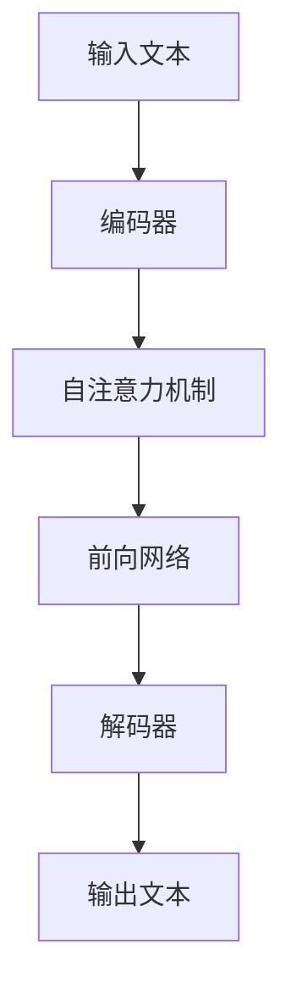
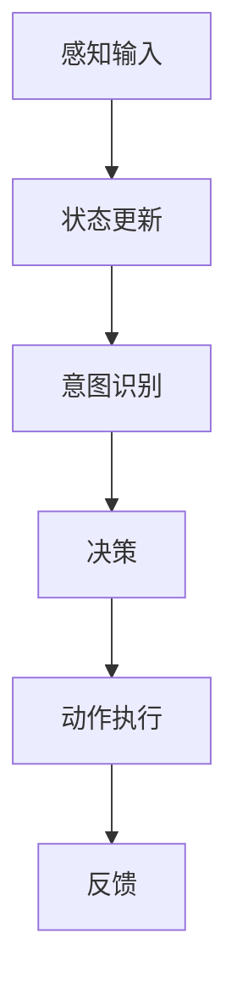
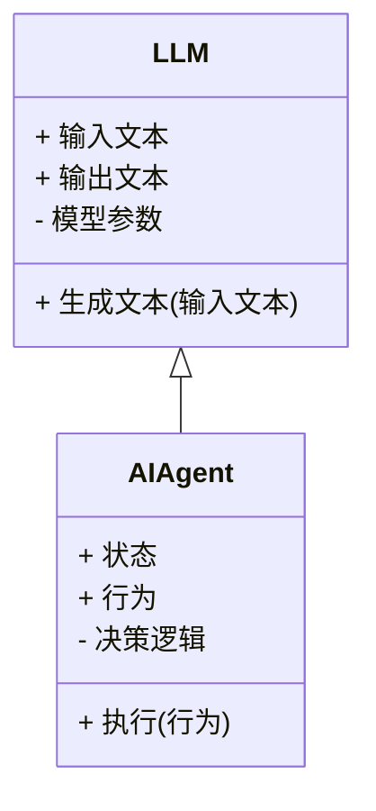
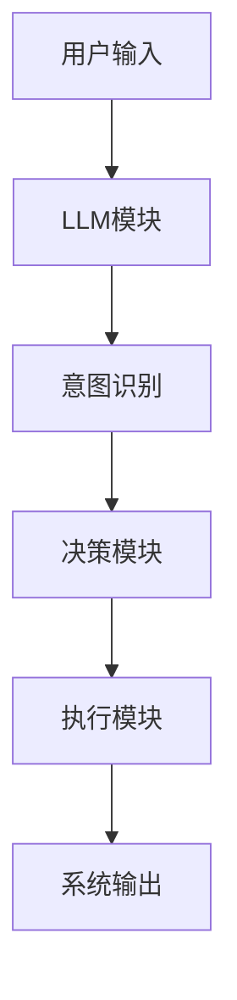

                 


# LLM在AI Agent概念形成与抽象中的作用

> 关键词：LLM, AI Agent, 大语言模型, 智能体, 人工智能, 机器学习, 人机交互

> 摘要：本文探讨了大语言模型（LLM）在AI Agent概念形成与抽象中的核心作用。通过系统性分析LLM与AI Agent的关联性，结合算法原理、数学模型和系统架构，深入解析了LLM如何助力AI Agent的智能化发展。本文还通过实际案例展示了LLM在AI Agent中的应用，为读者提供了全面而深入的视角。

---

# 第一部分: LLM与AI Agent的背景介绍

## 第1章: 问题背景与描述

### 1.1 问题背景
随着人工智能技术的快速发展，AI Agent（智能体）逐渐成为实现智能化系统的核心技术。AI Agent能够感知环境、自主决策并执行任务，而大语言模型（LLM）作为自然语言处理领域的突破性技术，为AI Agent的智能化提供了强大的语言理解和生成能力。

### 1.2 问题描述
AI Agent的核心能力在于理解和执行复杂任务，而LLM在语言理解和生成方面的优势为AI Agent的能力提升提供了新的可能性。然而，LLM与AI Agent的结合并非一帆风顺，存在概念模糊、技术整合复杂等问题。

### 1.3 问题解决
通过将LLM嵌入AI Agent的架构中，可以显著提升其语言理解和生成能力，同时优化决策过程。本文将从理论到实践，系统性地探讨LLM在AI Agent中的应用。

### 1.4 边界与外延
本文的研究范围限定在LLM与AI Agent的结合，不涉及其他AI技术（如计算机视觉）。同时，我们将重点关注LLM在AI Agent概念形成与抽象中的作用，而不是其在具体任务中的应用。

### 1.5 概念结构与核心要素
AI Agent的核心要素包括感知能力、决策能力、执行能力，而LLM则主要增强其语言理解和生成能力。通过将LLM与AI Agent结合，可以实现更自然的人机交互。

---

## 第2章: 核心概念与联系

### 2.1 核心概念原理
- **LLM的工作原理**：基于Transformer架构的LLM通过自注意力机制实现高效的文本生成和理解。
- **AI Agent的运作机制**：AI Agent通过感知环境、分析任务、决策并执行动作来完成目标。
- **LLM与AI Agent的关联性**：LLM为AI Agent提供语言能力，使其能够与人类进行自然交互。

### 2.2 核心概念属性对比
以下表格对比了LLM与AI Agent的核心属性：

```markdown
| 属性 | LLM | AI Agent |
|------|-----|----------|
| 输入 | 文本 | 状态+动作 | 
| 输出 | 文本 | 动作 | 
| 目标 | 生成合理文本 | 完成特定任务 | 
```

### 2.3 实体关系图
以下为LLM与AI Agent的实体关系图：

```mermaid
erd
    entity LLM {
        id
        模型参数
        训练数据
    }
    entity AI Agent {
        id
        状态
        行为
    }
    LLM --x-> AI Agent : 提供语言理解能力
    AI Agent --x-> LLM : 使用LLM进行交互
```

---

## 第3章: 算法原理

### 3.1 LLM的算法流程
以下是基于Transformer的LLM训练流程图：



### 3.2 AI Agent的决策算法
AI Agent的决策过程如下：



### 3.3 数学模型与公式
- **自注意力机制**：
  $$ \text{Attention}(Q,K,V) = \text{softmax}\left(\frac{QK^T}{\sqrt{d_k}}\right)V $$
- **前向网络**：
  $$ f(x) = \text{ReLU}(Ax + b) $$

---

## 第4章: 系统分析与架构设计

### 4.1 问题场景介绍
本文设计了一个基于LLM的AI Agent系统，用于实现自然语言交互和任务执行。

### 4.2 项目介绍
- **项目目标**：实现一个基于LLM的AI Agent，能够理解和执行复杂任务。
- **核心功能**：语言理解、决策推理、任务执行。

### 4.3 系统功能设计
以下是系统功能的类图：



### 4.4 系统架构设计
以下是系统架构图：



---

## 第5章: 项目实战

### 5.1 环境安装
- 安装Python和必要的库：
  ```bash
  pip install torch transformers
  ```

### 5.2 系统核心实现
以下是AI Agent的核心代码：

```python
class LLM:
    def __init__(self, model):
        self.model = model

    def generate(self, input_text):
        # LLM生成输出
        return self.model.generate(input_text)

class AI_Agent:
    def __init__(self, llm):
        self.llm = llm
        self.state = {}

    def perceive(self, input_text):
        self.state['input'] = input_text
        return self.state

    def decide(self):
        # 基于LLM进行决策
        input_text = self.state['input']
        output = self.llm.generate(input_text)
        self.state['output'] = output
        return output
```

### 5.3 代码应用解读
- **LLM类**：封装了大语言模型的生成功能。
- **AI_Agent类**：实现了感知、决策和执行功能。
- **交互过程**：
  1. 用户输入文本。
  2. AI Agent感知输入并更新状态。
  3. AI Agent调用LLM生成输出。
  4. 输出结果并执行任务。

### 5.4 实际案例分析
假设用户输入“预订一张从北京到上海的机票”，AI Agent将通过LLM生成自然语言的预订请求，并通过系统接口完成任务。

---

## 第6章: 最佳实践与总结

### 6.1 最佳实践
- **模型选择**：根据任务需求选择合适的LLM模型。
- **数据处理**：确保输入数据的多样性和质量。
- **性能优化**：通过参数调整和模型剪枝提升效率。

### 6.2 小结
本文详细探讨了LLM在AI Agent概念形成与抽象中的作用，从理论到实践全面分析了其在智能化系统中的应用。

### 6.3 注意事项
- LLM的训练数据可能包含偏见，需谨慎处理。
- 保护用户隐私，避免数据泄露。

### 6.4 拓展阅读
建议读者深入研究Transformer架构和强化学习在AI Agent中的应用。

---

# 作者：AI天才研究院/AI Genius Institute & 禅与计算机程序设计艺术 /Zen And The Art of Computer Programming

