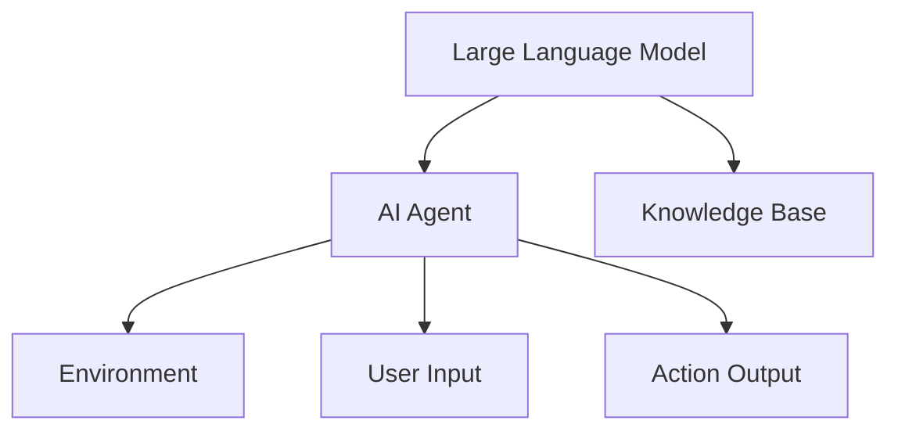

                 


# LLM在AI Agent概念形成与泛化中的作用

> 关键词：大语言模型、AI Agent、人机交互、智能系统、泛化能力

> 摘要：本文探讨了大语言模型（LLM）在AI Agent概念形成与泛化中的作用。通过分析LLM与AI Agent的结合，揭示了LLM如何赋能AI Agent的智能性和泛化能力，详细阐述了两者在技术原理、算法实现、系统架构等方面的协同关系，最后通过实际案例展示了LLM在AI Agent中的应用场景和优势。

---

## 第1章: 背景介绍

### 1.1 LLM与AI Agent的基本概念

#### 1.1.1 LLM的定义与特点
大语言模型（Large Language Model，LLM）是指基于深度学习技术训练的大型神经网络模型，具有以下特点：
- **大规模训练数据**：通常使用海量文本数据进行训练，涵盖多种语言和领域。
- **上下文理解**：能够理解上下文，生成连贯的文本。
- **多任务能力**：通过微调可以适应多种NLP任务，如翻译、问答、文本生成等。
- **可解释性**：部分模型（如GPT-3）具有较高的可解释性，但仍然存在一定的黑箱特性。

#### 1.1.2 AI Agent的定义与特点
AI Agent（人工智能代理）是指在特定环境中能够感知并自主行动以实现目标的智能体。其特点包括：
- **自主性**：无需外部干预，自主完成任务。
- **反应性**：能够实时感知环境并做出反应。
- **目标导向性**：基于目标驱动行为。
- **知识表示**：通过知识库或记忆机制处理和存储信息。

#### 1.1.3 LLM与AI Agent的结合
LLM与AI Agent的结合主要体现在以下几个方面：
- **智能性提升**：LLM通过强大的语言理解和生成能力，增强AI Agent的智能性。
- **任务灵活性**：LLM的多任务能力使AI Agent能够适应更多场景。
- **实时性优化**：通过LLM的快速生成能力，提升AI Agent的实时响应能力。

### 1.2 LLM与AI Agent的结合背景

#### 1.2.1 当前AI技术的发展趋势
- **大语言模型的崛起**：如GPT-3、PaLM等模型的出现，推动了LLM技术的发展。
- **AI Agent在智能系统中的应用需求**：随着智能系统对自主性和智能性的要求提高，AI Agent的应用场景逐渐增多。
- **技术可行性**：LLM的强大能力为AI Agent的智能化提供了技术基础。

#### 1.2.2 LLM在AI Agent中的应用场景
- **智能对话系统**：通过LLM实现自然语言理解与生成，提升对话系统的智能性。
- **自动决策系统**：利用LLM的知识表示能力，辅助AI Agent做出决策。
- **个性化推荐系统**：结合LLM的多任务能力，为用户提供个性化的推荐服务。

#### 1.2.3 LLM与AI Agent结合的必要性
- **提高AI Agent的智能性**：通过LLM的强大语言能力，增强AI Agent的理解和生成能力。
- **降低开发成本**：利用LLM的通用性，减少AI Agent的定制化开发需求。
- **提升泛化能力**：通过LLM的泛化能力，使AI Agent能够适应更多场景。

### 1.3 LLM与AI Agent的结合技术基础

#### 1.3.1 LLM的基本技术原理
- **训练方法**：基于Transformer架构，通过自监督学习预训练模型参数。
- **推理机制**：利用生成式模型，通过贪心算法或蒙特卡洛树搜索生成输出。
- **可解释性问题**：通过可视化技术或模型解密方法提升模型的可解释性。

#### 1.3.2 AI Agent的基本技术原理
- **感知与决策机制**：通过传感器或API获取环境信息，结合内部知识库进行决策。
- **知识表示方法**：使用知识图谱或符号逻辑表示知识。
- **行动执行方式**：通过API调用或外部系统接口执行动作。

#### 1.3.3 LLM与AI Agent结合的技术挑战
- **LLM的泛化能力限制**：在特定领域或小样本数据下，LLM的效果可能不佳。
- **AI Agent的实时性要求**：在高实时性场景中，LLM的推理速度可能成为瓶颈。
- **协同优化问题**：LLM与AI Agent的协同优化需要在性能和效果之间找到平衡。

---

## 第2章: LLM与AI Agent的核心概念与联系

### 2.1 LLM与AI Agent的核心概念

#### 2.1.1 LLM的核心概念
- **输入输出机制**：LLM接收输入文本，生成输出文本。
- **上下文理解能力**：能够理解上下文关系，生成连贯的回复。
- **知识记忆能力**：通过训练数据，模型记忆了大量知识，能够在生成文本时调用这些知识。

#### 2.1.2 AI Agent的核心概念
- **目标设定**：AI Agent需要明确的目标来驱动其行为。
- **环境感知**：通过传感器或其他接口感知外部环境的状态。
- **决策与行动**：基于感知信息和内部知识，做出决策并执行动作。

### 2.2 LLM与AI Agent的关系

#### 2.2.1 LLM作为AI Agent的核心模块
- **LLM在AI Agent中的角色**：作为AI Agent的“大脑”，负责理解和生成文本，辅助决策。
- **LLM如何影响AI Agent的智能性**：通过强大的语言能力，提升AI Agent的理解和表达能力。
- **功能定位**：LLM主要负责自然语言处理任务，如理解用户需求、生成回应等。

#### 2.2.2 LLM与AI Agent的协同工作模式
- **交互流程**：AI Agent接收用户输入，通过LLM生成回复，再根据用户的反馈调整行为。
- **LLM对AI Agent决策能力的提升**：通过LLM的生成能力，AI Agent能够提供更自然、更丰富的反馈。
- **泛化能力的提升**：LLM的多任务能力使AI Agent能够处理更多类型的任务。

### 2.3 LLM与AI Agent的核心概念对比

#### 2.3.1 LLM与AI Agent的属性对比

| 属性                | LLM                        | AI Agent                  |
|---------------------|---------------------------|---------------------------|
| 核心功能            | 语言理解和生成            | 感知、决策与行动          |
| 知识表示方式        | 基于训练数据的记忆        | 基于知识库或符号逻辑      |
| 任务灵活性          | 多任务能力强              | 多任务能力一般            |
| 可解释性            | 部分可解释                | 可解释性较低              |
| 实时性              | 取决于模型优化            | 高实时性要求              |

#### 2.3.2 LLM与AI Agent的实体关系图



---

## 第3章: LLM与AI Agent的算法原理

### 3.1 LLM的算法原理

#### 3.1.1 LLM的训练过程
- **预训练**：基于大量的文本数据，使用自监督学习方法训练模型参数。
- **微调**：针对特定任务或领域，使用小规模标注数据对模型进行微调。
- **生成过程**：通过解码器生成输出文本，通常采用贪心算法或随机采样方法。

#### 3.1.2 LLM的数学模型
- **变换器层**：使用多头自注意力机制和前馈网络进行特征提取。
- **损失函数**：交叉熵损失函数，用于衡量生成文本与真实文本的差距。

#### 3.1.3 LLM的算法实现
```python
def generate_response(prompt, model, tokenizer):
    inputs = tokenizer(prompt, return_tensors='pt')
    outputs = model.generate(inputs.input_ids, max_length=100, do_sample=True)
    response = tokenizer.decode(outputs[0], skip_special_tokens=True)
    return response
```

### 3.2 AI Agent的算法原理

#### 3.2.1 AI Agent的感知与决策
- **感知过程**：通过传感器或API获取环境信息。
- **决策过程**：基于感知信息和内部知识库，通过推理引擎做出决策。

#### 3.2.2 AI Agent的数学模型
- **状态表示**：使用向量表示环境状态。
- **决策模型**：基于Q-learning或策略梯度方法优化决策策略。

#### 3.2.3 AI Agent的算法实现
```python
def decide(action, state, model):
    # 状态转换为输入格式
    inputs = state_to_input(state)
    # 调用模型进行决策
    prediction = model.predict(inputs)
    # 返回动作
    return prediction
```

### 3.3 LLM与AI Agent的协同算法

#### 3.3.1 LLM辅助AI Agent决策
- **任务描述**：将AI Agent的目标转化为自然语言描述。
- **决策支持**：通过LLM生成多个可能的决策选项，供AI Agent选择。

#### 3.3.2 AI Agent优化LLM性能
- **上下文提供**：为LLM提供更丰富的上下文信息，提升生成质量。
- **反馈机制**：通过用户反馈优化LLM的生成策略。

#### 3.3.3 协同算法实现
```python
def协同决策(input, llm_model, ai_agent_model):
    # AI Agent生成决策建议
   建议 = ai_agent_model.decision_making(input)
    # LLM优化建议
    optimized_suggestion = llm_model.optimize(建议)
    return optimized_suggestion
```

---

## 第4章: LLM与AI Agent的数学模型

### 4.1 LLM的数学模型

#### 4.1.1 变换器层
- **自注意力机制**：
  $$ \text{Attention}(Q, K, V) = \text{softmax}\left(\frac{QK^T}{\sqrt{d_k}}\right)V $$
- **前馈网络**：
  $$ f(x) = \text{ReLU}(Wx + b) $$

#### 4.1.2 损失函数
- **交叉熵损失**：
  $$ \mathcal{L} = -\sum_{i=1}^{n} y_i \log p(y_i|x_i) $$

### 4.2 AI Agent的数学模型

#### 4.2.1 状态表示
- **向量表示**：
  $$ s = [s_1, s_2, ..., s_n] $$

#### 4.2.2 决策模型
- **Q-learning**：
  $$ Q(s, a) = r + \gamma \max_{a'} Q(s', a') $$
- **策略梯度**：
  $$ \nabla \log \pi(a|s) \cdot Q(s,a) $$

### 4.3 LLM与AI Agent的协同模型

#### 4.3.1 知识表示
- **符号逻辑**：
  $$ \text{如果 } P \text{ 那么 } Q $$

#### 4.3.2 决策优化
- **联合优化**：
  $$ \arg\max_{\theta} \mathcal{L}_{\text{LLM}} + \lambda \mathcal{L}_{\text{AI Agent}} $$

---

## 第5章: LLM与AI Agent的系统架构设计

### 5.1 问题场景介绍

#### 5.1.1 项目介绍
- **项目目标**：构建一个基于LLM的智能对话AI Agent。
- **应用场景**：智能客服、虚拟助手等。

#### 5.1.2 系统功能设计
- **领域模型**：
  ```mermaid
  classDiagram
      class LLM {
          generate_response(string prompt)
      }
      class AI_Agent {
          perceive_environment()
          make_decision()
          execute_action()
      }
      class Environment {
          get_state()
      }
      AI_Agent --> LLM: uses
      AI_Agent --> Environment: interacts_with
  ```

- **系统架构**：
  ```mermaid
  graph TD
      LLM --> AI_Agent
      AI_Agent --> Environment
      AI_Agent --> User_Interface
  ```

- **系统交互**：
  ```mermaid
  sequenceDiagram
      User -> AI_Agent: 提问
      AI_Agent -> LLM: 获取回答
      AI_Agent -> User: 回复
  ```

### 5.2 系统核心实现

#### 5.2.1 环境感知
- **实现细节**：通过API获取环境信息，如用户输入、时间、位置等。
- **代码实现**：
  ```python
  def perceive_environment():
      return get_user_input(), get_time(), get_location()
  ```

#### 5.2.2 决策与行动
- **实现细节**：基于感知信息，调用LLM生成回复。
- **代码实现**：
  ```python
  def make_decision(inputs):
      response = llm.generate_response(inputs)
      return response
  ```

### 5.3 项目实战

#### 5.3.1 环境安装
- **Python 3.8+**
- **TensorFlow或PyTorch库**
- **Hugging Face Transformers库**

#### 5.3.2 代码实现

##### 5.3.2.1 LLM部分
```python
from transformers import GPT2LMHeadModel, GPT2Tokenizer

tokenizer = GPT2Tokenizer.from_pretrained('gpt2')
model = GPT2LMHeadModel.from_pretrained('gpt2')
```

##### 5.3.2.2 AI Agent部分
```python
class AI_Agent:
    def __init__(self, llm_model):
        self.llm = llm_model
    
    def perceive_environment(self):
        return input("请输入您的问题：")
    
    def make_decision(self, input_text):
        return self.llm.generate_response(input_text)
    
    def execute_action(self, response):
        print("AI Agent的回复：", response)
```

##### 5.3.2.3 实际案例分析
- **案例描述**：用户向AI Agent询问“明天的天气如何？”
- **系统响应**：
  ```plaintext
  AI Agent: 明天的天气预报显示会有雨，请记得带伞。
  ```

### 5.4 系统优化与改进

#### 5.4.1 系统优化
- **性能优化**：优化LLM的生成速度，提升AI Agent的实时响应能力。
- **模型优化**：通过模型压缩或蒸馏技术，降低计算资源消耗。

#### 5.4.2 代码优化
- **LLM优化**：
  ```python
  def generate_response(prompt, max_length=100, num_return_sequences=1):
      inputs = tokenizer(prompt, return_tensors='pt')
      outputs = model.generate(inputs.input_ids, max_length=max_length, num_return_sequences=num_return_sequences)
      return [tokenizer.decode(output, skip_special_tokens=True) for output in outputs]
  ```

- **AI Agent优化**：
  ```python
  class Optimized_AI_Agent:
      def __init__(self, llm_model):
          self.llm = llm_model
          self.cache = {}
    
      def make_decision(self, input_text):
          if input_text in self.cache:
              return self.cache[input_text]
          response = self.llm.generate_response(input_text)
          self.cache[input_text] = response
          return response
  ```

---

## 第6章: 总结与展望

### 6.1 总结

- **LLM与AI Agent的核心作用**：LLM为AI Agent提供了强大的语言理解和生成能力，使其更加智能化。
- **技术实现的关键点**：通过协同算法和系统优化，提升LLM与AI Agent的性能和效果。
- **实际应用中的优势**：通过案例分析展示了LLM在AI Agent中的实际应用价值。

### 6.2 展望

- **技术进步**：随着大模型技术的发展，AI Agent的智能性和泛化能力将不断提升。
- **应用场景扩展**：LLM与AI Agent的结合将在更多领域得到应用，如教育、医疗、金融等。
- **挑战与未来方向**：需要进一步解决LLM的泛化能力限制和AI Agent的实时性要求，探索更高效的协同优化方法。

### 6.3 最佳实践 Tips

- **模型选择**：根据具体需求选择合适的LLM模型，如较小的模型适合实时性要求高的场景。
- **系统优化**：通过缓存机制和模型优化技术，提升系统的性能和响应速度。
- **用户体验**：注重用户体验设计，使AI Agent的交互更加自然流畅。

---

## 作者：AI天才研究院/AI Genius Institute & 禅与计算机程序设计艺术 /Zen And The Art of Computer Programming

---

以上是《LLM在AI Agent概念形成与泛化中的作用》的技术博客文章，涵盖了从背景介绍到系统架构设计的各个方面，详细探讨了LLM与AI Agent的结合及其技术实现。

