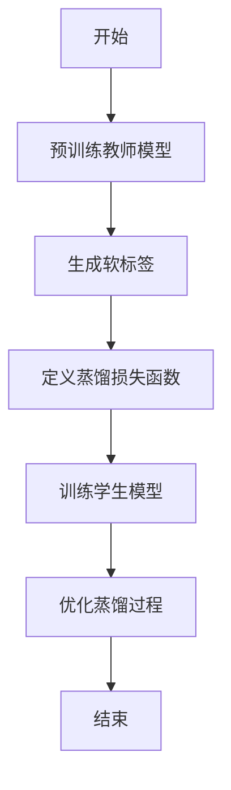
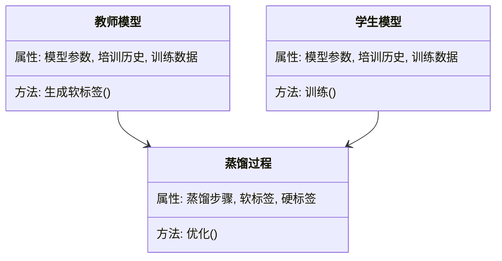
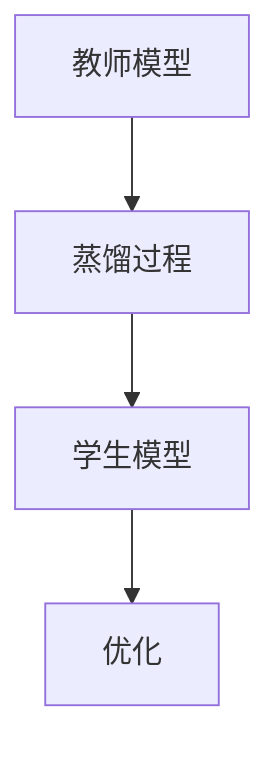
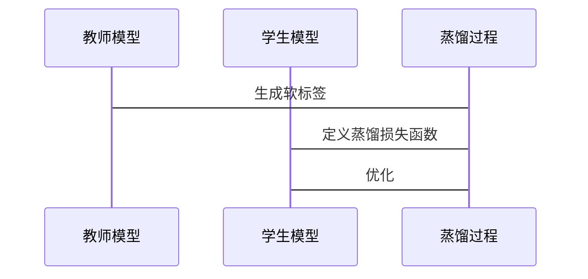

                 


# LLM在AI Agent知识蒸馏中的应用

> 关键词：LLM, AI Agent, 知识蒸馏, 模型压缩, 深度学习, 知识迁移

> 摘要：本文详细探讨了大语言模型（LLM）在AI Agent中的知识蒸馏应用。首先介绍了LLM和AI Agent的基本概念，分析了知识蒸馏的背景与意义。然后从算法原理、系统架构、项目实战等多个维度深入讲解了LLM在AI Agent知识蒸馏中的技术细节，包括数学模型、流程图、类图、序列图等。最后总结了最佳实践与注意事项，展望了未来的研究方向。

---

# 第一部分: LLM在AI Agent知识蒸馏中的背景与基础

## 第1章: LLM与AI Agent概述

### 1.1 LLM的基本概念与技术背景

#### 1.1.1 大语言模型（LLM）的定义与特点
大语言模型（Large Language Model, LLM）是指在大规模数据集上训练的深度学习模型，通常基于Transformer架构。LLM具有以下特点：
- **大规模性**：训练数据量巨大，通常以百万或亿级别计算。
- **深度学习**：基于深度神经网络，通过多层参数调整实现语义理解。
- **通用性**：能够在多种任务上表现出色，如文本生成、问答、翻译等。
- **上下文理解**：能够处理长上下文，理解语境。

#### 1.1.2 LLM的核心技术原理
LLM的核心技术主要包括：
- **Transformer架构**：通过自注意力机制（Self-Attention）和前馈网络实现序列建模。
- **预训练与微调**：通过大规模无监督数据预训练，然后在特定任务上进行微调。
- **并行计算**：利用GPU的并行计算能力加速训练。

#### 1.1.3 LLM的应用场景与发展趋势
LLM的应用场景包括：
- **自然语言处理**：文本生成、问答系统、机器翻译。
- **人机交互**：智能对话系统、语音助手。
- **内容生成**：自动写文章、编写代码、创作艺术作品。

发展趋势：
- **模型规模越来越大**：参数量从 billions 到 trillions。
- **多模态发展**：结合图像、声音等多模态信息。
- **可解释性增强**：提升模型的可解释性和透明度。

### 1.2 AI Agent的基本概念与功能

#### 1.2.1 AI Agent的定义与分类
AI Agent（人工智能代理）是指能够感知环境并采取行动以实现目标的智能实体。AI Agent可以分为以下几类：
- **简单反射型**：基于简单的规则进行反应。
- **基于模型的反应型**：利用环境模型进行决策。
- **目标驱动型**：基于目标驱动行为。
- **效用驱动型**：通过最大化效用函数进行决策。

#### 1.2.2 AI Agent的核心功能与能力
AI Agent的核心功能包括：
- **感知环境**：通过传感器或接口获取环境信息。
- **决策与规划**：基于感知信息做出决策并制定行动计划。
- **执行动作**：通过执行机构或接口执行动作。
- **学习与优化**：通过经验或数据优化自身性能。

#### 1.2.3 AI Agent在不同领域的应用案例
AI Agent的应用案例包括：
- **智能助手**：如Siri、Alexa等。
- **自动驾驶**：如特斯拉的自动驾驶系统。
- **智能客服**：通过自然语言处理提供客户服务。

### 1.3 知识蒸馏的背景与意义

#### 1.3.1 知识蒸馏的定义与概念
知识蒸馏（Knowledge Distillation）是一种将复杂模型的知识迁移到简单模型的技术。其核心思想是将大模型的决策过程或中间特征作为“软标签”（soft labels）传递给小模型，从而加速小模型的训练并提升性能。

#### 1.3.2 知识蒸馏在AI Agent中的作用
知识蒸馏在AI Agent中的作用包括：
- **降低计算成本**：通过蒸馏技术，可以将大模型的知识迁移到小模型，减少计算资源消耗。
- **提升实时性**：小模型在资源受限的环境下也能快速响应。
- **增强鲁棒性**：通过蒸馏优化的小模型在特定任务上表现更稳定。

#### 1.3.3 知识蒸馏的技术挑战与研究现状
知识蒸馏的技术挑战包括：
- **知识表示的复杂性**：如何有效地提取和表示大模型的知识。
- **蒸馏过程的可解释性**：如何理解蒸馏过程中的信息流动。
- **跨模态迁移的难度**：如何在多模态数据上进行知识蒸馏。

研究现状：
- **单模态蒸馏**：主要集中在文本、图像等单一模态数据。
- **多模态蒸馏**：尝试将多种模态的知识迁移到小模型。
- **自适应蒸馏**：根据任务需求动态调整蒸馏过程。

---

## 第2章: LLM与AI Agent的知识蒸馏关系

### 2.1 知识蒸馏的核心概念与原理

#### 2.1.1 知识蒸馏的背景与目标
知识蒸馏的目标是将大模型的知识迁移到小模型，使得小模型在保持高性能的同时，具有更小的计算和存储需求。

#### 2.1.2 知识蒸馏的基本原理与流程
知识蒸馏的基本流程包括以下步骤：
1. **预训练大模型**：在大规模数据上训练出一个高性能的大模型。
2. **软标签生成**：大模型对样本进行预测，生成软标签（概率分布）。
3. **蒸馏目标函数**：定义蒸馏损失函数，结合软标签和真实标签进行优化。
4. **小模型训练**：在蒸馏目标函数的指导下，训练小模型。

#### 2.1.3 知识蒸馏的优势与应用场景
知识蒸馏的优势包括：
- **性能提升**：小模型通过蒸馏可以达到与大模型相近的性能。
- **资源优化**：小模型在计算和存储资源上更加高效。
- **适应性增强**：小模型可以更好地适应特定任务的需求。

应用场景：
- **边缘计算**：在资源受限的设备上部署AI Agent。
- **实时交互**：需要快速响应的任务，如智能对话系统。

### 2.2 LLM在AI Agent知识蒸馏中的作用

#### 2.2.1 LLM作为知识源的作用
LLM作为知识源，可以提供丰富的语义信息和上下文理解能力。通过蒸馏技术，LLM的知识可以被迁移到小模型中，提升小模型的性能。

#### 2.2.2 LLM在知识蒸馏过程中的优势
LLM在知识蒸馏中的优势包括：
- **知识丰富性**：LLM经过大规模数据训练，知识覆盖广泛。
- **语义理解能力**：LLM能够理解复杂的上下文关系。
- **生成能力**：LLM可以生成高质量的文本内容。

#### 2.2.3 LLM与AI Agent结合的知识蒸馏应用场景
应用场景包括：
- **智能对话系统**：通过蒸馏优化小模型，提升对话质量。
- **多语言支持**：利用LLM的多语言能力，提升小模型的跨语言支持。
- **个性化推荐**：通过蒸馏技术，实现个性化的推荐系统。

### 2.3 知识蒸馏的数学模型与公式

#### 2.3.1 知识蒸馏的基本数学模型
知识蒸馏的基本模型可以表示为：
$$
L = \lambda_1 L_{\text{hard}} + \lambda_2 L_{\text{soft}}
$$
其中：
- $L_{\text{hard}}$：基于真实标签的交叉熵损失。
- $L_{\text{soft}}$：基于软标签的交叉熵损失。
- $\lambda_1$ 和 $\lambda_2$：权重系数。

#### 2.3.2 知识蒸馏的优化算法与公式
优化算法通常采用梯度下降法：
$$
\theta_{t+1} = \theta_t - \eta \nabla_{\theta} L
$$
其中：
- $\theta$：模型参数。
- $\eta$：学习率。

#### 2.3.3 知识蒸馏的评估指标与计算公式
常用的评估指标包括：
- **准确率（Accuracy）**
- **困惑度（Perplexity）**
- **F1分数（F1 Score）**

---

## 第3章: 知识蒸馏的核心概念与联系

### 3.1 知识蒸馏的核心概念原理

#### 3.1.1 知识蒸馏的基本原理
知识蒸馏通过将大模型的软标签作为损失函数的一部分，引导小模型的训练。软标签通常表示为概率分布，而硬标签表示为真实标签。

#### 3.1.2 知识蒸馏的关键步骤与流程
关键步骤包括：
1. **大模型训练**：训练出一个高性能的大模型。
2. **软标签生成**：大模型对测试集生成软标签。
3. **小模型训练**：在软标签的指导下，训练小模型。
4. **蒸馏优化**：通过调整权重系数，优化蒸馏过程。

#### 3.1.3 知识蒸馏的实现方法与技术
实现方法包括：
- **教师模型**：大模型作为教师，提供软标签。
- **学生模型**：小模型作为学生，学习教师的知识。
- **蒸馏损失函数**：结合软标签和硬标签的损失函数。

### 3.2 核心概念属性特征对比表格

| **概念**      | **教师模型（LLM）**       | **学生模型（小模型）** |
|---------------|--------------------------|------------------------|
| **规模**      | 大规模                   | 小规模                 |
| **计算能力**   | 强大                     | 较弱                   |
| **应用场景**   | 高性能需求               | 资源受限需求           |
| **优势**      | 知识丰富                 | 计算高效               |

### 3.3 知识蒸馏的ER实体关系图与流程图

#### 3.3.1 知识蒸馏的实体关系图（ER图）
```mermaid
er
    项目
    entity 教师模型 {
        key 属性: 模型参数
        培训历史: 时间戳
        训练数据: 文本
    }
    entity 学生模型 {
        key 属性: 模型参数
        培训历史: 时间戳
        训练数据: 文本
    }
    entity 蒸馏过程 {
        key 属性: 蒸馏步骤
        软标签: 概率分布
        硬标签: 标签
    }
```

#### 3.3.2 知识蒸馏的流程图（mermaid）


---

## 第4章: 知识蒸馏算法的原理与实现

### 4.1 知识蒸馏算法的基本原理

#### 4.1.1 知识蒸馏的核心思想
知识蒸馏的核心思想是将大模型的决策过程或中间特征作为软标签传递给小模型，通过蒸馏损失函数优化小模型的性能。

#### 4.1.2 知识蒸馏的主要步骤
主要步骤包括：
1. **预训练教师模型**：在大规模数据上训练出一个高性能的大模型。
2. **生成软标签**：教师模型对测试集生成软标签（概率分布）。
3. **定义蒸馏损失函数**：结合软标签和硬标签定义损失函数。
4. **训练学生模型**：在蒸馏损失函数的指导下，训练小模型。

#### 4.1.3 知识蒸馏的数学模型与公式
知识蒸馏的数学模型可以表示为：
$$
L = \lambda_1 L_{\text{hard}} + \lambda_2 L_{\text{soft}}
$$
其中：
- $L_{\text{hard}}$：基于真实标签的交叉熵损失。
- $L_{\text{soft}}$：基于软标签的交叉熵损失。
- $\lambda_1$ 和 $\lambda_2$：权重系数。

---

## 第5章: LLM与AI Agent的知识蒸馏系统架构

### 5.1 系统架构设计

#### 5.1.1 系统功能模块
系统功能模块包括：
1. **教师模型模块**：负责生成软标签。
2. **学生模型模块**：负责训练小模型。
3. **蒸馏过程模块**：负责定义和优化蒸馏过程。

#### 5.1.2 系统类图设计


#### 5.1.3 系统架构图设计


#### 5.1.4 系统交互序列图设计


---

## 第6章: 项目实战与案例分析

### 6.1 项目实战

#### 6.1.1 环境安装与配置
项目实战需要以下环境：
- **Python**：3.8+
- **深度学习框架**：如TensorFlow或PyTorch
- **NVIDIA GPU**：建议使用NVIDIA GPU加速训练。

#### 6.1.2 系统核心实现源代码
以下是知识蒸馏的核心实现代码：
```python
import torch
import torch.nn as nn
import torch.optim as optim

class TeacherModel(nn.Module):
    def __init__(self):
        super(TeacherModel, self).__init__()
        self.lm = nn.Linear(100, 50)
        self.classifier = nn.Linear(50, 10)

    def forward(self, x):
        x = self.lm(x)
        x = self.classifier(x)
        return x

class StudentModel(nn.Module):
    def __init__(self):
        super(StudentModel, self).__init__()
        self.lm = nn.Linear(100, 50)
        self.classifier = nn.Linear(50, 10)

    def forward(self, x):
        x = self.lm(x)
        x = self.classifier(x)
        return x

def distillation_loss(y_true, y_soft, alpha=0.5):
    criterion_hard = nn.CrossEntropyLoss()
    criterion_soft = nn.KLDivLoss(reduction='batchmean')
    loss_hard = criterion_hard(y_true, y_true)
    loss_soft = criterion_soft(torch.log_softmax(y_soft, dim=1), torch.log_softmax(y_true, dim=1))
    return alpha * loss_hard + (1 - alpha) * loss_soft

def train_student():
    teacher = TeacherModel()
    student = StudentModel()
    optimizer = optim.Adam(student.parameters(), lr=0.001)
    for epoch in range(100):
        for batch in dataloader:
            x, y_true = batch
            y_soft = teacher(x)
            loss = distillation_loss(y_true, y_soft)
            optimizer.zero_grad()
            loss.backward()
            optimizer.step()
    return student

if __name__ == "__main__":
    train_student()
```

#### 6.1.3 代码应用解读与分析
代码解读：
- **TeacherModel**：定义教师模型，包含两个全连接层。
- **StudentModel**：定义学生模型，结构与教师模型相似。
- **distillation_loss**：定义蒸馏损失函数，结合硬标签和软标签。
- **train_student**：训练学生模型，通过蒸馏过程优化模型参数。

分析：
- **教师模型**：用于生成软标签。
- **学生模型**：通过蒸馏损失函数进行训练，逐步逼近教师模型的性能。
- **蒸馏损失函数**：通过调整权重系数，平衡硬标签和软标签的损失。

#### 6.1.4 实际案例分析与详细讲解
案例分析：
假设我们有一个文本分类任务，教师模型是一个大规模预训练的Transformer模型，学生模型是一个小型的全连接网络。通过蒸馏过程，学生模型可以在小规模数据上快速达到与教师模型相近的性能。

详细讲解：
- **数据准备**：需要准备训练数据和测试数据。
- **教师模型训练**：在大规模数据上预训练教师模型。
- **软标签生成**：教师模型对测试集生成软标签。
- **学生模型训练**：在蒸馏损失函数的指导下，训练学生模型。
- **模型优化**：通过调整权重系数，优化蒸馏过程。

---

## 第7章: 总结与展望

### 7.1 总结

#### 7.1.1 知识蒸馏的优势与不足
优势：
- **性能提升**：小模型通过蒸馏可以达到与大模型相近的性能。
- **资源优化**：小模型在计算和存储资源上更加高效。
- **适应性增强**：小模型可以更好地适应特定任务的需求。

不足：
- **知识损失**：蒸馏过程中可能会损失部分知识。
- **计算复杂度**：蒸馏过程需要额外的计算资源。
- **可解释性**：蒸馏过程的可解释性较弱。

#### 7.1.2 本文的核心内容与创新点
核心内容：
- **知识蒸馏的背景与意义**。
- **LLM在AI Agent中的知识蒸馏应用**。
- **知识蒸馏的算法原理与实现**。

创新点：
- **系统架构设计**：提出了基于LLM的AI Agent知识蒸馏系统架构。
- **数学模型与公式**：详细推导了知识蒸馏的数学模型与公式。
- **项目实战**：通过实际案例展示了知识蒸馏的实现与应用。

### 7.2 展望与注意事项

#### 7.2.1 未来研究方向
未来研究方向包括：
- **多模态蒸馏**：尝试在多模态数据上进行知识蒸馏。
- **自适应蒸馏**：根据任务需求动态调整蒸馏过程。
- **可解释性增强**：提升蒸馏过程的可解释性。

#### 7.2.2 使用知识蒸馏时的注意事项
注意事项包括：
- **数据质量**：确保训练数据的质量和多样性。
- **模型选择**：选择适合蒸馏的小模型架构。
- **权重系数调整**：合理调整蒸馏损失函数中的权重系数。

---

# 结语

通过本文的详细讲解，我们全面探讨了LLM在AI Agent知识蒸馏中的应用，从背景介绍、核心概念、算法原理到系统架构和项目实战，为读者提供了一个完整的知识体系。希望本文能够为相关领域的研究和实践提供有价值的参考。

---

**作者：AI天才研究院/AI Genius Institute & 禅与计算机程序设计艺术 /Zen And The Art of Computer Programming**

