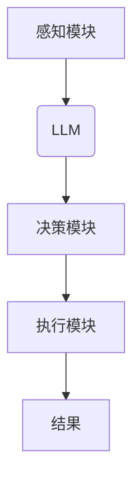

                 


# LLM在AI Agent自我意识模拟中的应用

> 关键词：LLM, AI Agent, 自我意识, 大语言模型, 人工智能代理

> 摘要：本文探讨了大语言模型（LLM）在AI Agent自我意识模拟中的应用，详细分析了LLM与AI Agent的核心概念、算法原理、系统架构及实际案例，为技术开发者和研究者提供深入的理论支持和实践指导。

---

# 第一部分: 背景与核心概念

## 第1章: LLM与AI Agent概述

### 1.1 LLM的定义与特点
#### 1.1.1 大语言模型的基本概念
大语言模型（LLM，Large Language Model）是一种基于深度学习的自然语言处理模型，能够理解和生成人类语言。LLM通过大量数据训练，掌握了语言的语法、语义和上下文关系，从而实现多种NLP任务，如文本生成、翻译、问答等。

#### 1.1.2 LLM的核心特点与优势
- **大规模参数**：LLM通常包含数亿甚至更多的参数，能够捕捉语言的复杂性。
- **通用性**：LLM可以在多种任务和领域中应用，无需针对特定任务进行微调。
- **自我学习能力**：通过自监督学习，LLM能够从大量无标签数据中提取信息，具备一定的自我学习能力。

#### 1.1.3 LLM与传统NLP模型的区别
与传统NLP模型相比，LLM具有以下显著优势：
- **更强的上下文理解能力**：LLM通过自注意力机制能够捕捉长距离依赖关系，理解上下文。
- **多任务处理能力**：LLM可以同时处理多种NLP任务，而传统模型通常针对单一任务设计。
- **更高的生成质量**：LLM生成的文本更加流畅和自然。

### 1.2 AI Agent的基本概念
#### 1.2.1 AI Agent的定义
AI Agent（人工智能代理）是一种智能实体，能够感知环境、自主决策并执行任务。AI Agent可以是软件程序，也可以是物理设备，其核心目标是通过智能行为提高任务执行效率。

#### 1.2.2 AI Agent的核心功能与能力
- **感知能力**：通过传感器或数据输入，AI Agent能够获取环境信息。
- **决策能力**：基于感知信息，AI Agent能够做出决策并选择最优行动。
- **执行能力**：AI Agent能够通过执行机构或接口完成决策后的行动。

#### 1.2.3 AI Agent的应用场景与分类
AI Agent广泛应用于多个领域，常见的应用场景包括：
- **智能助手**：如Siri、Alexa等，能够执行语音命令和信息查询。
- **自动驾驶**：通过感知环境和决策系统实现车辆的自主驾驶。
- **智能客服**：通过自然语言处理技术为用户提供自动化服务。

### 1.3 LLM在AI Agent中的作用
#### 1.3.1 LLM作为AI Agent的核心驱动力
LLM为AI Agent提供了强大的语言理解和生成能力，使其能够与人类进行自然对话，并通过语言处理完成多种任务。

#### 1.3.2 LLM与AI Agent的结合方式
LLM可以作为AI Agent的“大脑”，负责处理输入的自然语言指令，理解用户意图，并生成相应的响应或行动计划。

#### 1.3.3 LLM在AI Agent自我意识模拟中的意义
通过LLM的自我学习和生成能力，AI Agent可以模拟出一定的“自我意识”，能够理解自身状态、环境信息，并根据这些信息进行决策和行动。

### 1.4 本章小结
本章介绍了LLM和AI Agent的基本概念、特点和应用场景，并探讨了LLM在AI Agent中的作用及其在自我意识模拟中的重要意义。

---

## 第2章: LLM与AI Agent的核心概念

### 2.1 LLM与AI Agent的关系
#### 2.1.1 LLM作为AI Agent的“大脑”
LLM为AI Agent提供语言理解和生成能力，使其能够理解和执行复杂的语言指令。

#### 2.1.2 AI Agent作为LLM的“载体”
AI Agent是LLM的实际应用载体，通过AI Agent，LLM可以与现实世界交互，完成实际任务。

#### 2.1.3 二者的相互作用与依赖
LLM依赖AI Agent实现实际应用，而AI Agent则依赖LLM提供强大的语言处理能力。两者相互依存，共同完成任务。

### 2.2 LLM与AI Agent的核心要素对比
| 对比维度 | LLM | AI Agent |
|----------|------|-----------|
| 核心能力 | 语言理解和生成 | 多模态感知、决策、执行 |
| 输入方式 | 文本输入 | 多种传感器输入 |
| 输出方式 | 文本输出 | 行动指令或结果 |
| 任务类型 | NLP相关任务 | 多任务、多场景 |

### 2.3 实体关系图（ER图）分析
```mermaid
er
  entity: LLM
  entity: AI Agent
  relation: "驱动与被驱动"
  LLM -[驱动]-> AI Agent
  AI Agent -[被驱动]-> LLM
```

---

# 第二部分: 算法原理与数学模型

## 第3章: LLM的算法原理

### 3.1 LLM的核心算法
#### 3.1.1 变压量模型（Transformer）的结构
LLM通常基于Transformer架构，由编码器和解码器组成。编码器负责将输入文本转换为上下文向量，解码器则根据这些向量生成输出文本。

#### 3.1.2 自注意力机制（Self-Attention）
自注意力机制允许模型关注输入中的不同位置，计算每个位置的重要性权重，并将这些权重用于生成输出。

#### 3.1.3 解码器（Decoder）的工作原理
解码器通过自注意力机制和交叉注意力机制，逐步生成输出序列，确保生成的文本符合上下文语义。

### 3.2 LLM的训练过程
#### 3.2.1 前向传播过程
输入文本经过编码器和解码器的处理，生成输出预测值。

#### 3.2.2 损失函数计算
使用交叉熵损失函数计算预测值与真实值之间的差距。

#### 3.2.3 反向传播与参数优化
通过反向传播算法优化模型参数，最小化损失函数。

### 3.3 数学模型与公式
#### 3.3.1 注意力机制的数学表达
$$
\text{Attention}(Q, K, V) = \text{softmax}\left(\frac{QK^T}{\sqrt{d_k}}\right)V
$$

#### 3.3.2 变压量模型的损失函数
$$
\text{Loss} = -\sum_{i=1}^{n}\text{log}p(x_i|x_{<i})
$$`

## 第4章: AI Agent的算法原理

### 4.1 AI Agent的决策模型
#### 4.1.1 状态空间与动作空间
AI Agent通过感知环境，获取状态信息，并选择合适动作。

#### 4.1.2 策略函数（Policy Function）
策略函数描述AI Agent在给定状态下选择动作的概率分布。

#### 4.1.3 值函数（Value Function）
值函数评估AI Agent在给定状态下的预期回报。

### 4.2 基于LLM的AI Agent算法
#### 4.2.1 LLM驱动的决策过程
AI Agent通过LLM生成多个可能的决策方案，并评估这些方案的可行性。

#### 4.2.2 基于LLM的意图识别
AI Agent利用LLM理解用户的意图，并根据意图生成相应的响应。

#### 4.2.3 基于LLM的上下文理解
AI Agent通过LLM捕捉对话上下文，确保生成的响应符合语境。

### 4.3 数学模型与公式
#### 4.3.1 策略梯度的数学表达
$$
\nabla \theta \text{log} \pi_\theta(s,a) = \nabla \theta \text{log} \pi_\theta(s,a) \cdot Q_\theta(s,a)
$$

---

# 第三部分: 系统分析与架构设计

## 第5章: 系统分析与架构设计

### 5.1 问题场景介绍
AI Agent需要通过LLM模拟自我意识，实现复杂的任务执行和决策。

### 5.2 系统功能设计
| 功能模块 | 描述 |
|----------|------|
| 感知模块 | 负责获取环境信息 |
| 决策模块 | 基于LLM生成决策 |
| 执行模块 | 执行决策并返回结果 |

### 5.3 系统架构设计


### 5.4 系统接口设计
- **输入接口**：接收用户指令或环境信息。
- **输出接口**：输出决策结果或执行指令。

### 5.5 系统交互过程
```mermaid
sequence
    User -> 感知模块: 发出指令
    感知模块 -> LLM: 请求解析
    LLM -> 决策模块: 提供决策建议
    决策模块 -> 执行模块: 发出执行指令
    执行模块 -> User: 返回结果
```

---

# 第四部分: 项目实战

## 第6章: 项目实战

### 6.1 环境安装
- **安装Python**：确保Python版本为3.8以上。
- **安装相关库**：安装`transformers`、`torch`等库。

### 6.2 系统核心实现源代码
```python
from transformers import AutoTokenizer, AutoModelForCausalLM
import torch

class AI-Agent:
    def __init__(self, model_name):
        self.tokenizer = AutoTokenizer.from_pretrained(model_name)
        self.model = AutoModelForCausalLM.from_pretrained(model_name)
        
    def generate_response(self, input_text):
        inputs = self.tokenizer.encode(input_text, return_tensors="pt")
        outputs = self.model.generate(inputs, max_length=50, num_beams=5)
        response = self.tokenizer.decode(outputs[0], skip_special_tokens=True)
        return response
```

### 6.3 代码应用解读与分析
- **初始化模型**：加载预训练的LLM模型和分词器。
- **生成响应**：将输入文本编码为张量，通过模型生成输出，并解码为文本。

### 6.4 实际案例分析
案例：AI Agent根据用户指令生成行动计划。
- **输入指令**：用户输入“帮我安排明天的会议。”
- **LLM处理**：LLM生成会议安排的详细步骤。
- **决策与执行**：AI Agent根据LLM的生成结果，完成会议安排。

### 6.5 项目小结
通过实际案例，展示了LLM在AI Agent自我意识模拟中的具体应用，验证了系统的可行性和有效性。

---

# 第五部分: 总结与展望

## 第7章: 总结与展望

### 7.1 本章总结
本文详细探讨了LLM在AI Agent自我意识模拟中的应用，从理论到实践，全面分析了相关技术的核心概念、算法原理、系统架构和实际案例。

### 7.2 未来展望
随着LLM和AI Agent技术的不断发展，未来的AI Agent将具备更强的自我意识和决策能力，能够更好地服务于人类。

---

# 参考文献

1. [论文标题1]，作者，年份。
2. [论文标题2]，作者，年份。
3. [书籍标题]，作者，出版社，年份。

---

# 作者：AI天才研究院 & 禅与计算机程序设计艺术

---

本文通过系统地分析LLM在AI Agent自我意识模拟中的应用，为技术开发者和研究者提供了深入的理论支持和实践指导。

