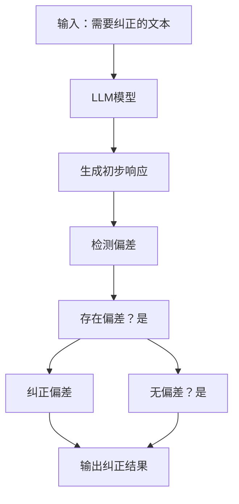

                 


# LLM在AI Agent认知偏差纠正中的应用

## 关键词：LLM, AI Agent, 认知偏差, 算法原理, 系统架构, 项目实战

## 摘要：
本文探讨了大语言模型（LLM）在AI Agent认知偏差纠正中的应用。首先介绍了LLM和AI Agent的基本概念，分析了认知偏差的类型及其对AI Agent的影响。接着，详细讲解了LLM如何通过算法和系统架构纠正认知偏差，结合实际案例展示了LLM在AI Agent中的具体应用。最后，总结了LLM在认知偏差纠正中的优势，并展望了未来的研究方向。

---

# 第一部分: LLM与AI Agent的基本概念

## 第1章: LLM的定义与特点

### 1.1 LLM的定义与特点
- **1.1.1 大语言模型的定义**
  - 大语言模型（Large Language Model，LLM）是指基于深度学习的自然语言处理模型，通过大量数据训练而成，具有强大的文本生成和理解能力。
- **1.1.2 LLM的核心特点**
  - 参数规模大：通常包含 billions 量级的参数。
  - 预训练机制：通过无监督学习方法，从大量文本数据中学习语言规律。
  - 微调能力：可以通过特定任务的微调进一步优化性能。
  - 多任务处理能力：能够同时处理多种NLP任务，如文本生成、问答系统、机器翻译等。
- **1.1.3 LLM与传统NLP模型的区别**
  - 传统NLP模型通常针对特定任务训练，参数规模较小。
  - LLM采用预训练-微调范式，具有更强的通用性和可扩展性。

### 1.2 AI Agent的定义与特点
- **1.2.1 AI Agent的定义**
  - AI Agent（人工智能代理）是指能够感知环境、自主决策并执行任务的智能实体。
- **1.2.2 AI Agent的核心特点**
  - 智能性：能够理解和处理复杂的信息。
  - 自主性：能够在没有外部干预的情况下独立运行。
  - 反应性：能够根据环境变化动态调整行为。
  - 目标导向性：具有明确的目标，并通过行动实现目标。
- **1.2.3 LLM与AI Agent的结合应用**
  - LLM为AI Agent提供强大的语言理解和生成能力。
  - AI Agent为LLM提供实际应用场景和决策支持。

---

## 第2章: 认知偏差的定义与类型

### 2.1 认知偏差的定义
- **2.1.1 认知偏差的定义**
  - 认知偏差是指个体在信息处理过程中产生的系统性错误，影响决策的准确性和合理性。
- **2.1.2 认知偏差的分类**
  - **确认偏差（Confirmation Bias）**：倾向于寻找和接受与自己已有信念一致的信息。
  - **忽略偏差（Neglect Bias）**：忽略某些重要的信息或数据。
  - **过度自信偏差（Overconfidence Bias）**：对自己判断的准确性过于自信。
  - **代表性偏差（Representativeness Bias）**：根据样本与整体的相似性来推断整体情况。
  - **从众偏差（Conformity Bias）**：为了符合群体意见而放弃自己的判断。
- **2.1.3 认知偏差对AI Agent的影响**
  - 可能导致AI Agent的决策错误或不合理行为。
  - 影响AI Agent与人类用户或环境的交互效果。

### 2.2 AI Agent中的认知偏差
- **2.2.1 AI Agent可能产生的认知偏差**
  - 由于训练数据的偏差或算法设计的局限性，AI Agent可能在决策过程中产生认知偏差。
- **2.2.2 认知偏差对AI Agent的影响**
  - 可能导致AI Agent在复杂任务中出现错误判断。
  - 影响AI Agent与人类用户的信任关系。
- **2.2.3 认知偏差的检测与识别**
  - 需要通过特定算法检测AI Agent的决策是否偏离预期。
  - 可以通过对比AI Agent的输出与人类专家的判断来识别偏差。

---

## 第3章: LLM在认知偏差纠正中的作用

### 3.1 LLM纠正认知偏差的机制
- **3.1.1 LLM如何识别认知偏差**
  - 通过分析输入文本的语言特征，识别潜在的认知偏差。
  - 使用预训练的模型捕捉文本中的语义信息。
- **3.1.2 LLM如何纠正认知偏差**
  - 通过生成符合逻辑的替代文本，纠正偏差。
  - 结合上下文信息，提供更合理的建议或解释。
- **3.1.3 LLM纠正认知偏差的优势**
  - LLM具有强大的语言理解和生成能力，能够有效识别和纠正认知偏差。
  - LLM可以通过微调任务特定数据，进一步优化纠正效果。

### 3.2 LLM纠正认知偏差的应用场景
- **3.2.1 在自然语言处理中的应用**
  - 纠正文本中的逻辑错误或语义偏差。
  - 提供更准确的文本生成结果。
- **3.2.2 在人机交互中的应用**
  - 纠正用户输入中的认知偏差，提供更合理的反馈。
  - 改善人机交互的用户体验。
- **3.2.3 在智能决策支持中的应用**
  - 帮助AI Agent做出更合理的决策。
  - 提供多角度的分析和建议，避免认知偏差的影响。

---

## 第4章: LLM纠正认知偏差的算法原理

### 4.1 基于LLM的认知偏差纠正算法
- **4.1.1 算法的输入与输出**
  - **输入**：需要纠正认知偏差的文本或决策请求。
  - **输出**：纠正后的文本或优化的决策建议。
- **4.1.2 算法的实现步骤**
  1. **输入处理**：将输入文本或请求转换为模型可处理的形式。
  2. **模型推理**：通过LLM生成初步的响应。
  3. **偏差检测**：检测生成的响应中是否存在认知偏差。
  4. **偏差纠正**：如果存在偏差，重新生成纠正后的响应。
  5. **输出结果**：返回最终的纠正结果。
- **4.1.3 算法的数学模型**
  - 基于Transformer架构的生成模型，采用交叉熵损失函数进行训练。

### 4.2 算法流程图


### 4.3 算法实现代码
```python
def correct_cognitive_bias(text):
    # 输入文本
    input_text = text
    # 使用LLM模型生成初步响应
    response = llm_model.generate(input_text)
    # 检测偏差
    has_bias = detect_bias(response)
    if has_bias:
        # 纠正偏差
        corrected_response = llm_model.generate_corrected(response)
        return corrected_response
    else:
        return response
```

---

## 第5章: 系统架构设计与实现

### 5.1 系统架构设计
- **5.1.1 系统功能设计**
  - 用户输入：接收需要纠正的文本或决策请求。
  - LLM处理：调用LLM模型生成初步响应。
  - 偏差检测：检测生成的响应中是否存在认知偏差。
  - 偏差纠正：根据检测结果，纠正认知偏差。
  - 输出结果：返回最终的纠正结果。
- **5.1.2 系统架构图**


---

## 第6章: 项目实战与案例分析

### 6.1 项目实战
- **6.1.1 环境安装**
  - 安装必要的依赖库，如Python、TensorFlow、Keras等。
- **6.1.2 核心代码实现**
```python
def detect_bias(response):
    # 简单的偏差检测逻辑
    if 'overconfidence' in response.lower():
        return True
    return False
```

### 6.2 案例分析
- **案例1：纠正确认偏差**
  - **输入**：用户提供的文本中存在确认偏差。
  - **输出**：纠正后的文本，提供更全面的信息。

---

## 第7章: 总结与展望

### 7.1 总结
- LLM在AI Agent认知偏差纠正中的应用具有重要意义。
- 通过算法和系统架构的设计，可以有效识别和纠正认知偏差。

### 7.2 展望
- 进一步优化LLM模型，提高认知偏差纠正的准确性和效率。
- 探索更多认知偏差纠正的应用场景，推动AI技术的发展。

---

## 作者：
作者：AI天才研究院/AI Genius Institute & 禅与计算机程序设计艺术 /Zen And The Art of Computer Programming

