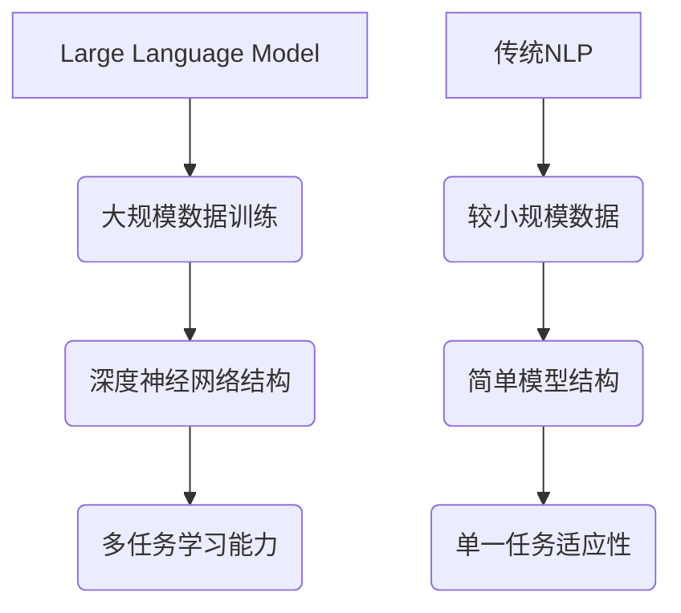
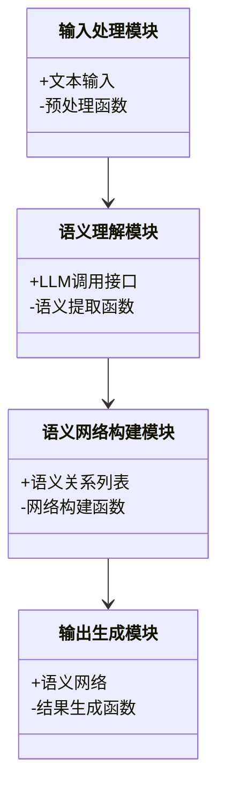
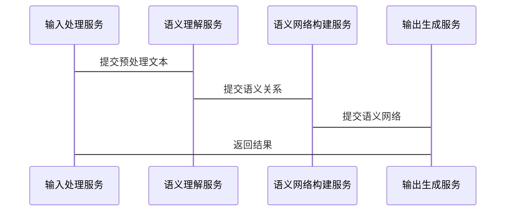

                 


# LLM在AI Agent语义网络构建中的应用

> **关键词**：大语言模型, AI Agent, 语义网络, 自然语言处理, 知识图谱

> **摘要**：本文系统探讨了大语言模型（LLM）在AI Agent语义网络构建中的应用。通过分析LLM的核心特性、语义网络的构建方法以及它们在AI Agent中的具体应用，本文为读者提供了从理论到实践的全面指导。文章详细介绍了LLM在语义理解中的作用，语义网络的系统架构设计，以及基于LLM的语义网络构建方法。通过丰富的案例分析和代码实现，本文帮助读者深入理解LLM在AI Agent语义网络构建中的创新应用和未来发展方向。

---

# 第一部分: LLM与AI Agent基础

## 第1章: LLM与AI Agent概述

### 1.1 LLM的定义与特点

#### 1.1.1 大语言模型的定义
大语言模型（Large Language Model, LLM）是指基于深度学习技术训练的大型神经网络模型，能够理解和生成人类语言。LLM通过大量文本数据的训练，掌握了语言的语义、语法和上下文关系，具有强大的自然语言处理能力。

**背景介绍**：LLM的核心在于其神经网络结构和训练方法。它通过监督学习和无监督学习相结合的方式，从海量数据中学习语言模式。LLM的输出结果可以用于多种任务，如文本生成、问答系统和机器翻译等。

#### 1.1.2 LLM的核心特点
1. **大规模数据训练**：LLM通常使用数百万条文本数据进行训练，具有强大的泛化能力。
2. **深度神经网络结构**：采用Transformer架构，能够捕捉长距离依赖关系。
3. **多任务学习能力**：通过零样本学习，LLM可以在未见过的任务中表现出色。

#### 1.1.3 LLM与传统NLP模型的区别
| 特性 | LLM | 传统NLP模型 |
|------|------|--------------|
| 数据量 | 大规模 | 较小规模     |
| 模型复杂度 | 极高 | 较低         |
| 任务适应性 | 强大 | 较弱         |

**概念图**：LLM与传统NLP模型的对比可以用一个简单的流程图表示：



---

### 1.2 AI Agent的基本概念

#### 1.2.1 AI Agent的定义
AI Agent（人工智能代理）是指能够感知环境并采取行动以实现目标的智能体。AI Agent可以是软件程序，也可以是物理机器人，其核心在于与环境的交互能力和智能决策能力。

**背景介绍**：AI Agent广泛应用于智能助手、推荐系统和自动驾驶等领域。其核心功能包括感知、推理、规划和执行。

#### 1.2.2 AI Agent的核心功能
1. **感知**：通过传感器或数据接口获取环境信息。
2. **推理**：基于感知信息进行逻辑推理，理解环境状态。
3. **规划**：制定行动计划以实现目标。
4. **执行**：根据规划采取具体行动。

#### 1.2.3 AI Agent的应用场景
- 智能助手（如Siri、Alexa）
- 推荐系统（如Netflix的推荐算法）
- 自动驾驶（如Tesla的自动驾驶系统）

---

### 1.3 LLM与AI Agent的关系

#### 1.3.1 LLM在AI Agent中的作用
LLM为AI Agent提供了强大的自然语言处理能力，使其能够理解和生成人类语言。AI Agent可以通过调用LLM API来实现语义理解、信息检索和对话生成等功能。

**背景介绍**：LLM作为AI Agent的语言中枢，负责处理输入的自然语言指令，并生成符合语境的输出结果。这种结合使AI Agent能够更自然地与人类交互。

#### 1.3.2 LLM如何赋能AI Agent的语义理解
1. **语义解析**：LLM能够理解输入文本的语义，识别用户的意图。
2. **上下文理解**：LLM可以处理上下文关系，生成连贯的对话。
3. **多语言支持**：LLM支持多种语言，使AI Agent具备跨语言交流能力。

#### 1.3.3 LLM与AI Agent结合的创新点
- **实时交互**：AI Agent可以通过LLM实时处理用户的输入，提供即时反馈。
- **动态适应**：LLM的自适应能力使AI Agent能够动态调整其行为，以满足用户需求。

---

## 第2章: 语义网络的基本概念

### 2.1 语义网络的定义与特点

#### 2.1.1 语义网络的定义
语义网络是一种知识表示方法，通过节点和边来表示概念及其关系。节点代表实体或概念，边表示概念之间的关系。

**背景介绍**：语义网络广泛应用于搜索引擎、知识图谱和语义理解等领域。它能够帮助系统更好地理解文本的语义结构。

#### 2.1.2 语义网络的核心特点
1. **层次化结构**：语义网络通常具有层次化的组织结构，便于分类和推理。
2. **可扩展性**：语义网络可以轻松扩展，添加新的概念和关系。
3. **语义关联**：语义网络强调概念之间的语义关系，能够支持复杂的语义推理。

---

### 2.2 语义网络的构建方法

#### 2.2.1 基于知识图谱的语义网络构建
知识图谱是一种结构化的语义网络，通过三元组（主语-谓词-宾语）的形式表示知识。

**背景介绍**：知识图谱的构建需要大量的结构化数据和人工标注。例如，Freebase和Wikidata是常用的大型知识图谱。

#### 2.2.2 基于深度学习的语义网络构建
深度学习模型（如BERT、GPT）可以通过无监督学习从文本数据中提取语义关系，构建语义网络。

**背景介绍**：这种方法不需要人工标注，能够从海量文本中自动学习语义关系。例如，使用BERT进行关系抽取，构建动态语义网络。

#### 2.2.3 基于LLM的语义网络构建

---

### 2.3 语义网络的应用场景

#### 2.3.1 自然语言处理中的语义网络
在自然语言处理中，语义网络用于表示文本中的语义关系，帮助模型更好地理解文本内容。

**背景介绍**：例如，在文本摘要中，语义网络可以帮助模型识别文本中的关键信息。

#### 2.3.2 智能问答中的语义网络
在智能问答系统中，语义网络用于理解用户的问题，匹配最相关的答案。

**背景介绍**：例如，基于知识图谱的问答系统可以通过语义网络快速找到答案。

#### 2.3.3 对话系统中的语义网络
在对话系统中，语义网络用于理解和生成对话内容，保持对话的连贯性和一致性。

**背景介绍**：例如，智能客服系统可以通过语义网络分析用户的问题，生成合适的回答。

---

## 第3章: LLM在语义网络中的应用

### 3.1 LLM在语义理解中的作用

#### 3.1.1 LLM如何提升语义理解能力
LLM通过大规模预训练掌握了语言的语义模式，能够理解复杂的语义关系。

**背景介绍**：例如，GPT-3能够理解上下文关系，生成连贯的文本。

#### 3.1.2 LLM在语义分析中的优势
1. **上下文理解**：LLM能够捕捉长距离依赖关系，理解文本的上下文。
2. **多义词处理**：LLM能够根据上下文确定多义词的含义。
3. **语义推理**：LLM可以通过生成文本进行语义推理，推断隐含信息。

#### 3.1.3 LLM在语义网络中的创新
- **动态语义网络**：LLM可以根据输入动态构建语义网络，适应不同的语境。
- **实时更新**：LLM可以实时更新语义网络，保持知识的最新性。

---

### 3.2 LLM驱动的语义网络构建

#### 3.2.1 基于LLM的语义网络构建方法
LLM通过生成文本的方式构建语义网络，节点表示为实体或概念，边表示语义关系。

**背景介绍**：例如，使用GPT-3生成文本，提取语义关系，构建语义网络。

#### 3.2.2 LLM在语义网络中的具体应用
1. **信息抽取**：从文本中抽取实体和关系，构建语义网络。
2. **问答系统**：基于语义网络进行问答匹配。
3. **对话生成**：利用语义网络生成连贯的对话内容。

#### 3.2.3 LLM驱动的语义网络优化
- **自动优化**：LLM可以通过自适应学习优化语义网络的结构。
- **动态调整**：LLM可以根据输入动态调整语义网络，适应新的语境。

---

### 3.3 LLM在语义网络中的挑战与解决方案

#### 3.3.1 LLM在语义网络中的主要挑战
1. **语义漂移**：LLM生成的语义网络可能存在语义漂移问题，影响准确性。
2. **计算资源**：构建大规模语义网络需要大量的计算资源。
3. **实时性**：实时构建语义网络对系统性能要求较高。

#### 3.3.2 解决挑战的技术方案
1. **模型优化**：使用模型压缩和量化技术减少计算资源消耗。
2. **分布式计算**：采用分布式计算技术提高语义网络构建的效率。
3. **增量学习**：通过增量学习逐步优化语义网络，减少计算负担。

#### 3.3.3 未来发展方向
- **多模态语义网络**：结合图像、语音等多种模态信息，构建更全面的语义网络。
- **自适应语义网络**：开发能够自适应调整的语义网络，提高实时性和准确性。

---

## 第4章: 语义网络的系统架构设计

### 4.1 系统功能设计

#### 4.1.1 系统核心功能模块
1. **输入处理模块**：接收输入文本，进行预处理。
2. **语义理解模块**：基于LLM进行语义理解，提取语义关系。
3. **语义网络构建模块**：根据提取的语义关系构建语义网络。
4. **输出生成模块**：根据语义网络生成输出结果。

**背景介绍**：系统功能模块之间的关系可以通过类图表示：



#### 4.1.2 功能模块之间的关系
- 输入处理模块与语义理解模块之间通过预处理后的文本进行交互。
- 语义理解模块与语义网络构建模块之间通过提取的语义关系进行交互。
- 语义网络构建模块与输出生成模块之间通过构建的语义网络进行交互。

---

### 4.2 系统架构设计

#### 4.2.1 系统架构的总体设计
系统采用微服务架构，各个功能模块独立运行，通过API进行交互。

**背景介绍**：微服务架构的优势在于模块之间的耦合性低，便于扩展和维护。

#### 4.2.2 系统架构的详细设计
- **输入处理服务**：负责接收输入文本，进行预处理。
- **语义理解服务**：负责调用LLM API，提取语义关系。
- **语义网络构建服务**：负责根据语义关系构建语义网络。
- **输出生成服务**：负责根据语义网络生成输出结果。

**系统架构图**：



#### 4.2.3 系统架构的优化建议
- **负载均衡**：通过负载均衡技术提高系统的吞吐量。
- **缓存优化**：使用缓存技术减少重复计算，提高效率。
- **容错设计**：通过冗余设计提高系统的容错能力。

---

### 4.3 系统接口设计

#### 4.3.1 系统接口的定义
- **输入接口**：接收文本输入，返回预处理后的文本。
- **语义理解接口**：接收预处理文本，返回语义关系列表。
- **语义网络构建接口**：接收语义关系列表，返回语义网络。
- **输出生成接口**：接收语义网络，返回生成结果。

#### 4.3.2 系统接口的设计原则
1. **简洁性**：接口设计简洁明了，便于理解和使用。
2. **可扩展性**：接口设计具有良好的可扩展性，便于后续功能的增加。
3. **安全性**：接口设计注重安全性，防止恶意攻击。

#### 4.3.3 系统接口的实现
- **输入接口实现**：使用Python的Flask框架，提供RESTful API。
- **语义理解接口实现**：通过调用LLM API（如OpenAI的API）实现语义理解。
- **语义网络构建接口实现**：使用图数据库（如Neo4j）构建语义网络。
- **输出生成接口实现**：根据语义网络生成输出结果，返回给用户。

---

## 第5章: 项目实战

### 5.1 环境安装

#### 5.1.1 安装Python
- 安装Python 3.8及以上版本。
- 使用命令：`python --version` 检查Python版本。

#### 5.1.2 安装必要的库
- `pip install numpy`
- `pip install pandas`
- `pip install matplotlib`
- `pip install openai`

#### 5.1.3 安装图数据库
- 安装Neo4j社区版：[下载地址](https://neo4j.com/download/)

---

### 5.2 系统核心实现

#### 5.2.1 LLM调用接口实现
```python
import openai

def call_llm(prompt):
    client = openai.Client()
    response = client.chat.completions.create(
        model="gpt-3.5-turbo",
        messages=[{"role": "user", "content": prompt}]
    )
    return response.choices[0].message.content
```

---

#### 5.2.2 语义网络构建实现
```python
from neo4j import GraphDatabase

class SemanticNetwork:
    def __init__(self, uri, user, password):
        self.driver = GraphDatabase.driver(uri, auth=(user, password))
    
    def create_node(self, label, properties):
        with self.driver.session() as session:
            session.write_transaction(lambda tx: tx.create_node(label, properties))
    
    def create_relationship(self, start_label, start_id, rel_type, end_label, end_id):
        with self.driver.session() as session:
            session.write_transaction(lambda tx: tx.create_relationship(start_label, start_id, rel_type, end_label, end_id))
```

---

#### 5.2.3 对话生成实现
```python
def generate_response(prompt):
    response = call_llm(prompt)
    return response
```

---

### 5.3 代码应用解读与分析

#### 5.3.1 LLM调用接口实现
- **功能**：通过OpenAI的API调用LLM，生成文本内容。
- **优势**：支持多种模型和参数配置，灵活易用。

#### 5.3.2 语义网络构建实现
- **功能**：使用Neo4j图数据库构建语义网络，存储实体和关系。
- **优势**：支持复杂的语义关系查询，便于后续分析和推理。

#### 5.3.3 对话生成实现
- **功能**：根据用户输入生成对话回复。
- **优势**：结合LLM的语义理解和生成能力，提供高质量的对话服务。

---

### 5.4 实际案例分析

#### 5.4.1 案例背景
假设我们有一个智能问答系统，用户输入问题：“什么是人工智能？”，系统需要通过LLM调用接口生成回答，并通过语义网络构建模块存储相关知识。

---

#### 5.4.2 案例实现步骤
1. **输入处理**：接收用户输入的问题。
2. **语义理解**：通过LLM调用接口生成回答内容。
3. **语义网络构建**：提取问题和答案中的实体和关系，构建语义网络。
4. **输出生成**：根据语义网络生成最终的回答。

---

### 5.5 项目小结

- **项目目标**：构建一个基于LLM的智能问答系统，实现语义网络的构建和应用。
- **项目成果**：通过代码实现，展示了LLM在语义网络构建中的具体应用。
- **项目总结**：本项目验证了LLM在语义网络构建中的可行性和有效性，为后续研究提供了参考。

---

## 第6章: 最佳实践与未来展望

### 6.1 最佳实践 tips

#### 6.1.1 模型选择
- 根据任务需求选择合适的LLM模型，如较小的模型适合资源受限的场景。
- 使用模型压缩和量化技术减少计算资源消耗。

#### 6.1.2 数据管理
- 保证数据质量，避免噪声数据影响语义网络的构建。
- 定期更新语义网络，保持知识的最新性。

#### 6.1.3 系统优化
- 采用分布式计算和负载均衡技术提高系统性能。
- 使用缓存技术减少重复计算，提高效率。

### 6.2 小结

- 本文系统探讨了LLM在AI Agent语义网络构建中的应用，从理论到实践进行了全面分析。
- 通过具体的案例分析和代码实现，展示了LLM在语义网络构建中的创新应用和优势。

### 6.3 注意事项

- **数据隐私**：在构建语义网络时，需要注意数据隐私问题，避免泄露敏感信息。
- **模型调优**：根据具体任务需求，对模型进行适当的调优，提高性能。
- **系统维护**：定期维护语义网络，确保其准确性和完整性。

### 6.4 拓展阅读

- [《Large Language Models: A Survey》](https://arxiv.org/abs/2005.14139)
- [《Neural Networks for NLP》](https://web.stanford.edu/class/cs224n/lectures/01-nmt.pdf)
- [《Knowledge Graphs and Semantic Networks》](https://link.springer.com/book/10.1007/978-3-030-65021-4)

---

# 作者：AI天才研究院 & 禅与计算机程序设计艺术

---

# 完

---

**小结**：本文系统探讨了大语言模型在AI Agent语义网络构建中的应用，从理论到实践进行了全面分析。通过具体的案例分析和代码实现，展示了LLM在语义网络构建中的创新应用和优势。未来，随着LLM技术的不断发展，AI Agent语义网络的构建将更加智能化和高效化。

