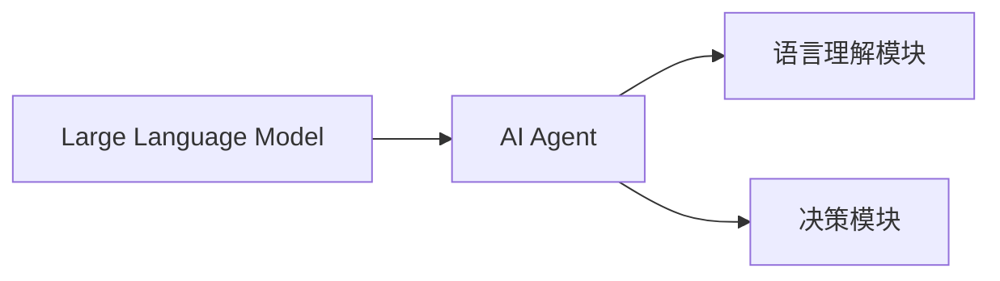
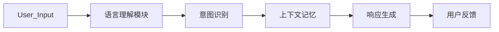
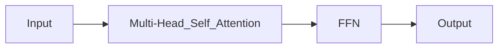
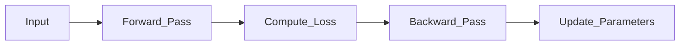
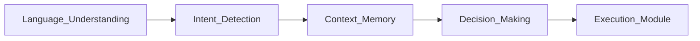
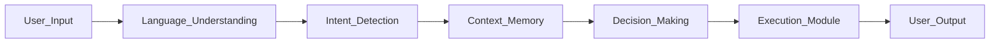
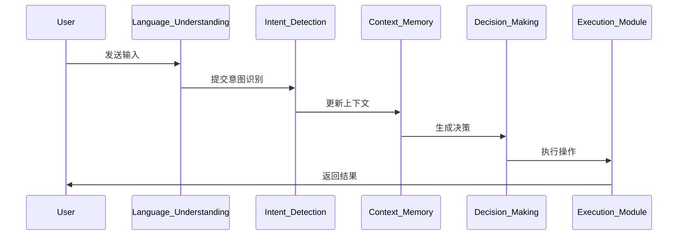

                 


# LLM在AI Agent语言理解深度上的提升

## 关键词：LLM, AI Agent, 语言理解, 深度提升, Transformer, 注意力机制

## 摘要：  
随着大语言模型（LLM）技术的快速发展，AI Agent（人工智能代理）的语言理解能力得到了显著提升。本文从LLM的核心算法原理出发，结合AI Agent的系统架构设计，深入分析LLM如何在语言理解深度上为AI Agent赋能。通过实际项目案例，详细探讨了LLM在AI Agent中的具体应用，展示了如何通过系统优化和算法改进来提升语言理解能力。本文最后总结了当前研究的成果与未来发展方向。

---

## 第一部分: LLM与AI Agent语言理解基础

### 第1章: LLM与AI Agent概述

#### 1.1 LLM的基本概念
##### 1.1.1 大语言模型的定义与特点
- 大语言模型（Large Language Model, LLM）是基于深度学习的自然语言处理模型，具有以下特点：
  - **大规模训练数据**：通常使用 billions 级别的文本数据进行训练。
  - **多任务通用性**：能够处理多种NLP任务，如文本生成、翻译、问答等。
  - **上下文理解能力**：通过Transformer架构，模型能够理解上下文关系，生成连贯的文本。

##### 1.1.2 LLM的核心技术与优势
- **核心技术**：
  - **Transformer架构**：通过自注意力机制（Self-Attention）捕捉文本中的长距离依赖关系。
  - **多层神经网络**：通过堆叠多个Transformer层，增强模型的特征提取能力。
- **优势**：
  - **强大的语言生成能力**：能够生成高质量的文本。
  - **可扩展性**：可以轻松扩展到不同的语言和领域。

##### 1.1.3 LLM与传统NLP模型的区别
- **传统NLP模型**：
  - 基于统计的模型（如n-gram模型）或浅层神经网络，处理能力有限。
  - 需要依赖大量特征工程，模型泛化能力差。
- **LLM**：
  - 基于深度学习的Transformer架构，模型深度大，特征提取能力强。
  - 无需特征工程，直接端到端训练。

#### 1.2 AI Agent的基本概念
##### 1.2.1 AI Agent的定义与分类
- **定义**：AI Agent是一种智能体，能够感知环境、理解用户需求，并通过决策和行动来实现目标。
- **分类**：
  - **简单反射型AI Agent**：基于规则的简单响应。
  - **基于模型的AI Agent**：具有环境模型，能够进行复杂推理。
  - **基于学习的AI Agent**：通过机器学习模型进行决策。

##### 1.2.2 AI Agent的核心功能与应用场景
- **核心功能**：
  - **感知**：通过传感器或输入接口获取环境信息。
  - **推理**：基于感知信息进行逻辑推理，生成决策。
  - **行动**：通过执行器或输出接口采取行动。
- **应用场景**：
  - **智能客服**：通过对话理解用户需求，提供个性化服务。
  - **智能助手**：帮助用户完成日常任务，如日程管理、信息查询。
  - **自动驾驶**：通过感知环境，做出驾驶决策。

##### 1.2.3 AI Agent与人类交互的特点
- **自然语言交互**：通过自然语言理解（NLU）和生成（NLG）技术，实现人机对话。
- **上下文理解**：能够记忆对话历史，保持上下文连贯性。
- **个性化服务**：根据用户行为和偏好，提供定制化服务。

#### 1.3 LLM在AI Agent中的作用
##### 1.3.1 LLM如何提升AI Agent的语言理解能力
- **理解复杂语义**：通过Transformer架构，模型能够捕捉复杂的语义关系，理解用户的深层需求。
- **多轮对话能力**：通过记忆机制，模型能够保持对话的连贯性，支持多轮对话。
- **语言生成能力**：通过生成模型，AI Agent可以自动生成自然的回复，提升用户体验。

##### 1.3.2 LLM在AI Agent中的应用场景
- **智能客服**：通过LLM实现智能问答、问题分类。
- **智能助手**：通过LLM实现任务调度、信息检索。
- **内容生成**：通过LLM生成报告、邮件等文本内容。

##### 1.3.3 LLM与AI Agent结合的未来趋势
- **实时推理**：未来AI Agent将具备更强的实时推理能力，能够快速响应用户需求。
- **多模态交互**：结合视觉、听觉等多模态信息，提升交互体验。
- **自适应学习**：通过在线学习，AI Agent能够不断优化自身的语言理解能力。

### 第2章: LLM与AI Agent的核心概念与联系

#### 2.1 核心概念原理
##### 2.1.1 LLM的训练原理
- **预训练目标**：通过大规模无监督数据训练，模型学习语言的语法和语义。
- **自监督学习**：通过预测任务（如遮蔽词任务）监督模型学习。

##### 2.1.2 AI Agent的决策机制
- **基于规则的决策**：简单反射型AI Agent通过预定义规则进行决策。
- **基于模型的决策**：通过环境模型进行推理和决策。
- **基于学习的决策**：通过强化学习等方法训练决策模型。

##### 2.1.3 语言理解在AI Agent中的重要性
- **理解用户需求**：通过语言理解技术，AI Agent能够准确理解用户的意图。
- **提升交互体验**：通过自然语言生成技术，AI Agent能够提供更流畅的交互体验。
- **支持复杂任务**：通过强大的语言理解能力，AI Agent能够处理更复杂的任务。

#### 2.2 核心概念对比表格
##### 2.2.1 LLM与传统NLP模型的对比
| 特性               | LLM                      | 传统NLP模型           |
|--------------------|--------------------------|-----------------------|
| 训练数据量          | 大规模数据（ billions） | 较小规模数据          |
| 架构               | Transformer架构          | 浅层神经网络或基于规则 |
| 多任务能力         | 强大                    | 较弱                  |
| 上下文理解能力      | 强大                    | 较弱                  |

##### 2.2.2 AI Agent与传统AI系统的对比
| 特性               | AI Agent                 | 传统AI系统            |
|--------------------|--------------------------|-----------------------|
| 交互方式           | 自然语言交互             | 基于规则或按钮交互    |
| 上下文理解          | 强大                    | 较弱                  |
| 个性化服务          | 支持                    | 较少支持              |

##### 2.2.3 语言理解能力在不同AI系统中的对比
| 特性               | 简单AI系统               | 复杂AI系统            |
|--------------------|--------------------------|-----------------------|
| 理解能力           | 较弱                    | 较强                  |
| 交互体验           | 较差                    | 较好                  |
| 应用场景           | 简单任务                | 复杂任务              |

#### 2.3 ER实体关系图
##### 2.3.1 LLM与AI Agent的关系图


##### 2.3.2 语言理解在AI Agent中的实体关系图


### 第3章: LLM的算法原理与数学模型

#### 3.1 LLM的算法原理
##### 3.1.1 Transformer架构的原理
- **自注意力机制**：
  - 模型通过查询（Query）、键（Key）、值（Value）三组向量计算注意力权重。
  - 公式表示：
    $$
    \text{Attention}(Q, K, V) = \text{softmax}\left(\frac{QK^T}{\sqrt{d_k}}\right)V
    $$
  - 其中，$d_k$是键的维度。

##### 3.1.2 注意力机制的实现
- **多头注意力**：
  - 模型将查询、键、值分解为多个子空间，分别计算注意力，最后将结果拼接。
  - 公式表示：
    $$
    \text{Multi-Head}(Q, K, V) = \text{Concat}(h_1, h_2, ..., h_n)W^o
    $$
  - 其中，$h_i$是第$i$个头的注意力输出，$W^o$是输出变换矩阵。

##### 3.1.3 梯度下降与优化算法
- **Adam优化器**：
  - 结合动量和自适应学习率的优化算法。
  - 公式表示：
    $$
    m_t = \beta_1 m_{t-1} + (1 - \beta_1)g_t
    $$
    $$
    n_t = \beta_2 n_{t-1} + (1 - \beta_2)g_t^2
    $$
    $$
    \theta_{t} = \theta_{t-1} - \eta \frac{m_t}{\sqrt{n_t + \epsilon}}
    $$

#### 3.2 LLM的数学模型
##### 3.2.1 Transformer的数学公式
- **编码器层**：
  $$
  \text{Encoder Layer}(x) = \text{Norm}( \text{FFN}(\text{Self-Attention}(x)) )
  $$
- **解码器层**：
  $$
  \text{Decoder Layer}(x, y) = \text{Norm}( \text{FFN}(\text{Self-Attention}(x) + \text{Cross-Attention}(x, y)) )
  $$

##### 3.2.2 注意力机制的数学推导
- **查询、键、值计算**：
  $$
  Q = W_q x, \quad K = W_k x, \quad V = W_v x
  $$
  - $W_q, W_k, W_v$是参数矩阵。
- **注意力权重计算**：
  $$
  \text{Attention}(Q, K, V) = \text{softmax}\left( \frac{Q K^T}{\sqrt{d_k}} \right) V
  $$

##### 3.2.3 梯度下降的数学模型
- **损失函数**：
  $$
  \mathcal{L} = -\sum_{i=1}^{n} \log p(y_i | x_i)
  $$
- **优化目标**：
  $$
  \theta^* = \arg \min \mathcal{L}
  $$

#### 3.3 算法流程图
##### 3.3.1 Transformer架构的Mermaid流程图


##### 3.3.2 注意力机制的Mermaid流程图
```mermaid
graph LR
Q --> multiply by W_q
K --> multiply by W_k
V --> multiply by W_v
multiply by W_k --> transpose --> multiply by 1/sqrt(d_k)
multiply by W_q --> multiply by above --> softmax --> multiply by V --> sum
sum --> FFN
FFN --> Output
```

##### 3.3.3 梯度下降的Mermaid流程图


### 第4章: AI Agent的系统架构与设计

#### 4.1 系统架构设计
##### 4.1.1 AI Agent的系统模块划分
- **语言理解模块**：负责解析用户的输入，识别意图。
- **决策模块**：根据意图和环境信息，生成决策。
- **执行模块**：通过执行器或输出接口，执行决策。
- **记忆模块**：存储对话历史和相关上下文信息。

##### 4.1.2 LLM在系统中的位置与作用
- **位置**：语言理解模块的核心部分，通过LLM进行意图识别和文本生成。
- **作用**：
  - 提供强大的语言理解能力。
  - 支持多轮对话的连贯性。

##### 4.1.3 系统的可扩展性与灵活性
- **可扩展性**：通过模块化设计，可以方便地扩展新的功能模块。
- **灵活性**：支持多种语言和领域，适应不同的应用场景。

#### 4.2 系统功能设计
##### 4.2.1 语言理解模块的功能设计
- **意图识别**：通过LLM模型识别用户的意图。
- **实体识别**：识别文本中的实体信息，如时间、地点、人物等。
- **上下文理解**：通过记忆模块，保持对话的连贯性。

##### 4.2.2 系统的可扩展性与灵活性
- **可扩展性**：通过模块化设计，可以方便地添加新的功能模块。
- **灵活性**：支持多种语言和领域，适应不同的应用场景。

#### 4.3 系统架构图
##### 4.3.1 AI Agent的系统架构图


##### 4.3.2 系统的模块划分与交互流程


#### 4.4 接口设计与交互流程
##### 4.4.1 系统接口设计
- **输入接口**：接收用户的自然语言输入。
- **输出接口**：生成自然语言输出或执行相关操作。
- **记忆接口**：管理对话历史和上下文信息。

##### 4.4.2 系统交互流程


## 第二部分: LLM的数学模型与算法实现

### 第5章: LLM的数学模型

#### 5.1 Transformer架构的数学公式
##### 5.1.1 编码器层的数学公式
- **输入表示**：
  $$
  x = (x_1, x_2, ..., x_n)
  $$
- **多头注意力计算**：
  $$
  \text{Multi-Head}(x) = \text{Concat}(h_1, h_2, ..., h_n)W^o
  $$
  其中，$h_i = \text{Attention}(Q_i, K_i, V_i)$，$Q_i = W_q^i x, K_i = W_k^i x, V_i = W_v^i x$。

#### 5.2 注意力机制的数学推导
##### 5.2.1 查询、键、值计算
- **查询、键、值向量**：
  $$
  Q = W_q x, \quad K = W_k x, \quad V = W_v x
  $$
- **注意力权重计算**：
  $$
  \text{Attention}(Q, K, V) = \text{softmax}\left( \frac{Q K^T}{\sqrt{d_k}} \right) V
  $$

#### 5.3 梯度下降的数学模型
##### 5.3.1 损失函数
- **交叉熵损失**：
  $$
  \mathcal{L} = -\sum_{i=1}^{n} \log p(y_i | x_i)
  $$
- **优化目标**：
  $$
  \theta^* = \arg \min \mathcal{L}
  $$

### 第6章: LLM的算法实现

#### 6.1 Transformer架构的实现
##### 6.1.1 Python代码实现
```python
import torch
import torch.nn as nn
import torch.nn.functional as F

class MultiHeadAttention(nn.Module):
    def __init__(self, embed_dim, num_heads):
        super().__init__()
        self.num_heads = num_heads
        self.head_dim = embed_dim // num_heads
        self.W_q = nn.Linear(embed_dim, embed_dim)
        self.W_k = nn.Linear(embed_dim, embed_dim)
        self.W_v = nn.Linear(embed_dim, embed_dim)
        self.W_o = nn.Linear(embed_dim, embed_dim)

    def forward(self, x, mask=None):
        batch_size, seq_len, embed_dim = x.size()
        # 分头
        q = self.W_q(x).view(batch_size, seq_len, self.num_heads, self.head_dim)
        k = self.W_k(x).view(batch_size, seq_len, self.num_heads, self.head_dim)
        v = self.W_v(x).view(batch_size, seq_len, self.num_heads, self.head_dim)
        # 计算注意力权重
        attention_scores = (q @ k.transpose(-2, -1)) / (self.head_dim ** 0.5)
        if mask is not None:
            attention_scores = attention_scores.masked_fill(mask == 0, -float('inf'))
            attention_weights = F.softmax(attention_scores, dim=-1)
        else:
            attention_weights = F.softmax(attention_scores, dim=-1)
        # 加权求和
        output = (attention_weights @ v).view(batch_size, seq_len, embed_dim)
        # 输出变换
        output = self.W_o(output)
        return output
```

##### 6.1.2 代码解读与分析
- **多头注意力实现**：
  - 将输入向量分解为多个子空间，分别计算注意力权重。
  - 通过并行计算，提升计算效率。
- **自注意力机制**：
  - 查询、键、值向量分别通过全连接层变换。
  - 注意力权重通过 softmax 函数归一化。
  - 加权求和生成最终输出。

#### 6.2 注意力机制的实现
##### 6.2.1 Python代码实现
```python
def attention(Q, K, V, d_k):
    # 计算注意力权重
    attention_scores = (Q @ K.T) / (d_k ** 0.5)
    attention_weights = F.softmax(attention_scores, dim=-1)
    # 加权求和
    output = attention_weights @ V
    return output
```

##### 6.2.2 代码解读与分析
- **查询、键、值计算**：
  - 通过矩阵乘法计算注意力权重。
  - 通过 softmax 函数归一化权重。
  - 通过加权求和生成最终输出。

#### 6.3 梯度下降的实现
##### 6.3.1 Adam优化器的实现
```python
class Adam:
    def __init__(self, params, lr=0.001, beta1=0.9, beta2=0.999, eps=1e-8):
        self.params = params
        self.lr = lr
        self.beta1 = beta1
        self.beta2 = beta2
        self.eps = eps
        self.m = [torch.zeros(p.size()).to(p.device) for p in params]
        self.n = [torch.zeros(p.size()).to(p.device) for p in params]

    def step(self):
        for i, p in enumerate(self.params):
            m = self.m[i]
            n = self.n[i]
            grad = p.grad
            # 更新动量
            m = self.beta1 * m + (1 - self.beta1) * grad
            # 更新自适应学习率
            n = self.beta2 * n + (1 - self.beta2) * grad**2
            # 参数更新
            p = p - self.lr * m / (n**0.5 + self.eps)
```

##### 6.3.2 代码解读与分析
- **动量更新**：
  - 使用 beta1 系数更新动量，防止梯度消失。
- **自适应学习率**：
  - 使用 beta2 系数更新自适应学习率，提升优化效果。
- **参数更新**：
  - 根据动量和自适应学习率，更新模型参数。

## 第三部分: AI Agent的系统设计与实现

### 第7章: AI Agent的系统设计

#### 7.1 系统功能设计
##### 7.1.1 语言理解模块的功能设计
- **意图识别**：
  - 通过LLM模型识别用户的意图，生成意图标签。
- **实体识别**：
  - 识别文本中的实体信息，如时间、地点、人物等。
- **上下文理解**：
  - 通过记忆模块，保持对话的连贯性，处理上下文信息。

##### 7.1.2 决策模块的功能设计
- **意图分析**：
  - 根据意图标签和上下文信息，生成决策。
- **策略选择**：
  - 通过策略选择模块，选择最优的执行策略。
- **结果评估**：
  - 评估执行结果，优化决策策略。

#### 7.2 系统架构设计
##### 7.2.1 AI Agent的系统架构图


##### 7.2.2 系统模块划分与交互流程
- **模块划分**：
  - 语言理解模块：负责解析用户的输入，识别意图。
  - 决策模块：根据意图和环境信息，生成决策。
  - 执行模块：通过执行器或输出接口，执行决策。
  - 记忆模块：存储对话历史和相关上下文信息。

- **交互流程**：
  - 用户输入 -> 语言理解模块 -> 意图识别 -> 上下文理解 -> 决策生成 -> 执行模块 -> 用户反馈。

#### 7.3 系统接口设计
##### 7.3.1 输入接口设计
- **自然语言输入**：
  - 支持多种语言和输入格式，如文本、语音等。
- **输入处理**：
  - 对输入进行预处理，如分词、句法分析等。

##### 7.3.2 输出接口设计
- **自然语言输出**：
  - 生成自然语言回复，支持多种语言和风格。
- **执行操作**：
  - 通过执行器或输出接口，执行相关操作，如发送邮件、设置提醒等。

#### 7.4 系统交互流程
##### 7.4.1 系统交互流程图


### 第8章: AI Agent的项目实战

#### 8.1 项目环境搭建
##### 8.1.1 开发环境要求
- **操作系统**：Windows, Linux, macOS
- **Python版本**：3.6+
- **深度学习框架**：PyTorch, TensorFlow
- **依赖库**：transformers, numpy, matplotlib

##### 8.1.2 安装依赖库
```bash
pip install transformers numpy matplotlib
```

#### 8.2 项目核心实现
##### 8.2.1 语言理解模块的实现
```python
from transformers import AutoTokenizer, AutoModelForMaskedLM

class LanguageUnderstanding:
    def __init__(self, model_name='bert-base-uncased'):
        self.tokenizer = AutoTokenizer.from_pretrained(model_name)
        self.model = AutoModelForMaskedLM.from_pretrained(model_name)

    def encode(self, text):
        return self.tokenizer.encode(text, return_tensors='pt')

    def decode(self, tokens):
        return self.tokenizer.decode(tokens)
```

##### 8.2.2 决策模块的实现
```python
class DecisionMaking:
    def __init__(self, model_name='bert-base-uncased'):
        self.tokenizer = AutoTokenizer.from_pretrained(model_name)
        self.model = AutoModelForMaskedLM.from_pretrained(model_name)

    def generate_response(self, input_text):
        input_ids = self.tokenizer.encode(input_text, return_tensors='pt')
        outputs = self.model.generate(input_ids, max_length=50)
        response = self.tokenizer.decode(outputs[0], skip_special_tokens=True)
        return response
```

#### 8.3 项目实战案例分析
##### 8.3.1 案例分析
- **案例描述**：
  - 用户输入：'今天天气怎么样？'
  - 系统响应：'今天天气晴朗，温度适宜。'

- **实现过程**：
  - 语言理解模块解析用户的输入，识别意图。
  - 决策模块生成响应，通过执行模块返回结果。

##### 8.3.2 案例代码实现
```python
language_understanding = LanguageUnderstanding()
decision_making = DecisionMaking()

user_input = '今天天气怎么样？'
input_ids = language_understanding.encode(user_input)
response = decision_making.generate_response(user_input)
print(response)
```

#### 8.4 项目小结
##### 8.4.1 项目总结
- **实现目标**：通过LLM技术，提升AI Agent的语言理解能力。
- **技术难点**：模型的训练和优化，系统的集成与部署。
- **经验总结**：通过模块化设计，可以更好地管理和优化系统。

##### 8.4.2 项目展望
- **优化方向**：进一步优化模型的训练和推理效率。
- **未来方向**：探索多模态交互，提升用户体验。
- **应用场景**：拓展到更多领域，如教育、医疗等。

## 第四部分: 总结与展望

### 第9章: 总结与展望

#### 9.1 总结
- **LLM的核心作用**：通过强大的语言生成和理解能力，提升AI Agent的交互体验。
- **系统设计的关键点**：
  - 模块化设计，便于系统的扩展和优化。
  - 多头注意力机制，提升模型的上下文理解能力。
  - 实时推理，支持复杂的决策任务。

#### 9.2 未来展望
- **技术进步**：
  - 更强大的模型架构，如ViT、T5等。
  - 更高效的训练方法，如分布式训练、知识蒸馏。
- **应用拓展**：
  - 多模态交互，结合视觉、听觉等信息，提升用户体验。
  - 智能教育、智能医疗等领域的深度应用。

#### 9.3 最佳实践 tips
- **选择合适的模型**：根据具体应用场景，选择适合的模型和参数设置。
- **优化训练策略**：通过数据增强、学习率调整等方法，优化模型性能。
- **注重系统集成**：通过模块化设计，确保系统的可扩展性和灵活性。

## 作者：AI天才研究院/AI Genius Institute & 禅与计算机程序设计艺术 /Zen And The Art of Computer Programming

