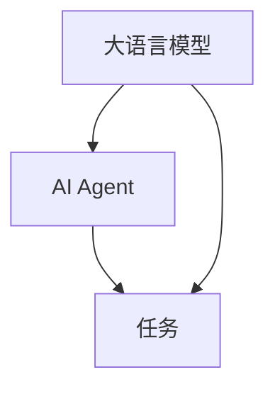
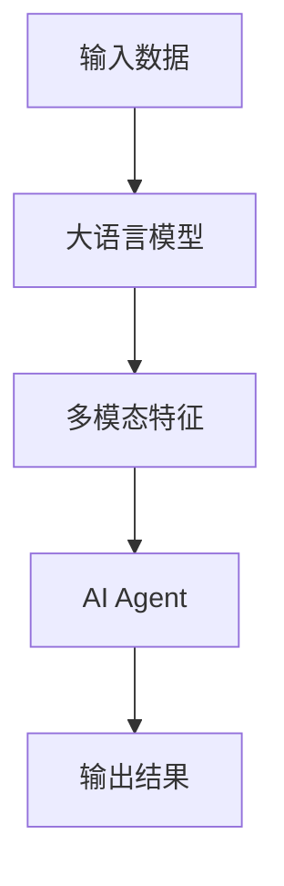
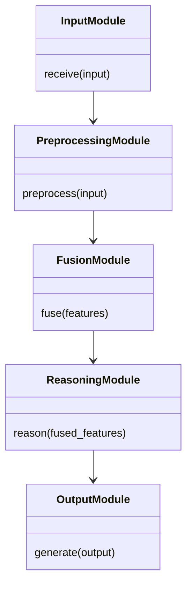
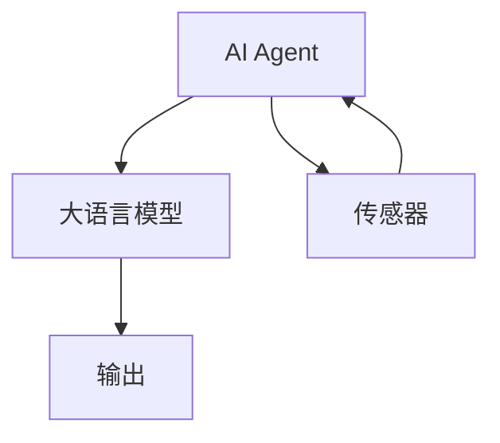

                 


# LLM在AI Agent跨模态理解中的应用

**关键词：** 大语言模型（LLM）、AI Agent、跨模态理解、多模态数据、人机交互

**摘要：** 本文探讨了大语言模型（LLM）在AI Agent中的应用，特别是在跨模态理解方面的创新和挑战。文章从背景介绍、核心概念、算法原理、系统架构到项目实战，全面分析了LLM在AI Agent中的作用及其对跨模态任务的推动。通过详细的技术分析和案例研究，本文为读者提供了全面的理解和实践指导。

---

# 第1章: 背景介绍与核心概念

## 1.1 问题背景与描述

### 1.1.1 当前AI Agent的发展现状
AI Agent（智能体）是一种能够感知环境、做出决策并执行任务的智能系统。随着人工智能技术的快速发展，AI Agent在多个领域展现出强大的应用潜力，例如智能助手、自动驾驶、智能客服等。然而，现有的AI Agent大多依赖单一模态的数据处理能力，难以应对复杂的跨模态任务。

### 1.1.2 跨模态理解的必要性
跨模态理解指的是同时处理和理解多种模态（如文本、图像、语音、视频等）的能力。在现实场景中，信息往往以多种模态的形式呈现，例如用户可能通过语音和图像表达需求。因此，AI Agent需要具备跨模态理解能力，才能更好地与用户交互并完成复杂任务。

### 1.1.3 LLM在AI Agent中的角色
大语言模型（LLM）以其强大的自然语言处理能力，成为AI Agent的核心模块。LLM能够理解用户输入的文本信息，并通过跨模态推理生成多模态的响应。例如，LLM可以分析用户的文本查询，结合图像信息，生成相应的视觉反馈。

## 1.2 问题解决与边界

### 1.2.1 跨模态理解的核心问题
跨模态理解的核心问题是如何将不同模态的数据进行有效的融合和关联。例如，在图像描述生成任务中，模型需要理解图像内容并生成相应的文本描述。

### 1.2.2 LLM在跨模态任务中的优势
LLM在跨模态任务中的优势主要体现在其强大的语言理解和生成能力。通过LLM，AI Agent可以更自然地与用户交互，并结合其他模态信息完成任务。

### 1.2.3 问题的边界与外延
跨模态理解的边界在于如何高效地处理多种模态数据，并确保模型的可解释性和鲁棒性。外延则涉及更多模态的融合，例如视频、音频等。

## 1.3 核心概念与结构

### 1.3.1 LLM的定义与特点
大语言模型（LLM）是指基于深度学习的自然语言处理模型，具有大规模参数和强大的上下文理解能力。LLM的特点包括：
- **大规模训练数据**：通常基于海量的文本数据进行预训练。
- **多任务能力**：能够处理多种语言理解和生成任务。
- **上下文理解**：能够捕捉文本中的语义和逻辑关系。

### 1.3.2 AI Agent的定义与功能
AI Agent是一种智能系统，能够感知环境、理解用户需求、做出决策并执行任务。其功能包括：
- **感知**：通过多种模态传感器获取环境信息。
- **推理**：基于感知信息进行分析和推理。
- **决策**：根据推理结果制定行动策略。
- **执行**：通过执行器完成任务。

### 1.3.3 跨模态理解的结构与组成
跨模态理解的结构通常包括以下组成部分：
1. **数据输入**：多种模态的数据输入，例如文本、图像、语音等。
2. **模态处理**：对每种模态数据进行预处理和特征提取。
3. **模态融合**：将不同模态的特征进行融合，生成统一的表示。
4. **跨模态推理**：基于融合的表示进行推理和决策。
5. **输出生成**：生成符合任务需求的输出，例如文本、图像、语音等。

---

# 第2章: LLM与AI Agent的核心原理

## 2.1 LLM的核心原理

### 2.1.1 大语言模型的训练机制
大语言模型通常采用基于Transformer的架构，通过自监督学习从海量文本数据中学习语言规律。训练过程包括编码器和解码器两个部分：
- **编码器**：将输入文本转化为上下文表示。
- **解码器**：根据编码器的输出生成目标文本。

### 2.1.2 模型的注意力机制
注意力机制是大语言模型的核心组件，能够捕捉文本中的长距离依赖关系。通过注意力机制，模型可以聚焦于重要的信息，提高理解和生成的准确性。

### 2.1.3 模型的生成机制
大语言模型的生成机制基于解码器的自回归结构。模型逐个生成字符或单词，同时根据上下文信息调整生成的概率分布。

## 2.2 AI Agent的工作原理

### 2.2.1 Agent的感知与决策过程
AI Agent通过多种传感器（如摄像头、麦克风）获取环境信息，并通过内部模型（如LLM）进行分析和推理。根据推理结果，Agent制定行动策略。

### 2.2.2 Agent的执行与反馈机制
Agent通过执行器（如机器人手臂、显示器）执行任务，并根据用户反馈调整其行为。反馈机制是AI Agent实现自适应的关键。

### 2.2.3 Agent的自适应能力
通过在线学习和强化学习，AI Agent能够不断优化其行为策略，提高在复杂环境中的适应能力。

## 2.3 跨模态理解的原理

### 2.3.1 多模态数据的融合方法
跨模态数据融合方法包括：
- **特征级融合**：在特征层对不同模态的数据进行融合。
- **决策级融合**：在决策层对不同模态的结果进行融合。

### 2.3.2 跨模态信息的对齐与关联
跨模态信息的对齐与关联是通过将不同模态的数据映射到一个共同的语义空间中实现的。例如，将图像特征与文本描述对齐，以便模型能够理解两者的关联关系。

### 2.3.3 跨模态理解的评价指标
常用的跨模态理解评价指标包括：
- **准确率**：模型对跨模态数据的理解正确性。
- **BLEU**：文本生成的评价指标。
- **ROUGE**：文本摘要的评价指标。

---

# 第3章: 核心概念的联系与对比

## 3.1 LLM与AI Agent的关系

### 3.1.1 LLM作为AI Agent的核心模块
大语言模型是AI Agent的核心模块，负责理解和生成语言信息。通过LLM，AI Agent能够与用户进行自然的语言交互。

### 3.1.2 AI Agent作为LLM的应用载体
AI Agent是LLM的应用载体，通过将LLM集成到Agent中，可以实现多种模态数据的处理和任务执行。

### 3.1.3 两者的协同工作模式
AI Agent通过调用LLM的API接口，实现语言信息的处理。LLM通过与Agent的其他模块协同工作，完成跨模态任务。

## 3.2 跨模态理解与LLM的联系

### 3.2.1 跨模态数据的输入与处理
跨模态数据通过传感器输入到AI Agent中，LLM负责对这些数据进行理解和处理。

### 3.2.2 LLM在跨模态任务中的应用
LLM在跨模态任务中的应用包括图像描述生成、语音指令理解等。

### 3.2.3 跨模态理解对LLM性能的提升
跨模态理解能够提高LLM的语义理解能力，使其在复杂场景中表现更佳。

## 3.3 实体关系图与流程图

### 3.3.1 实体关系图（ER图）


### 3.3.2 跨模态理解流程图


---

# 第4章: 跨模态理解的算法原理

## 4.1 跨模态理解的数学模型

### 4.1.1 多模态特征表示
多模态特征表示通常采用向量形式，例如文本表示为词向量，图像表示为特征向量。

### 4.1.2 模型的联合训练
跨模态模型通常采用联合训练的方式，通过多任务学习优化模型参数。

### 4.1.3 跨模态对齐
跨模态对齐是通过将不同模态的数据映射到一个共同的语义空间中实现的。常用的对齐方法包括：
- **线性变换**：通过线性变换将不同模态的数据对齐。
- **非线性变换**：通过深度学习模型实现非线性对齐。

## 4.2 跨模态理解的算法实现

### 4.2.1 图像描述生成
图像描述生成是跨模态理解的经典任务。模型通过图像特征生成对应的文本描述。

### 4.2.2 语音指令理解
语音指令理解是将语音信号转换为文本指令，并通过LLM进行理解和执行。

### 4.2.3 跨模态对话
跨模态对话是结合文本和图像进行对话的场景。模型需要理解用户的文本输入，并生成相应的图像反馈。

---

# 第5章: 系统分析与架构设计

## 5.1 项目介绍

### 5.1.1 项目目标
本项目旨在开发一个基于LLM的AI Agent系统，具备跨模态理解能力，能够处理多种任务。

### 5.1.2 项目范围
项目范围包括系统设计、算法实现、接口设计和测试优化。

## 5.2 系统功能设计

### 5.2.1 系统功能模块
- **输入模块**：接收多模态数据输入。
- **处理模块**：对输入数据进行预处理和特征提取。
- **融合模块**：将不同模态的特征进行融合。
- **推理模块**：基于融合的特征进行推理和决策。
- **输出模块**：生成符合任务需求的输出。

### 5.2.2 领域模型类图


## 5.3 系统架构设计

### 5.3.1 系统架构图


### 5.3.2 接口设计
- **输入接口**：接收多种模态数据。
- **输出接口**：生成符合任务需求的输出。

### 5.3.3 交互设计
- **用户输入**：用户通过多种模态输入需求。
- **系统响应**：系统通过LLM生成响应并反馈给用户。

---

# 第6章: 项目实战

## 6.1 环境安装

### 6.1.1 Python环境配置
安装Python和必要的库：
```bash
pip install numpy pandas torch transformers
```

## 6.2 系统核心实现源代码

### 6.2.1 输入处理模块
```python
class InputHandler:
    def __init__(self):
        pass

    def receive(self, input_type, data):
        # 处理输入数据
        pass
```

### 6.2.2 预处理模块
```python
class PreprocessingHandler:
    def __init__(self):
        pass

    def preprocess(self, data):
        # 数据预处理
        pass
```

### 6.2.3 融合模块
```python
class FusionHandler:
    def __init__(self):
        pass

    def fuse(self, features):
        # 特征融合
        pass
```

### 6.2.4 推理模块
```python
class ReasoningHandler:
    def __init__(self):
        pass

    def reason(self, features):
        # 推理
        pass
```

### 6.2.5 输出模块
```python
class OutputHandler:
    def __init__(self):
        pass

    def generate(self, output):
        # 生成输出
        pass
```

## 6.3 代码解读与分析

### 6.3.1 输入处理模块
输入处理模块负责接收多种模态的数据，并将其传递给预处理模块。

### 6.3.2 预处理模块
预处理模块对输入数据进行清洗和特征提取，为后续的融合和推理提供基础。

### 6.3.3 融合模块
融合模块将不同模态的特征进行融合，生成统一的表示。

### 6.3.4 推理模块
推理模块基于融合的特征进行分析和推理，生成决策结果。

### 6.3.5 输出模块
输出模块根据推理结果生成最终的输出，例如文本、图像等。

## 6.4 实际案例分析

### 6.4.1 图像描述生成
案例：给定一张图像，生成对应的文本描述。
- **输入**：图像数据。
- **输出**：图像描述文本。

### 6.4.2 语音指令理解
案例：用户通过语音指令控制AI Agent执行任务。
- **输入**：语音信号。
- **输出**：相应的执行操作。

---

# 第7章: 总结与展望

## 7.1 核心内容回顾
本文详细探讨了大语言模型（LLM）在AI Agent跨模态理解中的应用，分析了其核心原理和系统架构，并通过案例分析展示了其实现过程。

## 7.2 未来展望
未来的研究方向包括：
- **多模态模型的优化**：进一步提升跨模态理解的准确性和效率。
- **实时性优化**：优化模型的计算效率，使其能够实时处理多种模态数据。
- **可解释性增强**：提高模型的可解释性，便于用户理解和信任。

## 7.3 最佳实践 Tips

### 7.3.1 模型选择
根据具体任务需求选择合适的LLM模型。

### 7.3.2 数据处理
确保数据的多样性和质量，以提高模型的性能。

### 7.3.3 系统优化
通过并行计算和优化算法，提高系统的运行效率。

---

**作者：AI天才研究院/AI Genius Institute & 禅与计算机程序设计艺术/Zen And The Art of Computer Programming**

