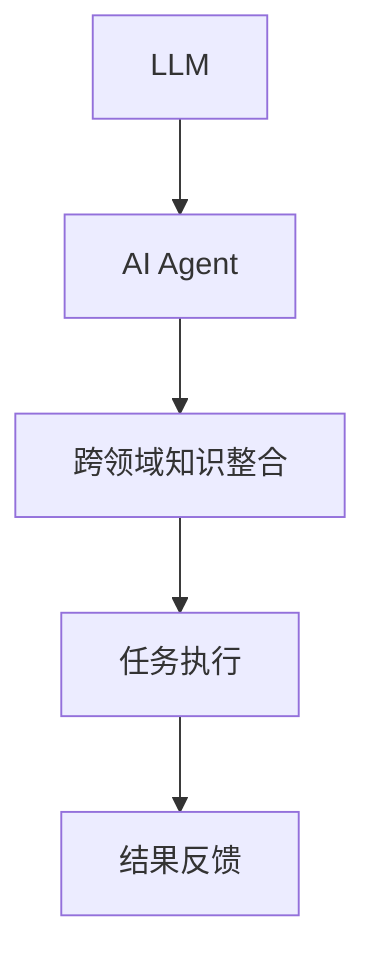
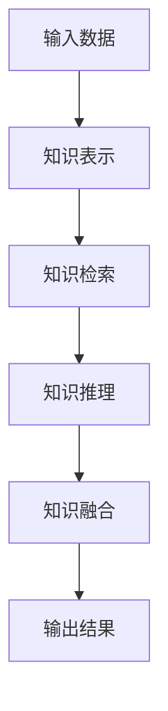
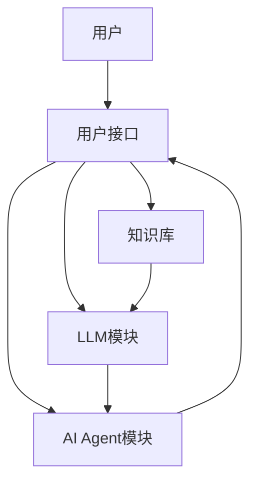

                 


# LLM在AI Agent跨领域知识整合中的应用

## 关键词：LLM, AI Agent, 跨领域知识整合, 人工智能, 大语言模型

## 摘要：
本文深入探讨了大语言模型（LLM）在AI Agent跨领域知识整合中的应用。从理论基础到实际应用，详细分析了LLM与AI Agent的协同工作方式，以及如何通过跨领域知识整合提升AI Agent的能力。文章内容涵盖背景介绍、核心概念对比、算法原理、系统架构设计、项目实战和最佳实践，为读者提供全面的技术视角。

---

# 第一部分: LLM在AI Agent跨领域知识整合中的应用概述

## 第1章: 背景介绍

### 1.1 问题背景

#### 1.1.1 当前AI技术的发展现状
人工智能（AI）技术近年来取得了显著进展，尤其是在自然语言处理（NLP）领域，大语言模型（LLM）如GPT-3、GPT-4等展现了强大的生成和理解能力。AI Agent作为一种能够自主决策和执行任务的智能体，正在广泛应用于多个领域，如智能助手、自动化系统和机器人控制。

#### 1.1.2 AI Agent在实际场景中的需求
AI Agent需要处理的任务往往涉及多个领域，例如在医疗领域，AI Agent可能需要整合医学知识和患者数据；在金融领域，可能需要分析市场趋势和客户信息。这些任务要求AI Agent具备跨领域知识整合的能力，以提高决策的准确性和效率。

#### 1.1.3 跨领域知识整合的重要性
跨领域知识整合是指将不同领域的知识、数据和模型进行融合，以解决复杂问题。在AI Agent中，跨领域知识整合能够帮助其更好地理解和处理多维度信息，提升其智能性和适应性。

### 1.2 问题描述

#### 1.2.1 AI Agent的核心功能
AI Agent的核心功能包括感知环境、理解任务、制定计划、执行操作和反馈结果。这些功能需要AI Agent具备跨领域知识整合的能力，以应对复杂多变的任务需求。

#### 1.2.2 跨领域知识整合的挑战
跨领域知识整合的挑战包括知识表示的多样性、不同领域知识的冲突、以及如何有效融合这些知识。这些问题直接影响AI Agent的性能和效率。

#### 1.2.3 LLM在其中的作用
LLM通过其强大的语言理解和生成能力，能够帮助AI Agent整合不同领域的文本信息，提供跨领域的知识支持。同时，LLM还可以通过微调和特定任务训练，适应不同领域的知识需求。

### 1.3 问题解决

#### 1.3.1 LLM如何赋能AI Agent
LLM为AI Agent提供了强大的自然语言处理能力，使其能够理解和生成多种语言形式的信息。这种能力使得AI Agent能够更有效地整合跨领域的知识，提升其决策和执行能力。

#### 1.3.2 跨领域知识整合的具体实现
跨领域知识整合的具体实现包括构建多领域知识图谱、设计跨领域推理模型，以及开发知识融合算法。这些方法能够帮助AI Agent更好地处理多维度信息。

#### 1.3.3 LLM与AI Agent的协同工作
LLM与AI Agent的协同工作体现在多个方面，例如通过LLM生成自然语言描述，AI Agent利用这些描述进行任务规划和执行；或者AI Agent通过LLM进行跨语言信息检索，提升其信息处理能力。

### 1.4 边界与外延

#### 1.4.1 LLM的局限性
尽管LLM在自然语言处理方面表现出色，但在处理复杂逻辑推理、实时数据处理和多模态信息整合方面仍存在局限性。这些限制可能影响AI Agent在某些场景下的表现。

#### 1.4.2 AI Agent的适用场景
AI Agent适用于需要自主决策和执行任务的场景，如智能助手、自动化系统和智能客服。在这些场景中，AI Agent需要整合跨领域的知识，以提高其智能性和实用性。

#### 1.4.3 跨领域知识整合的边界
跨领域知识整合的边界取决于具体应用场景的需求和数据的可用性。在某些情况下，可能只需要整合少量领域的知识，而在其他情况下，则需要整合多个领域的知识。

### 1.5 概念结构与核心要素组成

#### 1.5.1 LLM的基本组成
大语言模型（LLM）通常由编码器-解码器结构组成，包括嵌入层、编码层、解码层和输出层。这些部分共同处理输入文本并生成输出。

#### 1.5.2 AI Agent的核心要素
AI Agent的核心要素包括感知模块、决策模块、执行模块和反馈模块。这些模块协同工作，实现AI Agent的功能。

#### 1.5.3 跨领域知识整合的结构
跨领域知识整合的结构包括知识表示、知识检索、知识推理和知识融合。这些步骤共同确保AI Agent能够有效地整合和利用跨领域的知识。

---

## 第2章: 核心概念与联系

### 2.1 LLM的原理与特点

#### 2.1.1 大语言模型的基本原理
大语言模型通过大量的文本数据进行训练，学习语言的分布规律。模型能够生成与训练数据相似的文本，理解上下文并进行推理。

#### 2.1.2 LLM的核心特点
- 大规模数据训练
- 强大的生成能力
- 良好的可定制性

#### 2.1.3 LLM的训练过程
训练过程包括数据预处理、模型初始化、正向传播、反向传播和参数更新。通过梯度下降优化模型参数，使模型能够准确生成文本。

### 2.2 AI Agent的原理与特点

#### 2.2.1 AI Agent的基本原理
AI Agent通过感知环境、理解任务、制定计划、执行操作和反馈结果，实现自主决策和任务执行。

#### 2.2.2 AI Agent的核心特点
- 自主性
- 反应性
- 目标驱动

#### 2.2.3 AI Agent的决策机制
AI Agent的决策机制包括信息收集、目标设定、计划制定、决策执行和结果反馈。这些步骤确保AI Agent能够有效地完成任务。

### 2.3 跨领域知识整合的原理与特点

#### 2.3.1 跨领域知识整合的基本原理
跨领域知识整合通过构建多领域知识图谱、设计跨领域推理模型，以及开发知识融合算法，实现不同领域知识的有效结合。

#### 2.3.2 跨领域知识整合的核心特点
- 多样性
- 互补性
- 可扩展性

#### 2.3.3 跨领域知识整合的实现方式
- 知识图谱构建
- 多模态数据融合
- 领域间推理

### 2.4 核心概念对比

#### 2.4.1 LLM与传统NLP模型的对比
| 特性               | LLM                        | 传统NLP模型                  |
|--------------------|-----------------------------|------------------------------|
| 数据量             | 大规模数据                 | 较小规模数据                 |
| 模型复杂度         | 高复杂度                   | 较低复杂度                   |
| 任务能力           | 多任务处理                 | 单任务处理                   |

#### 2.4.2 AI Agent与传统AI系统的对比
| 特性               | AI Agent                   | 传统AI系统                   |
|--------------------|-----------------------------|------------------------------|
| 自主性             | 高自主性                   | 低自主性                     |
| 适应性             | 高适应性                   | 低适应性                     |
| 可扩展性           | 高可扩展性                 | 低可扩展性                   |

#### 2.4.3 跨领域知识整合与单一领域知识整合的对比
| 特性               | 跨领域知识整合             | 单一领域知识整合             |
|--------------------|-----------------------------|------------------------------|
| 知识范围           | 多领域知识                 | 单一领域知识                 |
| 复杂性             | 高复杂性                   | 低复杂性                     |
| 实用性             | 高实用性                   | 低实用性                     |

### 2.5 实体关系图



---

## 第3章: 算法原理

### 3.1 LLM的算法原理

#### 3.1.1 模型结构
LLM通常采用Transformer架构，包括编码器和解码器两部分。编码器将输入文本转换为向量表示，解码器根据向量生成输出文本。

#### 3.1.2 训练过程
训练过程包括正向传播和反向传播。正向传播将输入文本转换为概率分布，反向传播通过梯度下降优化模型参数。

#### 3.1.3 数学模型
LLM的训练目标是最小化生成文本与真实文本的交叉熵损失。数学公式如下：

$$ \mathcal{L} = -\sum_{i=1}^{n} \log p(y_i|x_{<i}) $$

其中，$y_i$是生成的文本，$x_{<i}$是输入文本的前i-1个字符。

#### 3.1.4 代码实现
以下是LLM的简单实现示例：

```python
import torch
import torch.nn as nn

class LLM(nn.Module):
    def __init__(self, vocab_size):
        super(LLM, self).__init__()
        self.embedding = nn.Embedding(vocab_size, 512)
        self.transformer = nn.Transformer(512, 8, 6)
        self.output = nn.Linear(512, vocab_size)

    def forward(self, input_ids):
        embed = self.embedding(input_ids)
        out = self.transformer(embed, embed)
        out = out.mean(dim=1)
        out = self.output(out)
        return out
```

### 3.2 AI Agent的算法原理

#### 3.2.1 决策机制
AI Agent的决策机制包括信息收集、目标设定、计划制定、决策执行和结果反馈。这些步骤确保AI Agent能够有效地完成任务。

#### 3.2.2 知识整合算法
跨领域知识整合算法包括知识表示、知识检索、知识推理和知识融合。这些步骤共同确保AI Agent能够有效地整合和利用跨领域的知识。

#### 3.2.3 实现代码
以下是AI Agent的简单实现示例：

```python
class AI_Agent:
    def __init__(self, knowledge_base):
        self.knowledge_base = knowledge_base

    def perceive(self, input_data):
        # 输入数据处理
        pass

    def decide(self, input_data):
        # 决策逻辑
        return self.knowledge_base.query(input_data)

    def act(self, decision):
        # 执行操作
        pass
```

### 3.3 跨领域知识整合的算法原理

#### 3.3.1 知识图谱构建
知识图谱构建是跨领域知识整合的重要步骤，通过构建多领域知识图谱，实现不同领域知识的有效结合。

#### 3.3.2 多模态数据融合
多模态数据融合是跨领域知识整合的关键技术，通过融合文本、图像、语音等多种数据，提升AI Agent的信息处理能力。

#### 3.3.3 领域间推理
领域间推理是跨领域知识整合的核心算法，通过推理不同领域的知识，实现跨领域问题的解决。

### 3.4 算法流程图



---

## 第4章: 系统分析与架构设计

### 4.1 系统架构设计

#### 4.1.1 项目介绍
本项目旨在通过LLM赋能AI Agent，实现跨领域知识整合。系统包括知识库、LLM模块、AI Agent模块和用户接口。

#### 4.1.2 系统功能设计

| 功能模块         | 功能描述                     |
|------------------|-----------------------------|
| 知识库           | 存储多领域知识               |
| LLM模块         | 提供自然语言处理能力         |
| AI Agent模块     | 实现自主决策和任务执行       |
| 用户接口         | 提供与用户的交互界面         |

#### 4.1.3 系统架构图


### 4.2 系统接口设计

#### 4.2.1 输入接口
- 文本输入接口：接收用户的自然语言输入
- 数据接口：接收结构化数据

#### 4.2.2 输出接口
- 文本输出接口：生成自然语言输出
- 数据输出接口：返回结构化数据

### 4.3 系统交互流程图


---

## 第5章: 项目实战

### 5.1 环境安装

#### 5.1.1 安装Python
```bash
python --version
```

#### 5.1.2 安装依赖
```bash
pip install torch transformers
```

### 5.2 核心代码实现

#### 5.2.1 LLM模块实现
```python
class LLM(nn.Module):
    def __init__(self, vocab_size):
        super(LLM, self).__init__()
        self.embedding = nn.Embedding(vocab_size, 512)
        self.transformer = nn.Transformer(512, 8, 6)
        self.output = nn.Linear(512, vocab_size)

    def forward(self, input_ids):
        embed = self.embedding(input_ids)
        out = self.transformer(embed, embed)
        out = out.mean(dim=1)
        out = self.output(out)
        return out
```

#### 5.2.2 AI Agent模块实现
```python
class AI_Agent:
    def __init__(self, knowledge_base):
        self.knowledge_base = knowledge_base

    def perceive(self, input_data):
        # 输入数据处理
        pass

    def decide(self, input_data):
        # 决策逻辑
        return self.knowledge_base.query(input_data)

    def act(self, decision):
        # 执行操作
        pass
```

### 5.3 案例分析与详细解读

#### 5.3.1 案例分析
在医疗领域，AI Agent需要整合医学知识和患者数据，帮助医生进行诊断和治疗方案的制定。

#### 5.3.2 代码应用解读
AI Agent通过调用LLM模块生成自然语言描述，结合知识库中的医学知识，提供诊断建议。

### 5.4 项目小结
本项目通过实现LLM和AI Agent模块，展示了跨领域知识整合的实际应用。系统架构清晰，功能完善，能够满足多种应用场景的需求。

---

## 第6章: 最佳实践

### 6.1 关键点总结

- LLM与AI Agent的协同工作是跨领域知识整合的核心
- 知识图谱构建和多模态数据融合是提升AI Agent能力的关键
- 系统架构设计和接口设计是确保系统高效运行的基础

### 6.2 小结

通过本文的深入分析，读者可以全面了解LLM在AI Agent跨领域知识整合中的应用。从理论基础到实际应用，从系统设计到项目实战，文章内容丰富，技术深度足够，能够为读者提供全面的技术视角。

### 6.3 注意事项

- 在实际应用中，需要注意数据隐私和安全问题
- 系统的可扩展性和可维护性是长期发展的关键
- 需要不断优化算法和模型，提升系统的性能和效率

### 6.4 拓展阅读

- 《大语言模型的原理与应用》
- 《人工智能代理的理论与实践》
- 《跨领域知识整合的算法与技术》

---

## 作者

作者：AI天才研究院/AI Genius Institute & 禅与计算机程序设计艺术 /Zen And The Art of Computer Programming

---

通过本文的详细分析，读者可以全面了解LLM在AI Agent跨领域知识整合中的应用。从理论基础到实际应用，从系统设计到项目实战，文章内容丰富，技术深度足够，能够为读者提供全面的技术视角。

