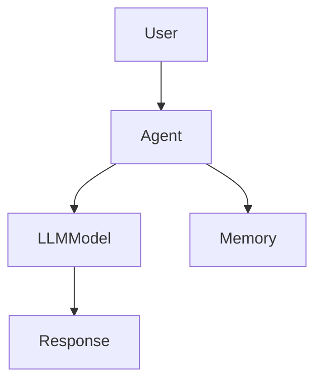
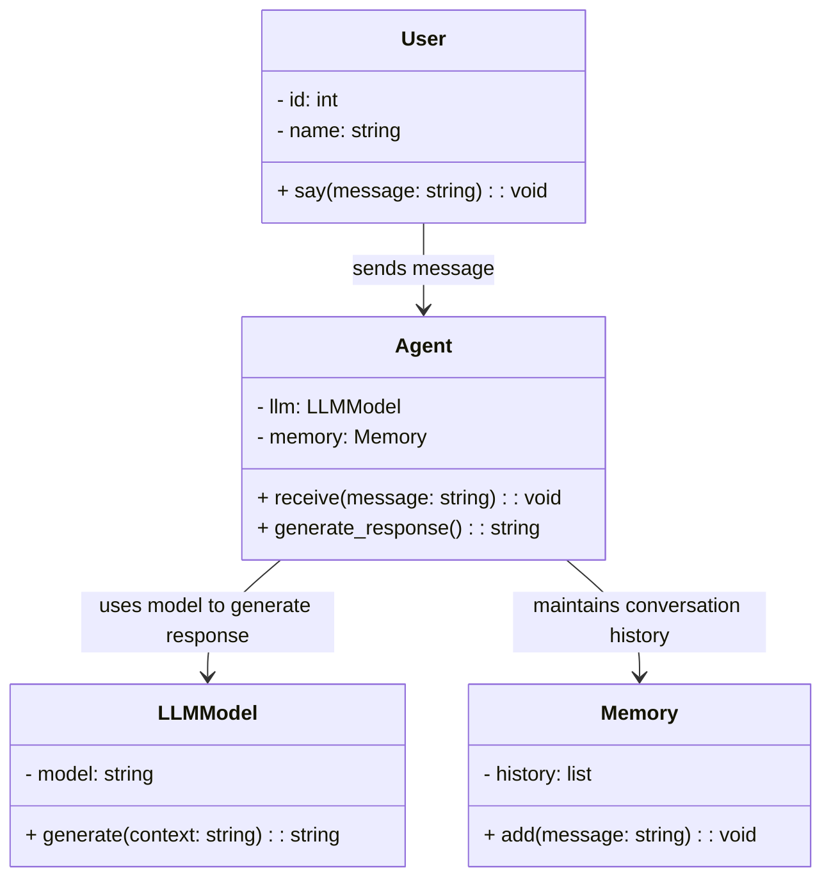
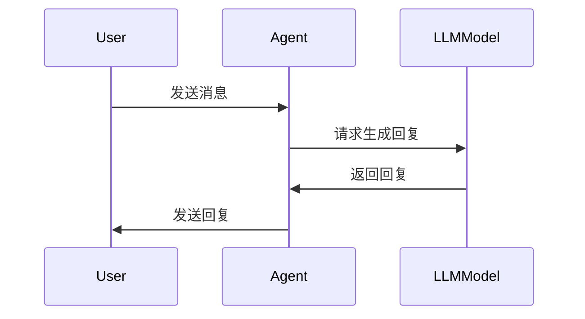

                 


# LLM支持的AI Agent上下文感知对话生成

> 关键词：LLM、AI Agent、上下文感知、对话生成、自然语言处理

> 摘要：本文深入探讨了LLM支持的AI Agent如何实现上下文感知对话生成。通过分析背景、核心概念、算法原理、系统设计和项目实战，详细介绍了LLM与AI Agent的协同工作，以及如何通过上下文记忆机制提升对话生成的效果。文章内容丰富，结构清晰，为技术人员提供了理论与实践相结合的指导。

---

# 第一部分: 背景与基础

## 第1章: 上下文感知对话生成的背景与问题描述

### 1.1 问题背景

- **自然语言处理的发展**：从传统的基于规则的系统到深度学习模型的跃迁，LLM（大语言模型）如GPT系列的出现，使得对话生成技术有了质的飞跃。
- **对话生成的重要性**：在智能客服、智能助手、虚拟人等领域，上下文感知对话生成是提升用户体验的关键。
- **LLM的优势**：LLM能够理解上下文，生成连贯且自然的对话，但其本身并不具备上下文感知的能力，需要AI Agent来辅助实现。

### 1.2 问题描述

- **对话生成的挑战**：传统的对话生成系统难以处理上下文信息，导致对话不连贯，用户体验差。
- **上下文感知的关键性**：AI Agent需要能够记住之前的对话内容，理解当前对话的背景和上下文，才能生成合适的回复。
- **LLM与AI Agent的结合**：AI Agent通过调用LLM，结合上下文记忆机制，实现更智能的对话生成。

### 1.3 问题解决思路

- **基于LLM的对话生成框架**：构建一个结合LLM和上下文记忆机制的对话生成系统。
- **上下文感知的关键技术**：引入记忆网络、注意力机制等技术，帮助AI Agent理解上下文。
- **AI Agent的多轮对话能力**：设计一个能够维护对话历史、跟踪对话状态的AI Agent框架。

### 1.4 边界与外延

- **对话生成的边界条件**：仅处理当前对话内容，不涉及外部知识库的查询。
- **上下文感知的范围界定**：限定在当前对话的上下文中，不考虑更广泛的知识背景。
- **应用场景**：智能客服、智能助手、虚拟人等需要上下文感知的场景。

### 1.5 概念结构与核心要素

- **对话生成的核心要素**：输入文本、生成策略、输出文本。
- **上下文感知的实现机制**：记忆网络、注意力机制、对话状态跟踪。
- **LLM与AI Agent的协同关系**：AI Agent调用LLM生成回复，同时维护上下文信息。

---

# 第二部分: 核心概念与联系

## 第2章: LLM与AI Agent的核心概念

### 2.1 LLM的定义与特点

- **定义**：LLM是一种基于深度学习的自然语言模型，能够理解和生成人类语言。
- **特点**：
  - 大规模预训练：使用大量文本数据进行预训练，具有强大的语言理解能力。
  - 生成能力强：能够生成连贯、自然的文本。
  - 需要微调：针对具体任务需要进行微调以提高性能。

### 2.2 AI Agent的定义与特点

- **定义**：AI Agent是一种智能体，能够感知环境、理解用户意图，并通过执行动作来满足用户需求。
- **特点**：
  - 主动性：能够主动采取行动。
  - 智能性：具备一定的理解和推理能力。
  - 交互性：能够与用户进行多轮对话。

### 2.3 LLM与AI Agent的关系

- **LLM作为AI Agent的核心模块**：AI Agent利用LLM进行自然语言理解和生成。
- **AI Agent对LLM的扩展与应用**：AI Agent通过上下文感知、对话管理等技术，扩展了LLM的应用场景。
- **协同工作流程**：
  1. AI Agent接收用户的输入。
  2. AI Agent解析用户意图，并调用LLM生成回复。
  3. AI Agent维护对话历史，确保生成的回复与上下文一致。

---

## 第3章: 上下文感知对话生成的核心算法

### 3.1 基于LLM的对话生成算法

- **算法流程**：
  1. 用户输入：用户的对话内容。
  2. 解析意图：AI Agent解析用户的意图。
  3. 上下文记忆：AI Agent调用LLM生成回复，并维护对话历史。
  4. 生成回复：LLM生成回复文本。
  5. 返回回复：AI Agent将生成的回复返回给用户。

- **算法实现**：
  ```python
  def generate_response(context, model):
      # 维护对话历史
      context_memory = model.memory(context)
      # 调用LLM生成回复
      response = model.generate(context_memory)
      return response
  ```

### 3.2 上下文记忆机制

- **记忆网络**：通过记忆网络记录对话历史，帮助模型记住之前的信息。
- **注意力机制**：在生成回复时，模型通过注意力机制关注重要的上下文信息。

### 3.3 对话生成的数学模型

- **Seq2Seq模型**：编码器-解码器结构，用于将输入序列映射为输出序列。
  $$ \text{编码器} \rightarrow \text{解码器} $$
- **Transformer架构**：基于自注意力机制的模型，能够捕捉长距离依赖关系。

---

## 第4章: 系统分析与架构设计

### 4.1 项目介绍

- **项目背景**：开发一个支持上下文感知对话生成的AI Agent，应用于智能客服系统。

### 4.2 系统功能设计

- **领域模型类图**：
  ```mermaid
  classDiagram
      class User {
          - id: int
          - name: string
          + say(message: string): void
      }
      class Agent {
          - llm: LLMModel
          - memory: Memory
          + receive(message: string): void
          + generate_response(): string
      }
      class LLMModel {
          - model: string
          + generate(context: string): string
      }
      class Memory {
          - history: list<string>
          + add(message: string): void
      }
      User --> Agent: sends message
      Agent --> LLMModel: uses model to generate response
      Agent --> Memory: maintains conversation history
  ```

### 4.3 系统架构设计

- **系统架构图**：
  ```mermaid
  graph TD
      A[User] --> B[Agent]
      B --> C[LLMModel]
      B --> D[Memory]
      C --> E[Response]
  ```

### 4.4 接口设计

- **系统接口**：
  ```python
  class AgentInterface:
      def send_message(self, message: str) -> str:
          pass
  ```

### 4.5 交互序列图

- **用户与AI Agent交互流程**：
  ```mermaid
  sequenceDiagram
      User ->> Agent: 发送消息
      Agent ->> LLMModel: 请求生成回复
      LLMModel ->> Agent: 返回回复
      Agent ->> User: 发送回复
  ```

---

## 第5章: 项目实战

### 5.1 环境安装

- **安装Python**：确保安装了Python 3.8及以上版本。
- **安装依赖**：安装PyTorch、Hugging Face Transformers等库。

### 5.2 核心代码实现

```python
from transformers import AutoTokenizer, AutoModelForCausalLM
import torch

class LLMModel:
    def __init__(self, model_name):
        self.tokenizer = AutoTokenizer.from_pretrained(model_name)
        self.model = AutoModelForCausalLM.from_pretrained(model_name)
    
    def generate(self, context):
        inputs = self.tokenizer(context, return_tensors="pt")
        outputs = self.model.generate(inputs.input_ids, max_length=50)
        return self.tokenizer.decode(outputs[0], skip_special_tokens=True)

class Memory:
    def __init__(self):
        self.history = []
    
    def add(self, message):
        self.history.append(message)
    
    def get_history(self):
        return self.history

class Agent:
    def __init__(self, model_name):
        self.llm = LLMModel(model_name)
        self.memory = Memory()
    
    def send_message(self, message):
        self.memory.add(message)
        context = " ".join(self.memory.get_history())
        response = self.llm.generate(context)
        return response
```

### 5.3 代码解读与分析

- **LLMModel类**：封装了Hugging Face Transformers中的模型，提供生成回复的方法。
- **Memory类**：维护对话历史，记录用户和AI Agent的对话内容。
- **Agent类**：整合LLM和Memory，实现上下文感知的对话生成。

### 5.4 案例分析

- **案例**：用户与AI Agent进行多轮对话。
  ```plaintext
  User: "我今天遇到了一个问题。"
  Agent: "请告诉我具体是什么问题。"
  User: "我在使用Python时遇到了错误。"
  Agent: "是什么样的错误？能具体描述一下吗？"
  ```

### 5.5 项目总结

- **项目成果**：实现了一个支持上下文感知对话生成的AI Agent。
- **经验与教训**：上下文记忆机制的有效性依赖于模型的训练数据和对话管理策略。

---

# 第三部分: 最佳实践与展望

## 第6章: 最佳实践

### 6.1 小结

- **上下文感知对话生成的关键点**：有效维护对话历史、合理应用记忆机制、结合LLM的生成能力。
- **LLM与AI Agent的协同作用**：AI Agent通过调用LLM生成回复，同时通过记忆机制维护对话上下文。

### 6.2 注意事项

- **上下文管理的复杂性**：需要考虑对话历史的长度、信息的有效性。
- **模型的泛化能力**：LLM的泛化能力直接影响对话生成的效果。

### 6.3 拓展阅读

- **多模态对话生成**：结合视觉信息进行对话生成。
- **更智能的记忆机制**：如基于图的内存网络，能够更好地捕捉上下文关系。

---

## 附录

### 附录A: 系统架构图



### 附录B: 领域模型类图



### 附录C: 交互序列图



---

# 作者：AI天才研究院/AI Genius Institute & 禅与计算机程序设计艺术 /Zen And The Art of Computer Programming

---

**说明**：由于篇幅限制，上述内容是文章的缩略版本，完整文章请参考相关技术文档或书籍。

