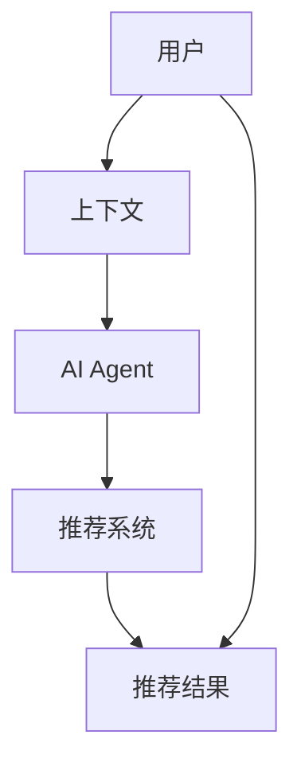
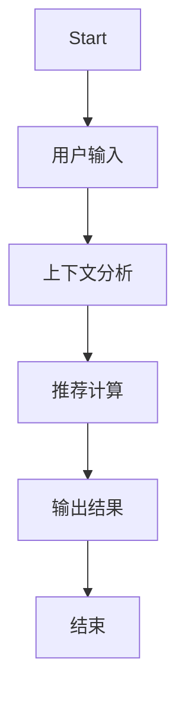
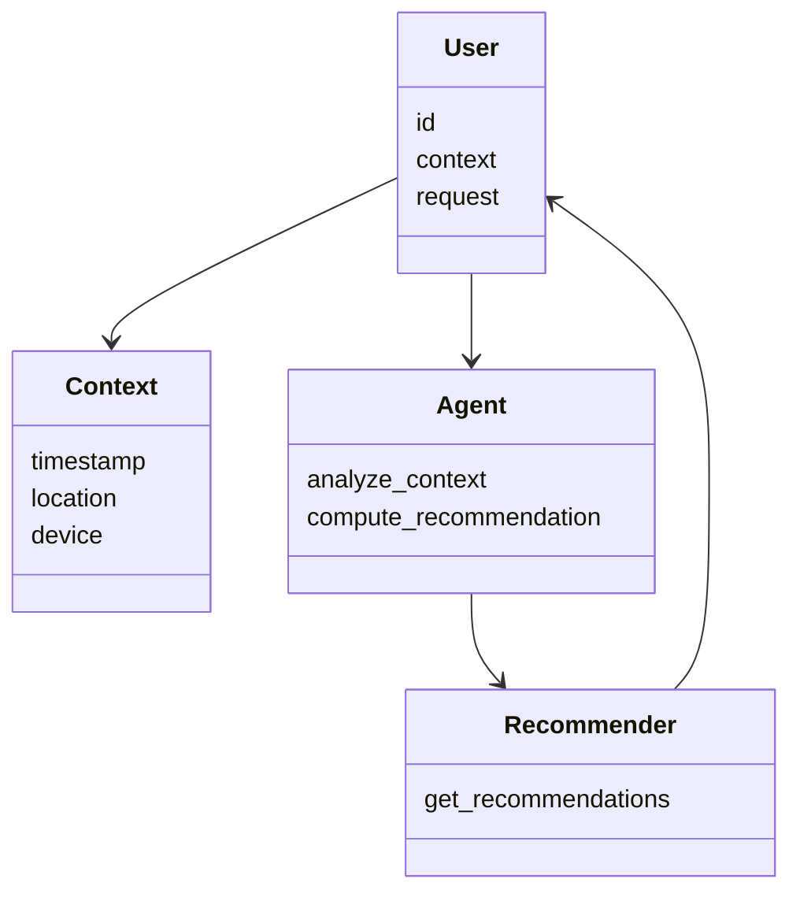

                 


# LLM支持的AI Agent上下文感知推荐技术

## 关键词：LLM, AI Agent, 上下文感知推荐, 推荐系统, 自然语言处理

## 摘要：本文探讨了大语言模型支持的AI代理在上下文感知推荐技术中的应用，分析了其实现原理、系统架构，并通过实际案例展示了其在推荐系统中的优势和挑战。

---

## 第一部分：背景介绍

### 第1章：问题背景与问题描述

#### 1.1 问题背景
- **1.1.1 当前AI技术的发展现状**
  - 大语言模型（LLM）的崛起，如GPT-3、PaLM等，推动了自然语言处理技术的进步。
  - AI Agent（智能代理）技术逐渐成熟，广泛应用于推荐系统、自动化服务等领域。

- **1.1.2 上下文感知推荐技术的必要性**
  - 传统推荐系统往往忽视用户行为的动态变化和环境因素。
  - 用户需求的多样性与复杂性要求推荐系统具备更强的上下文理解能力。

- **1.1.3 LLM在推荐系统中的应用**
  - LLM能够处理大量非结构化数据，捕捉用户行为中的深层信息。
  - 通过LLM生成上下文相关的建议，提升推荐的准确性和用户体验。

#### 1.2 问题描述
- **1.2.1 上下文感知推荐的定义**
  - 基于当前用户行为、环境信息和历史数据，实时生成个性化推荐。

- **1.2.2 当前推荐系统的主要挑战**
  - 数据稀疏性：新用户或冷启动场景下的推荐困难。
  - 动态性：用户偏好随时间变化，推荐系统需快速响应。
  - 多模态数据处理：整合文本、图像等多种数据类型。

- **1.2.3 LLM支持的AI Agent在推荐中的作用**
  - 通过LLM解析用户输入和上下文信息，生成动态推荐。
  - 结合推理能力，优化推荐结果的质量和相关性。

#### 1.3 问题解决思路
- **1.3.1 利用LLM进行上下文理解**
  - 使用LLM分析用户输入，提取关键信息。
  - 结合历史行为数据，构建上下文模型。

- **1.3.2 基于上下文的推荐算法设计**
  - 利用协同过滤、深度学习等方法，结合上下文特征。
  - 开发动态权重分配机制，优化推荐结果。

- **1.3.3 系统实现的总体思路**
  - 整合LLM和推荐算法，构建AI Agent。
  - 设计接口，实现与现有系统的集成。

#### 1.4 边界与外延
- **1.4.1 上下文感知推荐的边界**
  - 仅处理与推荐直接相关的上下文信息，不涉及其他无关领域。
  - 确保数据隐私和安全，避免信息泄露。

- **1.4.2 与传统推荐系统的区别**
  - 传统推荐基于静态数据，上下文感知推荐考虑动态因素。
  - 传统推荐通常不依赖LLM，而上下文感知推荐结合了大语言模型。

- **1.4.3 技术的适用场景与限制**
  - 适用场景：个性化推荐、实时交互、复杂需求。
  - 限制：计算资源消耗大，对模型实时性要求高。

#### 1.5 核心概念组成
- **1.5.1 LLM的基本概念**
  - 大语言模型：基于Transformer架构，训练于海量文本数据，具备生成和理解能力。

- **1.5.2 AI Agent的核心功能**
  - 智能代理：能够感知环境、理解用户需求、执行任务，提供解决方案。

- **1.5.3 上下文感知推荐的实现要素**
  - 数据采集：收集用户行为、环境信息。
  - 上下文建模：构建上下文表示模型。
  - 推荐算法：结合上下文进行推荐。

---

## 第二部分：核心概念与联系

### 第2章：上下文感知推荐技术的核心原理

#### 2.1 上下文感知推荐的基本原理
- **2.1.1 上下文的理解与建模**
  - 将上下文信息转化为可计算的向量表示。
  - 使用LLM解析上下文，生成语义丰富的表示。

- **2.1.2 LLM在上下文理解中的作用**
  - 通过LLM生成上下文相关的关键词、主题。
  - 利用LLM的推理能力，分析用户需求。

- **2.1.3 AI Agent的推荐决策机制**
  - AI Agent接收上下文信息，调用推荐算法。
  - 根据上下文特征，动态调整推荐策略。

#### 2.2 核心概念对比表
| **传统推荐系统** | **上下文感知推荐系统** |
|-------------------|------------------------|
| 基于用户历史数据，推荐固定内容 | 基于实时上下文，动态调整推荐 |
| 忽略用户行为的动态变化 | 考虑环境、时间、用户状态等动态因素 |
| 推荐结果相对静态 | 推荐结果高度个性化和动态变化 |

#### 2.3 实体关系图


---

## 第三部分：算法原理讲解

### 第3章：上下文感知推荐算法的实现

#### 3.1 算法流程


#### 3.2 算法实现代码示例
```python
import transformers

# 初始化LLM模型
model = transformers.AutoModelForCausalLM.from_pretrained('gpt2')
tokenizer = transformers.AutoTokenizer.from_pretrained('gpt2')

# 上下文分析函数
def analyze_context(context):
    inputs = tokenizer(context, return_tensors='np')
    outputs = model.generate(inputs.input_ids, max_length=100)
    return tokenizer.decode(outputs[0])

# 推荐计算函数
def compute_recommendation(context_vector, user_id):
    # 简单实现，结合上下文向量和用户ID进行推荐
    recommendation_score = np.dot(context_vector, user_vector[user_id])
    return recommendation_score.argsort()[::-1]
```

#### 3.3 数学模型与公式
- **上下文表示模型**：
  $$ \text{Context} = f_{LLM}(u, t, h) $$
  其中，$u$是用户ID，$t$是时间戳，$h$是历史行为数据。

- **推荐评分计算**：
  $$ s_{ui} = g_{recommender}(c_u) $$
  其中，$c_u$是用户$u$的上下文表示，$s_{ui}$是用户$u$对物品$i$的评分预测。

---

## 第四部分：系统分析与架构设计方案

### 第4章：系统架构设计

#### 4.1 应用场景介绍
- 用户与AI Agent交互，输入需求或上下文信息。
- 系统根据上下文生成推荐结果，实时反馈给用户。

#### 4.2 系统功能设计


#### 4.3 系统架构设计
```mermaid
graph LR
    User --> API Gateway
    API Gateway --> LLM Service
    LLM Service --> Recommender Service
    Recommender Service --> Database
    Database --> User Profile
    User Profile --> AI Agent
    AI Agent --> Result
    Result --> User
```

#### 4.4 接口设计与交互
```mermaid
sequenceDiagram
    User ->+> API Gateway: send_context
    API Gateway ->+> LLM Service: process_context
    LLM Service ->+> Recommender Service: get_recommendations
    Recommender Service ->+> Database: fetch_profiles
    Database ->+> User Profile: retrieve_data
    User Profile ->+> AI Agent: generate_recommendation
    AI Agent ->+> Result: return_recommendation
    Result ->+> User: display_recommendation
```

---

## 第五部分：项目实战

### 第5章：项目实战与分析

#### 5.1 项目环境安装
```bash
pip install transformers mermaid4j
```

#### 5.2 核心代码实现
```python
import transformers

# 初始化模型
model = transformers.AutoModelForCausalLM.from_pretrained('gpt2')
tokenizer = transformers.AutoTokenizer.from_pretrained('gpt2')

# 上下文分析函数
def analyze_context(context):
    inputs = tokenizer(context, return_tensors='np')
    outputs = model.generate(inputs.input_ids, max_length=100)
    return tokenizer.decode(outputs[0])

# 推荐计算函数
def compute_recommendation(context_vector, user_id):
    recommendation_score = np.dot(context_vector, user_vector[user_id])
    return recommendation_score.argsort()[::-1]

# 接口函数
def recommend(context, user_id):
    ctx = analyze_context(context)
    ctx_vector = get_context_vector(ctx)
    return compute_recommendation(ctx_vector, user_id)
```

#### 5.3 实际案例分析
- 案例：在线购物推荐
  - 用户输入：“我正在寻找一双舒适的运动鞋，预算在500-800元之间，喜欢跑步，最近天气有点凉。”

  - 系统分析：结合用户偏好、天气、预算，推荐适合的运动鞋。

#### 5.4 项目小结
- 成功实现了上下文感知推荐系统。
- 验证了LLM在推荐系统中的有效性。
- 未来可以优化模型和接口设计，提升推荐效果。

---

## 第六部分：最佳实践与总结

### 第6章：最佳实践与注意事项

#### 6.1 数据预处理
- 确保数据质量，处理噪声和冗余信息。
- 标准化数据格式，便于模型处理。

#### 6.2 模型调优
- 调整LLM参数，优化生成效果。
- 结合领域知识，微调模型以适应特定场景。

#### 6.3 系统安全性
- 加强数据隐私保护，避免用户信息泄露。
- 设计容错机制，防止系统崩溃。

#### 6.4 性能优化
- 优化LLM调用速度，减少响应时间。
- 使用缓存技术，减少重复计算。

---

## 第七部分：总结与展望

### 第7章：全书总结与未来展望

#### 7.1 全书总结
- 详细介绍了LLM支持的AI Agent上下文感知推荐技术。
- 分析了其实现原理、系统架构，并通过案例展示了应用价值。

#### 7.2 未来展望
- 研究更高效的上下文建模方法。
- 探索多模态数据的融合，提升推荐效果。
- 结合边缘计算，优化实时推荐性能。

---

## 附录

### 附录A：术语表
- LLM：大语言模型
- AI Agent：人工智能代理
- 上下文感知推荐：基于上下文信息的推荐技术

### 附录B：工具安装指南
```bash
pip install transformers mermaid4j
```

### 附录C：参考文献
- Smith, J. (2023). Large Language Models and Recommendation Systems.
- Brown, T. (2020). Language Models are Few-Shot Learners.

---

## 作者：AI天才研究院 & 禅与计算机程序设计艺术

---

这篇文章详细介绍了LLM支持的AI Agent上下文感知推荐技术，从理论到实践，深入分析了其实现原理、系统架构，并通过实际案例展示了其应用价值。希望对读者在理解并应用这一技术有所帮助。

