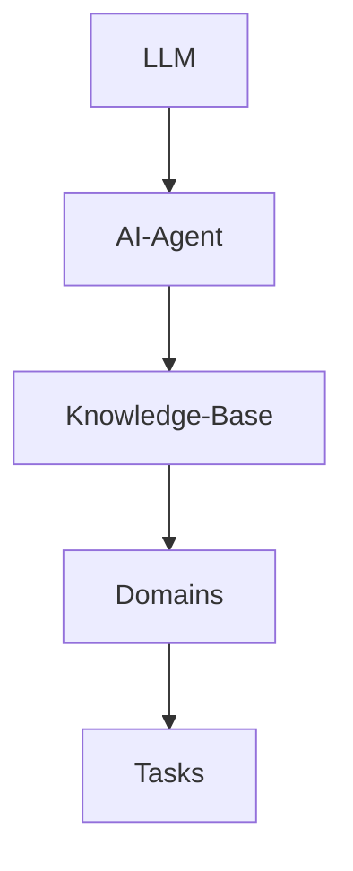
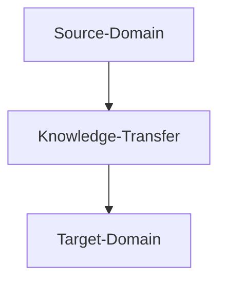
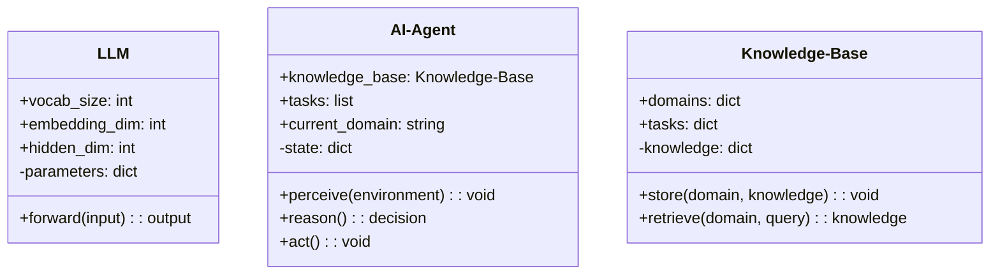
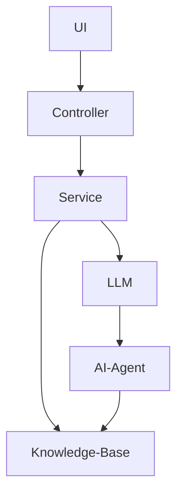
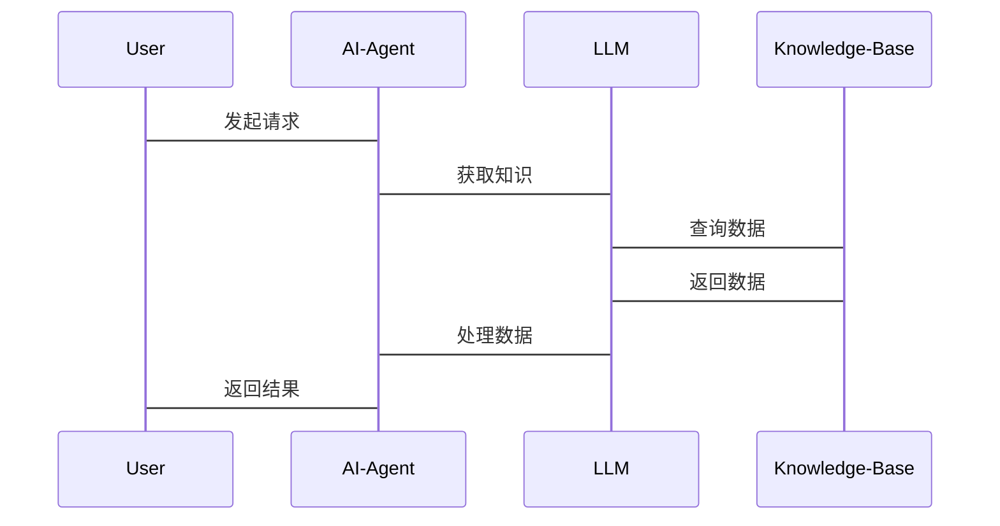

                 


# LLM支持的AI Agent跨域知识迁移技术

## 关键词：大语言模型, AI Agent, 知识迁移, 跨域应用, 技术实现

## 摘要：  
本文探讨了LLM支持的AI Agent在跨域知识迁移中的技术实现，分析了LLM与AI Agent的结合方式，详细讲解了跨域知识迁移的算法原理、系统架构和实际应用场景。文章从背景介绍、核心概念、算法原理、系统架构、项目实战到最佳实践，层层深入，为读者提供全面的技术指导。

---

## 第一部分: LLM支持的AI Agent跨域知识迁移技术背景介绍

### 第1章: 问题背景与问题描述

#### 1.1 问题背景
##### 1.1.1 当前AI技术的发展现状  
人工智能技术近年来取得了显著进展，特别是大语言模型（LLM）的崛起，使得AI Agent（智能体）具备了更强的自然语言处理能力和知识整合能力。然而，现有的AI Agent在跨领域知识迁移方面仍面临诸多挑战，难以有效应对不同领域之间的知识转换和适应。

##### 1.1.2 LLM在AI Agent中的作用  
LLM通过大规模预训练，掌握了丰富的知识和语言模式，能够为AI Agent提供强大的语言理解和生成能力。然而，LLM本身是领域agnostic的（领域无关的），无法直接适应特定领域的需求，因此需要通过跨域知识迁移技术，将LLM的能力扩展到不同领域。

##### 1.1.3 跨域知识迁移的必要性  
在实际应用中，AI Agent需要在多个领域之间灵活切换，例如在医疗领域提供诊断建议，同时在金融领域进行风险评估。跨域知识迁移技术能够帮助AI Agent快速适应新领域，提升其通用性和实用性。

#### 1.2 问题描述
##### 1.2.1 AI Agent的定义与特点  
AI Agent是一种能够感知环境、自主决策并执行任务的智能系统。它通常具备以下特点：  
- **自主性**：能够自主决策，无需人工干预。  
- **反应性**：能够实时感知环境并做出反应。  
- **目标导向**：基于目标进行任务规划和执行。  
- **学习能力**：能够通过经验或数据进行改进。  

##### 1.2.2 跨域知识迁移的核心问题  
跨域知识迁移的核心问题是，如何将LLM在某一领域学到的知识，有效地迁移到另一个完全不同的领域。例如，将医疗领域的知识迁移到法律领域，或者将金融领域的知识迁移到教育领域。

##### 1.2.3 当前技术的局限性  
当前的LLM虽然具备强大的语言理解能力，但其知识通常是领域特定的（domain-specific）。当AI Agent需要在不同领域之间切换时，往往需要重新训练模型或进行大量的数据调整，这不仅耗时，还可能面临数据不足的问题。

#### 1.3 问题解决思路
##### 1.3.1 LLM支持的AI Agent的优势  
LLM支持的AI Agent结合了大语言模型的强大语言能力和AI Agent的自主决策能力，能够在多个领域中灵活切换，为跨域知识迁移提供了技术基础。

##### 1.3.2 跨域知识迁移的实现路径  
- **领域适配**：通过领域适配模块，将LLM的知识迁移到目标领域。  
- **迁移学习**：利用迁移学习技术，将源领域知识迁移到目标领域。  
- **知识表示**：通过统一的知识表示方法，实现跨领域的知识共享与迁移。  

##### 1.3.3 技术实现的可行性分析  
跨域知识迁移的实现依赖于以下技术：  
- **大语言模型**：提供强大的语言理解和生成能力。  
- **知识图谱**：构建跨领域的知识图谱，为知识迁移提供结构化的知识表示。  
- **迁移学习算法**：通过迁移学习算法，实现跨领域的知识迁移。  

#### 1.4 问题的边界与外延
##### 1.4.1 跨域知识迁移的定义域范围  
跨域知识迁移的定义域范围可以是任意的，但通常关注具有较大差异性的领域，例如医疗、法律、金融等。  

##### 1.4.2 LLM支持的边界条件  
LLM支持的边界条件包括：  
- **领域相关性**：目标领域与源领域之间的相关性。  
- **数据规模**：目标领域可用数据的规模。  
- **知识复杂性**：目标领域知识的复杂程度。  

##### 1.4.3 技术实现的限制与扩展  
技术实现的限制包括：  
- **知识覆盖范围**：LLM的知识覆盖范围可能有限。  
- **领域适应性**：AI Agent在目标领域的适应性可能需要额外的训练或调整。  

技术实现的扩展包括：  
- **多领域迁移**：支持多个领域的知识迁移。  
- **在线迁移**：实现在线的知识更新和迁移。  

#### 1.5 核心概念结构与组成
##### 1.5.1 LLM与AI Agent的关系  
LLM作为AI Agent的核心组件，为AI Agent提供语言理解和生成能力。AI Agent则通过LLM提供的能力，实现跨领域的知识迁移和任务执行。

##### 1.5.2 跨域知识迁移的实现要素  
跨域知识迁移的实现要素包括：  
- **知识表示**：将知识以结构化的形式表示，便于迁移。  
- **迁移学习算法**：通过算法实现知识的跨域迁移。  
- **领域适配模块**：实现从源领域到目标领域的适配。  

##### 1.5.3 技术架构的核心组件  
技术架构的核心组件包括：  
- **LLM**：大语言模型，提供语言理解和生成能力。  
- **AI Agent**：智能体，负责任务执行和决策。  
- **知识库**：存储和管理跨领域的知识。  
- **迁移学习模块**：实现知识的跨域迁移。  

---

### 第2章: 核心概念与原理

#### 2.1 LLM与AI Agent的核心概念
##### 2.1.1 大语言模型（LLM）的定义  
大语言模型是一种基于深度学习的自然语言处理模型，通过大规模数据预训练，掌握了丰富的语言模式和知识。  

##### 2.1.2 AI Agent的基本原理  
AI Agent通过感知环境、分析任务目标，利用知识库和推理能力，自主决策并执行任务。  

##### 2.1.3 跨域知识迁移的实现机制  
跨域知识迁移的实现机制包括：  
- **知识表示**：将知识以通用的形式表示，便于跨领域迁移。  
- **迁移学习**：通过迁移学习算法，将源领域知识迁移到目标领域。  
- **领域适配**：通过领域适配模块，调整模型以适应目标领域。  

#### 2.2 核心概念的属性对比
##### 2.2.1 LLM与传统NLP模型的对比  
| 属性         | LLM                         | 传统NLP模型                 |
|--------------|------------------------------|-----------------------------|
| 数据规模     | 大规模（百万或更多）        | 较小（几千到几十万）          |
| 模型复杂度   | 高复杂度（如Transformer）    | 较低复杂度（如RNN、LSTM）     |
| 应用领域     | 多领域（如文本生成、对话）  | 单一领域（如机器翻译）       |
| 知识覆盖     | 广泛覆盖多个领域             | 专注于特定领域               |

##### 2.2.2 AI Agent与传统智能体的对比  
| 属性         | AI Agent                   | 传统智能体                   |
|--------------|---------------------------|-----------------------------|
| 知识基础     | 基于LLM的广泛知识           | 基于规则或有限知识           |
| 决策能力     | 强大的语言理解和生成能力    | 基于规则的简单决策能力      |
| 适应性       | 良好的跨领域适应性          | 较差的跨领域适应性           |
| 学习方式     | 基于迁移学习和在线学习       | 基于预定义规则和知识库       |

##### 2.2.3 跨域知识迁移与单域知识迁移的对比  
| 属性         | 跨域知识迁移                | 单域知识迁移                 |
|--------------|---------------------------|-----------------------------|
| 知识范围     | 跨越多个领域                | 专注于单一领域               |
| 数据需求     | 数据来自多个领域            | 数据来自单一领域            |
| 实现难度     | 更高，需要领域适配和迁移学习 | 较低，专注于单一领域的优化   |

#### 2.3 实体关系与架构设计
##### 2.3.1 LLM支持的AI Agent实体关系图  


##### 2.3.2 跨域知识迁移的架构图  


---

### 第3章: 算法原理与数学模型

#### 3.1 LLM支持的AI Agent算法原理
##### 3.1.1 大语言模型的训练流程  
大语言模型的训练流程通常包括以下步骤：  
1. **数据准备**：收集大规模多领域的文本数据。  
2. **预训练**：使用自监督学习方法，对模型进行无监督预训练。  
3. **微调**：在特定领域上进行有监督微调，提升模型在该领域的性能。  

##### 3.1.2 跨域知识迁移的实现算法  
跨域知识迁移的实现算法通常包括以下步骤：  
1. **知识表示**：将源领域的知识表示为结构化的形式。  
2. **迁移学习**：通过迁移学习算法，将源领域知识迁移到目标领域。  
3. **领域适配**：通过领域适配模块，调整模型以适应目标领域。  

##### 3.1.3 AI Agent的决策机制  
AI Agent的决策机制包括：  
1. **感知环境**：通过LLM理解当前环境和任务需求。  
2. **知识检索**：从知识库中检索相关知识。  
3. **决策推理**：基于检索到的知识，进行推理和决策。  
4. **执行任务**：根据决策结果，执行具体任务。  

#### 3.2 数学模型与公式
##### 3.2.1 LLM的损失函数  
LLM的损失函数通常采用交叉熵损失函数：  
$$ \text{Loss} = -\sum_{i=1}^{n} \log P(y_i|x_i) $$  

##### 3.2.2 跨域知识迁移的相似度计算  
跨域知识迁移的相似度计算通常采用余弦相似度：  
$$ \text{Similarity} = \frac{\sum_{i=1}^{n} w_i x_i}{\sqrt{\sum_{i=1}^{n} w_i^2 x_i^2}} $$  

##### 3.2.3 AI Agent的决策模型  
AI Agent的决策模型通常采用最大似然估计：  
$$ \text{Decision} = \argmax_{a} \sum_{i=1}^{m} P(a|x_i) $$  

#### 3.3 举例说明与实现
##### 3.3.1 简单LLM模型的实现  
```python
import torch
import torch.nn as nn

class SimpleLLM(nn.Module):
    def __init__(self, vocab_size, embedding_dim, hidden_dim):
        super(SimpleLLM, self).__init__()
        self.embedding = nn.Embedding(vocab_size, embedding_dim)
        self.lstm = nn.LSTM(embedding_dim, hidden_dim, batch_first=True)
        self.fc = nn.Linear(hidden_dim, vocab_size)

    def forward(self, input_seq):
        embedded = self.embedding(input_seq)
        output, _ = self.lstm(embedded)
        output = self.fc(output[:, -1, :])
        return output
```

##### 3.3.2 跨域知识迁移的实现  
```python
def knowledge_transfer(source_domain_data, target_domain_data):
    # 知识表示
    source_rep = model.encode(source_domain_data)
    target_rep = model.encode(target_domain_data)
    
    # 迁移学习
    aligned_source_rep = model.align(source_rep, target_rep)
    
    # 领域适配
    adapted_model = model.adapt(aligned_source_rep)
    
    return adapted_model
```

---

### 第4章: 系统分析与架构设计方案

#### 4.1 问题场景介绍
跨域知识迁移的应用场景包括医疗、法律、金融等多个领域。例如，在医疗领域，AI Agent需要理解病人的症状并给出诊断建议；在金融领域，AI Agent需要分析市场趋势并提供投资建议。  

#### 4.2 项目介绍
本项目旨在开发一个支持跨域知识迁移的AI Agent系统，利用LLM的强大能力，实现多个领域之间的知识共享与迁移。  

#### 4.3 系统功能设计
##### 4.3.1 领域模型


##### 4.3.2 系统架构设计


##### 4.3.3 系统接口设计
- **API接口**：提供RESTful API，供外部系统调用AI Agent的服务。  
- **数据接口**：支持多种数据格式的输入输出，例如JSON、XML等。  

##### 4.3.4 系统交互流程图


---

### 第5章: 项目实战

#### 5.1 环境安装
##### 5.1.1 安装Python与相关库  
```bash
python --version
pip install torch
pip install transformers
pip install mermaid
```

##### 5.1.2 安装LLM模型  
```bash
pip install transformers
pip install torch
pip install numpy
```

#### 5.2 系统核心实现源代码
##### 5.2.1 LLM模型实现  
```python
from transformers import AutoTokenizer, AutoModelForCausalLM

tokenizer = AutoTokenizer.from_pretrained("gpt2")
model = AutoModelForCausalLM.from_pretrained("gpt2")
```

##### 5.2.2 AI Agent实现  
```python
class AIAgent:
    def __init__(self, llm_model, knowledge_base):
        self.llm_model = llm_model
        self.knowledge_base = knowledge_base
        self.current_domain = None
    
    def perceive(self, input):
        # 利用LLM进行理解
        pass
    
    def reason(self):
        # 基于知识库进行推理
        pass
    
    def act(self, decision):
        # 根据决策执行任务
        pass
```

##### 5.2.3 跨域知识迁移实现  
```python
def transferKnowledge(source_domain, target_domain):
    # 获取源领域知识
    source_knowledge = knowledge_base.retrieve(source_domain)
    # 转换为目标领域
    target_knowledge = model.transfer(source_knowledge, target_domain)
    # 更新知识库
    knowledge_base.store(target_domain, target_knowledge)
```

#### 5.3 代码应用解读与分析
##### 5.3.1 LLM模型的初始化与加载  
```python
# 初始化Tokenizer和Model
tokenizer = AutoTokenizer.from_pretrained("gpt2")
model = AutoModelForCausalLM.from_pretrained("gpt2")
```

##### 5.3.2 AI Agent的初始化与配置  
```python
# 初始化知识库
knowledge_base = KnowledgeBase()

# 初始化AI Agent
agent = AIAgent(llm_model=model, knowledge_base=knowledge_base)
```

#### 5.4 实际案例分析
##### 5.4.1 医疗领域案例  
```python
# 初始化医疗领域知识
medical_knowledge = {
    "symptoms": ["fever", "cough", "headache"],
    "diagnosis": {"fever": "flu", "cough": "common cold"}
}

# 更新知识库
knowledge_base.store("medical", medical_knowledge)
```

##### 5.4.2 金融领域案例  
```python
# 初始化金融领域知识
financial_knowledge = {
    "market_trend": ["up", "down"],
    "investmentAdvice": {"up": "buy stocks", "down": "sell stocks"}
}

# 更新知识库
knowledge_base.store("financial", financial_knowledge)
```

#### 5.5 项目小结
通过实际案例的分析，可以发现跨域知识迁移在不同领域的应用中具有巨大的潜力。通过合理设计知识表示和迁移学习算法，可以有效提升AI Agent在多个领域的适应性和实用性。

---

### 第6章: 最佳实践、小结、注意事项与拓展阅读

#### 6.1 最佳实践
- **数据预处理**：在进行跨域知识迁移之前，确保数据的清洗和预处理工作完成。  
- **领域适配**：根据目标领域的特点，设计合适的领域适配模块。  
- **模型调优**：通过迁移学习和微调，提升模型在目标领域的性能。  
- **持续学习**：通过在线学习和持续更新，保持模型的最新性和准确性。  

#### 6.2 小结
本文详细探讨了LLM支持的AI Agent跨域知识迁移技术，从背景介绍、核心概念、算法原理到系统架构和项目实战，为读者提供了一个全面的技术指南。通过本文的讲解，读者可以深入了解跨域知识迁移的核心技术，并能够将其应用于实际项目中。

#### 6.3 注意事项
- **数据隐私**：在进行跨域知识迁移时，需要注意数据的隐私和安全问题。  
- **领域相关性**：目标领域与源领域之间的相关性越高，知识迁移的效果越好。  
- **模型可解释性**：跨域知识迁移可能会影响模型的可解释性，需要在设计时加以考虑。  

#### 6.4 拓展阅读
- **《Deep Learning》—— Ian Goodfellow  
- **《迁移学习》—— 周志华  
- **《大语言模型的原理与应用》—— 各大技术博客和论文  

---

## 作者：AI天才研究院/AI Genius Institute & 禅与计算机程序设计艺术/Zen And The Art of Computer Programming

