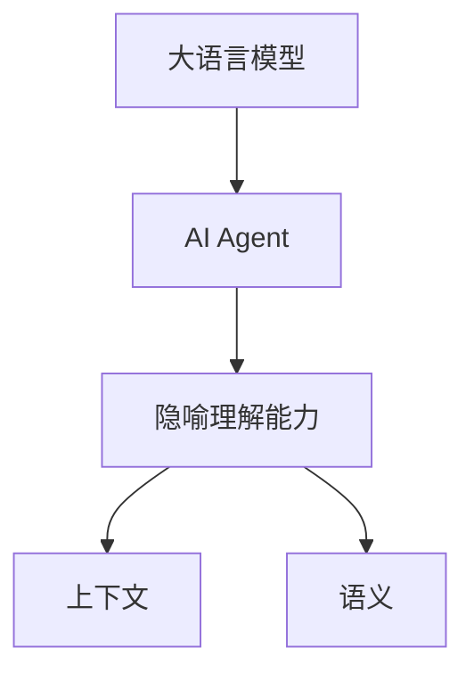
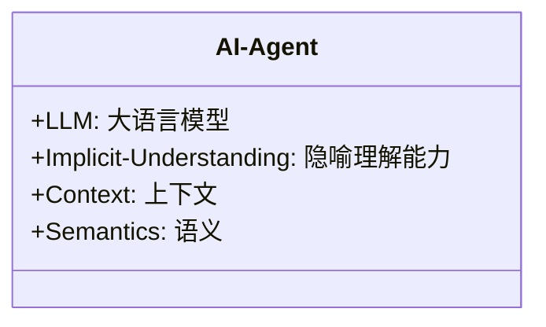
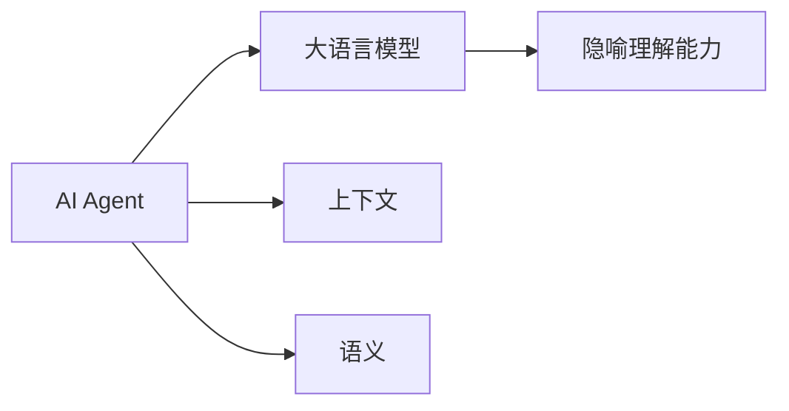
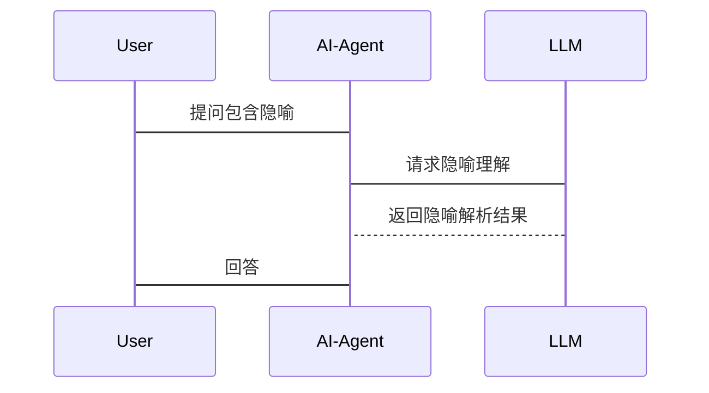

                 


# LLM支持的AI Agent隐喻理解能力

> 关键词：LLM、AI Agent、隐喻理解能力、大语言模型、隐喻、人工智能、自然语言处理

> 摘要：本文深入探讨了大语言模型（LLM）支持的AI Agent在隐喻理解能力方面的能力，分析了隐喻理解的核心概念、算法原理、系统架构设计以及实际项目实现。通过详细的技术分析和案例研究，本文揭示了LLM如何增强AI Agent的隐喻理解能力，并为未来的AI技术发展提供了新的思路。

---

## 第一部分：背景介绍

### 第1章：LLM支持的AI Agent隐喻理解能力概述

#### 1.1 问题背景
- **1.1.1 当前AI Agent的发展现状**  
  AI Agent（人工智能代理）是一种能够感知环境、执行任务并做出决策的智能系统。随着深度学习和大语言模型（LLM）的快速发展，AI Agent的能力得到了显著提升，但其在处理复杂语义任务（如隐喻理解）方面仍存在挑战。

- **1.1.2 隐喻理解能力的重要性**  
  隐喻是一种常见的语言现象，能够通过比喻或象征的方式表达深层含义。理解隐喻是人类语言理解的核心能力之一，但目前AI Agent在处理隐喻时仍不够自然。

- **1.1.3 LLM在AI Agent中的作用**  
  LLM（如GPT-3、GPT-4）具有强大的语言生成和理解能力，能够为AI Agent提供强大的语义理解支持，尤其是在隐喻理解方面。

#### 1.2 问题描述
- **1.2.1 隐喻理解的基本概念**  
  隐喻是一种修辞手法，通过将一个概念映射到另一个概念来表达新的含义。例如，“时间是一把刀”将“时间”比作“刀”，强调时间的无情和切割性。

- **1.2.2 LLM支持的AI Agent的定义**  
  LLM支持的AI Agent是一种结合了大语言模型的语义理解和生成能力的智能代理系统，能够在复杂语境中进行自然语言交互。

- **1.2.3 隐喻理解能力的核心问题**  
  隐喻理解的关键在于识别隐含的类比关系，并将这种关系应用于具体语境中。LLM需要能够从上下文中推断出隐喻的意义，并将其融入到AI Agent的决策过程中。

#### 1.3 问题解决
- **1.3.1 隐喻理解的实现方法**  
  隐喻理解可以通过预训练模型的微调、对比学习或生成式模型来实现。

- **1.3.2 LLM在隐喻理解中的优势**  
  LLM通过大规模数据训练，能够捕捉到语言中的隐含关系，并在生成文本时自然地融入隐喻。

- **1.3.3 AI Agent的隐喻理解能力提升路径**  
  通过结合LLM的语义理解和生成能力，AI Agent可以在对话、任务执行中更自然地理解和使用隐喻。

#### 1.4 边界与外延
- **1.4.1 隐喻理解能力的边界**  
  隐喻理解能力的边界在于上下文的理解深度和模型的推理能力。

- **1.4.2 LLM支持的AI Agent的外延**  
  LLM支持的AI Agent可以应用于智能对话系统、虚拟助手、教育辅助工具等领域。

- **1.4.3 相关概念的对比与区分**  
  隐喻与比喻、拟人等修辞手法的区别在于其隐含的类比关系。LLM支持的AI Agent需要能够区分这些修辞手法，并根据具体语境进行理解。

#### 1.5 概念结构与核心要素组成
- **1.5.1 隐喻理解能力的构成要素**  
  隐喻理解能力包括隐喻识别、隐喻推理和隐喻生成三个核心要素。

- **1.5.2 LLM在AI Agent中的角色**  
  LLM作为AI Agent的语言基础，负责提供语义理解、生成和推理能力。

- **1.5.3 AI Agent隐喻理解能力的核心要素**  
  核心要素包括隐喻识别、上下文理解、类比推理和隐喻生成。

---

## 第二部分：核心概念与联系

### 第2章：隐喻理解能力的核心概念

#### 2.1 隐喻理解的原理
- **2.1.1 隐喻的基本类型**  
  隐喻可以分为直接隐喻、间接隐喻、拟人隐喻、比喻隐喻等类型。

- **2.1.2 隐喻理解的神经机制**  
  隐喻理解涉及到大脑的语义网络和类比推理机制。神经科学研究表明，隐喻理解与大脑的右半球活动密切相关。

- **2.1.3 LLM在隐喻理解中的优势**  
  LLM通过预训练和微调，能够捕捉到语言中的隐含关系，并在生成文本时自然地融入隐喻。

#### 2.2 LLM与AI Agent的联系
- **2.2.1 LLM作为AI Agent的语言基础**  
  LLM为AI Agent提供了强大的语义理解能力和生成能力，使其能够进行复杂的语言交互。

- **2.2.2 AI Agent的隐喻理解能力依赖于LLM**  
  LLM通过理解上下文和隐含关系，帮助AI Agent识别隐喻的含义。

- **2.2.3 LLM如何增强AI Agent的隐喻理解能力**  
  LLM通过大规模数据训练，能够识别隐喻的模式，并在特定语境中生成适当的隐喻表达。

#### 2.3 隐喻理解能力的属性特征对比
- **2.3.1 不同隐喻类型的特点对比**  
  表格展示了不同隐喻类型的特点，例如直接隐喻强调直接类比，拟人隐喻强调赋予事物人类特征。

- **2.3.2 LLM支持的AI Agent与传统AI Agent的对比**  
  LLM支持的AI Agent在语义理解能力上远超传统AI Agent，尤其是在隐喻理解方面。

- **2.3.3 隐喻理解能力的量化评估指标**  
  隐喻理解能力可以通过准确率、召回率、F1分数等指标进行评估。

#### 2.4 ER实体关系图


---

## 第三部分：算法原理讲解

### 第3章：隐喻理解的算法原理

#### 3.1 预训练语言模型的隐喻理解机制
- **3.1.1 预训练模型的基本原理**  
  预训练模型通过无监督学习从大规模数据中提取语义特征，建立词语之间的关联关系。

- **3.1.2 微调模型的隐喻理解优化**  
  微调模型在特定任务数据上进行训练，以提升隐喻理解能力。

- **3.1.3 对比学习在隐喻理解中的应用**  
  对比学习通过比较隐喻和非隐喻表达，优化模型的隐喻识别能力。

#### 3.2 隐喻理解的数学模型
- **3.2.1 隐喻理解的概率模型**  
  隐喻理解可以通过概率图模型进行建模，计算隐喻成立的概率。

- **3.2.2 基于注意力机制的隐喻理解模型**  
  注意力机制能够聚焦于与隐喻相关的关键词和短语，增强隐喻识别能力。

- **3.2.3 隐喻理解的损失函数**  
  损失函数用于衡量模型预测与真实隐喻理解结果的差异，优化模型参数。

#### 3.3 算法实现步骤
- **3.3.1 数据预处理**  
  将隐喻和非隐喻句子进行标注，构建训练数据集。

- **3.3.2 模型训练**  
  使用预训练语言模型进行微调，优化隐喻理解能力。

- **3.3.3 模型评估**  
  使用测试数据集评估模型的隐喻理解准确率。

---

## 第四部分：系统分析与架构设计方案

### 第4章：系统架构设计

#### 4.1 问题场景介绍
- 隐喻理解能力是AI Agent的核心能力之一，能够提升其在自然语言交互中的表现。

#### 4.2 项目介绍
- 开发一个基于LLM的AI Agent，具备隐喻理解能力，能够与用户进行自然语言对话。

#### 4.3 系统功能设计


#### 4.4 系统架构设计


#### 4.5 系统交互设计


---

## 第五部分：项目实战

### 第5章：项目实战

#### 5.1 环境安装
- 安装必要的Python库，如`transformers`和`torch`。

#### 5.2 系统核心实现源代码
```python
from transformers import AutoTokenizer, AutoModelForCausalLM
import torch

model_name = "gpt2"
tokenizer = AutoTokenizer.from_pretrained(model_name)
model = AutoModelForCausalLM.from_pretrained(model_name)

def understand_metaphor(context):
    inputs = tokenizer.encode(context, return_tensors="pt")
    outputs = model.generate(inputs, max_length=100)
    return tokenizer.decode(outputs[0], skip_special_tokens=True)

# 示例
context = "时间是一把刀"
print(understand_metaphor(context))
```

#### 5.3 代码应用解读与分析
- 上述代码展示了如何利用GPT-2模型进行隐喻理解。通过输入包含隐喻的句子，模型能够生成相关的解析结果。

#### 5.4 实际案例分析和详细讲解剖析
- 以“时间是一把刀”为例，模型生成的结果可能包括“时间无情地流逝，如同一把锋利的刀”。

#### 5.5 项目小结
- 通过结合LLM和AI Agent，可以实现强大的隐喻理解能力，提升人机交互的自然性。

---

## 第六部分：最佳实践

### 第6章：小结

- **6.1 注意事项**  
  在实际应用中，需要注意隐喻的理解可能受到上下文和文化背景的影响。

- **6.2 拓展阅读**  
  建议进一步阅读关于隐喻理解的神经网络模型和对比学习的研究。

- **6.3 其他相关技术**  
  结合情感分析、意图识别等技术，可以进一步提升AI Agent的综合能力。

---

## 作者信息

作者：AI天才研究院/AI Genius Institute & 禅与计算机程序设计艺术 /Zen And The Art of Computer Programming

