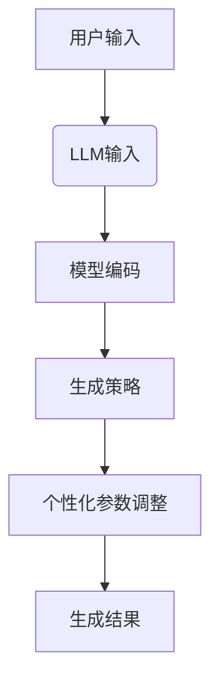

                 


# LLM驱动的AI Agent个性化对话生成

> 关键词：LLM，AI Agent，个性化对话生成，大语言模型，对话系统

> 摘要：本文探讨了利用大语言模型（LLM）驱动的AI Agent实现个性化对话生成的方法，分析了其背后的算法原理、系统架构设计以及实际应用案例，为相关研究和实践提供了参考。

---

## 第1章：问题背景与描述

### 1.1 问题背景
#### 1.1.1 当前人机交互的发展趋势
随着人工智能技术的飞速发展，人机交互方式正在从传统的图形用户界面向更加智能和自然的对话交互转变。用户期望与AI系统进行更自然、更个性化的交流，这对AI系统提出了更高的要求。

#### 1.1.2 大语言模型的崛起
近年来，大语言模型（LLM）如GPT-3、GPT-4等的出现，显著提升了机器理解与生成自然语言的能力。这些模型具有强大的上下文理解和生成能力，能够处理复杂的对话场景。

#### 1.1.3 AI Agent的定义与作用
AI Agent是一种智能体，能够根据用户需求和环境信息，主动采取行动以实现目标。在对话生成领域，AI Agent充当用户与系统之间的桥梁，通过理解和生成对话内容，提供个性化的交互体验。

### 1.2 问题描述
#### 1.2.1 对话生成的挑战
传统的对话生成系统往往依赖于规则或预定义模板，难以应对复杂的上下文和个性化需求。此外，不同用户可能有不同的语言习惯和偏好，这使得对话生成更加具有挑战性。

#### 1.2.2 个性化需求的复杂性
个性化对话生成需要考虑用户的背景、情感、偏好等多个因素，这使得系统需要具备高度的灵活性和自适应能力。

#### 1.2.3 LLM在对话生成中的应用潜力
LLM的强大生成能力和可微调特性，使其成为实现个性化对话生成的理想工具。通过微调LLM，可以使其适应特定领域或用户的对话风格。

### 1.3 问题解决
#### 1.3.1 LLM驱动AI Agent的解决方案
通过将LLM与AI Agent结合，可以充分发挥LLM的生成能力和AI Agent的主动性，实现更自然、个性化的对话交互。

#### 1.3.2 个性化对话生成的关键技术
个性化对话生成需要结合用户特征分析、上下文理解和动态生成技术，以实现高度个性化的对话体验。

#### 1.3.3 系统架构的设计与优化
通过优化系统架构，可以提升对话生成的效率和准确性。例如，引入缓存机制、分布式计算等方法，可以提高系统的响应速度。

### 1.4 边界与外延
#### 1.4.1 LLM驱动AI Agent的适用范围
LLM驱动AI Agent适用于需要高度个性化和自然对话的场景，如智能客服、虚拟助手等。

#### 1.4.2 个性化对话生成的边界条件
个性化对话生成需要在保护用户隐私的前提下进行，同时需要考虑计算资源的限制。

#### 1.4.3 相关技术的对比与区别
与传统对话生成技术相比，LLM驱动的个性化对话生成具有更高的灵活性和准确性，但同时也面临计算成本高、模型训练复杂等挑战。

### 1.5 概念结构与核心要素
#### 1.5.1 LLM与AI Agent的关系
LLM作为AI Agent的核心生成引擎，AI Agent则负责理解和协调生成结果与用户需求之间的关系。

#### 1.5.2 个性化对话生成的要素分解
个性化对话生成需要考虑用户特征、对话历史、上下文等多个要素，每个要素都对生成结果产生影响。

#### 1.5.3 核心概念的结构化描述
个性化对话生成系统由用户输入、LLM生成引擎、AI Agent协调模块和输出结果四个核心部分组成，各部分协同工作以实现个性化的对话体验。

---

## 第2章：核心概念与联系

### 2.1 LLM驱动的AI Agent
#### 2.1.1 LLM的基本原理
大语言模型通过大量数据训练，掌握了语言的分布规律，能够根据输入生成相关的文本内容。

#### 2.1.2 AI Agent的工作机制
AI Agent通过感知环境和用户输入，采取相应的行动，以实现预定目标。在对话生成中，AI Agent负责协调生成过程，确保生成内容符合用户需求。

#### 2.1.3 LLM与AI Agent的结合方式
LLM作为生成引擎，AI Agent负责协调和控制生成过程。通过AI Agent的分析和决策，LLM能够生成更加个性化和符合上下文的对话内容。

### 2.2 个性化对话生成
#### 2.2.1 对话生成的分类
个性化对话生成可以根据用户特征、对话场景等进行分类，例如通用对话生成、领域特定对话生成等。

#### 2.2.2 个性化生成的特点
个性化对话生成强调根据用户的个性化需求生成对话内容，能够适应不同用户的特点和偏好。

#### 2.2.3 个性化对话生成的关键技术
关键技术包括用户特征分析、动态生成策略、上下文理解和反馈优化等。

### 2.3 核心概念的联系
#### 2.3.1 LLM与个性化对话的关系
LLM为个性化对话生成提供了强大的生成能力，而个性化对话生成则通过用户特征分析优化了LLM的生成效果。

#### 2.3.2 AI Agent在对话生成中的作用
AI Agent通过协调生成过程，确保生成内容既符合用户需求，又具备自然流畅的表达。

#### 2.3.3 核心概念的相互影响
LLM的生成能力影响着AI Agent的协调效果，而AI Agent的协调能力又影响着LLM生成内容的个性化程度。

---

### 2.4 概念属性特征对比

| **核心概念** | **LLM** | **AI Agent** | **个性化对话生成** |
|--------------|---------|-------------|--------------------|
| **定义**     | 大语言模型，用于生成自然语言文本。 | 智能体，能够感知环境并采取行动。 | 根据用户需求生成个性化对话内容。 |
| **功能**     | 文本生成 | 协调与决策 | 个性化对话生成 |
| **依赖**     | 大规模数据训练 | 用户输入与环境反馈 | 用户特征与对话历史 |

---

### 2.5 ER实体关系图架构

```mermaid
er
  entity(LLM) {
    id
    parameters
    model_size
  }
  entity(AI Agent) {
    id
    state
    action
  }
  entity(个性化对话生成) {
    id
    input
    output
  }
  relation(生成, LLM, AI Agent)
  relation(驱动, AI Agent, 个性化对话生成)
```

---

## 第3章：算法原理与数学模型

### 3.1 对话生成的算法流程

#### 3.1.1 输入处理
系统接收用户输入，包括文本、语音或其他形式的输入。

#### 3.1.2 模型编码
输入被编码为模型能够处理的形式，通常使用词嵌入或更高级的编码方式。

#### 3.1.3 解码与生成
编码后的输入通过解码器生成输出文本，生成过程中可能还会考虑用户特征和上下文信息。

---

### 3.2 LLM驱动的AI Agent算法

#### 3.2.1 模型输入
AI Agent接收用户输入，并根据用户特征分析生成合适的上下文信息。

#### 3.2.2 解码策略
LLM采用自适应解码策略，根据上下文生成符合用户需求的对话内容。

#### 3.2.3 个性化参数调整
AI Agent根据用户特征动态调整生成参数，以优化生成结果。

---

### 3.3 数学模型与公式

#### 3.3.1 编码器-解码器结构
编码器将输入文本转换为向量表示：
$$ encoder(x) = z $$
解码器根据编码结果生成输出：
$$ decoder(z) = y $$

#### 3.3.2 注意力机制
注意力机制用于计算输入中各词的重要性：
$$ attention(q, k, v) = softmax\left(\frac{q \cdot k}{\sqrt{d}}\right) \cdot v $$

#### 3.3.3 模型训练的损失函数
交叉熵损失函数用于训练模型：
$$ \mathcal{L} = -\sum_{i=1}^{n} y_i \log(p(y_i|x)) $$

---

### 3.4 算法流程图



---

## 第4章：系统分析与架构设计

### 4.1 系统架构设计

#### 4.1.1 项目介绍
本项目旨在通过LLM驱动的AI Agent实现个性化对话生成，系统架构包括前端、后端和模型服务三部分。

#### 4.1.2 系统功能设计
- 用户输入处理
- 对话历史记录
- 个性化生成策略
- 反馈优化

#### 4.1.3 系统架构图


---

## 第5章：项目实战

### 5.1 环境安装
需要安装Python、PyTorch、Hugging Face库等。

### 5.2 核心代码实现
```python
class LLM_Driver:
    def __init__(self, model_name):
        self.model = AutoModelForCausalLM.from_pretrained(model_name)
        self.tokenizer = AutoTokenizer.from_pretrained(model_name)
    
    def generate_response(self, input_text, max_length=50):
        inputs = self.tokenizer(input_text, return_tensors="pt")
        outputs = self.model.generate(**inputs, max_length=max_length)
        return self.tokenizer.decode(outputs[0], skip_special_tokens=True)
```

### 5.3 案例分析
通过实际案例展示系统如何根据用户特征生成个性化对话。

---

## 第6章：最佳实践与小结

### 6.1 最佳实践
- 定期更新模型，以保持生成能力
- 优化系统架构，提高响应速度
- 考虑用户隐私和数据安全

### 6.2 小结
本文详细介绍了LLM驱动的AI Agent个性化对话生成的实现过程，从背景介绍到算法原理，再到系统架构设计和项目实战，为读者提供了全面的技术指导。

---

## 作者：AI天才研究院/AI Genius Institute & 禅与计算机程序设计艺术 /Zen And The Art of Computer Programming

