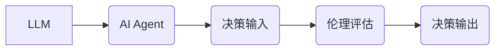
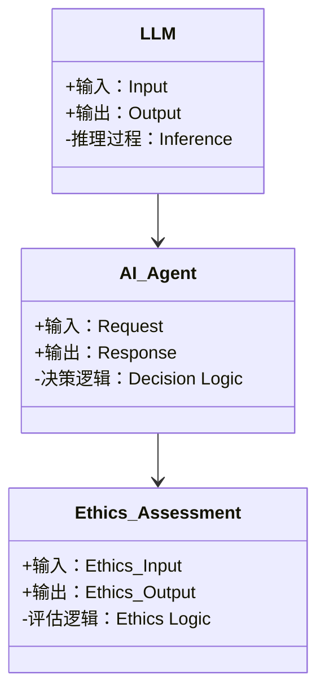
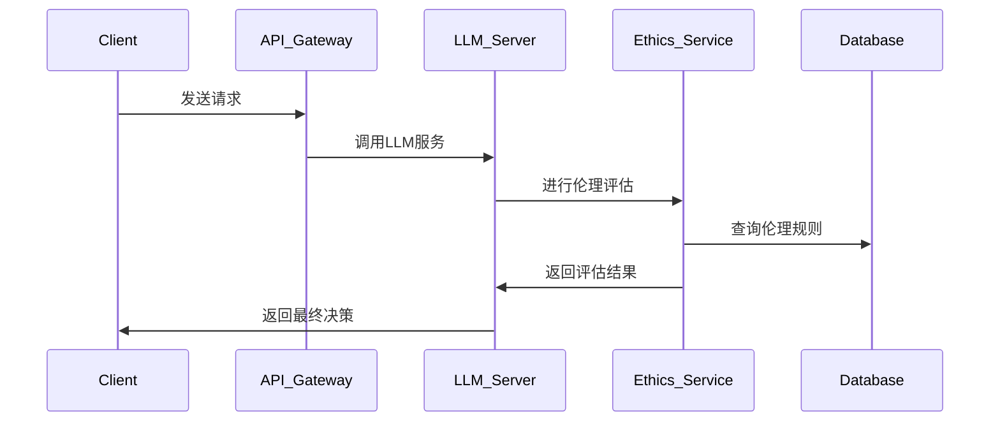

                 


# LLM驱动的AI Agent伦理决策支持系统

> 关键词：大语言模型、AI Agent、伦理决策支持系统、LLM驱动、AI伦理、人机协作

> 摘要：本文详细探讨了基于大语言模型（LLM）构建AI Agent伦理决策支持系统的核心原理、系统架构和实现方法。通过分析LLM与AI Agent的协同工作方式，结合伦理决策的数学模型和算法原理，提出了一个完整的系统设计与实现方案。文章内容涵盖从理论到实践的全过程，为AI伦理决策支持系统的开发提供了深入的技术指导和实践参考。

---

# 第一部分：LLM驱动的AI Agent伦理决策支持系统概述

## 第1章：问题背景与核心概念

### 1.1 问题背景介绍

#### 1.1.1 从传统AI到LLM驱动的AI Agent的演进
传统的人工智能（AI）系统通常基于规则或专家系统进行决策，但这种决策方式存在灵活性差、难以处理复杂场景的问题。近年来，随着大语言模型（LLM）的崛起，AI Agent的概念逐渐成为研究热点。LLM的强大生成能力和理解能力为AI Agent的决策过程注入了新的活力，使其能够处理更复杂、更动态的场景。

#### 1.1.2 当前AI Agent决策中的伦理挑战
AI Agent的决策过程需要考虑伦理因素，例如隐私保护、公平性、透明性等。然而，传统的决策系统往往忽略了这些因素，导致在实际应用中可能出现伦理风险。例如，在医疗AI Agent的诊断决策中，如果不考虑患者隐私保护，可能会引发数据泄露问题；在金融领域的AI Agent决策中，如果不考虑公平性，可能会导致歧视性结果。

#### 1.1.3 为什么需要伦理决策支持系统
伦理决策支持系统的引入，可以帮助AI Agent在决策过程中自动考虑伦理因素，确保决策的合法性和道德性。这种系统不仅可以降低伦理风险，还能提升用户对AI系统的信任度。

---

### 1.2 核心概念与问题描述

#### 1.2.1 LLM的定义与技术特点
大语言模型（LLM）是一种基于深度学习的自然语言处理模型，具有以下特点：
- **强大的生成能力**：能够生成符合上下文的自然语言文本。
- **理解能力**：能够通过上下文理解用户意图。
- **可扩展性**：可以通过微调或提示工程技术适应不同领域的需求。

#### 1.2.2 AI Agent的定义与功能模块
AI Agent是一种智能体，能够感知环境、理解用户需求并执行相应操作。其主要功能模块包括：
- **感知模块**：接收用户输入或环境信息。
- **决策模块**：基于感知信息生成决策。
- **执行模块**：将决策转化为具体操作。

#### 1.2.3 伦理决策支持系统的定义与目标
伦理决策支持系统是一种辅助AI Agent进行伦理决策的系统，其目标是通过引入伦理规则和价值观，确保AI决策的合法性和道德性。

---

### 1.3 问题解决与边界外延

#### 1.3.1 LLM驱动AI Agent的决策流程
1. **输入处理**：AI Agent接收用户的请求或环境信息。
2. **伦理评估**：通过LLM分析决策的伦理影响。
3. **决策生成**：结合伦理评估结果生成最终决策。
4. **输出执行**：将决策转化为具体操作。

#### 1.3.2 伦理决策支持系统的边界与限制
- **边界**：仅处理与伦理相关的决策问题，不涉及技术实现细节。
- **限制**：无法完全消除所有伦理风险，只能降低风险发生的概率。

#### 1.3.3 相关领域与外延范围
- **相关领域**：伦理学、人工智能、自然语言处理。
- **外延范围**：应用于医疗、金融、法律等多个领域。

---

## 第2章：核心概念与联系

### 2.1 LLM与AI Agent的核心原理

#### 2.1.1 LLM的训练与推理机制
- **训练**：基于大规模数据集进行监督学习和无监督学习。
- **推理**：根据输入生成符合逻辑的输出。

#### 2.1.2 AI Agent的感知与行动逻辑
- **感知**：通过输入接口接收信息。
- **行动**：通过输出接口执行操作。

#### 2.1.3 伦理决策的数学模型
伦理决策可以通过数学模型表示为：
$$
D = f(e, r)
$$
其中，$D$ 表示决策，$e$ 表示环境信息，$r$ 表示伦理规则。

---

### 2.2 核心概念属性对比表

#### 2.2.1 LLM与传统NLP模型的对比
| 属性         | LLM                          | 传统NLP模型                 |
|--------------|-------------------------------|-----------------------------|
| 处理能力     | 强大的生成和理解能力          | 仅限于特定任务               |
| 可扩展性     | 高                          | 低                          |
| 算法复杂度   | 高                          | 低                          |

#### 2.2.2 AI Agent与传统决策系统的对比
| 属性         | AI Agent                     | 传统决策系统                |
|--------------|-------------------------------|-----------------------------|
| 智能性       | 高                          | 低                          |
| 可定制性     | 高                          | 低                          |
| 响应速度     | 快                          | 慢                          |

#### 2.2.3 伦理决策与非伦理决策的对比
| 属性         | 伦理决策                     | 非伦理决策                  |
|--------------|-------------------------------|-----------------------------|
| 考虑因素     | 道德、法律、隐私等           | 技术可行性、经济效益等       |
| 决策复杂度   | 高                          | 中                          |

---

## 2.3 ER实体关系图

### 2.3.1 实体关系图的Mermaid流程图


---

# 第三部分：算法原理与数学模型

---

## 第3章：算法原理与数学模型

### 3.1 LLM的算法原理

#### 3.1.1 基于LLM的决策生成算法


#### 3.1.2 伦理评估的数学模型
伦理评估可以通过以下公式表示：
$$
E = \sum_{i=1}^{n} w_i \cdot f_i(x)
$$
其中，$E$ 表示伦理评估结果，$w_i$ 表示特征的重要性权重，$f_i(x)$ 表示特征的评估函数。

---

### 3.2 伦理决策支持算法

#### 3.2.1 基于规则的伦理决策算法


#### 3.2.2 基于强化学习的伦理决策算法
强化学习通过奖惩机制优化决策策略：
$$
R = r_1 \cdot x_1 + r_2 \cdot x_2 + \dots + r_n \cdot x_n
$$
其中，$R$ 表示奖励值，$r_i$ 表示奖励权重，$x_i$ 表示决策特征。

---

## 第三部分：系统分析与架构设计

---

## 第4章：系统分析与架构设计

### 4.1 项目介绍

#### 4.1.1 项目背景
本项目旨在开发一个基于LLM的AI Agent伦理决策支持系统，帮助AI Agent在决策过程中考虑伦理因素。

---

### 4.2 系统功能设计

#### 4.2.1 领域模型


---

### 4.3 系统架构设计

#### 4.3.1 系统架构


#### 4.3.2 接口设计
- **输入接口**：接收用户请求。
- **输出接口**：返回决策结果。
- **内部接口**：LLM与伦理评估服务之间的通信接口。

#### 4.3.3 交互设计


---

## 第5章：项目实战

### 5.1 环境搭建与安装

#### 5.1.1 安装Python环境
```bash
python --version
pip install --upgrade pip
```

#### 5.1.2 安装依赖库
```bash
pip install transformers
pip install torch
```

---

### 5.2 系统核心实现

#### 5.2.1 LLM驱动的决策生成代码
```python
from transformers import pipeline

# 初始化LLM管道
llm = pipeline("text-generation", model="gpt2")

# 决策生成函数
def generate_decision(input_text):
    return llm(input_text)[0]['generated_text']
```

#### 5.2.2 伦理评估代码
```python
def ethics_assessment(input_text):
    # 示例伦理规则：隐私保护
    if "private" in input_text.lower():
        return "高风险"
    else:
        return "低风险"
```

---

### 5.3 实际案例分析

#### 5.3.1 案例1：医疗诊断中的隐私保护
```python
input_text = "患者信息泄露的风险"
decision = generate_decision(input_text)
ethics = ethics_assessment(input_text)
print(f"决策：{decision}\n伦理评估：{ethics}")
```

#### 5.3.2 案例2：金融领域的公平性评估
```python
input_text = "贷款申请中的性别歧视"
decision = generate_decision(input_text)
ethics = ethics_assessment(input_text)
print(f"决策：{decision}\n伦理评估：{ethics}")
```

---

## 第六部分：最佳实践与小结

---

## 第6章：最佳实践与小结

### 6.1 最佳实践

#### 6.1.1 注意事项
- 确保伦理规则的全面性。
- 定期更新LLM模型以适应新的伦理规范。

#### 6.1.2 系统优化
- 增加用户反馈机制，优化决策算法。
- 提供多语言支持，扩展系统应用场景。

### 6.2 小结

本文详细介绍了基于LLM的AI Agent伦理决策支持系统的构建过程，从理论到实践，为开发者提供了完整的系统设计与实现方案。通过本文的指导，读者可以快速搭建一个基础的伦理决策支持系统，并在此基础上进行进一步的优化和扩展。

---

# 作者：AI天才研究院/AI Genius Institute & 禅与计算机程序设计艺术/Zen And The Art of Computer Programming

