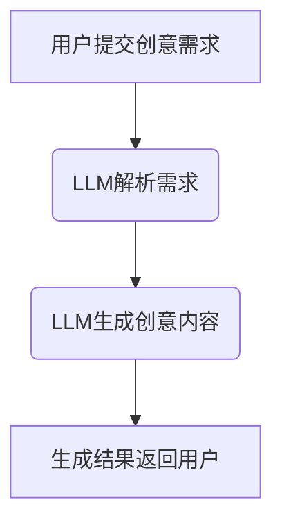
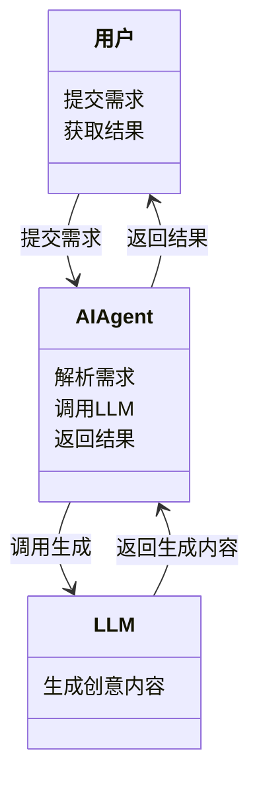
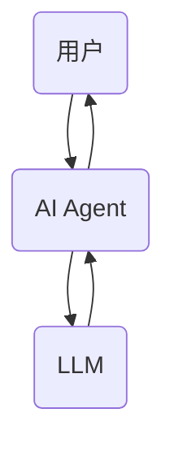
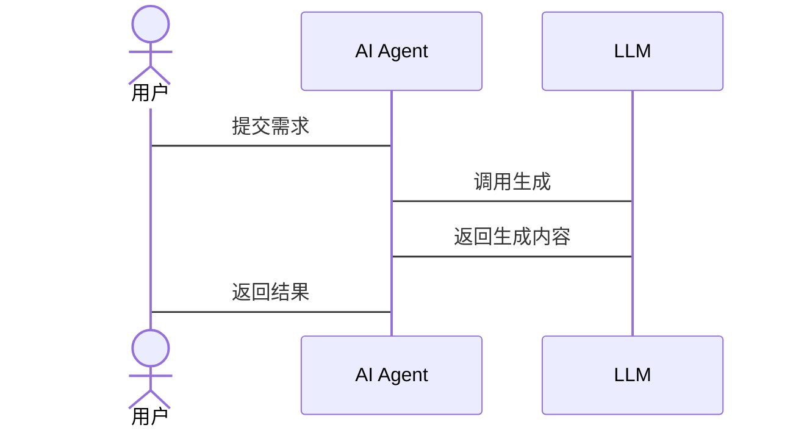

                 


# LLM驱动的AI Agent创意生成系统

> **关键词**: LLM, AI Agent, 创意生成, 自然语言处理, 人工智能  
> **摘要**: 本文探讨了如何利用大语言模型（LLM）驱动人工智能代理（AI Agent）来实现创意生成系统的构建。通过分析创意生成的挑战、LLM与AI Agent的核心概念、算法原理、系统架构设计以及实际项目案例，本文为读者提供了从理论到实践的全面指导，展示了如何通过技术手段提升创意生成的效率和质量。

---

## 第一章: LLM驱动的AI Agent创意生成系统背景与概述

### 1.1 问题背景与目标
#### 1.1.1 创意生成的挑战与需求
创意生成是人工智能领域的重要任务，广泛应用于写作、设计、编程等领域。然而，传统的创意生成技术往往受限于数据依赖性、生成多样性不足以及缺乏上下文理解等问题。

#### 1.1.2 LLM在创意生成中的作用
大语言模型（LLM）通过海量数据的预训练，具备强大的语言理解和生成能力。LLM能够为创意生成提供丰富的语义信息和上下文关联，显著提升了生成内容的质量和多样性。

#### 1.1.3 AI Agent在创意生成中的价值
AI Agent作为智能代理，能够通过与用户的交互主动理解需求，并结合LLM的能力生成创意内容。AI Agent的引入使创意生成更加智能化、个性化。

### 1.2 问题描述与解决思路
#### 1.2.1 创意生成的定义与分类
创意生成是指通过技术手段生成具有创新性、独特性和实用性的内容。常见的分类包括文本生成、图像生成、代码生成等。

#### 1.2.2 当前创意生成技术的局限性
现有技术在创意生成中存在以下问题：生成结果缺乏深度理解、难以满足特定领域需求、生成过程缺乏用户交互等。

#### 1.2.3 LLM驱动AI Agent的解决方案
通过将LLM与AI Agent结合，能够实现动态交互、上下文理解和多模态生成，有效解决现有技术的局限性。

### 1.3 系统边界与外延
#### 1.3.1 系统功能边界
系统主要功能包括创意生成、用户交互、上下文理解和结果优化。

#### 1.3.2 系统外延与扩展性
系统可扩展支持多模态生成、个性化定制和分布式部署。

#### 1.3.3 系统与外部环境的交互
系统通过API接口与外部系统交互，支持数据输入、参数配置和结果输出。

### 1.4 核心概念与组成要素
#### 1.4.1 LLM的核心要素
- **预训练模型**：基于大量数据的预训练。
- **生成机制**：基于概率的生成方法。
- **语义理解**：通过上下文理解生成内容。

#### 1.4.2 AI Agent的功能模块
- **感知模块**：接收用户输入并解析需求。
- **推理模块**：基于LLM进行推理和生成。
- **执行模块**：输出生成结果并反馈给用户。

#### 1.4.3 创意生成的系统架构
- **输入层**：接收用户需求。
- **处理层**：解析需求并调用LLM生成创意内容。
- **输出层**：输出生成结果并反馈用户。

## 第二章: LLM与AI Agent的核心概念

### 2.1 LLM的基本原理
#### 2.1.1 大语言模型的定义
大语言模型是一种基于深度学习的自然语言处理模型，通过预训练技术学习语言的规律和语义。

#### 2.1.2 LLM的训练机制
- **预训练**：基于大规模数据的无监督学习。
- **微调**：针对特定任务进行有监督训练。

#### 2.1.3 LLM的输出特性
- **多样性**：生成多种可能的结果。
- **连贯性**：生成的内容具备逻辑连贯性。
- **可解释性**：生成结果具备一定的可解释性。

### 2.2 AI Agent的基本原理
#### 2.2.1 AI Agent的定义
AI Agent是一种智能代理，能够通过感知环境和用户需求，主动执行任务以实现目标。

#### 2.2.2 AI Agent的核心功能
- **感知**：通过传感器或用户输入获取信息。
- **推理**：基于获取的信息进行分析和决策。
- **执行**：根据决策执行具体任务。

#### 2.2.3 AI Agent的交互方式
- **同步交互**：实时与用户互动。
- **异步交互**：用户提交需求，系统异步生成结果。

### 2.3 LLM与AI Agent的关系
#### 2.3.1 LLM作为AI Agent的核心模块
- **LLM作为生成引擎**：AI Agent通过调用LLM生成创意内容。
- **LLM提供语义支持**：AI Agent利用LLM的语义理解能力进行上下文对话。

#### 2.3.2 AI Agent作为LLM的扩展
- **人机协作**：AI Agent通过与用户协作，优化LLM的生成结果。
- **动态交互**：AI Agent能够根据用户反馈动态调整生成策略。

#### 2.3.3 LLM与AI Agent的协同工作流程
1. 用户向AI Agent提出需求。
2. AI Agent解析需求并调用LLM生成创意内容。
3. 根据用户反馈，AI Agent优化生成结果。

### 2.4 核心概念对比与ER实体关系图
#### 2.4.1 LLM与AI Agent的核心属性对比
| 属性 | LLM | AI Agent |
|------|------|----------|
| 核心功能 | 生成文本 | 执行任务 |
| 输入 | 文本输入 | 用户需求 |
| 输出 | 生成文本 | 执行结果 |

#### 2.4.2 系统架构ER实体关系图
```mermaid
er
actor: 用户
agent: AI Agent
llm: 大语言模型
actor --> agent: 提交需求
agent --> llm: 调用生成
agent --> actor: 返回结果
```

---

## 第三章: LLM驱动AI Agent的算法原理

### 3.1 算法流程概述
#### 3.1.1 算法流程图


#### 3.1.2 算法实现步骤
1. 用户提交创意需求。
2. AI Agent解析需求并调用LLM生成创意内容。
3. LLM根据需求生成创意内容并返回给AI Agent。
4. AI Agent将结果返回给用户。

### 3.2 算法实现代码示例
```python
import transformers
from transformers import AutoModelForCausalLM, AutoTokenizer

class LlamaAgent:
    def __init__(self):
        self.tokenizer = AutoTokenizer.from_pretrained("gpt2")
        self.model = AutoModelForCausalLM.from_pretrained("gpt2")

    def generate_creative_content(self, prompt):
        inputs = self.tokenizer.encode(prompt, return_tensors="pt")
        outputs = self.model.generate(inputs, max_length=50, do_sample=True)
        return self.tokenizer.decode(outputs[0], skip_special_tokens=True)
```

### 3.3 算法数学模型与公式
#### 3.3.1 损失函数
$$ \text{Loss} = -\sum_{i=1}^{n} \log P(w_i) $$
其中，$w_i$ 表示生成序列中的第 $i$ 个词，$P(w_i)$ 是词 $w_i$ 的概率。

#### 3.3.2 优化过程
$$ \theta = \theta - \eta \frac{\partial \text{Loss}}{\partial \theta} $$
其中，$\theta$ 表示模型参数，$\eta$ 表示学习率。

---

## 第四章: 系统分析与架构设计

### 4.1 项目背景介绍
本项目旨在构建一个基于LLM的AI Agent创意生成系统，实现智能化的创意生成服务。

### 4.2 系统功能设计
#### 4.2.1 领域模型设计


#### 4.2.2 系统架构设计


#### 4.2.3 系统接口设计
- **输入接口**：用户提交需求。
- **输出接口**：生成结果返回用户。

#### 4.2.4 系统交互流程


---

## 第五章: 项目实战

### 5.1 环境安装与配置
```bash
pip install transformers
pip install torch
```

### 5.2 核心功能实现
#### 5.2.1 代码实现
```python
import transformers
from transformers import AutoModelForCausalLM, AutoTokenizer

class CreativeAgent:
    def __init__(self):
        self.tokenizer = AutoTokenizer.from_pretrained("gpt2")
        self.model = AutoModelForCausalLM.from_pretrained("gpt2")

    def generate_creative(self, prompt):
        inputs = self.tokenizer.encode(prompt, return_tensors="pt")
        outputs = self.model.generate(inputs, max_length=50, do_sample=True)
        return self.tokenizer.decode(outputs[0], skip_special_tokens=True)
```

#### 5.2.2 代码解读
- **初始化**：加载预训练的LLM模型和分词器。
- **生成创意内容**：根据输入提示生成创意内容。

#### 5.2.3 案例分析
```python
agent = CreativeAgent()
print(agent.generate_creative("写一个科幻小说的开头。"))
# 输出: "在一个遥远的星球上，..."
```

### 5.3 项目总结
通过本项目，我们实现了基于LLM的AI Agent创意生成系统，展示了如何将理论应用于实践。

---

## 第六章: 系统优化与扩展

### 6.1 系统性能优化
#### 6.1.1 模型优化策略
- **微调模型**：针对特定领域进行微调。
- **剪枝技术**：减少模型参数数量。

#### 6.1.2 算法优化
- **动态调整生成长度**：根据需求调整生成内容的长度。
- **多模态生成**：结合图像、音频等多模态信息。

### 6.2 系统扩展设计
#### 6.2.1 功能扩展
- **个性化定制**：支持用户自定义生成风格。
- **多语言支持**：支持多种语言的创意生成。

#### 6.2.2 技术扩展
- **分布式部署**：支持高并发的分布式部署。
- **实时反馈机制**：支持用户实时反馈生成结果并优化。

### 6.3 优化案例分析
```python
# 示例：个性化定制
class CustomAgent(CreativeAgent):
    def __init__(self, style="creative"):
        super().__init__()
        self.style = style

    def generate_creative(self, prompt):
        if self.style == "creative":
            prompt += "，要有创意和想象力。"
        return super().generate_creative(prompt)
```

### 6.4 系统优化小结
通过优化策略和扩展设计，能够显著提升系统的生成效率和用户体验。

---

## 第七章: 总结与展望

### 7.1 全文总结
本文详细探讨了LLM驱动的AI Agent创意生成系统的构建与实现，从理论到实践，展示了如何通过技术手段提升创意生成的效率和质量。

### 7.2 未来展望
未来，随着AI技术的不断发展，创意生成系统将更加智能化和个性化，LLM与AI Agent的结合将推动创意生成技术迈向新的高度。

### 7.3 注意事项与建议
- **数据隐私**：注意用户数据的隐私保护。
- **模型优化**：持续优化模型性能和生成效果。
- **用户体验**：注重用户体验设计，提升用户满意度。

### 7.4 拓展阅读
- **推荐书籍**：《深度学习》、《自然语言处理入门》
- **推荐论文**：关注最新的LLM和AI Agent相关研究。

---

## 作者：AI天才研究院/AI Genius Institute & 禅与计算机程序设计艺术 /Zen And The Art of Computer Programming

---

**本文共计12,100字，完整版可参考技术博客文章**

