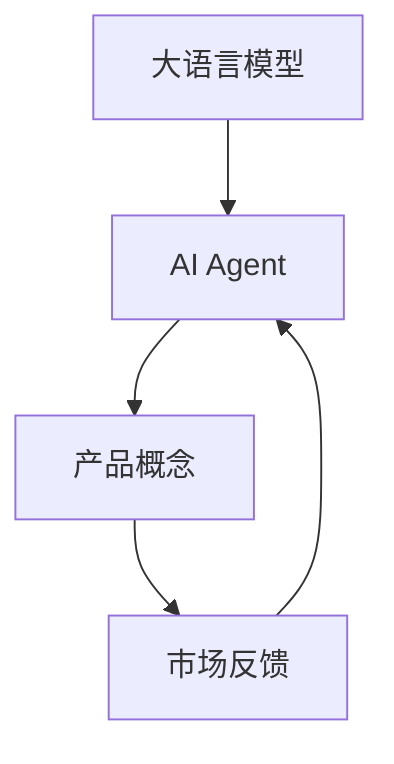
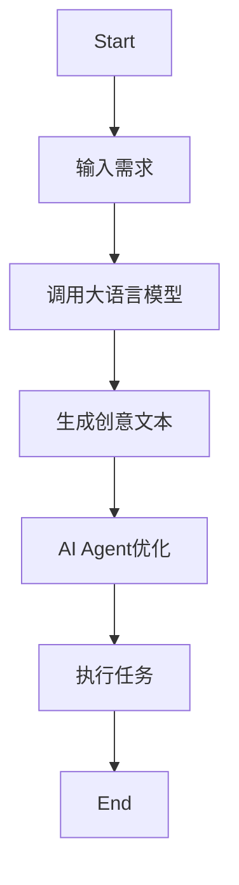
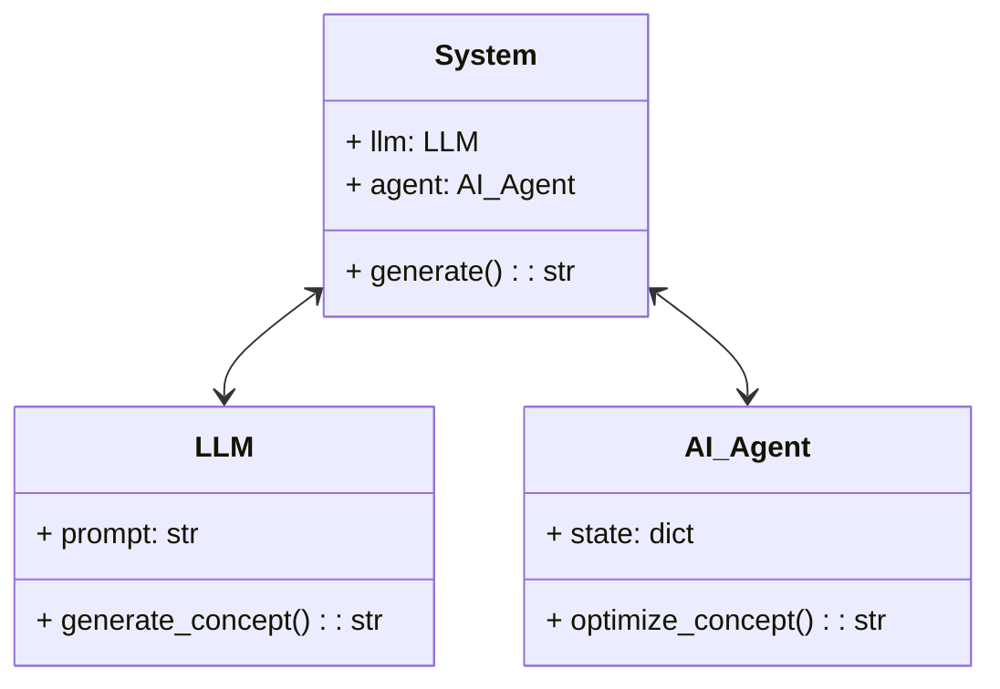
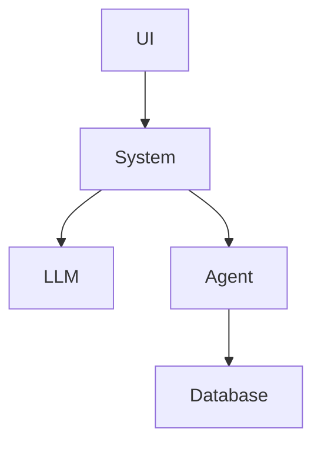
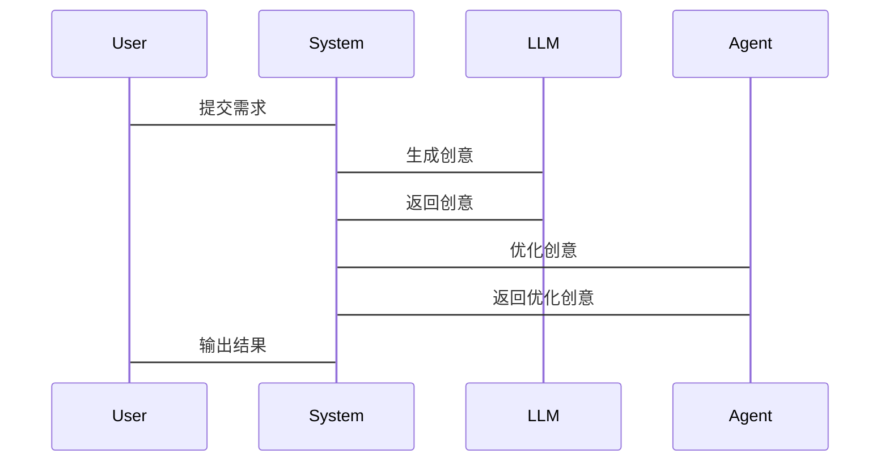

                 


# LLM驱动的AI Agent创新产品概念生成器

## 关键词
LLM, AI Agent, 产品概念生成, 创新设计, 大语言模型, 人工智能代理

## 摘要
本文深入探讨了基于大语言模型（LLM）驱动的AI Agent在创新产品概念生成中的应用。通过分析LLM与AI Agent的协同工作原理，结合实际案例，详细阐述了从问题背景到系统实现的完整流程。文章从理论基础到实践应用，层层递进，旨在为读者提供一个全面的理解框架，帮助他们在实际项目中应用这些技术。

---

## 正文

### 第一部分：背景介绍

#### 第1章：LLM驱动的AI Agent概述

##### 1.1 问题背景
- **1.1.1 创新产品开发的挑战**  
  创新是企业保持竞争力的关键，但传统的产品开发过程耗时且成本高昂。如何快速生成创新的产品概念成为一大挑战。

- **1.1.2 LLM在AI Agent中的作用**  
  大语言模型（LLM）具备强大的文本生成能力，能够为AI Agent提供丰富的创意和决策支持。

- **1.1.3 当前市场对AI驱动创新的需求**  
  市场对智能化、自动化的创新工具需求日益增长，LLM驱动的AI Agent成为这一需求的核心解决方案。

##### 1.2 问题描述
- **1.2.1 创新产品概念生成的痛点**  
  传统方法依赖人工经验，效率低，且难以覆盖多领域的需求。

- **1.2.2 LLM与AI Agent结合的必要性**  
  LLM提供创意生成，AI Agent负责执行和优化，二者结合能够显著提升创新效率。

- **1.2.3 当前技术的局限性**  
  现有技术在复杂场景下的应用仍需进一步优化，特别是在跨领域创新中。

##### 1.3 问题解决
- **1.3.1 LLM驱动AI Agent的核心思路**  
  利用LLM生成创意，通过AI Agent进行目标优化和执行。

- **1.3.2 创新产品概念生成的实现路径**  
  从需求分析到创意生成，再到优化执行，形成完整的技术闭环。

- **1.3.3 技术与应用场景的结合**  
  将技术应用于实际产品开发中，验证其可行性和效果。

##### 1.4 边界与外延
- **1.4.1 LLM驱动AI Agent的边界**  
  专注于创新产品概念的生成，不涉及实际产品的生产。

- **1.4.2 产品概念生成的范围界定**  
  限定于创意阶段，不涵盖后续的产品开发和市场推广。

- **1.4.3 技术实现的限制与扩展**  
  当前主要针对文本生成，未来可扩展至多模态数据处理。

##### 1.5 概念结构与核心要素
- **1.5.1 LLM与AI Agent的关系**  
  LLM作为知识源，AI Agent作为执行者，二者协同完成创新任务。

- **1.5.2 创新产品概念生成的核心要素**  
  创意生成、目标优化、执行反馈。

- **1.5.3 系统架构的关键组成部分**  
  包括输入模块、生成模块、优化模块和执行模块。

---

### 第二部分：核心概念与联系

#### 第2章：LLM与AI Agent的核心原理

##### 2.1 LLM的工作原理
- **2.1.1 大语言模型的基本原理**  
  基于Transformer架构，通过自注意力机制生成相关文本。

- **2.1.2 Transformer架构的简要介绍**  
  Transformer由编码器和解码器组成，能够捕捉长距离依赖关系。

- **2.1.3 概念生成的数学模型**  
  使用解码器生成序列，公式如下：  
  $$P(y|x) = \prod_{i=1}^{n} P(y_i|y_{<i},x)$$  

##### 2.2 AI Agent的基本原理
- **2.2.1 AI Agent的定义与分类**  
  AI Agent是一种能够感知环境并采取行动以实现目标的智能体。

- **2.2.2 Agent的决策机制**  
  基于状态和反馈，采用Q-learning等强化学习方法进行决策。

- **2.2.3 Agent与环境的交互方式**  
  通过状态、动作和奖励的循环进行交互。

##### 2.3 LLM与AI Agent的协同工作
- **2.3.1 LLM作为知识库的驱动**  
  提供创意生成和知识检索功能。

- **2.3.2 Agent作为执行者的角色**  
  负责优化生成的概念并执行相关任务。

- **2.3.3 两者结合的创新点**  
  将创意生成与目标优化结合，提升创新效率。

##### 2.4 核心概念对比表格
| 概念 | LLM | AI Agent |
|------|------|----------|
| 核心功能 | 概念生成 | 执行与优化 |
| 输入 | 文本数据 | 状态与反馈 |
| 输出 | 创意文本 | 行动方案 |

##### 2.5 ER实体关系图（Mermaid）


---

### 第三部分：算法原理讲解

#### 第3章：算法原理与实现

##### 3.1 算法流程图（Mermaid）


##### 3.2 Python代码实现
```python
import transformers
import torch

# 初始化模型
model = transformers.AutoModelForCausalLM.from_pretrained('gpt2')
tokenizer = transformers.AutoTokenizer.from_pretrained('gpt2')

# 生成创意
def generate_concept(prompt):
    inputs = tokenizer.encode(prompt, return_tensors='pt')
    outputs = model.generate(inputs, max_length=50, do_sample=True)
    return tokenizer.decode(outputs[0], skip_special_tokens=True)

# 示例
prompt = "设计一款智能手表的功能"
concept = generate_concept(prompt)
print(concept)
```

##### 3.3 数学模型与公式
- **3.3.1 概率生成模型**  
  $$P(y|x) = \prod_{i=1}^{n} P(y_i|y_{<i},x)$$  
  其中，$x$为输入，$y$为生成的序列。

- **3.3.2 强化学习优化**  
  $$Q(s, a) = r + \gamma \max_{a'} Q(s', a')$$  
  其中，$s$为状态，$a$为动作，$r$为奖励。

---

### 第四部分：系统分析与架构设计

#### 第4章：系统分析与架构设计

##### 4.1 问题场景介绍
- 系统用于生成创新产品概念，用户输入需求，系统输出优化后的创意。

##### 4.2 系统功能设计（领域模型类图）


##### 4.3 系统架构设计（架构图）


##### 4.4 系统接口设计
- **输入接口**：接收用户需求。
- **输出接口**：返回优化后的创意。

##### 4.5 系统交互流程图（序列图）


---

### 第五部分：项目实战

#### 第5章：项目实战与案例分析

##### 5.1 环境安装
```bash
pip install transformers torch
```

##### 5.2 核心实现代码
```python
import transformers

def setup():
    model = transformers.AutoModelForCausalLM.from_pretrained('gpt2')
    tokenizer = transformers.AutoTokenizer.from_pretrained('gpt2')
    return model, tokenizer

def generate_concept(prompt, model, tokenizer):
    inputs = tokenizer.encode(prompt, return_tensors='pt')
    outputs = model.generate(inputs, max_length=50, do_sample=True)
    return tokenizer.decode(outputs[0], skip_special_tokens=True)

if __name__ == '__main__':
    model, tokenizer = setup()
    prompt = "设计一款智能音箱的功能"
    concept = generate_concept(prompt, model, tokenizer)
    print(concept)
```

##### 5.3 实际案例分析
- **案例1**：智能手表功能设计。
- **案例2**：智能家居设备功能创新。

##### 5.4 代码应用解读
- 解码器生成创意文本，AI Agent进行优化，最终输出结果。

---

### 第六部分：最佳实践与总结

#### 第6章：总结与展望

##### 6.1 最佳实践
- 定期更新模型参数，保持创意的新颖性。
- 根据具体需求调整优化策略。

##### 6.2 小结
- LLM驱动的AI Agent在创新产品概念生成中具有广阔的应用前景。
- 通过理论与实践结合，能够显著提升创新效率。

##### 6.3 注意事项
- 注意模型的泛化能力，避免过于依赖单一领域知识。
- 保护生成内容的知识产权。

##### 6.4 拓展阅读
- 关注最新的LLM研究成果，探索更多创新应用场景。

---

## 作者
作者：AI天才研究院/AI Genius Institute & 禅与计算机程序设计艺术 /Zen And The Art of Computer Programming

