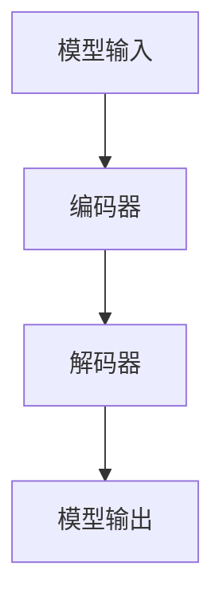
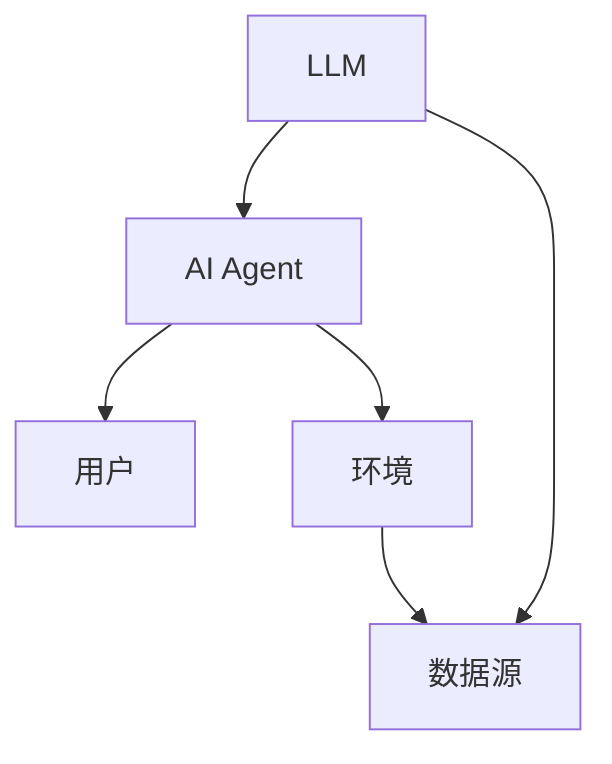
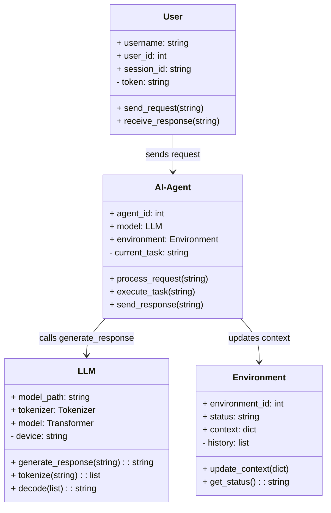
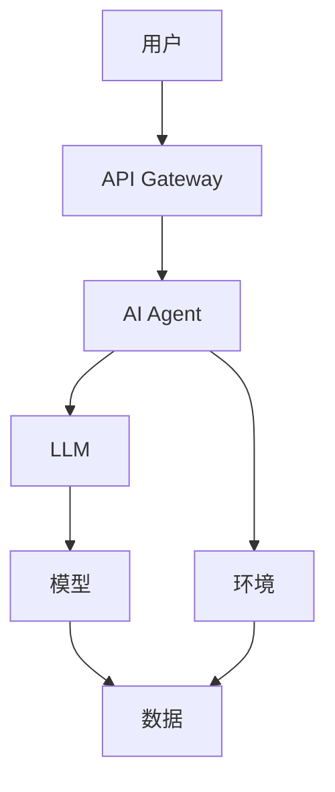
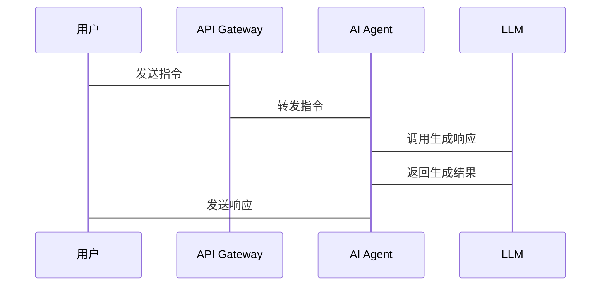

                 


```markdown
# LLM驱动的AI Agent创新产品设计

> 关键词：LLM、AI Agent、人工智能、创新产品设计、大语言模型、智能代理

> 摘要：本文详细探讨了如何利用大语言模型（LLM）驱动人工智能代理（AI Agent）的创新设计。从技术背景到核心概念，从算法原理到系统架构，再到项目实战和最佳实践，全面解析了LLM与AI Agent结合的实现方法和应用场景。通过具体案例和代码示例，帮助读者理解并掌握LLM驱动的AI Agent的设计与开发。

---

# 第一部分: LLM驱动的AI Agent背景与基础

# 第1章: LLM与AI Agent概述

## 1.1 LLM的定义与核心原理
### 1.1.1 大语言模型的基本概念
- 大语言模型（LLM）是指基于深度学习的大型语言模型，如GPT系列、BERT系列等。
- LLM的核心目标是理解和生成人类语言，通过大量数据训练，能够进行文本生成、翻译、问答等任务。

### 1.1.2 LLM的核心技术与特点
- **技术**：基于Transformer架构，采用自注意力机制，支持序列建模。
- **特点**：
  - 大规模数据训练
  - 自然语言处理能力强大
  - 支持多种任务（文本生成、问答、摘要等）

### 1.1.3 LLM的训练与推理机制
- **训练**：通过监督学习或无监督学习，优化模型参数以最小化损失函数。
- **推理**：通过解码器生成序列，基于概率最大化选择下一个词。



## 1.2 AI Agent的基本概念
### 1.2.1 AI Agent的定义
- AI Agent是一种智能体，能够感知环境并采取行动以实现目标。
- AI Agent可以是软件程序或物理设备，具备自主决策能力。

### 1.2.2 AI Agent的功能与类型
- **功能**：
  - 感知环境
  - 制定策略
  - 执行行动
- **类型**：
  - 软件Agent（如虚拟助手）
  - 物理Agent（如自动驾驶汽车）

### 1.2.3 AI Agent的应用场景
- **软件**：智能助手、聊天机器人
- **硬件**：自动驾驶、工业机器人

## 1.3 LLM与AI Agent的结合
### 1.3.1 LLM作为AI Agent的“大脑”
- LLM提供强大的语言理解和生成能力，赋予AI Agent自然语言交互能力。

### 1.3.2 LLM与AI Agent的协同工作原理
- AI Agent通过LLM进行语言理解和生成，结合环境感知和决策系统完成任务。

### 1.3.3 LLM驱动AI Agent的优势与挑战
- **优势**：
  - 提供强大的自然语言处理能力
  - 可扩展性强
  - 易于集成
- **挑战**：
  - 计算资源消耗大
  - 模型调优复杂
  - 需要处理不确定性

## 1.4 本章小结
- 介绍了LLM和AI Agent的基本概念
- 探讨了LLM驱动AI Agent的核心思想
- 分析了结合LLM的优势与挑战

---

# 第二部分: LLM驱动的AI Agent核心概念与原理

# 第2章: LLM驱动的AI Agent核心概念

## 2.1 LLM驱动AI Agent的核心要素
### 2.1.1 LLM作为AI Agent的“大脑”
- LLM负责理解和生成语言，提供决策依据。

### 2.1.2 AI Agent的行为决策机制
- AI Agent根据环境信息和LLM的输出制定行动计划。

### 2.1.3 LLM与AI Agent的交互模式
- **输入输出交互**：AI Agent将感知信息输入LLM，获得语言生成结果。
- **双向交互**：AI Agent与LLM之间可以进行多轮对话，逐步完善任务。

## 2.2 LLM与AI Agent的关系分析
### 2.2.1 LLM作为AI Agent的智能支持
- LLM为AI Agent提供语言理解和生成能力，是其智能核心。

### 2.2.2 AI Agent作为LLM的应用载体
- AI Agent是LLM的实际应用者，将LLM的能力转化为具体行动。

### 2.2.3 LLM与AI Agent的协同进化
- 通过不断交互，LLM和AI Agent的能力共同提升。

## 2.3 LLM驱动AI Agent的系统架构
### 2.3.1 系统整体架构图（Mermaid）


### 2.3.2 核心模块功能说明
- **LLM模块**：负责语言理解和生成。
- **AI Agent模块**：负责感知环境和执行任务。
- **用户模块**：与AI Agent进行交互。
- **环境模块**：AI Agent行动的环境。

### 2.3.3 模块之间的交互关系
- **LLM与AI Agent**：双向数据流，AI Agent调用LLM进行语言处理。
- **AI Agent与用户/环境**：AI Agent根据LLM的输出与用户/环境交互。

## 2.4 本章小结
- 详细阐述了LLM驱动AI Agent的核心概念
- 描述了系统架构和模块交互关系

---

# 第三部分: LLM驱动的AI Agent算法原理与数学模型

# 第3章: LLM的算法原理

## 3.1 LLM的训练过程
### 3.1.1 数据预处理
- 数据清洗：去除噪音数据
- 数据分割：训练集、验证集、测试集划分
- 数据转换：文本编码（如词嵌入）

### 3.1.2 模型训练
- **模型架构**：基于Transformer的编码器-解码器结构。
- **训练目标**：最小化预测概率的负对数似然。
  $$ \mathcal{L} = -\sum_{i=1}^{n} \log p(x_i|x_{<i}) $$
- **优化方法**：使用Adam优化器，设置学习率和批量大小。

### 3.1.3 模型调优
- 参数调整：学习率、批量大小、模型深度
- 模型评估：验证集上的准确率、困惑度等指标

## 3.2 LLM的推理机制
### 3.2.1 解码过程
- **贪心解码**：每次选择概率最高的词。
- **随机采样**：随机选择下一个词，基于概率分布。
- **beam search**：生成多个候选序列，选择最优解。

### 3.2.2 概率生成
- 生成文本的概率计算：
  $$ P(y|x) = \prod_{i=1}^{n} p(y_i|y_{<i},x) $$

## 3.3 LLM的数学模型
### 3.3.1 Transformer架构
- **自注意力机制**：
  $$ \text{Attention}(Q,K,V) = \text{softmax}\left(\frac{QK^T}{\sqrt{d_k}}\right)V $$
- **前馈网络**：多层感知机（MLP）用于位置编码。

### 3.3.2 损失函数
- 交叉熵损失：
  $$ \mathcal{L} = -\sum_{i=1}^{n} \log p(y_i|x,y_{<i}) $$

## 3.4 本章小结
- 阐述了LLM的训练过程和推理机制
- 介绍了数学模型和损失函数

---

# 第四部分: LLM驱动的AI Agent系统架构与设计

# 第4章: 系统分析与架构设计

## 4.1 项目背景与需求分析
### 4.1.1 项目背景
- 开发一个基于LLM的智能助手，实现自然语言交互和任务执行。

### 4.1.2 需求分析
- **功能需求**：
  - 用户输入自然语言指令
  - AI Agent解析指令并执行任务
  - 返回执行结果
- **性能需求**：
  - 响应时间小于5秒
  - 支持多轮对话
- **扩展需求**：
  - 支持多种任务类型（搜索、预订、信息查询等）

## 4.2 系统功能设计
### 4.2.1 领域模型设计（Mermaid类图）


### 4.2.2 系统架构设计（Mermaid架构图）


### 4.2.3 接口设计
- **API接口**：
  - `/api/v1/agent/invoke`
    - POST请求，包含用户指令和上下文信息。
  - `/api/v1/agent/status`
    - GET请求，获取AI Agent的状态信息。

### 4.2.4 交互流程（Mermaid序列图）


## 4.3 本章小结
- 分析了项目背景和需求
- 设计了系统功能和架构
- 描述了接口和交互流程

---

# 第五部分: LLM驱动的AI Agent项目实战

# 第5章: 项目实战

## 5.1 环境安装与配置
### 5.1.1 安装Python
- 安装Python 3.8或更高版本。
- 安装必要的库：`transformers`, `torch`, `flask`

### 5.1.2 安装依赖
```bash
pip install transformers torch flask
```

## 5.2 核心代码实现
### 5.2.1 LLM集成
```python
from transformers import AutoModelForCausalLM, AutoTokenizer
import torch

class LLMInterface:
    def __init__(self, model_name="gpt2"):
        self.model = AutoModelForCausalLM.from_pretrained(model_name)
        self.tokenizer = AutoTokenizer.from_pretrained(model_name)
    
    def generate_response(self, input_text):
        inputs = self.tokenizer(input_text, return_tensors="pt")
        outputs = self.model.generate(**inputs, max_length=100)
        response = self.tokenizer.decode(outputs[0], skip_special_tokens=True)
        return response
```

### 5.2.2 AI Agent实现
```python
class AIAssistant:
    def __init__(self, llm):
        self.llm = llm
        self.context = {}
    
    def process_request(self, request):
        response = self.llm.generate_response(request)
        self.context.update({"last_request": request, "last_response": response})
        return response
```

### 5.2.3 API接口开发
```python
from flask import Flask, request, jsonify

app = Flask(__name__)

@app.route('/api/v1/agent/invoke', methods=['POST'])
def invoke_agent():
    data = request.json
    request_text = data['request']
    response = ai_assistant.process_request(request_text)
    return jsonify({"response": response})

if __name__ == "__main__":
    app.run(debug=True)
```

## 5.3 代码解读与功能分析
- **LLMInterface**：
  - 负责与大语言模型的交互，封装生成响应的方法。
- **AIAssistant**：
  - 封装AI Agent的核心逻辑，处理用户请求并调用LLM生成响应。
- **API接口**：
  - 提供HTTP接口，接收用户请求并返回AI Agent的响应。

## 5.4 项目运行与测试
### 5.4.1 启动服务
```bash
python app.py
```

### 5.4.2 发送请求
```bash
curl -X POST http://localhost:5000/api/v1/agent/invoke -H 'Content-Type: application/json' -d '{"request": "帮我查一下今天的天气"}'
```

## 5.5 项目小结
- 实现了一个基于LLM的AI Agent系统
- 展示了代码实现和API接口设计
- 提供了运行和测试方法

---

# 第六部分: LLM驱动的AI Agent最佳实践

# 第6章: 最佳实践

## 6.1 项目总结
### 6.1.1 核心收获
- 理解了LLM驱动AI Agent的设计原理
- 掌握了系统架构设计和实现方法

### 6.1.2 经验教训
- 模型选择影响性能
- 代码结构要清晰
- 接口设计要规范

## 6.2 注意事项
### 6.2.1 计算资源
- LLM需要大量计算资源，建议使用云服务器或GPU加速。

### 6.2.2 模型调优
- 需要进行充分的模型调优，包括超参数优化和数据增强。

### 6.2.3 安全性
- 注意用户数据和隐私保护，避免模型被滥用。

## 6.3 拓展阅读
### 6.3.1 推荐书籍
- 《Effective Python》
- 《深度学习入门：基于Python和Keras》

### 6.3.2 推荐博客与文章
- [Hugging Face Transformers文档](https://huggingface.co/transformers/)
- [AI Agent设计模式](https://arxiv.org/abs/2212.09248)

## 6.4 本章小结
- 总结了项目的收获与经验
- 提出了注意事项和拓展资源

---

# 作者：AI天才研究院/AI Genius Institute & 禅与计算机程序设计艺术 /Zen And The Art of Computer Programming
```

