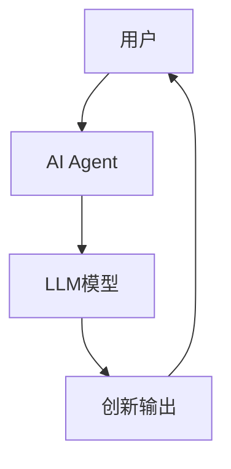
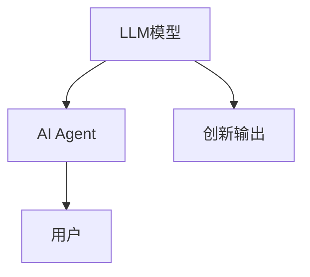
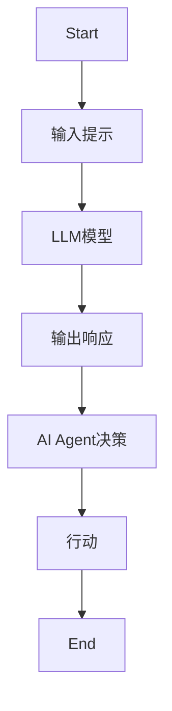
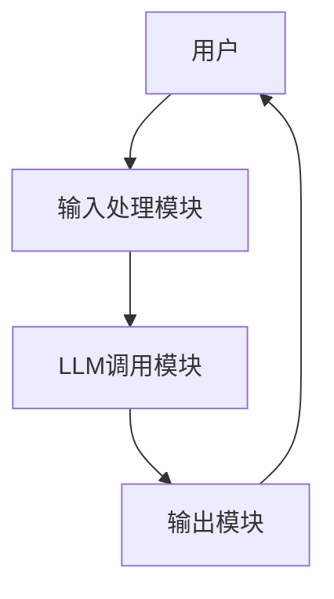
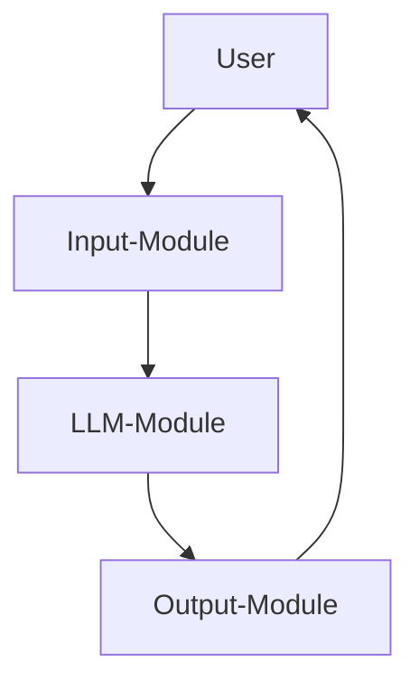

                 


# LLM驱动的AI Agent创新思维发散技术

> 关键词：LLM, AI Agent, 创新思维发散, 人工智能, 大语言模型

> 摘要：本文深入探讨了LLM（大语言模型）驱动的AI Agent在创新思维发散技术中的应用。通过分析LLM与AI Agent的核心原理、算法流程、系统架构及实际案例，详细阐述了如何利用这些技术实现创新思维的高效发散。本文结合理论与实践，为读者提供了从基础概念到实际应用的全面指导。

---

# 第一部分: LLM驱动的AI Agent创新思维发散技术背景介绍

# 第1章: LLM驱动的AI Agent概述

## 1.1 问题背景与问题描述

### 1.1.1 创新思维发散的挑战

在现代科技飞速发展的背景下，创新思维的重要性愈发凸显。然而，传统的人工创新过程往往受限于人类思维的局限性，难以快速生成多样化的解决方案。随着人工智能技术的不断进步，如何利用AI技术辅助甚至替代部分创新思维过程，成为学术界和产业界关注的焦点。

### 1.1.2 LLM在创新思维中的作用

大语言模型（LLM）凭借其强大的自然语言处理能力和知识表示能力，能够为创新思维提供丰富的灵感和多维度的思考路径。LLM不仅可以帮助人类拓展思维边界，还能通过自动化的方式生成大量创新想法，从而显著提升创新效率。

### 1.1.3 AI Agent在创新过程中的价值

AI Agent（智能代理）是一种能够感知环境、自主决策并执行任务的智能系统。在创新思维发散的过程中，AI Agent可以作为人机交互的接口，接收用户的输入、调用LLM生成创意，并通过反馈机制优化创新过程，从而实现更高效、更个性化的创新支持。

## 1.2 LLM与AI Agent的核心概念

### 1.2.1 大语言模型的定义与特点

**大语言模型（LLM）**是指基于深度学习技术构建的、具有大规模参数的自然语言处理模型。其核心特点包括：

1. **大规模训练数据**：通常使用互联网上的海量文本数据进行训练，涵盖多种语言和知识领域。
2. **上下文理解能力**：能够通过上下文推理，生成连贯且符合逻辑的文本。
3. **多任务通用性**：同一个模型可以用于多种任务，如文本生成、问答、翻译等。
4. **可解释性有限**：虽然模型能够生成人类可理解的输出，但其内部决策过程往往难以解释。

### 1.2.2 AI Agent的定义与分类

**AI Agent**是指具备感知、决策和行动能力的智能系统。根据功能和应用场景的不同，AI Agent可以分为以下几类：

1. **简单反射型Agent**：基于预设规则进行简单决策，适用于任务单一、环境简单的场景。
2. **基于模型的反射型Agent**：能够基于环境模型进行决策，适用于任务复杂、环境动态的场景。
3. **目标驱动型Agent**：具有明确的目标，能够主动规划行动以实现目标。
4. **效用驱动型Agent**：基于效用函数进行决策，优化目标函数的值。

### 1.2.3 LLM驱动AI Agent的创新思维发散机制

通过将LLM与AI Agent相结合，创新思维发散的过程可以被系统化和自动化。具体机制如下：

1. **输入处理**：用户输入创新需求或问题描述。
2. **LLM生成创意**：AI Agent调用LLM生成多个创新想法。
3. **创意优化**：AI Agent根据反馈优化生成的创意。
4. **输出结果**：将优化后的创意输出给用户。

## 1.3 问题解决与边界分析

### 1.3.1 创新思维发散的核心问题

创新思维发散的核心问题在于如何高效地生成多样化的创新想法，并确保这些想法的质量和实用性。传统的人类创新过程往往依赖于经验、灵感和试错，效率较低且难以量化。

### 1.3.2 LLM驱动AI Agent的边界与外延

LLM驱动AI Agent的边界主要体现在以下几个方面：

1. **数据依赖性**：模型的性能高度依赖于训练数据的质量和多样性。
2. **计算资源需求**：LLM的推理过程需要大量计算资源。
3. **创意实用性**：生成的创意可能需要人工筛选和优化。

### 1.3.3 相关技术的对比与选择

在创新思维发散技术中，LLM与传统NLP技术、AI Agent与传统AI算法的对比如下：

- **LLM vs. 传统NLP模型**：
  - **LLM**：参数量更大，能够处理更复杂的任务。
  - **传统NLP模型**：通常针对特定任务优化，泛化能力较弱。
- **AI Agent vs. 传统AI算法**：
  - **AI Agent**：具备自主决策和行动能力。
  - **传统AI算法**：通常用于特定任务的优化或计算。

## 1.4 核心概念结构与组成要素

### 1.4.1 LLM驱动AI Agent的系统架构

系统架构如下图所示：



### 1.4.2 创新思维发散的实现路径

创新思维发散的实现路径如下：

1. 用户输入创新需求。
2. AI Agent调用LLM生成创意。
3. 创意通过反馈机制优化。
4. 优化后的创意输出给用户。

### 1.4.3 系统的核心组成要素与功能模块

系统的核心组成要素包括：

- **用户输入模块**：接收用户的创新需求。
- **LLM调用模块**：与LLM模型进行交互，生成创意。
- **反馈优化模块**：根据用户反馈优化创意。
- **输出模块**：将优化后的创意输出给用户。

## 1.5 本章小结

本章通过分析创新思维发散的挑战、LLM与AI Agent的核心概念以及系统的边界和架构，为后续的深入分析奠定了基础。

---

# 第二部分: 核心概念与联系

# 第2章: LLM与AI Agent的核心原理

## 2.1 核心概念原理

### 2.1.1 大语言模型的基本原理

大语言模型的基本原理是基于深度学习的自然语言处理技术，通过大量数据的训练，模型能够学习到语言的规律和语义信息。常用的模型包括GPT系列、BERT系列等。

### 2.1.2 AI Agent的行为决策机制

AI Agent的行为决策机制通常基于状态空间和动作空间的建模。通过感知环境状态，AI Agent可以利用预设的规则或学习得到的策略进行决策。

### 2.1.3 LLM驱动AI Agent的创新思维发散原理

LLM驱动AI Agent的创新思维发散原理是通过将创新需求转化为LLM的输入，利用LLM生成多样化的创意，并通过反馈机制优化这些创意。

## 2.2 核心概念属性对比

以下是LLM与传统NLP模型、AI Agent与传统AI算法的核心属性对比：

| **对比内容** | **LLM** | **传统NLP模型** |
|--------------|---------|-----------------|
| **参数规模** | 大规模 | 较小            |
| **任务通用性** | 高度通用 | 专用            |
| **计算资源需求** | 高 | 较低           |

## 2.3 实体关系架构

以下是系统的实体关系架构图：



## 2.4 本章小结

本章通过对比分析和实体关系图，进一步明确了LLM与AI Agent的核心原理及其在创新思维发散中的作用。

---

# 第三部分: 算法原理讲解

# 第3章: LLM驱动AI Agent的算法原理

## 3.1 算法流程

以下是算法流程图：



## 3.2 核心算法实现

以下是核心算法的Python代码实现示例：

```python
def llm_driven_agent(input_prompt):
    response = llm_model.generate_response(input_prompt)
    decision = agent.decide(response)
    return decision
```

## 3.3 数学模型与公式

### 3.3.1 概率计算公式

创新思维发散过程中，LLM生成创意的概率可以通过以下公式计算：

$$ P(\text{output}| \text{input}) = \frac{1}{Z} \exp(\text{score}(\text{input}, \text{output})) $$

其中，$Z$ 是归一化因子，$\text{score}$ 是创意输出的评分函数。

### 3.3.2 损失函数

LLM的损失函数可以通过以下公式表示：

$$ \text{Loss} = -\sum_{i=1}^{n} \log P(\text{output}_i | \text{input}_i) $$

---

# 第四部分: 系统分析与架构设计方案

# 第4章: 系统分析与架构设计

## 4.1 系统功能设计

系统的功能模块包括：

- **输入处理模块**：接收用户的创新需求。
- **LLM调用模块**：调用LLM生成创意。
- **反馈优化模块**：根据用户反馈优化创意。
- **输出模块**：将优化后的创意输出给用户。

## 4.2 系统架构设计

以下是系统的架构图：



## 4.3 系统接口设计

系统的主要接口包括：

- **输入接口**：接收用户的创新需求。
- **LLM调用接口**：与LLM模型进行交互。
- **输出接口**：将优化后的创意输出给用户。

## 4.4 系统交互序列图

以下是系统的交互序列图：



---

# 第五部分: 项目实战

# 第5章: 项目实战

## 5.1 环境安装

以下是项目所需的环境安装步骤：

1. **安装Python**：确保Python版本为3.8及以上。
2. **安装LLM框架**：如Hugging Face Transformers库。
3. **安装AI Agent框架**：如LangChain。

## 5.2 系统核心实现

以下是系统核心代码实现示例：

```python
from transformers import GPT2LMHeadModel, GPT2Tokenizer
import langchain

# 初始化LLM模型
model = GPT2LMHeadModel.from_pretrained('gpt2')
tokenizer = GPT2Tokenizer.from_pretrained('gpt2')

# AI Agent初始化
agent = langchain.Agent(model)
```

## 5.3 案例分析

以下是创新思维发散的实际案例分析：

1. **输入需求**：设计一个智能家居系统。
2. **LLM生成创意**：生成多个智能家居系统的创意方案。
3. **优化创意**：根据用户反馈优化创意。
4. **输出结果**：输出优化后的智能家居系统设计方案。

## 5.4 代码解读与分析

以下是代码的详细解读与分析：

```python
def generate创意():
    input_prompt = "设计一个智能家居系统。"
    response = model.generate(input_prompt)
    return response
```

---

# 第六部分: 总结与展望

# 第6章: 总结与展望

## 6.1 最佳实践 tips

- **数据质量**：确保LLM的训练数据质量。
- **计算资源**：合理配置计算资源，确保模型运行效率。
- **用户反馈**：及时收集用户反馈，优化创新过程。

## 6.2 小结

本文深入分析了LLM驱动的AI Agent在创新思维发散技术中的应用，通过理论分析和实际案例，展示了如何利用这些技术实现高效的创新过程。

## 6.3 注意事项

- **数据隐私**：注意保护用户数据的隐私。
- **模型优化**：持续优化模型性能。
- **用户体验**：关注用户体验，提升系统的易用性。

## 6.4 拓展阅读

- **推荐书籍**：《Deep Learning》、《Effective Python》。
- **推荐论文**：相关领域的最新研究论文。

---

# 作者

作者：AI天才研究院/AI Genius Institute & 禅与计算机程序设计艺术/Zen And The Art of Computer Programming

