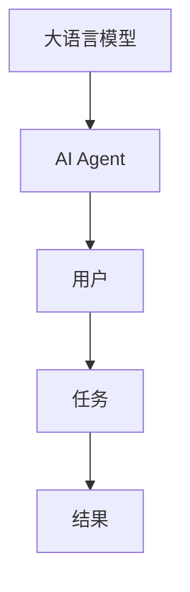
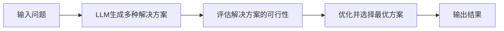
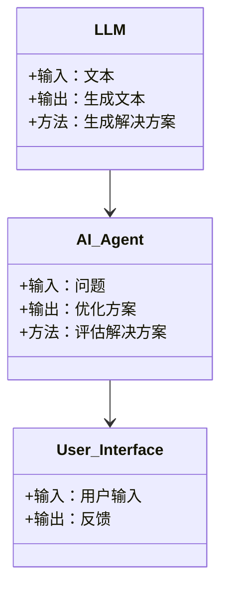

                 


# LLM驱动的AI Agent创新思维训练方法

**关键词**：LLM、AI Agent、创新思维、自然语言处理、强化学习、智能系统、人机协作

**摘要**：本文探讨如何利用大语言模型（LLM）驱动AI Agent，进行创新思维训练的方法。通过理论分析、算法设计、系统架构和实战案例，系统阐述LLM在AI Agent中的应用，强调创新思维训练的系统性和创新性。

---

## 第一部分：背景介绍

### 第1章：LLM与AI Agent概述  
#### 1.1 问题背景  
- **1.1.1 当前AI技术的发展趋势**  
  随着深度学习和自然语言处理技术的快速发展，AI技术在各个领域的应用日益广泛。  
  **技术背景**：大语言模型（LLM）如GPT-3、GPT-4的出现，使得AI能够处理复杂的自然语言任务，具备生成、推理和对话能力。  

- **1.1.2 大语言模型（LLM）的崛起**  
  LLM通过大规模数据训练，掌握了丰富的知识和语言模式，能够生成高质量的文本内容。  
  **关键点**：LLM的出现为AI Agent提供了强大的自然语言处理能力，使其能够更好地理解和生成人类语言。  

- **1.1.3 AI Agent的概念与目标**  
  AI Agent是一种智能体，能够在环境中感知、推理、决策并执行任务。  
  **目标**：通过LLM驱动，AI Agent能够具备创新思维能力，解决复杂问题。  

#### 1.2 问题描述  
- **1.2.1 LLM与AI Agent结合的必要性**  
  AI Agent需要具备高效的自然语言处理能力，以实现与人类的有效交互和任务完成。  
  **问题**：传统的AI Agent在处理复杂语言任务时，往往依赖预定义规则，缺乏灵活性和创新性。  

- **1.2.2 创新思维训练的核心问题**  
  创新思维训练需要AI Agent能够生成多样化的想法，突破常规思维模式。  
  **挑战**：如何让AI Agent在生成过程中具备创造性，同时保持逻辑性和合理性。  

- **1.2.3 LLM驱动AI Agent的潜力与挑战**  
  LLM为AI Agent提供了强大的生成能力和知识储备，但如何有效结合并优化，仍需深入研究。  

#### 1.3 问题解决  
- **1.3.1 LLM如何赋能AI Agent**  
  通过LLM，AI Agent能够理解上下文，生成相关反馈，具备更强的交互能力。  
  **方法**：将LLM作为AI Agent的核心模块，赋予其语言理解和生成能力。  

- **1.3.2 创新思维训练的实现路径**  
  利用LLM的生成能力，设计创新思维训练的框架和流程。  
  **步骤**：输入问题，LLM生成多种解决方案，AI Agent进行评估和优化。  

- **1.3.3 LLM驱动AI Agent的具体应用场景**  
  在教育、设计、医疗等领域，AI Agent辅助人类进行创新性思考和决策。  

#### 1.4 边界与外延  
- **1.4.1 LLM驱动AI Agent的边界条件**  
  限定于特定领域或任务，避免超出模型能力范围。  
  **限制**：LLM驱动的AI Agent在处理复杂任务时，可能受限于训练数据和模型能力。  

- **1.4.2 创新思维训练的范围界定**  
  突破传统思维模式，生成多样化的解决方案。  
  **范围**：涵盖问题分析、方案生成、评估优化等环节。  

- **1.4.3 相关技术的对比与区分**  
  区分LLM和传统NLP技术，明确AI Agent与传统智能体的区别。  

---

## 第二部分：核心概念与联系

### 第2章：核心概念与联系  
#### 2.1 核心概念原理  
- **2.1.1 LLM的核心原理**  
  基于Transformer架构，通过自注意力机制和前馈网络生成文本。  
  **公式**：  
  $$ \text{Attention}(Q,K,V) = \text{softmax}(\frac{QK^T}{\sqrt{d_k}})V $$  

- **2.1.2 AI Agent的核心原理**  
  通过感知环境、推理、决策和执行，实现目标。  

#### 2.2 概念属性特征对比  
| 概念    | 属性              | 特征对比             |
|---------|-------------------|----------------------|
| LLM     | 数据驱动          | 强调大规模数据训练    |
|         | 自然语言处理      | 具备生成和理解能力    |
| AI Agent| 智能交互          | 能够自主决策和执行    |
|         | 环境适应性        | 能够适应不同场景      |

#### 2.3 ER实体关系图  


---

## 第三部分：算法原理讲解

### 第3章：算法原理  
#### 3.1 算法流程图  


#### 3.2 Python代码实现  
```python
def llm_driven_agent(input):
    # 调用LLM生成多种解决方案
    solutions = llm.generate_solutions(input)
    # 评估解决方案
    for solution in solutions:
        if is_feasible(solution):
            selected = solution
            break
    return selected
```

#### 3.3 数学模型与公式  
- **Transformer模型**  
  $$ \text{Attention}(Q,K,V) = \text{softmax}(\frac{QK^T}{\sqrt{d_k}})V $$  
- **强化学习**  
  $$ \text{损失函数} = -\sum \text{log}(P(a|s)) \cdot r(s,a) $$  

---

## 第四部分：系统分析与架构设计

### 第4章：系统设计  
#### 4.1 项目背景  
- 开发一个基于LLM的AI Agent，用于创新思维训练。  

#### 4.2 系统功能设计  


#### 4.3 系统架构设计  


#### 4.4 接口设计  
- **输入接口**：用户输入问题。  
- **输出接口**：返回优化方案。  

#### 4.5 交互设计  
```mermaid
sequenceDiagram
    User → AI_Agent: 提交问题
    AI_Agent → LLM: 生成解决方案
    LLM → AI_Agent: 返回解决方案
    AI_Agent → User: 输出优化方案
```

---

## 第五部分：项目实战

### 第5章：项目实战  
#### 5.1 环境安装  
- Python 3.8+  
- 必要库：Hugging Face Transformers库。  

#### 5.2 核心代码实现  
```python
from transformers import GPT2LMHeadModel, GPT2Tokenizer

class AI_Agent:
    def __init__(self):
        self.model = GPT2LMHeadModel.from_pretrained('gpt2')
        self.tokenizer = GPT2Tokenizer.from_pretrained('gpt2')

    def generate_solutions(self, input_text):
        inputs = self.tokenizer(input_text, return_tensors='pt')
        outputs = self.model.generate(**inputs, max_length=50)
        return [self.tokenizer.decode(output[0], skip_special_tokens=True) for output in outputs]

    def assess(self, solution):
        # 简单的评估方法，根据关键词匹配
        keywords = ['创新', '方案', '优化']
        score = sum(1 for kw in keywords if kw in solution)
        return score
```

#### 5.3 代码解读  
- 初始化模型和分词器。  
- `generate_solutions`方法：生成多个解决方案。  
- `assess`方法：评估解决方案的可行性。  

#### 5.4 实际案例分析  
**案例**：设计一个创新的智能家居系统。  
**输入**：智能家居系统设计  
**LLM生成**：1. 基于IoT的智能家居控制中心；2. 多设备联动的家庭自动化系统；3. 基于AI的智能家电协调平台。  
**评估与优化**：选择方案2，优化设备联动逻辑。  

#### 5.5 项目小结  
- 成功实现LLM驱动的AI Agent，具备生成和评估能力。  
- 评估方法简单，未来可优化为更复杂的评估机制。  

---

## 第六部分：应用案例

### 第6章：应用案例  
#### 6.1 智能助手领域  
- **应用**：帮助用户生成创意解决方案。  
- **优势**：提升效率，提供多样化思路。  

#### 6.2 数据分析领域  
- **应用**：辅助数据分析师生成分析报告。  
- **优势**：提供数据可视化和分析建议。  

#### 6.3 内容创作领域  
- **应用**：协助内容创作者生成创意内容。  
- **优势**：激发创作灵感，提高效率。  

---

## 第七部分：总结

### 第7章：总结  
#### 7.1 全文回顾  
- 介绍了LLM驱动AI Agent的背景、核心概念、算法原理和系统设计。  
- 提供了项目实战和应用案例，展示了方法的实际价值。  

#### 7.2 创新思维训练的重要性  
- 创新思维是AI Agent的核心能力，能够帮助人类解决复杂问题。  

#### 7.3 注意事项  
- LLM驱动的AI Agent仍需不断优化，特别是在评估机制和模型能力方面。  
- 需要注意数据隐私和模型伦理问题。  

#### 7.4 拓展阅读  
- 推荐阅读《The Art of Computer Programming》、《Large Language Models: A Survey》等书籍。  

---

**作者：AI天才研究院 & Zen And The Art of Computer Programming**

