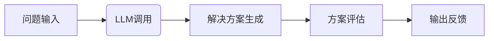
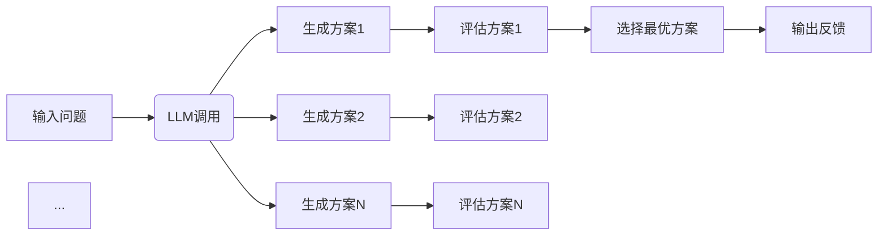
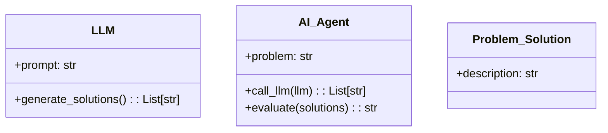
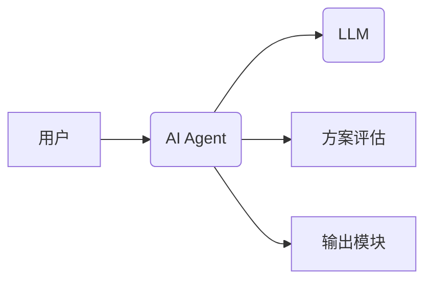
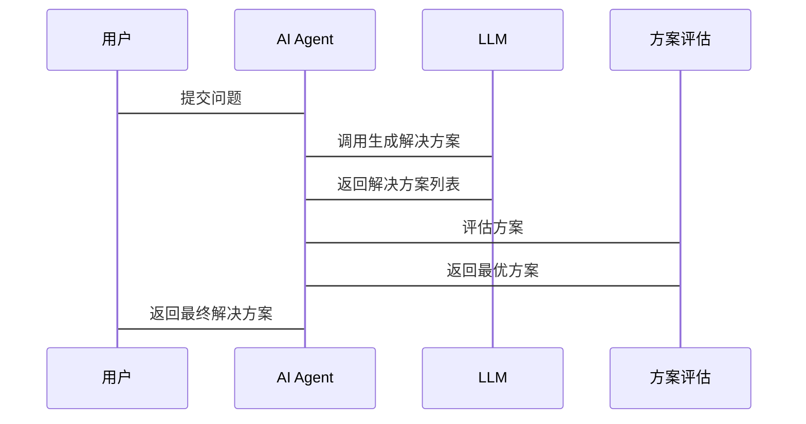

                 


# LLM驱动的AI Agent创造性问题解决框架

## 关键词：LLM，AI Agent，创造性问题解决，人工智能，大语言模型

## 摘要：  
本文介绍了一种基于LLM（大语言模型）驱动的AI Agent创造性问题解决框架，分析了该框架的核心原理、算法流程、系统架构及其实现方式。通过详细的技术分析和实际案例，展示了如何利用LLM和AI Agent的结合，实现高效的创造性问题解决。

---

# 第一部分: LLM驱动的AI Agent创造性问题解决框架概述

## 第1章: 问题背景与概念介绍

### 1.1 问题背景
#### 1.1.1 当前AI技术的发展现状  
人工智能技术近年来取得了飞速发展，尤其是大语言模型（LLM）和AI Agent技术的结合，为创造性问题解决提供了新的可能性。传统的AI系统在处理复杂、创造性的问题时，往往受限于固定的规则和数据，难以灵活应对多样化的场景。

#### 1.1.2 创造性问题解决的挑战  
创造性问题解决的核心在于生成创新性的解决方案，这需要AI系统具备灵活性、适应性和创造性。然而，传统的基于规则的AI系统难以应对高度不确定性和复杂性的问题。

#### 1.1.3 LLM与AI Agent的结合优势  
大语言模型（LLM）具有强大的语言理解和生成能力，而AI Agent则具备自主决策和行动的能力。两者的结合，使得AI系统能够更高效地处理复杂问题，并生成创新性的解决方案。

### 1.2 问题描述
#### 1.2.1 创造性问题解决的核心要素  
创造性问题解决需要具备以下核心要素：明确问题目标、理解问题背景、生成创新性解决方案、评估解决方案的可行性。

#### 1.2.2 LLM在创造性问题解决中的作用  
LLM能够提供丰富的语言理解和生成能力，帮助AI Agent更好地理解问题背景，并生成多样化的解决方案。

#### 1.2.3 AI Agent在问题解决中的角色  
AI Agent作为问题解决的核心主体，负责协调LLM和其他工具，制定解决方案，并执行相关任务。

### 1.3 问题解决框架
#### 1.3.1 框架的基本组成  
该框架主要包括问题输入、LLM调用、解决方案生成、方案评估和输出反馈五个核心模块。

#### 1.3.2 框架的核心流程  
1. 输入问题：AI Agent接收用户提供的问题描述。
2. 分析问题：LLM对问题进行理解和分析，提取关键信息。
3. 生成解决方案：LLM根据分析结果，生成多个创新性解决方案。
4. 评估方案：AI Agent对生成的方案进行评估，选择最优解。
5. 输出反馈：AI Agent将最终解决方案反馈给用户。

#### 1.3.3 框架的适用场景  
适用于需要创造性思维和多样化解决方案的场景，如商业策略制定、创意设计、复杂问题诊断等。

### 1.4 边界与外延
#### 1.4.1 框架的边界  
该框架主要用于创造性问题解决，不涉及具体执行层面的细节。

#### 1.4.2 框架的外延  
框架可以与其他AI技术（如视觉识别、知识图谱）结合，扩展其应用范围。

#### 1.4.3 框架与其他技术的关系  
该框架依赖于LLM和AI Agent技术，同时可以与其他AI技术协同工作。

### 1.5 概念结构与核心要素
#### 1.5.1 概念结构图  


#### 1.5.2 核心要素分析  
- **问题输入**：用户提供的问题描述和相关背景信息。
- **LLM调用**：AI Agent调用LLM进行问题理解和分析。
- **解决方案生成**：LLM生成多样化的解决方案。
- **方案评估**：AI Agent对生成的方案进行评估和选择。
- **输出反馈**：将最终解决方案反馈给用户。

#### 1.5.3 要素之间的关系  
各要素之间相互依赖，形成一个完整的流程。问题输入驱动LLM调用，生成解决方案后，通过评估和反馈形成闭环。

### 1.6 本章小结  
本章介绍了基于LLM的AI Agent创造性问题解决框架的背景、核心要素和整体结构，为后续章节的深入分析奠定了基础。

---

## 第2章: LLM与AI Agent的核心概念

### 2.1 LLM的基本原理
#### 2.1.1 大语言模型的定义  
LLM是一种基于深度学习的自然语言处理模型，能够理解和生成人类语言。

#### 2.1.2 LLM的核心特点  
- 大规模预训练
- 强大的语言理解和生成能力
- 基于概率的生成模型

#### 2.1.3 LLM的训练机制  
基于大量的文本数据进行预训练，采用自监督学习方法，通过生成任务优化模型参数。

### 2.2 AI Agent的基本原理
#### 2.2.1 AI Agent的定义  
AI Agent是一种能够感知环境、自主决策并执行任务的智能体。

#### 2.2.2 AI Agent的类型  
- **反应式AI Agent**：基于当前感知做出反应。
- **认知式AI Agent**：具备推理和规划能力。

#### 2.2.3 AI Agent的行为模式  
- **感知**：通过传感器或API获取环境信息。
- **决策**：基于感知信息进行推理和决策。
- **执行**：根据决策执行相应的动作。

### 2.3 LLM与AI Agent的结合
#### 2.3.1 LLM驱动AI Agent的机制  
AI Agent通过调用LLM进行问题理解和生成解决方案。

#### 2.3.2 LLM与AI Agent的协同工作  
AI Agent利用LLM的能力，提升自身的理解和生成能力，从而更好地解决问题。

#### 2.3.3 LLM在AI Agent中的应用  
- **问题理解**：LLM帮助AI Agent理解用户需求。
- **方案生成**：LLM生成创新性解决方案。
- **反馈优化**：基于LLM的反馈优化解决方案。

### 2.4 核心概念对比
#### 2.4.1 LLM与传统NLP模型的对比  
| 特性       | LLM                     | 传统NLP模型         |
|------------|--------------------------|----------------------|
| 模型规模    | 大规模参数               | 较小规模参数         |
| 任务能力    | 多任务通用                | 专注于特定任务       |
| 模型结构    | 基于Transformer架构       | 可能基于其他结构     |

#### 2.4.2 AI Agent与传统AI系统的对比  
| 特性       | AI Agent                 | 传统AI系统           |
|------------|--------------------------|----------------------|
| 自主性      | 高度自主                 | 较低自主             |
| 适应性      | 强大的环境适应能力       | 较弱的环境适应能力   |
| 任务处理    | 复杂任务处理             | 简单任务处理         |

#### 2.4.3 LLM驱动AI Agent的独特性  
LLM驱动的AI Agent结合了大语言模型的强大生成能力和AI Agent的自主决策能力，能够在复杂场景下生成创新性解决方案。

### 2.5 本章小结  
本章详细分析了LLM和AI Agent的核心概念和特点，以及它们结合的独特优势，为后续章节的算法和系统设计奠定了基础。

---

## 第3章: LLM驱动AI Agent的算法原理

### 3.1 算法概述
#### 3.1.1 算法的基本流程  
1. 接收问题输入。
2. 分析问题并调用LLM生成解决方案。
3. 对生成的方案进行评估和优化。
4. 输出最终解决方案。

#### 3.1.2 算法的核心步骤  
- **问题输入处理**：解析用户提供的问题描述。
- **LLM调用**：将问题输入LLM，生成多种解决方案。
- **方案评估**：基于预设的评估指标，选择最优方案。
- **结果输出**：将最终方案反馈给用户。

#### 3.1.3 算法的优化方向  
- 提高LLM的生成多样性。
- 提升方案评估的准确性。
- 优化AI Agent的决策逻辑。

### 3.2 算法详细解析
#### 3.2.1 输入处理  
输入问题需要经过清洗和解析，提取关键信息。

#### 3.2.2 模型调用  
AI Agent调用LLM API，生成多种解决方案。

#### 3.2.3 输出处理  
根据评估结果，选择最优方案并进行格式化输出。

### 3.3 算法实现



#### 3.3.1 代码实现  
```python
def llm_agent(problem):
    # 调用LLM生成解决方案
    solutions = llm.generate_solutions(problem)
    # 评估方案
    scores = evaluate_solutions(solutions)
    # 选择最优方案
    best_solution = max(solutions, key=lambda x: scores[x])
    return best_solution
```

#### 3.3.2 数学模型与公式  
评估方案的得分公式：
$$ score = \sum_{i=1}^{n} w_i \cdot f_i(s) $$
其中，$w_i$ 是特征的重要性权重，$f_i(s)$ 是第i个特征的函数。

### 3.4 本章小结  
本章详细介绍了基于LLM的AI Agent算法原理，包括算法流程、核心步骤和实现细节。

---

## 第4章: 系统分析与架构设计

### 4.1 问题场景介绍
#### 4.1.1 项目介绍  
本项目旨在开发一个基于LLM的AI Agent，用于创造性问题解决。

#### 4.1.2 问题场景  
在商业咨询、创意设计等领域，用户需要AI帮助生成创新性解决方案。

### 4.2 系统功能设计
#### 4.2.1 功能模块  
- **输入模块**：接收用户输入的问题描述。
- **LLM调用模块**：调用LLM生成解决方案。
- **方案评估模块**：评估生成的方案。
- **输出模块**：反馈最终解决方案。

#### 4.2.2 领域模型类图  


### 4.3 系统架构设计
#### 4.3.1 系统架构图  


#### 4.3.2 接口设计  
- 用户接口：接收问题描述。
- LLM接口：生成解决方案。
- 评估接口：评估方案并返回最优解。

#### 4.3.3 交互序列图  


### 4.4 本章小结  
本章详细分析了系统的功能模块、架构设计和交互流程，为后续的实现提供了指导。

---

## 第5章: 项目实战

### 5.1 环境安装
#### 5.1.1 安装Python  
确保安装Python 3.8及以上版本。

#### 5.1.2 安装依赖库  
安装必要的库，如`transformers`、`openai`等。

### 5.2 系统核心实现
#### 5.2.1 核心代码  
```python
from transformers import pipeline
import openai

class LLM_Agent:
    def __init__(self):
        self.llm = pipeline('text-generation', model='gpt2')
    
    def generate_solutions(self, problem):
        # 调用LLM生成解决方案
        return self.llm(problem, max_length=50, num_return_sequences=5)
    
    def evaluate_solutions(self, solutions):
        # 简单的评估方法：选择最短的解决方案
        return min(solutions, key=lambda x: len(x))
    
    def solve_problem(self, problem):
        solutions = self.generate_solutions(problem)
        best_solution = self.evaluate_solutions(solutions)
        return best_solution
```

#### 5.2.2 代码解读  
- `LLM_Agent`类初始化时加载LLM模型。
- `generate_solutions`方法生成多个解决方案。
- `evaluate_solutions`方法评估并选择最优方案。

#### 5.2.3 应用案例分析  
假设用户提出的问题是“如何提升公司员工的创造力？”，AI Agent会生成多个解决方案，如“组织创意培训”、“建立创新激励机制”等，并选择最优方案进行反馈。

### 5.3 本章小结  
本章通过实际案例展示了如何实现基于LLM的AI Agent，帮助读者更好地理解和应用相关技术。

---

## 第6章: 最佳实践、小结、注意事项与拓展阅读

### 6.1 最佳实践  
- **模型选择**：根据具体需求选择合适的LLM模型。
- **评估指标**：设计合理的评估指标以提高方案选择的准确性。
- **错误处理**：确保系统具备良好的容错机制，避免因模型调用失败导致整体流程中断。

### 6.2 小结  
本文详细介绍了基于LLM的AI Agent创造性问题解决框架，从理论到实践，全面分析了其核心原理、系统架构和实现方法。

### 6.3 注意事项  
- **数据隐私**：确保处理的数据符合相关隐私保护法规。
- **模型调优**：根据实际需求对模型进行优化和调整。
- **用户反馈**：收集用户反馈，持续改进系统性能。

### 6.4 拓展阅读  
- **推荐书籍**：《Large Language Models in AI》
- **推荐论文**：《The Role of AI Agents in Creative Problem Solving》
- **在线课程**：推荐相关在线课程和资源，帮助读者深入学习。

---

## 作者：AI天才研究院 & 禅与计算机程序设计艺术

---

通过以上内容，我们详细分析了基于LLM的AI Agent创造性问题解决框架，从理论到实践，全面探讨了其核心原理和实现方法。希望本文能够为相关领域的研究和应用提供有价值的参考。

