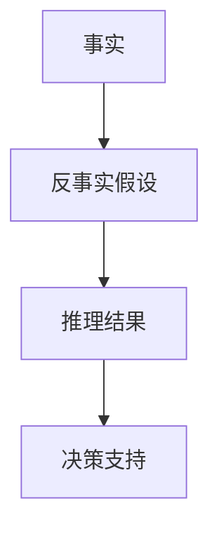
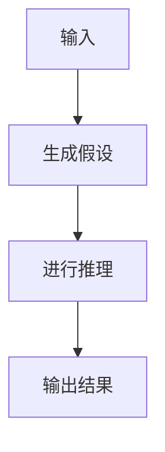
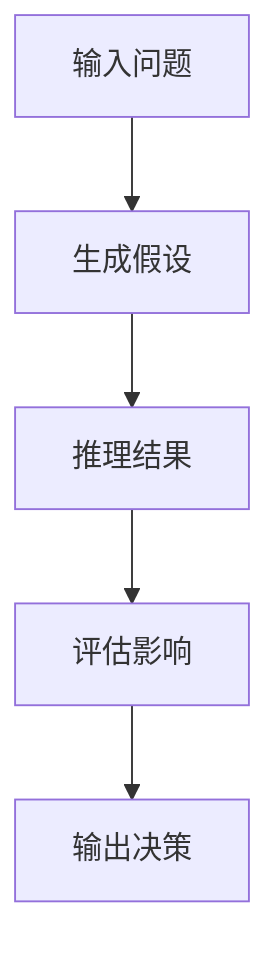
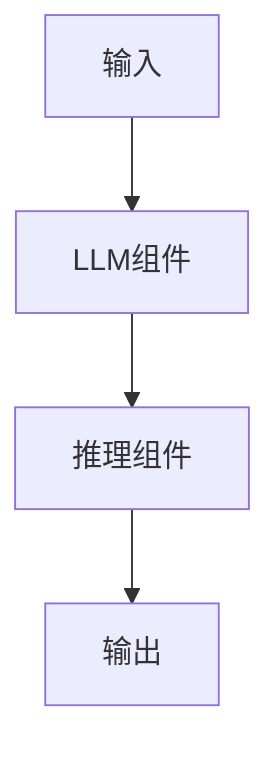
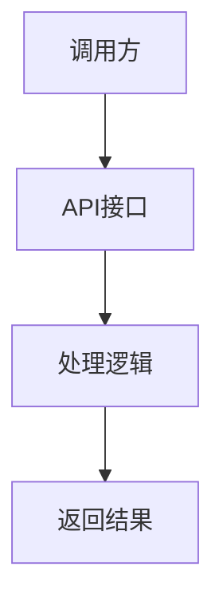

                 


# 第一部分: LLM驱动的AI Agent反事实推理机制概述

# 第1章: LLM驱动的AI Agent反事实推理机制概述

## 1.1 问题背景与挑战
### 1.1.1 反事实推理的定义与背景
反事实推理是指在假设某个与事实相反的情况下，推导出可能的结果。在AI Agent中，这种推理能力可以帮助智能体更好地理解和处理不确定性，做出更优的决策。

### 1.1.2 LLM在AI Agent中的作用
大语言模型（LLM）通过强大的自然语言处理能力，能够生成丰富的上下文信息，为AI Agent提供多维度的支持，特别是在反事实推理中，LLM可以生成多种假设场景，帮助智能体进行推理。

### 1.1.3 反事实推理在AI Agent中的应用价值
通过反事实推理，AI Agent可以在复杂环境中模拟不同的决策结果，评估其潜在影响，从而做出更稳健的决策。这种能力在金融、医疗等领域具有重要应用价值。

## 1.2 问题描述与目标
### 1.2.1 反事实推理的核心问题
反事实推理的核心问题是如何在假设条件下，准确推导出可能的结果，并评估这些结果对实际决策的影响。

### 1.2.2 LLM驱动的AI Agent的目标
目标是通过LLM生成多种假设场景，并利用这些场景进行推理，帮助AI Agent做出更优的决策。

### 1.2.3 反事实推理与AI Agent的结合意义
结合反事实推理，AI Agent能够更好地处理不确定性，提高决策的可靠性和准确性，增强系统的适应性。

## 1.3 问题解决与边界
### 1.3.1 反事实推理的解决思路
通过生成假设场景，模拟决策结果，并评估这些结果的影响。

### 1.3.2 LLM驱动的AI Agent的实现边界
边界包括数据来源、计算能力限制、场景复杂度等因素，这些因素会影响反事实推理的范围和效果。

### 1.3.3 反事实推理的外延与限制
反事实推理的外延涉及多种应用场景，但其限制在于假设场景的准确性、推理过程的复杂性以及计算资源的限制。

## 1.4 概念结构与核心要素
### 1.4.1 反事实推理机制的核心要素
包括假设生成、推理过程、结果评估等关键环节。

### 1.4.2 LLM在AI Agent中的角色
作为信息生成和处理的核心，LLM为反事实推理提供丰富的假设场景和上下文信息。

### 1.4.3 反事实推理与AI Agent的交互流程
从假设生成到结果评估，整个流程需要AI Agent与LLM进行高效协作。

## 1.5 本章小结
本章通过介绍反事实推理的基本概念、LLM在AI Agent中的作用，以及两者的结合意义，为后续章节奠定了基础。

---

# 第2章: 反事实推理机制的核心概念与联系

## 2.1 反事实推理机制的原理
### 2.1.1 反事实推理的基本原理
反事实推理通过生成与事实相反的假设，推导其可能的结果。其关键在于假设的生成和结果的推导。

### 2.1.2 LLM在反事实推理中的作用
LLM能够生成丰富的假设场景，并通过自然语言处理能力，帮助推理过程更加准确和多样化。

### 2.1.3 反事实推理与AI Agent的结合
通过结合AI Agent的决策能力，反事实推理能够为智能体提供更全面的决策支持。

## 2.2 核心概念对比
### 2.2.1 反事实推理与事实推理的对比
事实推理基于现有数据，而反事实推理基于假设场景，两者在数据来源和推理目标上有显著差异。

### 2.2.2 LLM与传统AI推理方式的对比
传统AI推理依赖于规则和逻辑推理，而LLM则通过生成文本进行推理，具有更强的灵活性和创造性。

### 2.2.3 反事实推理在不同场景中的应用
在金融、医疗等领域，反事实推理能够提供独特的决策支持，帮助应对复杂问题。

## 2.3 实体关系图与流程图
### 2.3.1 反事实推理机制的实体关系图

### 2.3.2 反事实推理的流程图


## 2.4 本章小结
通过对比和分析，本章详细阐述了反事实推理的核心概念及其在AI Agent中的应用，为后续章节的深入分析提供了理论基础。

---

# 第3章: LLM驱动的反事实推理算法原理

## 3.1 算法原理
### 3.1.1 基于LLM的反事实推理算法
算法通过生成多个假设场景，并对每个场景进行推理，评估其对决策的影响。

### 3.1.2 算法流程图


## 3.2 数学模型与公式
### 3.2.1 假设生成的概率模型
假设生成的概率模型可以表示为：
$$ P(假设|输入) $$

### 3.2.2 推理结果的评估模型
推理结果的评估可以通过加权平均的方式进行：
$$ \text{评估结果} = \sum_{i=1}^{n} w_i \cdot r_i $$
其中，$w_i$是权重，$r_i$是推理结果。

## 3.3 实现细节与优化
### 3.3.1 假设生成的优化
通过优化LLM的生成策略，可以提高假设的质量和多样性。

### 3.3.2 推理过程的优化
采用分布式计算和并行推理，提高处理效率。

## 3.4 实际案例分析
### 3.4.1 案例一：金融投资决策
通过生成不同的市场假设，评估投资决策的风险和收益。

### 3.4.2 案例二：医疗诊断
生成假设诊断，评估不同诊断方案的效果。

## 3.5 本章小结
本章通过详细讲解算法原理和数学模型，结合实际案例，展示了如何利用LLM实现高效的反事实推理。

---

# 第4章: LLM驱动的AI Agent系统架构与设计

## 4.1 系统架构设计
### 4.1.1 分层架构
系统分为输入层、推理层和输出层，每一层负责不同的功能。

### 4.1.2 组件交互图


## 4.2 接口设计
### 4.2.1 API接口
系统提供标准的API接口，方便与其他系统集成。

### 4.2.2 接口交互流程


## 4.3 交互流程设计
### 4.3.1 用户输入
用户输入问题，系统生成假设场景。

### 4.3.2 系统推理
系统根据假设场景进行推理，生成决策建议。

## 4.4 本章小结
本章通过系统架构设计和接口设计，展示了如何实现高效的LLM驱动的AI Agent。

---

# 第5章: 项目实战与实现

## 5.1 项目环境搭建
### 5.1.1 环境要求
安装必要的依赖库和工具，如Python、LLM框架等。

### 5.1.2 安装步骤
```bash
pip install transformers
pip install mermaid
```

## 5.2 核心代码实现
### 5.2.1 假设生成代码
```python
def generate_hypotheses(llm, input):
    return llm.generate(input)
```

### 5.2.2 推理与评估代码
```python
def infer_and_evaluate(llm, hypotheses):
    results = []
    for hypothesis in hypotheses:
        result = llm.infer(hypothesis)
        results.append(result)
    return results
```

## 5.3 案例分析与解读
### 5.3.1 金融投资案例
通过生成不同的市场假设，评估投资策略的效果。

### 5.3.2 医疗诊断案例
生成假设诊断，评估不同诊断方案的优劣。

## 5.4 项目总结
### 5.4.1 成果总结
总结项目实现的成果和经验。

### 5.4.2 问题与改进
分析项目中存在的问题，并提出改进建议。

## 5.5 本章小结
本章通过实际项目实现，展示了如何利用LLM驱动的AI Agent进行反事实推理。

---

# 第6章: 最佳实践与小结

## 6.1 总结
### 6.1.1 核心内容回顾
回顾本书的核心内容，包括反事实推理的基本原理、算法实现、系统设计和项目实战。

### 6.1.2 关键点总结
总结反事实推理的关键点，包括假设生成、推理过程、结果评估等。

## 6.2 实践中的注意事项
### 6.2.1 数据质量的重要性
数据质量直接影响假设生成和推理结果的准确性。

### 6.2.2 算法选择的注意事项
选择合适的算法和模型，确保推理的效率和准确性。

## 6.3 未来展望
### 6.3.1 技术发展趋势
展望反事实推理技术的发展趋势，包括更强大的LLM、更高效的推理算法等。

### 6.3.2 应用场景拓展
探讨反事实推理在更多领域的应用潜力。

## 6.4 本章小结
本章通过总结和展望，为读者提供了进一步学习和实践的方向。

---

# 附录: 工具与资源

## 7.1 术语表
- 反事实推理：在假设条件下推导可能结果的过程。
- LLM：大语言模型，用于生成文本和上下文信息。

## 7.2 工具列表
- LLM框架：如GPT、BERT等。
- 可视化工具：如Mermaid，用于绘制流程图和实体关系图。

---

# 作者：AI天才研究院/AI Genius Institute & 禅与计算机程序设计艺术 /Zen And The Art of Computer Programming

---

**摘要：**  
本文深入探讨了LLM驱动的AI Agent反事实推理机制的核心概念、算法原理和系统架构。通过详细分析反事实推理的原理和实现方法，结合实际案例，展示了如何利用LLM提升AI Agent的决策能力。文章还提供了系统设计和项目实战的详细步骤，帮助读者更好地理解和应用相关技术。

