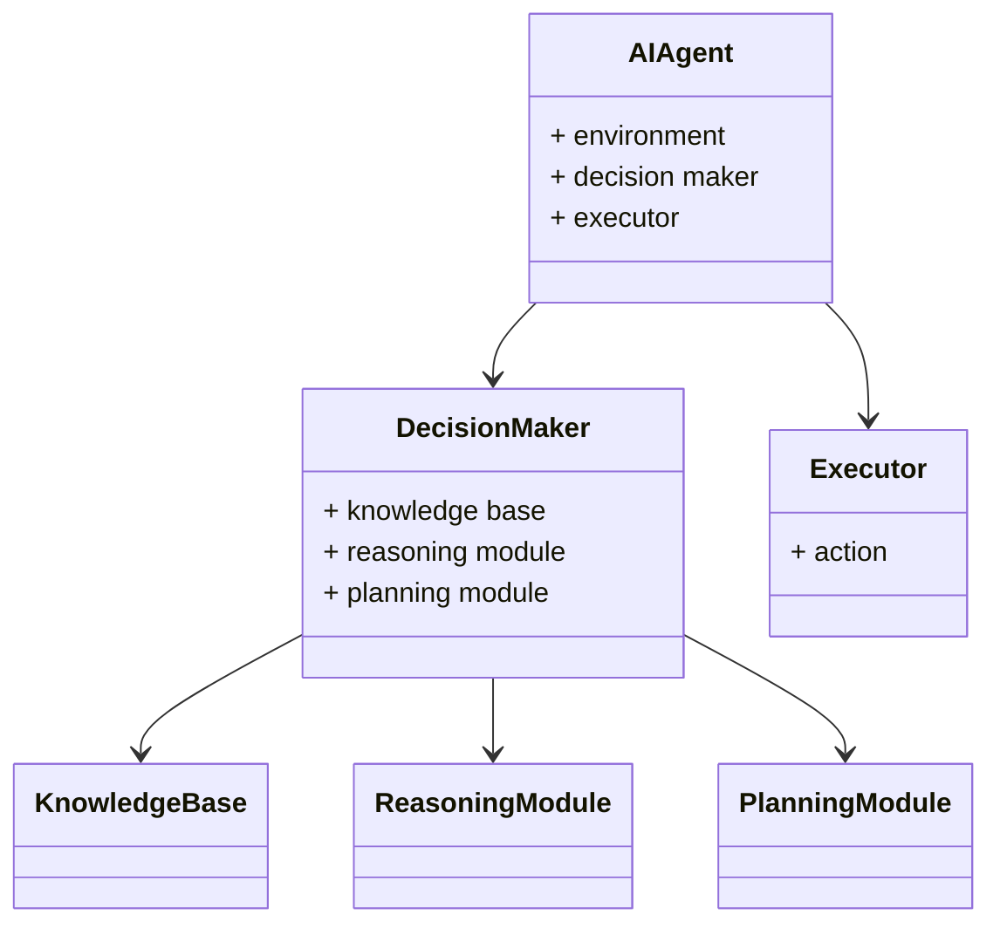
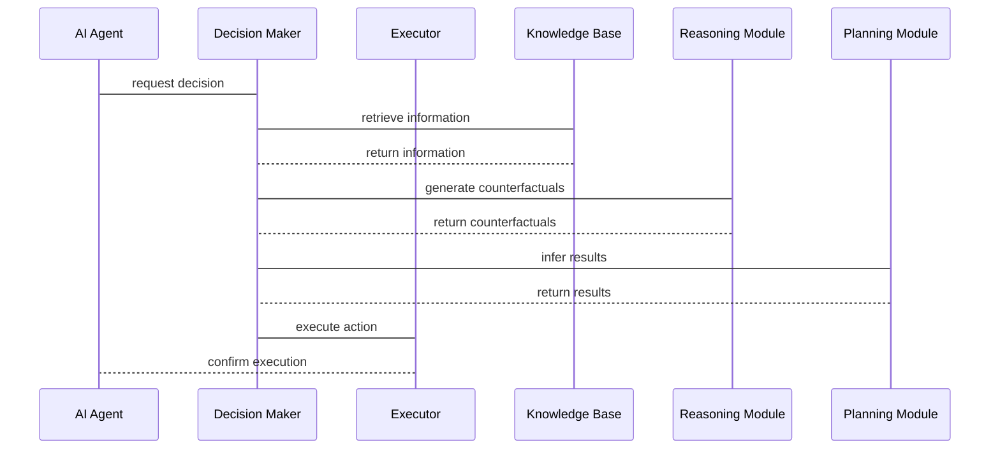

                 


# LLM驱动的AI Agent反事实推理能力

> **关键词**: 反事实推理, AI Agent, 大语言模型, 生成式模型, 推理算法

> **摘要**: 本文深入探讨了LLM驱动的AI Agent反事实推理能力，分析了反事实推理的核心概念、算法原理及其在AI Agent中的实现。通过系统设计与项目实战，展示了如何构建具备反事实推理能力的AI Agent，并总结了最佳实践与未来发展。

---

# 第一部分: 反事实推理与AI Agent的背景介绍

## 第1章: 反事实推理与AI Agent的背景介绍

### 1.1 问题背景与定义

#### 1.1.1 反事实推理的定义与核心概念
反事实推理是一种推理方式，它基于“如果我做某事，结果会怎样”的假设，推导出与现实不符的可能结果。这种推理能力是AI Agent在复杂环境中做出决策的关键。

#### 1.1.2 AI Agent的基本概念与功能
AI Agent（智能体）是能够感知环境、执行任务并做出决策的实体。它需要具备理解、推理和行动的能力，以适应动态环境。

#### 1.1.3 反事实推理在AI Agent中的作用
反事实推理帮助AI Agent预测不同选择的结果，从而做出更优化的决策。例如，在金融领域，AI Agent可以通过反事实推理评估不同的投资策略。

---

### 1.2 反事实推理的特点与优势

#### 1.2.1 反事实推理的独特性
反事实推理不同于事实推理，它关注的是假设性结果，而非现实中的结果。这种独特性使其能够帮助AI Agent探索更多可能性。

#### 1.2.2 反事实推理在AI Agent中的应用价值
反事实推理使AI Agent能够模拟多种决策路径，评估潜在风险，从而做出更稳健的决策。

#### 1.2.3 反事实推理的局限性与边界
反事实推理依赖于假设，其结果可能存在不确定性。此外，其应用范围受限于假设条件的合理性。

---

### 1.3 问题描述与解决方案

#### 1.3.1 反事实推理的核心问题
如何基于LLM生成反事实条件句，并设计算法进行推理。

#### 1.3.2 AI Agent反事实推理能力的构建目标
构建一种能够生成反事实条件句并进行推理的AI Agent。

#### 1.3.3 解决方案的框架与思路
结合生成式模型和推理算法，设计一种能够生成反事实条件句并进行推理的框架。

---

### 1.4 反事实推理能力的边界与外延

#### 1.4.1 反事实推理的适用场景
适用于需要模拟多种决策路径的领域，如金融、医疗等。

#### 1.4.2 反事实推理的限制条件
假设条件的合理性、数据的充分性等。

#### 1.4.3 反事实推理与其他推理方式的对比
与事实推理、归纳推理等的对比，突出反事实推理的独特性。

---

## 1.5 本章小结

本章介绍了反事实推理的基本概念、特点及其在AI Agent中的作用，明确了构建反事实推理能力的目标和方法。

---

# 第2章: 反事实推理的核心概念与原理

## 2.1 反事实推理的原理

### 2.1.1 反事实条件句的逻辑结构

反事实条件句通常采用“如果A，那么B”的形式，其中A是与现实不符的条件，B是基于A的假设结果。

---

### 2.1.2 反事实推理的逻辑框架

1. **生成反事实条件句**: 基于当前环境生成假设条件。
2. **推理结果**: 基于反事实条件句推导出可能结果。

---

### 2.1.3 反事实推理与可解释性AI的关系

反事实推理增强了AI的可解释性，因为它能够明确展示决策背后的假设。

---

## 2.2 反事实推理的核心要素

### 2.2.1 反事实条件句的构成

- **条件部分**: 假设的条件。
- **结论部分**: 基于条件的推导结果。

---

### 2.2.2 反事实推理的逻辑关系

- **条件与结果的关系**: 条件是结果的前提。
- **假设的合理性**: 假设越合理，推导越准确。

---

## 2.3 反事实推理与AI Agent的结合

### 2.3.1 反事实推理在AI Agent中的应用

AI Agent通过反事实推理模拟多种决策路径，评估潜在风险。

### 2.3.2 反事实推理与LLM的结合方式

利用LLM生成反事实条件句，并进行推理。

### 2.3.3 反事实推理对AI Agent决策能力的提升

反事实推理使AI Agent能够做出更稳健的决策。

---

## 2.4 本章小结

本章详细讲解了反事实推理的核心概念和逻辑框架，分析了其在AI Agent中的应用和优势。

---

# 第3章: 反事实推理的算法原理与实现

## 3.1 反事实推理的算法概述

### 3.1.1 反事实条件句的生成算法

1. **输入**: 当前环境。
2. **输出**: 反事实条件句。

---

### 3.1.2 反事实推理的推理算法

1. **输入**: 反事实条件句。
2. **输出**: 推导结果。

---

### 3.1.3 基于LLM的反事实推理实现

利用大语言模型生成反事实条件句，并进行推理。

---

## 3.2 反事实条件句的生成过程

### 3.2.1 条件句的生成逻辑

1. **分析当前环境**: 确定可能的假设条件。
2. **生成条件句**: 基于假设条件生成反事实条件句。

---

### 3.2.2 反事实推理的逻辑关系

1. **条件与结果的关系**: 条件是结果的前提。
2. **假设的合理性**: 假设越合理，推导越准确。

---

## 3.3 反事实推理的数学模型

### 3.3.1 反事实条件句的生成模型

$$ P(A|B) = P(B|A) \times \frac{P(A)}{P(B)} $$

---

### 3.3.2 推理算法的数学表达

$$ R = f(A) $$

其中，$R$ 是结果，$A$ 是条件。

---

## 3.4 本章小结

本章详细讲解了反事实推理的算法实现，包括条件句生成和推理算法。

---

# 第4章: 反事实推理的系统分析与架构设计

## 4.1 系统分析

### 4.1.1 问题场景介绍

AI Agent需要在复杂环境中做出决策，反事实推理能力是其核心。

---

### 4.1.2 项目介绍

设计并实现一个具备反事实推理能力的AI Agent。

---

## 4.2 系统功能设计

### 4.2.1 领域模型



---

### 4.2.2 系统架构设计


---

## 4.3 系统接口设计

### 4.3.1 接口定义

1. **生成反事实条件句**: `generate_counterfactuals(environment)`
2. **推理结果**: `inference(counterfactuals)`

---

### 4.3.2 交互流程



---

## 4.4 本章小结

本章分析了反事实推理系统的架构设计，包括功能模块和接口设计。

---

# 第5章: 反事实推理的项目实战

## 5.1 项目背景与目标

### 5.1.1 项目背景

设计一个具备反事实推理能力的AI Agent，应用于金融领域。

---

### 5.1.2 项目目标

实现反事实条件句生成和推理功能。

---

## 5.2 系统核心实现

### 5.2.1 环境配置

安装所需的Python库，如`transformers`和`numpy`。

---

### 5.2.2 核心代码实现

```python
from transformers import AutoTokenizer, AutoModelForCausalLM
import torch

class CounterfactualReasoner:
    def __init__(self, model_name):
        self.tokenizer = AutoTokenizer.from_pretrained(model_name)
        self.model = AutoModelForCausalLM.from_pretrained(model_name)
    
    def generate_counterfactuals(self, input):
        inputs = self.tokenizer(input, return_tensors="pt")
        outputs = self.model.generate(**inputs, max_length=50)
        return [self.tokenizer.decode(output) for output in outputs]

    def infer(self, counterfactual):
        # 实现推理逻辑
        pass
```

---

## 5.3 代码应用解读与分析

### 5.3.1 代码功能解读

1. **类定义**: `CounterfactualReasoner` 类，封装了反事实推理功能。
2. **生成反事实条件句**: `generate_counterfactuals` 方法，基于输入生成反事实条件句。
3. **推理方法**: `infer` 方法，实现反事实推理。

---

### 5.3.2 代码实现细节

- 使用 `transformers` 库加载预训练模型。
- 生成反事实条件句时，限制最大长度为50。

---

## 5.4 项目小结

本章通过一个具体项目，展示了反事实推理能力的实现过程，包括环境配置和代码实现。

---

# 第6章: 反事实推理的最佳实践与注意事项

## 6.1 最佳实践

### 6.1.1 数据质量

确保训练数据的多样性和代表性。

---

### 6.1.2 模型选择

选择适合反事实推理的模型，如GPT-3。

---

## 6.2 小结

反事实推理能力的实现需要综合考虑数据、模型和算法等因素。

---

# 第7章: 总结与展望

## 7.1 总结

本文详细探讨了LLM驱动的AI Agent反事实推理能力，分析了其核心概念、算法原理和系统架构。

---

## 7.2 未来展望

未来的研究方向包括更复杂的反事实推理模型和更广泛的应用场景。

---

## 作者信息

**作者**: AI天才研究院/AI Genius Institute & 禅与计算机程序设计艺术/Zen And The Art of Computer Programming

---

以上是《LLM驱动的AI Agent反事实推理能力》的技术博客文章的完整目录结构和内容概述，确保了逻辑清晰、结构紧凑、内容详实。

