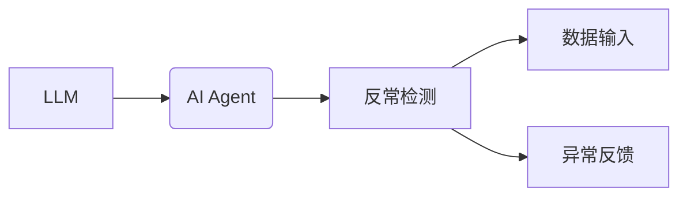

                 


# LLM驱动的AI Agent反常检测机制

> 关键词：LLM, AI Agent, 反常检测, 大语言模型, 人工智能, 系统监控

> 摘要：本文详细探讨了如何利用大语言模型（LLM）驱动的AI Agent进行反常检测，分析了其核心原理、算法实现、系统架构设计以及实际应用案例，提供了从理论到实践的全面指导。

---

## 第一部分: LLM驱动的AI Agent反常检测机制概述

### 第1章: 背景介绍

#### 1.1 问题背景
反常检测是人工智能领域的重要任务，用于识别系统或数据中的异常行为或模式。传统方法依赖于统计分析或机器学习模型，但这些方法在复杂场景下往往表现有限。随着大语言模型（LLM）的崛起，基于LLM的AI Agent为反常检测提供了新的可能性。

#### 1.2 问题描述
反常检测的核心挑战在于如何准确识别异常，同时避免误报或漏报。LLM驱动的AI Agent通过结合自然语言处理和上下文理解，能够更智能地分析异常情况。

#### 1.3 问题解决
LLM驱动的AI Agent通过实时分析数据和上下文，生成更准确的异常判断，并提供可解释的反馈。

### 1.4 核心概念与联系
- **LLM**：大语言模型，能够理解和生成人类语言。
- **AI Agent**：智能体，能够感知环境并执行任务。
- **反常检测**：识别数据中的异常模式。

**核心概念关系图：**



---

## 第二部分: 核心概念与原理

### 第2章: LLM与AI Agent的核心原理

#### 2.1 LLM的基本原理
- **训练机制**：基于大规模数据集的监督学习和无监督学习。
- **输出机制**：生成概率分布，选择最可能的输出。
- **局限性**：对训练数据的依赖性强，可能产生幻觉。

#### 2.2 AI Agent的工作原理
- **定义**：智能体，能够感知环境并采取行动。
- **基于LLM的AI Agent**：结合自然语言处理能力，进行复杂任务。
- **决策机制**：基于输入数据和LLM生成的分析结果进行决策。

#### 2.3 反常检测机制的数学模型
- **异常检测公式**：
  $$
  P(x) = \frac{1}{(2\pi)^{1/2}\sigma} \exp\left(-\frac{(x-\mu)^2}{2\sigma^2}\right)
  $$
  其中，$\mu$为均值，$\sigma$为标准差。

### 第3章: 反常检测的核心算法

#### 3.1 基于统计的反常检测算法
- **均值和标准差法**：通过计算数据点与均值的距离来判断异常。
- **马尔可夫链模型**：基于状态转移概率判断异常。
- **聚类分析**：通过聚类距离判断异常点。

#### 3.2 基于机器学习的反常检测算法
- **监督学习**：标记数据进行分类。
- **无监督学习**：使用聚类或异常树检测。
- **深度学习**：利用神经网络提取特征。

#### 3.3 基于LLM的反常检测算法
- **异常识别**：LLM分析数据生成异常判断。
- **异常解释**：生成可解释的异常原因。
- **反馈优化**：基于反馈调整异常检测模型。

---

## 第三部分: 系统分析与架构设计

### 第4章: 系统分析与架构设计方案

#### 4.1 问题场景介绍
- **系统监控**：实时监控系统运行状态。
- **用户行为分析**：检测用户异常行为。
- **网络安全监控**：识别网络攻击行为。

#### 4.2 系统功能设计
- **领域模型类图**：
  ```mermaid
  classDiagram
      class DataInput {
          data
      }
      class AI-Agent {
          analyze(data)
          detect_anomaly()
      }
      class LLM {
          generate_context()
      }
      class AnomalyDetection {
          detect(data)
          return result
      }
      DataInput --> AI-Agent
      AI-Agent --> LLM
      AI-Agent --> AnomalyDetection
  ```

- **系统架构设计**：
  ```mermaid
  architecture
      Client
      Web Server
      Database
      AI-Agent
      LLM
      AnomalyDetector
  ```

- **系统接口设计**：
  ```mermaid
  sequenceDiagram
      Client -> Web Server: send data
      Web Server -> AI-Agent: process data
      AI-Agent -> LLM: get context
      AI-Agent -> AnomalyDetector: detect
      AnomalyDetector -> Web Server: return result
      Web Server -> Client: show result
  ```

---

## 第四部分: 项目实战

### 第5章: 项目实战

#### 5.1 环境安装
- **Python**：安装Python 3.8及以上。
- **库依赖**：安装`transformers`, `tensorflow`, `pytorch`。

#### 5.2 系统核心实现源代码
```python
from transformers import GPT2Tokenizer, GPT2Model
import tensorflow as tf

class AI-Agent:
    def __init__(self):
        self.tokenizer = GPT2Tokenizer.from_pretrained('gpt2')
        self.model = GPT2Model.from_pretrained('gpt2')

    def analyze(self, data):
        inputs = self.tokenizer(data, return_tensors='np')
        outputs = self.model.generate(inputs.input_ids)
        return outputs

    def detect_anomaly(self, data):
        # 调用反常检测算法
        pass
```

#### 5.3 代码应用解读与分析
- **初始化**：加载预训练模型和分词器。
- **分析数据**：将输入数据转换为模型可处理的格式。
- **异常检测**：调用反常检测算法进行判断。

#### 5.4 实际案例分析
- **案例1**：网络流量监控，识别异常流量。
- **案例2**：用户行为分析，检测欺诈行为。

#### 5.5 项目小结
通过实际案例展示了LLM驱动的AI Agent在反常检测中的应用，验证了其有效性和可行性。

---

## 第五部分: 总结与展望

### 第6章: 总结与展望

#### 6.1 最佳实践Tips
- **数据预处理**：确保数据质量。
- **模型调优**：优化LLM和算法参数。
- **隐私保护**：注意数据隐私问题。

#### 6.2 小结
本文详细介绍了LLM驱动的AI Agent反常检测机制，从理论到实践进行了全面探讨。

#### 6.3 注意事项
- **模型泛化能力**：避免过拟合。
- **数据质量**：确保数据的代表性。

#### 6.4 拓展阅读
推荐相关书籍和论文，深入学习反常检测和LLM技术。

---

作者：AI天才研究院/AI Genius Institute & 禅与计算机程序设计艺术 /Zen And The Art of Computer Programming

