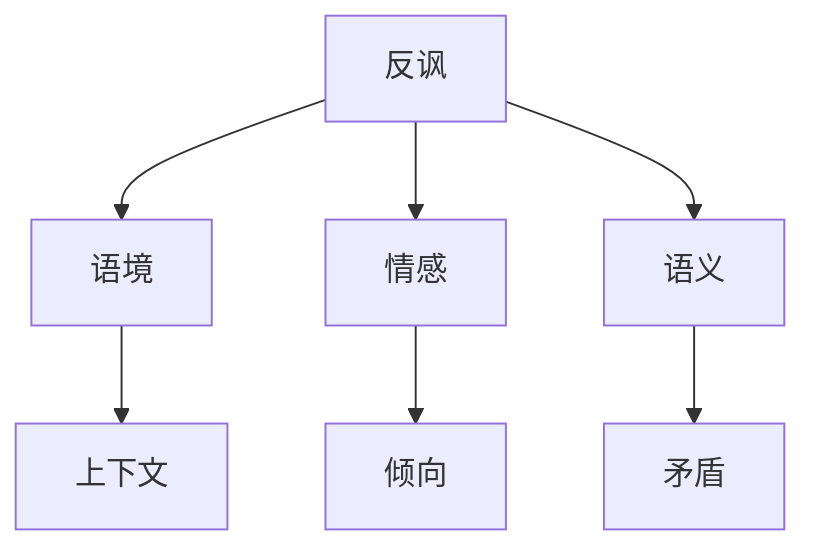
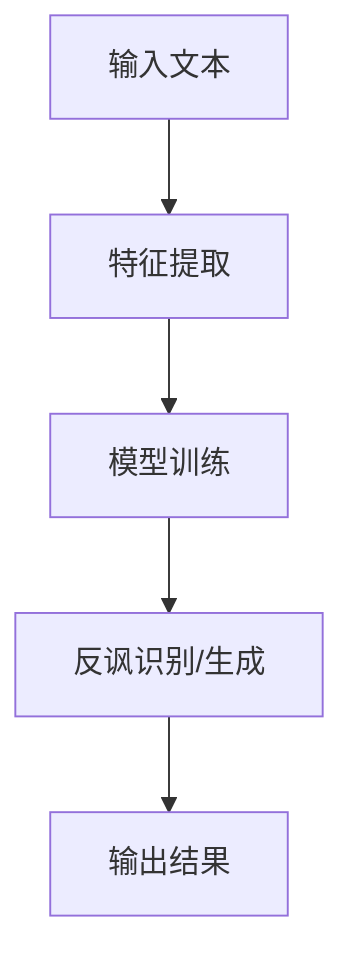
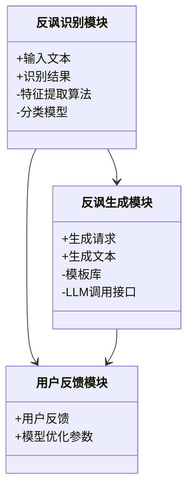
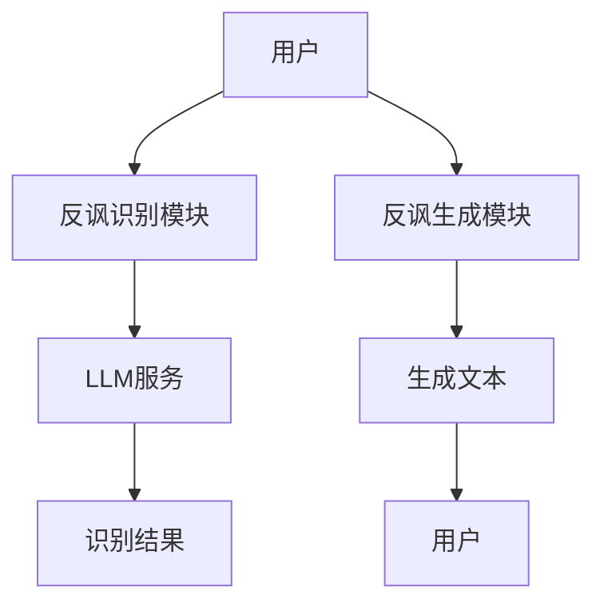
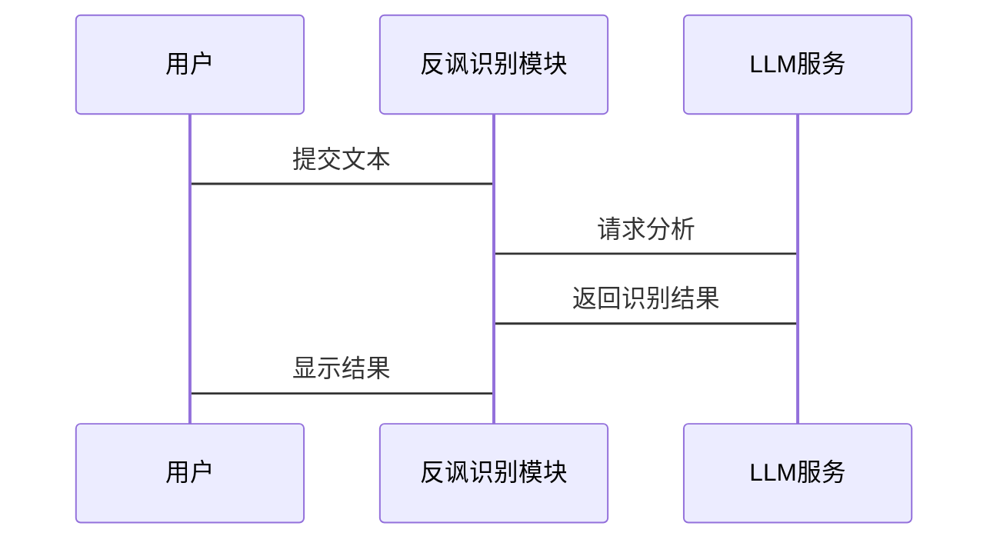
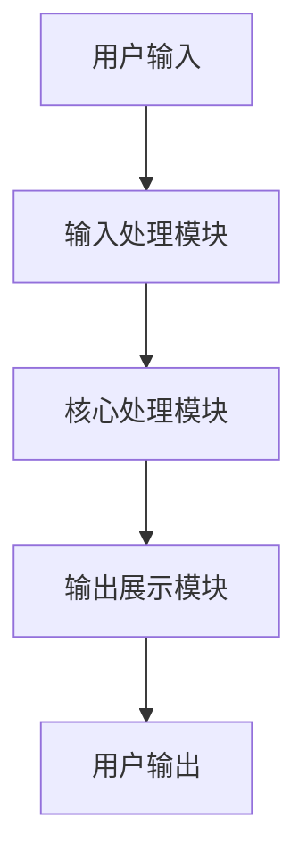

                 


# LLM驱动的AI Agent反讽理解能力

> 关键词：反讽理解，LLM，AI Agent，自然语言处理，情感分析

> 摘要：本文探讨了大语言模型（LLM）在AI Agent中的反讽理解能力，分析了其背景、技术原理、系统架构，并结合实际案例进行了深入剖析。通过详细的技术分析和案例研究，本文为理解反讽在AI Agent中的应用提供了全面的视角。

---

## 第一部分: LLM驱动的AI Agent反讽理解能力背景与概念

### 第1章: 反讽理解能力的定义与重要性

#### 1.1 反讽的定义与类型

反讽是一种修辞手法，通过语言的表面含义与实际意图之间的矛盾来表达讽刺或幽默。常见的反讽类型包括：

- **直接反讽**：明确表达反意，如“今天天气真好啊！”（实际天气糟糕）。
- **间接反讽**：通过暗示或比喻表达反意，如“多么美好的一天啊！”（暗指天气不好）。
- **反语反讽**：通过重复或强调某些词语来传达反意，如“多么成功的项目啊！”（项目失败）。

#### 1.2 LLM与AI Agent的背景

- **大语言模型（LLM）**：基于大规模数据训练的神经网络模型，如GPT系列，能够理解并生成自然语言文本。
- **AI Agent**：智能体，能够感知环境、执行任务并做出决策的实体，常用于自动化系统和人机交互。

LLM与AI Agent的结合，使AI Agent能够具备强大的语言理解和生成能力，从而更好地处理复杂任务。

#### 1.3 反讽理解在AI Agent中的应用价值

- **提升交互体验**：通过理解反讽，AI Agent能更准确地理解用户意图，提供更自然的对话。
- **增强情感分析**：反讽理解有助于识别隐藏的情感倾向，提升情感分析的准确性。
- **改善任务执行**：在客服、社交分析等领域，反讽理解能帮助AI Agent更好地识别用户需求。

---

### 第2章: 反讽理解的核心概念与联系

#### 2.1 反讽的理解维度

- **语境依赖性**：反讽的理解依赖于上下文，同一句话在不同语境下可能有不同的反讽含义。
- **情感倾向**：反讽通常带有强烈的情感色彩，如讽刺或幽默。
- **语义矛盾**：反讽通过表面含义与实际意图的矛盾来传达信息。

#### 2.2 LLM与反讽理解的关系

- **LLM的语义理解能力**：通过大规模数据训练，LLM能够识别语言中的细微差别。
- **反讽识别的优势**：LLM在处理大量文本时，能够捕捉到反讽的模式和特征。
- **局限性**：LLM可能难以准确理解复杂或隐晦的反讽，尤其是在缺乏明确语境的情况下。

#### 2.3 AI Agent中的反讽理解架构

- **反讽识别模块**：负责检测输入文本中的反讽成分。
- **反讽生成模块**：用于在生成文本时加入适当的反讽元素。
- **反馈机制**：根据用户反馈调整反讽理解模型，提升准确性。

#### 2.4 核心概念对比表

| 概念   | 特性                         |
|--------|------------------------------|
| 反讽   | 语境依赖性、情感倾向、语义矛盾 |
| LLM    | 语义理解能力、生成能力       |

#### 2.5 ER实体关系图



---

### 第3章: 反讽理解的算法原理

#### 3.1 反讽识别算法

- **基于特征的分类算法**：通过提取文本特征（如关键词、句式结构）进行分类。
- **基于深度学习的模型**：如BERT、GPT等模型，能够捕捉复杂的语义信息。
- **混合模型**：结合特征工程和深度学习的优势，提升识别准确率。

#### 3.2 反讽生成算法

- **基于规则的生成**：根据预定义的规则生成反讽文本。
- **基于模板的生成**：利用模板结构生成反讽内容。
- **基于LLM的生成**：利用大语言模型直接生成反讽文本，具有更高的灵活性和自然度。

#### 3.3 算法流程图



#### 3.4 数学模型与公式

- **反讽识别的概率模型**：
  $$ P(\text{反讽}|T) = \frac{P(T|\text{反讽})P(\text{反讽})}{P(T)} $$
  其中，T为文本特征，P(反讽)为先验概率。

- **反讽生成的损失函数**：
  $$ L = -\sum_{i=1}^{n} \log P(y_i|x_i) $$
  其中，$x_i$为输入，$y_i$为生成的反讽文本。

#### 3.5 举例说明

- **反讽识别示例**：
  输入文本："今天天气真好啊！"，模型识别出反讽的概率为$P=0.8$。

---

## 第二部分: 系统分析与架构设计

### 第4章: 反讽理解的系统分析

#### 4.1 应用场景

- **客户服务**：识别用户情绪，提供更贴心的服务。
- **社交网络分析**：分析社交媒体上的反讽内容，进行舆情监测。
- **教育辅助**：帮助学生识别和理解反讽。

#### 4.2 系统功能设计

- **反讽识别模块**：检测文本中的反讽成分。
- **反讽生成模块**：生成符合上下文的反讽文本。
- **用户反馈模块**：收集用户反馈，优化模型。

#### 4.3 领域模型类图



#### 4.4 系统架构图



#### 4.5 系统交互图



---

### 第5章: 系统架构设计

#### 5.1 模块划分

- **输入处理模块**：接收并解析输入文本。
- **核心处理模块**：执行反讽识别或生成。
- **输出展示模块**：将结果展示给用户。

#### 5.2 交互流程



#### 5.3 实现方案

- **模块化设计**：将系统划分为独立模块，便于维护和扩展。
- **接口标准化**：确保模块间接口统一，方便通信。

---

## 第三部分: 项目实战与案例分析

### 第6章: 项目实战

#### 6.1 环境安装

- **Python环境**：安装Python 3.8以上版本。
- **依赖库安装**：使用pip安装必要的库，如transformers、numpy、scikit-learn。

#### 6.2 核心实现代码

```python
from transformers import pipeline

# 反讽识别模型
classifier = pipeline("text-classification", model="train/anti-sarcasm")

# 反讽生成模型
generator = pipeline("text-generation", model="gpt2")

def detect_irony(text):
    result = classifier(text)
    return result[0]['label'] == 'IRONY'

def generate_irony(text):
    response = generator(text, max_length=50, num_return_sequences=1)
    return response[0]['sequence']
```

#### 6.3 代码解读与分析

- **detect_irony函数**：使用预训练的分类模型检测文本中的反讽。
- **generate_irony函数**：调用生成模型，根据输入生成反讽文本。

#### 6.4 实际案例分析

- **输入文本**："This is such a great idea!"（在团队项目中，实际想法很差）
- **识别结果**：detect_irony返回True，表示检测到反讽。
- **生成结果**：generate_irony生成类似“Wow, what a brilliant idea！”的反讽回应。

---

### 第7章: 案例分析

#### 7.1 典型场景

- **客服对话**：用户使用反讽语气表达不满，AI Agent需准确识别并提供解决方案。
- **社交媒体分析**：识别用户评论中的反讽，进行舆情监控。

#### 7.2 系统处理流程

1. **用户输入**："Your support is so helpful!"（实际支持很糟糕）
2. **识别模块**：检测到反讽，标记为负面情感。
3. **生成模块**：生成适当的回应，如“Thank you for your feedback. We will improve!”
4. **输出展示**：将回应展示给用户。

#### 7.3 案例总结

通过实际案例分析，展示了反讽理解在AI Agent中的重要性及其应用场景。准确识别和生成反讽文本，能够显著提升系统的交互体验和任务执行效率。

---

## 第四部分: 总结与展望

### 第8章: 总结与展望

#### 8.1 全文总结

本文探讨了LLM在AI Agent中的反讽理解能力，从概念、算法、系统架构到实际应用进行了全面分析。通过理论与实践结合，展示了反讽理解在提升人机交互体验中的重要作用。

#### 8.2 研究的局限性

- **数据不足**：反讽数据的多样性和复杂性对模型提出了更高要求。
- **上下文依赖**：部分反讽理解仍依赖于特定语境，模型可能在缺乏上下文的情况下表现不佳。
- **文化差异**：不同文化背景下的反讽表达方式不同，模型需要更多跨文化数据支持。

#### 8.3 未来展望

- **模型优化**：通过引入更多的反讽数据和改进模型结构，提升识别和生成的准确率。
- **多模态融合**：结合图像、语音等多模态信息，增强反讽理解的准确性。
- **实时应用**：探索反讽理解在实时对话系统中的应用，如智能音箱、虚拟助手等。

---

## 作者

作者：AI天才研究院/AI Genius Institute  
& 禅与计算机程序设计艺术 /Zen And The Art of Computer Programming

