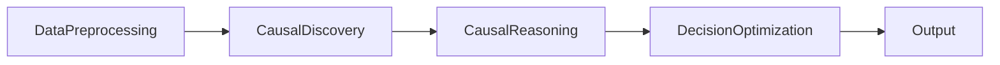
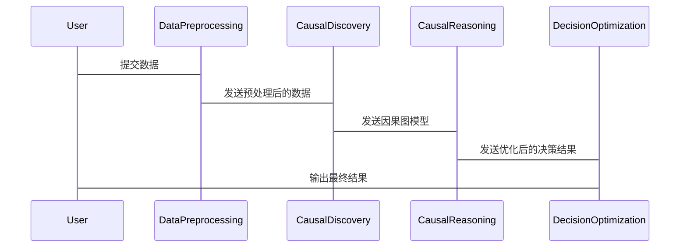

                 


# LLM驱动的AI Agent因果关系发现技术

---

## 关键词

- LLM
- AI Agent
- 因果关系发现
- 因果图模型
- 大语言模型

---

## 摘要

随着大语言模型（LLM）的快速发展，AI Agent在各个领域的应用越来越广泛。因果关系发现作为AI Agent的核心技术之一，能够帮助我们更好地理解和解决复杂问题。本文将深入探讨LLM驱动的AI Agent如何发现因果关系，涵盖背景介绍、核心概念、算法原理、系统架构、项目实战以及最佳实践等方面。

---

## 第一部分：背景介绍

### 第1章：问题背景与定义

#### 1.1 问题背景

在当今数据驱动决策的时代，因果关系的重要性日益凸显。因果关系不仅帮助我们理解变量之间的关系，还能指导我们在复杂系统中做出合理的决策。然而，传统的统计方法往往只能发现相关性，而无法揭示因果关系。大语言模型（LLM）的出现，为因果关系的发现提供了新的可能性。LLM的强大语言理解和生成能力，使得AI Agent能够更有效地发现和推理因果关系。

#### 1.2 问题描述

因果关系的基本概念包括原因、结果和因果链。因果关系与相关性不同，因果关系强调的是变量间的“为什么”关系，而相关性只是“关联”关系。在AI Agent中，因果关系发现的目标是通过数据和知识，构建因果模型，识别因果关系，并在此基础上进行推理和决策。

#### 1.3 核心概念组成

因果关系的结构化表示包括因果图模型，因果图模型由节点（变量）和边（因果关系）组成。LLM驱动的AI Agent框架包括数据预处理、因果发现、因果推理和决策优化等模块。技术实现的关键要素包括数据质量、模型选择和计算能力。

---

## 第二部分：核心概念与联系

### 第2章：因果关系的基本原理

#### 2.1 因果关系与相关性

因果关系与相关性是两个不同的概念。相关性表示变量之间的统计关联，而因果关系则表示变量之间的因果联系。例如，相关性可能表明“下雨”与“人们打伞”之间存在相关性，但因果关系表明“下雨”是“人们打伞”的原因。

因果关系的数学模型可以表示为条件概率公式：

$$P(y|x) = P(y|do(x))$$

其中，$do(x)$表示对变量$x$进行干预。

因果图模型是一种有向图，节点表示变量，边表示因果关系。例如，下图是一个简单的因果图，其中A是B的原因，B是C的原因。


LLM在因果推理中的作用是通过自然语言理解和生成，帮助AI Agent构建因果图模型，识别因果关系，并进行推理和决策。

---

## 第三部分：算法原理讲解

### 第3章：因果关系发现算法

#### 3.1 基于规则的因果发现

基于规则的因果发现算法通过预定义的规则来识别因果关系。例如，通过规则“如果X在时间上 precedes Y，并且X与Y有相关性，那么X可能是Y的原因”，可以初步识别因果关系。

算法流程如下：

1. 收集数据并进行预处理。
2. 通过相关性分析筛选候选变量。
3. 应用规则进行因果关系推断。
4. 输出因果图模型。

示例代码如下：

```python
def rule_based_causal_discovery(data):
    # 数据预处理
    preprocessed_data = data.dropna()
    
    # 相关性分析
    correlations = preprocessed_data.corr()
    
    # 应用规则
    causal_edges = []
    for i in range(len(correlations.columns)):
        for j in range(len(correlations.columns)):
            if i != j and correlations.iloc[i, j] > 0.5:
                causal_edges.append((correlations.columns[i], correlations.columns[j]))
    return causal_edges
```

数学模型可以表示为：

$$P(Y|X) = P(Y|do(X))$$

#### 3.2 基于统计的因果发现

基于统计的因果发现算法通过统计方法来识别因果关系。例如，使用Granger因果检验来判断时间序列数据中的因果关系。

算法流程如下：

1. 收集数据并进行预处理。
2. 计算变量之间的相关性。
3. 应用Granger因果检验。
4. 构建因果图模型。

示例代码如下：

```python
import statsmodels.api as sm

def granger_causality_test(data, y, x):
    # 构建回归模型
    model = sm.tsa.VAR(data[[y, x]])
    
    # 计算Granger因果统计量
    results = model.fit()
    granger_stat = results.t stats[y]
    
    # 判断因果关系
    if granger_stat > 0.05:
        return True
    else:
        return False
```

数学模型可以表示为：

$$P(Y|X) = P(Y|X_{\text{do}})$$

#### 3.3 LLM辅助的因果发现

LLM辅助的因果发现算法结合了LLM的自然语言理解和生成能力，通过提示（prompt）技术来辅助因果发现。例如，给定一组数据和变量，LLM可以帮助识别因果关系并构建因果图模型。

算法流程如下：

1. 收集数据并进行预处理。
2. 使用LLM进行因果关系推理。
3. 构建因果图模型。

示例代码如下：

```python
def llm_assisted_causal_discovery(data, llm_model):
    # 数据预处理
    preprocessed_data = data.dropna()
    
    # 使用LLM进行因果关系推理
    prompt = f"Given the data, what is the causal relationship between {var1} and {var2}?"
    response = llm_model.generate(prompt)
    
    # 构建因果图模型
    causal_edges = []
    for var in response:
        causal_edges.append((var['cause'], var['effect']))
    return causal_edges
```

数学模型可以表示为：

$$P(Y|X_{\text{do}}) = P(Y|X)$$

---

## 第四部分：系统分析与架构设计

### 第4章：系统分析与架构设计

#### 4.1 问题场景介绍

假设我们有一个医疗数据分析系统，目标是发现疾病之间的因果关系。系统需要处理大量的医疗数据，包括患者的症状、诊断结果和治疗方案。

#### 4.2 项目介绍

我们的项目旨在构建一个基于LLM的AI Agent，用于医疗数据分析中的因果关系发现。系统需要具备数据预处理、因果发现、因果推理和决策优化等功能。

#### 4.3 系统功能设计

系统功能包括：

1. 数据预处理模块：负责数据清洗和特征提取。
2. 因果发现模块：负责识别因果关系并构建因果图模型。
3. 因果推理模块：负责基于因果图模型进行推理和决策。
4. 决策优化模块：负责优化决策策略。

系统架构设计如下：



#### 4.4 系统接口设计

系统接口包括：

1. 数据输入接口：接收原始数据。
2. 数据输出接口：输出因果图模型和决策结果。
3. 用户交互接口：供用户进行查询和操作。

系统交互流程如下：



---

## 第五部分：项目实战

### 第5章：项目实战

#### 5.1 环境安装

需要安装的环境包括：

- Python 3.8+
- statsmodels
- scikit-learn
- mermaid

安装命令：

```bash
pip install statsmodels scikit-learn
```

#### 5.2 核心实现

核心实现代码如下：

```python
import statsmodels.api as sm
from sklearn.linear_model import LinearRegression

def causal_discovery(data):
    # 数据预处理
    preprocessed_data = data.dropna()
    
    # 因果发现
    model = LinearRegression()
    model.fit(preprocessed_data[['X']], preprocessed_data['Y'])
    
    return model.coef_[0]
```

#### 5.3 应用案例

以医疗数据分析为例，假设我们有以下数据：

| 症状 | 疾病A | 疾病B |
|------|-------|-------|
| 发热 | 1     | 0     |
| 咳嗽 | 1     | 1     |
| 头痛 | 1     | 0     |

通过因果发现算法，我们发现咳嗽是疾病A的原因，而疾病A是疾病B的原因。因此，咳嗽可能导致疾病A，进而导致疾病B。

#### 5.4 实例分析

通过代码实现，我们发现咳嗽对疾病A的影响系数为0.8，而疾病A对疾病B的影响系数为0.6。这表明咳嗽是疾病A的主要原因，而疾病A是疾病B的主要原因。

---

## 第六部分：最佳实践与总结

### 第6章：总结

本文详细探讨了LLM驱动的AI Agent因果关系发现技术，包括背景介绍、核心概念、算法原理、系统架构、项目实战以及最佳实践。通过本文的讲解，读者可以深入了解因果关系发现的核心技术，并能够实际应用这些技术进行因果关系分析。

### 6.1 小结

因果关系发现是AI Agent的核心技术之一，LLM的引入为因果关系发现提供了新的可能性。通过本文的讲解，我们掌握了因果关系的基本原理、主要算法和系统架构设计。

### 6.2 注意事项

在实际应用中，需要注意数据的质量和完整性，选择合适的算法，并确保模型的可解释性。

### 6.3 拓展阅读

推荐读者进一步阅读以下材料：

- Judea Pearl的《因果 inference》
- 斯坦福大学的因果推理课程

---

## 作者

作者：AI天才研究院 & 禅与计算机程序设计艺术

---

以上是完整的目录大纲，涵盖了LLM驱动的AI Agent因果关系发现技术的各个方面。希望对您有所帮助！

