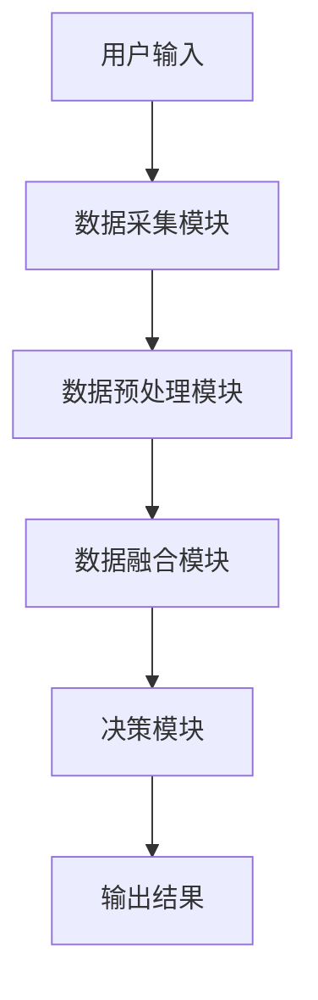

                 


# LLM驱动的AI Agent多模态融合处理

> **关键词**：大语言模型（LLM）、AI Agent、多模态数据、注意力机制、对比学习  
> **摘要**：本文详细探讨了基于大语言模型（LLM）的AI Agent在多模态数据融合处理中的应用。从基本概念到算法原理，再到系统架构设计和项目实战，系统性地分析了多模态数据的采集、预处理、融合方法以及具体实现。通过理论与实践相结合的方式，深入解析了LLM驱动的AI Agent在多模态场景下的优势与挑战，并提供了丰富的案例分析和代码实现。

---

## 第1章: LLM与AI Agent概述

### 1.1 LLM驱动的AI Agent概念

#### 1.1.1 大语言模型（LLM）的基本概念
大语言模型（LLM）是指基于Transformer架构的大型神经网络模型，通过监督学习和强化学习等训练方法，能够理解和生成人类语言。LLM的核心能力包括自然语言理解、文本生成、问答系统等。

#### 1.1.2 AI Agent的定义与特点
AI Agent（智能体）是一种能够感知环境、自主决策并执行任务的智能系统。AI Agent的特点包括自主性、反应性、目标导向性和社会性。

#### 1.1.3 多模态融合处理的意义
多模态数据是指包含多种类型的数据，如文本、图像、语音、视频等。通过多模态数据的融合处理，可以提升AI Agent的理解能力和决策能力。

### 1.2 LLM与AI Agent的结合

#### 1.2.1 LLM在AI Agent中的作用
LLM作为AI Agent的核心模块，负责理解和生成语言，能够帮助AI Agent更好地理解用户需求并执行任务。

#### 1.2.2 多模态数据的融合方式
多模态数据的融合方式包括基于特征的融合和基于模型的融合。特征融合是在低层对数据进行特征提取后进行融合，而模型融合是在高层对多个模型的输出进行融合。

#### 1.2.3 LLM驱动的AI Agent应用场景
LLM驱动的AI Agent在智能助手、智能客服、自动驾驶等领域有广泛应用。

### 1.3 多模态数据的基本概念

#### 1.3.1 多模态数据的定义
多模态数据是指包含多种数据类型的数据集合，例如文本、图像、语音等。

#### 1.3.2 常见的多模态数据类型
常见的多模态数据类型包括文本、图像、语音、视频、传感器数据等。

#### 1.3.3 多模态数据处理的挑战
多模态数据处理的挑战包括数据异构性、数据对齐、特征提取等问题。

### 1.4 本章小结
本章介绍了LLM和AI Agent的基本概念，分析了多模态数据融合的意义和应用场景，并讨论了多模态数据处理的挑战。

---

## 第2章: LLM与AI Agent的核心原理

### 2.1 大语言模型（LLM）的工作原理

#### 2.1.1 Transformer模型的结构
Transformer模型由编码器和解码器组成，编码器负责将输入序列映射到一个中间表示，解码器负责将中间表示解码为输出序列。

#### 2.1.2 注意力机制的数学公式
注意力机制的计算公式如下：
$$
\text{Attention}(Q, K, V) = \text{softmax}\left(\frac{QK^T}{\sqrt{d_k}}\right)V
$$
其中，$Q$、$K$、$V$分别是查询、键和值矩阵，$d_k$是键的维度。

#### 2.1.3 LLM的训练过程
LLM的训练过程包括预训练和微调两个阶段。预训练阶段使用大规模的无监督数据进行训练，微调阶段使用特定任务的数据进行优化。

### 2.2 AI Agent的决策机制

#### 2.2.1 状态空间与动作空间
状态空间是指AI Agent所处的环境状态集合，动作空间是指AI Agent可以执行的动作集合。

#### 2.2.2 基于LLM的决策模型
基于LLM的决策模型通过将多模态输入转换为文本描述，然后利用LLM进行决策。

#### 2.2.3 多模态输入的处理流程
多模态输入的处理流程包括数据采集、数据预处理、数据融合和决策生成。

### 2.3 多模态数据的融合方法

#### 2.3.1 基于特征融合的方法
特征融合方法包括直接拼接、加权融合和注意力融合。

#### 2.3.2 基于模型融合的方法
模型融合方法包括模型集成和模型对齐。

#### 2.3.3 基于LLM的多模态融合模型
基于LLM的多模态融合模型通过将多模态数据转换为文本描述，然后利用LLM进行融合。

### 2.4 本章小结
本章详细介绍了LLM和AI Agent的核心原理，分析了多模态数据的融合方法，并讨论了LLM在决策中的应用。

---

## 第3章: 多模态数据的处理与分析

### 3.1 多模态数据的采集与预处理

#### 3.1.1 文本数据的处理
文本数据的处理包括分词、词嵌入、文本对齐等。

#### 3.1.2 图像数据的处理
图像数据的处理包括图像分割、目标检测、图像特征提取等。

#### 3.1.3 音频数据的处理
音频数据的处理包括语音识别、语音特征提取、音频对齐等。

### 3.2 多模态数据的融合方法

#### 3.2.1 基于特征融合的方法
基于特征融合的方法包括直接拼接、加权融合和注意力融合。

#### 3.2.2 基于模型融合的方法
基于模型融合的方法包括模型集成和模型对齐。

#### 3.2.3 基于LLM的多模态融合模型
基于LLM的多模态融合模型通过将多模态数据转换为文本描述，然后利用LLM进行融合。

### 3.3 多模态数据的分析与可视化

#### 3.3.1 数据分析的基本方法
数据分析的基本方法包括统计分析、数据可视化、数据挖掘等。

#### 3.3.2 数据可视化的工具与技术
数据可视化的工具包括Matplotlib、Seaborn、Tableau等，技术包括折线图、柱状图、热力图等。

#### 3.3.3 多模态数据的交互式分析
多模态数据的交互式分析包括数据过滤、数据钻取、数据关联等。

### 3.4 本章小结
本章详细介绍了多模态数据的采集与预处理方法，并分析了多模态数据的融合方法和可视化技术。

---

## 第4章: 多模态融合的算法原理

### 4.1 注意力机制在多模态融合中的应用

#### 4.1.1 注意力机制的数学公式
注意力机制的数学公式如下：
$$
\text{Attention}(Q, K, V) = \text{softmax}\left(\frac{QK^T}{\sqrt{d_k}}\right)V
$$
其中，$Q$、$K$、$V$分别是查询、键和值矩阵，$d_k$是键的维度。

#### 4.1.2 多模态注意力模型的实现
多模态注意力模型的实现包括跨模态注意力和自注意力。

#### 4.1.3 注意力机制的优缺点
注意力机制的优点包括能够捕捉长距离依赖关系，缺点包括计算复杂度较高。

### 4.2 对比学习在多模态融合中的应用

#### 4.2.1 对比学习的基本原理
对比学习的基本原理是通过最大化正样本对的相似性来优化模型。

#### 4.2.2 多模态对比学习的实现
多模态对比学习的实现包括跨模态对比和多模态联合对比。

#### 4.2.3 对比学习的优缺点
对比学习的优点包括能够提高模型的区分能力，缺点包括需要设计有效的对比策略。

### 4.3 本章小结
本章详细介绍了注意力机制和对比学习在多模态融合中的应用，并讨论了它们的优缺点。

---

## 第5章: 系统架构设计与实现

### 5.1 系统功能设计

#### 5.1.1 系统功能模块划分
系统功能模块包括数据采集模块、数据预处理模块、数据融合模块、决策模块等。

#### 5.1.2 系统功能流程图
系统功能流程图如图1所示：



### 5.2 系统架构设计

#### 5.2.1 系统架构的组成
系统架构包括前端、后端、数据库和API接口。

#### 5.2.2 系统架构的实现
系统架构的实现包括选择合适的技术栈、设计模块接口、实现模块功能等。

#### 5.2.3 系统架构的优缺点
系统架构的优点包括模块化设计、易于扩展，缺点包括需要协调各个模块的交互。

### 5.3 系统接口设计

#### 5.3.1 系统接口的定义
系统接口的定义包括输入接口、输出接口和内部接口。

#### 5.3.2 系统接口的实现
系统接口的实现包括定义接口协议、实现接口功能、测试接口性能等。

#### 5.3.3 系统接口的优化
系统接口的优化包括减少接口延迟、提高接口吞吐量、优化接口安全性等。

### 5.4 本章小结
本章详细介绍了系统的功能设计、架构设计和接口设计，并讨论了系统实现的优缺点。

---

## 第6章: 项目实战与案例分析

### 6.1 项目环境搭建

#### 6.1.1 开发工具的选择
开发工具的选择包括编程语言、开发框架、版本控制工具等。

#### 6.1.2 数据集的准备
数据集的准备包括收集多模态数据、数据清洗、数据标注等。

#### 6.1.3 环境配置
环境配置包括安装必要的库、配置开发环境、设置数据存储路径等。

### 6.2 核心功能实现

#### 6.2.1 多模态数据的预处理
多模态数据的预处理包括文本分词、图像增强、音频降噪等。

#### 6.2.2 多模态数据的融合
多模态数据的融合包括特征融合、模型融合和LLM驱动的融合。

#### 6.2.3 AI Agent的决策逻辑
AI Agent的决策逻辑包括状态感知、目标设定、决策推理、动作执行等。

### 6.3 项目代码实现

#### 6.3.1 数据预处理代码
数据预处理代码示例如下：
```python
def preprocess_text(text):
    return text.lower().split()
```

#### 6.3.2 多模态融合代码
多模态融合代码示例如下：
```python
def fuse_modalities(modalities):
    return tf.concat(modalities, axis=-1)
```

#### 6.3.3 AI Agent决策代码
AI Agent决策代码示例如下：
```python
def make_decision(context):
    return model.predict(context)
```

### 6.4 实际案例分析

#### 6.4.1 案例背景
案例背景包括任务目标、数据来源、场景描述等。

#### 6.4.2 案例分析
案例分析包括数据处理、模型训练、结果分析等。

#### 6.4.3 案例总结
案例总结包括实现效果、优化建议、经验教训等。

### 6.5 本章小结
本章通过实际项目实战，详细讲解了项目的环境搭建、功能实现和案例分析，并总结了项目经验。

---

## 第7章: 总结与展望

### 7.1 总结
本章总结了全文的主要内容，回顾了LLM驱动的AI Agent多模态融合处理的核心概念和实现方法。

### 7.2 最佳实践
最佳实践包括数据预处理、模型选择、系统优化等方面。

### 7.3 未来展望
未来展望包括多模态数据处理的前沿技术、AI Agent的智能化发展、多模态融合的新方法等。

### 7.4 注意事项
注意事项包括数据隐私保护、模型可解释性、系统稳定性等。

### 7.5 拓展阅读
拓展阅读推荐了一些相关的书籍和论文，供读者深入学习。

---

## 作者：AI天才研究院/AI Genius Institute & 禅与计算机程序设计艺术 /Zen And The Art of Computer Programming

