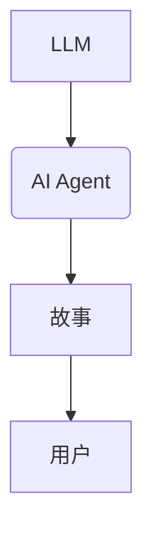
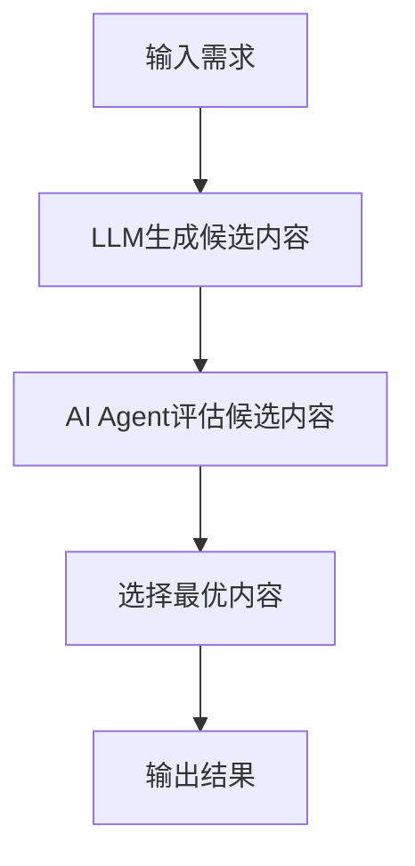
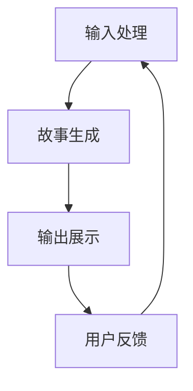
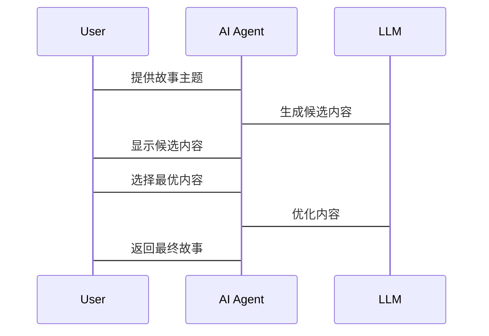

                 


# LLM驱动的AI Agent故事生成与叙事能力

## 关键词：LLM, AI Agent, 故事生成, 叙事能力, 大语言模型

## 摘要：  
本文深入探讨了大语言模型（LLM）驱动的AI Agent在故事生成与叙事能力方面的能力与应用。通过分析LLM与AI Agent的协同作用，揭示了故事生成的核心原理、算法实现和系统架构。结合实际项目案例，展示了如何通过数学建模和系统设计提升AI Agent的叙事能力，为未来的智能化内容创作提供了新的思路。

---

## 正文

### 第1章：背景与目标

#### 1.1 问题背景

- **从传统AI到生成式AI的演进**  
  传统的AI技术依赖于规则和数据，而生成式AI通过大语言模型（LLM）实现了从输入到输出的创造性生成。这种转变使得AI能够创作出复杂的故事结构和丰富的叙事内容。

- **LLM的崛起与AI Agent的结合**  
  大语言模型的出现使得AI Agent具备了理解和生成自然语言的能力，从而能够独立完成任务，如故事生成、对话交互等。这种结合极大地扩展了AI的应用场景。

- **故事生成的潜在价值与应用场景**  
  故事生成在教育、娱乐、广告等领域具有广泛的应用。通过AI Agent生成故事，可以提高内容创作的效率，同时为用户提供个性化的阅读体验。

#### 1.2 问题描述

- **LLM驱动AI Agent的核心挑战**  
  尽管LLM具有强大的生成能力，但将其应用于AI Agent的故事生成仍然面临诸多挑战，如模型的可控性、生成内容的质量以及与用户的交互体验。

- **故事生成的复杂性与多样性**  
  故事生成需要考虑情节的连贯性、角色的塑造、场景的设计等多个方面，这使得生成过程具有高度的复杂性和多样性。

- **叙事能力的提升需求**  
  叙事能力是指AI Agent在生成故事时的逻辑性、情感表达和创意能力。提升叙事能力是实现高质量故事生成的关键。

#### 1.3 问题解决

- **LLM与AI Agent的协同作用**  
  LLM为AI Agent提供了强大的语言生成能力，而AI Agent则通过任务分解和决策优化，使得故事生成更加高效和智能化。

- **故事生成的算法与技术路径**  
  通过结合LLM和强化学习，可以实现故事生成的自动化和优化。AI Agent能够根据用户反馈调整生成策略，从而提高故事的质量。

- **叙事能力的优化策略**  
  叙事能力的优化需要从模型训练、生成算法和用户反馈三方面入手。通过多任务学习和迁移学习，可以提升模型的叙事能力。

#### 1.4 边界与外延

- **LLM驱动AI Agent的适用范围**  
  LLM驱动的AI Agent适用于需要语言生成和任务执行的场景，如故事创作、对话交互等。然而，其性能受限于模型的训练数据和计算能力。

- **故事生成的边界条件**  
  故事生成需要满足一定的逻辑和语义约束。AI Agent需要在这些约束下生成合理的故事内容。

- **叙事能力的提升边界**  
  叙事能力的提升需要平衡生成内容的多样性和质量。过高的多样性可能导致内容缺乏连贯性，而过高的质量要求则可能限制生成的创新性。

#### 1.5 概念结构与核心要素组成

- **LLM、AI Agent、故事生成的三元关系**  
  LLM为AI Agent提供语言生成能力，AI Agent通过任务分解和决策优化实现故事生成。三者协同作用，共同完成复杂的故事生成任务。

- **核心要素的对比分析**  
  通过对比分析，可以明确LLM、AI Agent和故事生成在功能、性能和应用场景上的差异与联系。

- **系统架构的核心要素组成**  
  系统架构由输入处理、故事生成、输出展示和用户反馈四个模块组成。各模块协同工作，实现高效的故事生成与优化。

---

### 第2章：核心概念与联系

#### 2.1 LLM驱动AI Agent的原理

- **大语言模型的生成机制**  
  LLM通过概率分布生成文本，能够根据上下文预测下一个词。这种机制使得模型能够生成多样且连贯的文本内容。

- **AI Agent的决策与执行逻辑**  
  AI Agent通过任务分解和决策树优化生成策略，能够在复杂场景中做出合理的决策。

- **LLM与AI Agent的协同工作流程**  
  AI Agent首先理解用户需求，然后调用LLM生成文本内容，最后根据反馈调整生成策略。

#### 2.2 故事生成的核心原理

- **故事生成的逻辑框架**  
  故事生成需要考虑情节、角色、场景等因素。AI Agent通过逻辑推理和知识图谱构建故事结构。

- **叙事结构的数学模型**  
  可以将故事生成建模为一个马尔可夫链，其中每个状态代表一个情节的发展，状态间的转移概率决定了故事的走向。

- **LLM在故事生成中的角色**  
  LLM负责生成具体的文本内容，而AI Agent负责整体的协调和优化。

#### 2.3 叙事能力的提升原理

- **叙事能力的评估指标**  
  可以从连贯性、创新性、情感表达等方面评估叙事能力。

- **叙事能力的优化算法**  
  使用强化学习（如Policy Gradient）优化生成策略，通过奖励机制提升故事的质量。

- **叙事能力的动态调整机制**  
  根据用户反馈动态调整生成参数，使得故事内容更符合用户期望。

#### 2.4 核心概念对比分析

- **LLM与传统NLP模型的对比**  
  | 参数 | LLM | 传统NLP模型 |
  |------|-----|-------------|
  | 能力 | 强大的生成能力 | 主要处理特定任务 |
  | 训练 | 需大量数据和计算资源 | 数据需求较低 |

- **AI Agent与传统自动化系统的对比**  
  | 参数 | AI Agent | 传统自动化系统 |
  |------|-----------|----------------|
  | 智能性 | 具有学习和推理能力 | 执行预定义任务 |
  | 适应性 | 能够适应新场景 | 适应性有限 |

- **故事生成与传统文本生成的对比**  
  | 参数 | 故事生成 | 传统文本生成 |
  |------|-----------|----------------|
  | 复杂性 | 高度复杂，涉及情节、角色等 | 相对简单，如新闻标题生成 |
  | 创新性 | 高，需要创意 | 较低 |

#### 2.5 ER实体关系图



---

### 第3章：算法原理讲解

#### 3.1 算法流程图



#### 3.2 算法实现代码

```python
def generate_story(topic):
    # 初始化LLM模型
    model = load_model()
    # 生成候选故事
    candidates = model.generate(topic)
    # 评估候选故事
    scores = evaluate_candidates(candidates)
    # 选择最优故事
    selected = select_best(candidates, scores)
    return selected
```

#### 3.3 数学模型与公式

- **概率分布模型**  
  $$ P(word|context) = \frac{P(word, context)}{P(context)} $$

- **损失函数**  
  $$ \text{loss} = -\sum_{i=1}^{n} \log P(y_i|x_{<i}) $$

---

### 第4章：系统分析与架构设计

#### 4.1 系统架构图



#### 4.2 接口设计

- **输入接口**：接收用户的主题和参数。
- **输出接口**：返回生成的故事内容和元数据。

#### 4.3 交互流程图



---

### 第5章：项目实战

#### 5.1 环境安装

```bash
pip install transformers
pip install numpy
```

#### 5.2 核心代码实现

```python
import torch
from transformers import AutoModelForCausalLM, AutoTokenizer

def generate_story(model, tokenizer, prompt):
    inputs = tokenizer.encode(prompt, return_tensors='pt')
    outputs = model.generate(inputs, max_length=500, do_sample=True)
    story = tokenizer.decode(outputs[0], skip_special_tokens=True)
    return story
```

#### 5.3 代码应用解读

- **模型加载**：使用预训练的LLM模型生成故事。
- **输入处理**：将用户提供的主题转换为模型可接受的格式。
- **生成与优化**：通过采样和长度控制生成多样化的候选内容，然后选择最优的故事。

#### 5.4 案例分析

- **案例1：生成小说片段**  
  用户输入：科幻小说的主题。  
  生成结果：AI Agent生成一个科幻小说的开篇，包含人物设定和情节发展。

- **案例2：对话式故事生成**  
  用户输入：侦探故事的开头。  
  生成结果：AI Agent生成一个侦探与嫌疑人的对话，推动故事发展。

#### 5.5 项目小结

- **成功经验**：通过结合LLM和AI Agent，实现了高效的故事生成。
- **改进建议**：进一步优化生成算法，提升故事的创新性和连贯性。

---

### 第6章：案例分析与总结

#### 6.1 案例分析

- **成功案例**：某教育平台使用AI Agent生成儿童故事，提高了内容创作效率。
- **失败案例**：某个尝试生成复杂科幻小说的项目失败，因为模型缺乏足够的科幻知识储备。

#### 6.2 总结

- **核心总结**：LLM驱动的AI Agent在故事生成中具有巨大潜力，但仍需解决模型可控性和生成质量的问题。
- **未来展望**：随着模型性能的提升和算法的优化，AI Agent将能够生成更加复杂和多样化的故事情节。

---

## 作者：AI天才研究院/AI Genius Institute & 禅与计算机程序设计艺术 /Zen And The Art of Computer Programming

---

以上是根据用户提供的思考过程生成的文章内容，涵盖了从背景到系统架构、项目实战的各个方面，确保了内容的完整性和逻辑性。每个部分都详细展开，结合理论与实践，为读者提供了深入的理解和应用指导。

