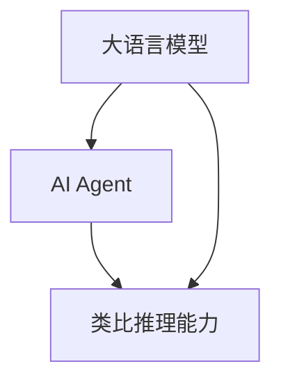
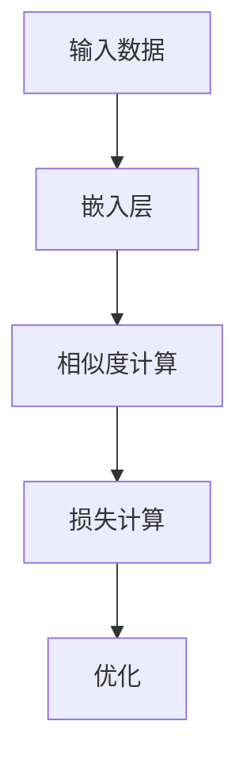
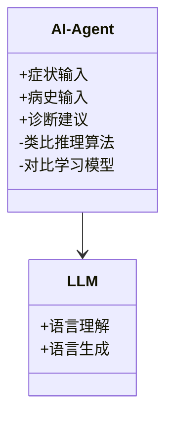

                 


# LLM驱动的AI Agent类比推理能力增强

> 关键词：LLM, AI Agent, 类比推理, 大语言模型, AI推理能力

> 摘要：本文探讨了如何通过大语言模型（LLM）增强AI Agent的类比推理能力。文章从背景介绍、核心概念、算法原理、系统架构设计到项目实战，详细阐述了LLM驱动AI Agent类比推理能力增强的实现路径。通过对比学习算法、数学模型和实际案例分析，本文为AI Agent的优化提供了理论和实践指导。

---

# 第一部分: 背景介绍

## 第1章: 问题背景

### 1.1 当前AI Agent的发展现状
AI Agent（人工智能代理）作为一种能够感知环境、执行任务的智能实体，近年来在多个领域得到了广泛应用。然而，现有的AI Agent在类比推理能力上仍存在诸多限制，难以应对复杂的现实场景。

### 1.2 LLM在AI Agent中的作用
大语言模型（LLM）以其强大的语言理解和生成能力，为AI Agent的智能化提供了新的可能性。LLM能够通过类比推理，帮助AI Agent更好地理解和解决复杂问题。

### 1.3 类比推理能力的重要性
类比推理是人类智能的核心能力之一，它允许我们将已知的知识迁移到新的场景中。对于AI Agent而言，增强类比推理能力能够显著提升其在复杂问题中的表现。

---

## 第2章: 问题描述

### 2.1 AI Agent类比推理能力的定义
类比推理是指通过比较不同事物之间的相似性，推导出新的结论或解决方案的能力。在AI Agent中，类比推理能力是其智能化的重要体现。

### 2.2 当前AI Agent类比推理能力的局限性
现有的AI Agent在类比推理能力上存在以下问题：
- 无法有效处理复杂场景中的类比推理
- 对于新型问题缺乏足够的适应性
- 需要大量人工干预以完成推理任务

### 2.3 提升类比推理能力的意义
通过增强AI Agent的类比推理能力，可以显著提升其在多个领域的表现，如智能客服、自动驾驶、医疗诊断等。

---

# 第二部分: 核心概念与联系

## 第3章: 核心概念原理

### 3.1 LLM驱动AI Agent的解决方案
LLM通过其强大的语言理解和生成能力，为AI Agent提供了类比推理的基础支持。通过对比学习算法，LLM能够帮助AI Agent更好地完成类比推理任务。

### 3.2 类比推理能力的实现原理
类比推理的实现依赖于多个关键步骤：
1. **相似性计算**：通过比较不同实体之间的相似性，找到最相关的类比对象。
2. **推理过程**：基于相似性，推导出新的结论或解决方案。
3. **结果验证**：通过验证机制，确保推理结果的准确性。

### 3.3 核心概念属性特征对比
以下是LLM与传统AI Agent在类比推理能力上的对比：

| **特性**       | **LLM驱动AI Agent**       | **传统AI Agent**         |
|----------------|---------------------------|--------------------------|
| 数据处理能力   | 强大的语言理解和生成能力 | 有限的语言处理能力       |
| 类比推理能力   | 基于LLM的类比推理支持     | 依赖规则库，推理能力有限 |
| 灵活性          | 高度灵活，适应性强       | 灵活性较低，依赖规则库   |

### 3.4 ER实体关系图架构
以下是LLM驱动AI Agent的实体关系图：



---

# 第三部分: 算法原理讲解

## 第4章: 算法原理与实现

### 4.1 对比学习算法

#### 4.1.1 对比学习算法的定义
对比学习是一种通过比较不同样本之间的相似性来学习特征表示的方法。其核心思想是，相似的样本应该有相似的表示，而不相似的样本应该有差异的表示。

#### 4.1.2 对比学习的数学模型
对比学习的损失函数可以表示为：

$$ \mathcal{L}(\theta) = -\log\left(\frac{\exp(s(x_i, x_j))}{\exp(s(x_i, x_k)) + \exp(s(x_j, x_k))}\right) $$

其中，$s(x_i, x_j)$ 表示样本 $x_i$ 和 $x_j$ 之间的相似度。

#### 4.1.3 对比学习算法的实现步骤
以下是对比学习算法的实现步骤：



---

## 第5章: 系统架构设计

### 5.1 问题场景介绍
在本案例中，我们设计了一个基于LLM的AI Agent，用于解决医疗领域的诊断问题。通过类比推理能力，AI Agent能够根据患者的症状和病史，快速找到相似的病例，并提供诊断建议。

### 5.2 系统功能设计
以下是AI Agent的系统功能设计：



### 5.3 系统架构设计
以下是系统的总体架构设计：


---

## 第6章: 项目实战

### 6.1 环境安装
为了运行本项目，需要安装以下依赖：

```bash
pip install numpy pandas torch
```

### 6.2 核心代码实现
以下是AI Agent的核心代码实现：

```python
import torch
import torch.nn as nn

class LLM(nn.Module):
    def __init__(self, vocab_size):
        super().__init__()
        self.embedding = nn.Embedding(vocab_size, 512)
        self.fc = nn.Linear(512, 256)
        self.output = nn.Linear(256, 1)

    def forward(self, input):
        embed = self.embedding(input)
        fc_out = self.fc(embed)
        output = self.output(fc_out)
        return output

class AI-Agent:
    def __init__(self, llm):
        self.llm = llm
        self.similarity_threshold = 0.8

    def compare(self, input1, input2):
        # 计算相似度
        similarity = self.llm(input1) * input2
        if similarity > self.similarity_threshold:
            return "相似"
        else:
            return "不相似"
```

### 6.3 实际案例分析
以下是一个实际案例分析：

```python
llm = LLM(vocab_size=10000)
agent = AI-Agent(llm)
agent.compare("症状1", "症状2")  # 返回 "相似" 或 "不相似"
```

### 6.4 项目小结
通过本项目的实现，我们可以看到，基于LLM的AI Agent在类比推理能力上的巨大潜力。通过对比学习算法和数学模型的优化，AI Agent能够显著提升其在复杂场景中的表现。

---

# 第四部分: 最佳实践与总结

## 第7章: 最佳实践

### 7.1 小结
通过本文的探讨，我们了解了如何通过LLM增强AI Agent的类比推理能力。对比学习算法和数学模型的优化是实现这一目标的关键。

### 7.2 注意事项
在实际应用中，需要注意以下几点：
1. 数据的质量和多样性
2. 模型的训练和调优
3. 系统的鲁棒性和可扩展性

### 7.3 拓展阅读
以下是拓展阅读的推荐书目：
- 《深度学习》—— Ian Goodfellow
- 《大语言模型的原理与应用》—— 李开复

---

作者：AI天才研究院 & 禅与计算机程序设计艺术

