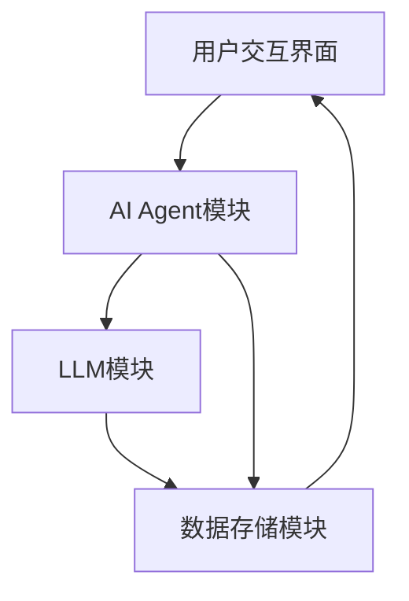

                 


# LLM驱动的AI Agent诗歌创作与鉴赏

## 关键词：
- 大语言模型（LLM）
- AI Agent
- 诗歌创作
- 诗歌鉴赏
- 人机协作
- 智能创作

## 摘要：
本文探讨了大语言模型（LLM）驱动的AI Agent在诗歌创作与鉴赏中的应用。通过分析LLM与AI Agent的协同机制，详细阐述了AI Agent在诗歌创作和鉴赏中的具体应用，包括诗歌生成的算法原理、系统架构设计以及实际案例分析。文章还讨论了人机协作在诗歌创作中的潜力与挑战，为未来的诗歌创作与鉴赏提供了新的视角。

---

# 第一部分: LLM驱动的AI Agent诗歌创作与鉴赏背景介绍

## 第1章: LLM与AI Agent概述

### 1.1 LLM与AI Agent的基本概念

#### 1.1.1 大语言模型（LLM）的定义
大语言模型（Large Language Model，LLM）是指基于深度学习技术训练的大型神经网络模型，能够理解和生成人类语言。LLM通过大量的文本数据进行训练，掌握了语言的语义、语法和上下文关系。例如，GPT系列模型就是典型的LLM。

#### 1.1.2 AI Agent的概念与特点
AI Agent（人工智能代理）是指能够感知环境、自主决策并执行任务的智能实体。AI Agent可以通过与用户的交互或环境的反馈，动态调整其行为，以达到预定目标。AI Agent的特点包括自主性、反应性、目标导向性和社交能力。

#### 1.1.3 LLM与AI Agent的结合
LLM与AI Agent的结合使得AI Agent能够具备强大的自然语言处理能力。通过LLM的支持，AI Agent可以在诗歌创作与鉴赏中执行复杂的语言任务，如生成诗句、分析诗歌主题和情感等。

### 1.2 诗歌创作与鉴赏的基本概念

#### 1.2.1 诗歌创作的定义与特点
诗歌创作是通过语言表达情感、思想和艺术的一种形式。诗歌创作的特点包括情感性、象征性、韵律性和创造性。诗歌创作不仅仅是语言的组合，更是一种艺术表达。

#### 1.2.2 诗歌鉴赏的定义与方法
诗歌鉴赏是指对诗歌进行分析、理解和评价的过程。诗歌鉴赏的方法包括分析诗歌的主题、情感、意象、结构和语言风格等。诗歌鉴赏需要结合诗歌的背景、作者的意图和读者的感受。

#### 1.2.3 诗歌创作与鉴赏的结合
诗歌创作与鉴赏的结合可以促进诗歌艺术的发展。通过鉴赏，创作者可以更好地理解诗歌的美感和表达方式；通过创作，鉴赏者可以更深入地体验诗歌的内涵。

### 1.3 本章小结
本章介绍了LLM和AI Agent的基本概念，并探讨了它们在诗歌创作与鉴赏中的潜在应用。LLM的强大语言处理能力与AI Agent的自主决策能力相结合，为诗歌创作与鉴赏提供了新的可能性。

---

## 第2章: LLM驱动的AI Agent在诗歌创作中的应用

### 2.1 LLM在诗歌创作中的作用

#### 2.1.1 LLM生成诗歌的基本原理
LLM通过生成模型，根据输入的提示（prompt）生成诗歌。生成过程基于概率分布，模型会根据训练数据中学习到的语言模式，预测下一个可能的词或句子。

#### 2.1.2 LLM在诗歌创作中的优势
- **多样性**：LLM可以生成多种风格和主题的诗歌，满足不同用户的需求。
- **高效性**：LLM可以在短时间内生成大量诗歌，节省时间和成本。
- **创新性**：LLM可以结合不同的语言模式，创作出新颖的诗句。

#### 2.1.3 LLM在诗歌创作中的挑战
- **创造性不足**：虽然LLM可以生成诗句，但缺乏人类创作者的情感和灵感。
- **主题控制**：用户需要明确提示，否则模型可能会生成不符合预期的内容。

### 2.2 AI Agent在诗歌创作中的角色

#### 2.2.1 AI Agent的定义与功能
AI Agent在诗歌创作中可以作为创作助手，帮助用户生成诗句、调整诗歌结构或提供创作建议。AI Agent还可以根据用户的需求，实时调整生成内容的风格和主题。

#### 2.2.2 AI Agent在诗歌创作中的具体应用
- **自动生成诗句**：根据用户提供的主题或关键词，AI Agent生成相应的诗句。
- **诗歌结构优化**：AI Agent可以分析诗歌的韵律和结构，提出优化建议。
- **创作灵感激发**：AI Agent可以根据用户的情感状态，提供相关的诗歌灵感。

#### 2.2.3 AI Agent与人类诗人的协作模式
AI Agent与人类诗人的协作模式可以是人机协作，即人类诗人提供创意，AI Agent协助完成具体诗句的生成和调整。这种协作模式可以充分发挥人类的创造力和AI Agent的效率。

### 2.3 本章小结
本章探讨了LLM和AI Agent在诗歌创作中的作用和应用。AI Agent作为创作助手，可以显著提高诗歌创作的效率和多样性，同时为人类诗人提供新的创作思路。

---

## 第3章: LLM驱动的AI Agent在诗歌鉴赏中的应用

### 3.1 LLM在诗歌鉴赏中的作用

#### 3.1.1 LLM分析诗歌的基本原理
LLM可以通过自然语言处理技术，分析诗歌的主题、情感、意象和语言风格。模型可以识别诗歌中的关键词、主题句和情感倾向。

#### 3.1.2 LLM在诗歌鉴赏中的优势
- **深度分析**：LLM可以对诗歌进行多维度的分析，包括主题、情感、结构等。
- **客观性**：LLM的分析基于训练数据，具有较高的客观性和一致性。
- **高效性**：LLM可以在短时间内完成大量诗歌的分析和评价。

#### 3.1.3 LLM在诗歌鉴赏中的挑战
- **情感理解的局限性**：LLM可能无法完全理解诗歌中隐含的情感和意图。
- **文化差异**：诗歌的鉴赏可能受到文化背景的影响，LLM需要更多的文化知识来准确分析。

### 3.2 AI Agent在诗歌鉴赏中的角色

#### 3.2.1 AI Agent的定义与功能
在诗歌鉴赏中，AI Agent可以作为智能评论家，帮助用户分析诗歌的主题、情感和语言风格。AI Agent还可以提供诗歌的背景信息和作者的创作意图。

#### 3.2.2 AI Agent在诗歌鉴赏中的具体应用
- **主题分析**：AI Agent可以识别诗歌的主题和主要情感。
- **意象分析**：AI Agent可以提取诗歌中的意象和象征，分析其深层含义。
- **语言风格评价**：AI Agent可以评价诗歌的语言风格，如是否押韵、是否符合韵律要求。

#### 3.2.3 AI Agent与人类评论家的协作模式
AI Agent可以与人类评论家协作，共同完成诗歌的鉴赏。人类评论家提供主观的评价，AI Agent提供客观的数据分析，两者结合可以更全面地分析诗歌。

### 3.3 本章小结
本章探讨了LLM和AI Agent在诗歌鉴赏中的应用。AI Agent可以为诗歌鉴赏提供高效、客观的分析工具，同时与人类评论家协作，提升鉴赏的深度和广度。

---

## 第4章: LLM与AI Agent的协同工作原理

### 4.1 LLM与AI Agent的协同机制

#### 4.1.1 信息传递与处理
AI Agent通过用户输入的提示或指令，将任务传递给LLM。LLM根据任务要求生成相应的诗句或分析结果，返回给AI Agent。

#### 4.1.2 任务分配与协作
在诗歌创作中，AI Agent可以将任务分解为多个子任务，如主题确定、诗句生成、结构优化等。LLM负责生成具体的诗句，AI Agent负责协调和优化整个创作过程。

#### 4.1.3 结果反馈与优化
AI Agent可以将生成的诗句反馈给用户，根据用户的反馈进行优化。LLM可以根据反馈调整生成策略，生成更符合用户需求的诗句。

### 4.2 LLM与AI Agent的协同流程

#### 4.2.1 诗歌创作的协同流程
1. 用户向AI Agent提出创作需求，如“创作一首关于秋天的诗”。
2. AI Agent将任务传递给LLM，LLM根据提示生成诗句。
3. AI Agent将生成的诗句返回给用户，用户进行评价和修改。
4. 根据用户的反馈，AI Agent调整任务参数，重新生成诗句。

#### 4.2.2 诗歌鉴赏的协同流程
1. 用户向AI Agent提交一首诗歌，要求进行鉴赏。
2. AI Agent将诗歌内容传递给LLM，LLM进行主题、情感和语言风格的分析。
3. AI Agent将分析结果返回给用户，用户进行评价和进一步分析。
4. 根据用户的反馈，AI Agent可以调整分析参数，提供更深入的分析结果。

#### 4.2.3 协同流程中的关键节点
- **用户输入**：用户的需求和反馈是协同工作的关键。
- **LLM生成**：LLM的生成能力是协同工作的核心。
- **AI Agent协调**：AI Agent的协调能力是协同工作的保障。

### 4.3 本章小结
本章详细探讨了LLM与AI Agent的协同机制和流程。通过合理的任务分配和信息传递，LLM与AI Agent可以高效地完成诗歌创作与鉴赏任务。

---

## 第5章: LLM驱动的AI Agent诗歌创作与鉴赏的系统架构

### 5.1 系统整体架构

#### 5.1.1 系统组成模块
- **用户交互界面**：用户输入需求和反馈。
- **AI Agent模块**：协调LLM和用户之间的交互。
- **LLM模块**：生成诗歌或分析诗歌。
- **数据存储模块**：存储用户数据和生成的诗歌。

#### 5.1.2 模块之间的关系
用户通过交互界面向AI Agent提出需求，AI Agent将需求传递给LLM模块，LLM模块生成相应的内容，返回给AI Agent，最终通过交互界面反馈给用户。

#### 5.1.3 系统的输入输出
- **输入**：用户的创作需求或诗歌内容。
- **输出**：生成的诗歌或分析结果。

### 5.2 系统功能设计

#### 5.2.1 诗歌创作功能模块
- **主题生成**：根据用户输入的主题生成诗句。
- **结构优化**：优化诗歌的韵律和结构。
- **创作建议**：提供创作灵感和技巧。

#### 5.2.2 诗歌鉴赏功能模块
- **主题分析**：分析诗歌的主题和情感。
- **意象分析**：提取诗歌中的意象和象征。
- **语言风格评价**：评价诗歌的语言风格。

#### 5.2.3 用户交互界面设计
- **用户输入**：文本框输入创作需求或诗歌内容。
- **生成结果展示**：显示生成的诗句或分析结果。
- **反馈机制**：用户可以对生成结果进行评价和修改。

### 5.3 系统架构图（Mermaid）



---

## 第6章: 项目实战

### 6.1 环境安装与配置

#### 6.1.1 安装Python
需要安装Python 3.8及以上版本。可以通过以下命令安装：
```bash
python --version
```

#### 6.1.2 安装LLM库
安装GPT-3.5或GPT-4的API库：
```bash
pip install openai
```

#### 6.1.3 安装其他依赖
安装必要的自然语言处理库：
```bash
pip install transformers
```

### 6.2 系统核心实现源代码

#### 6.2.1 AI Agent模块代码

```python
import openai

class AI-Agent:
    def __init__(self, api_key):
        self.api_key = api_key
        self.client = openai.Client(api_key)

    def generate_poetry(self, prompt):
        response = self.client.chat.completions.create(
            model="gpt-3.5-turbo",
            messages=[{
                "role": "user",
                "content": prompt
            }]
        )
        return response.choices[0].message.content

    def analyze_poetry(self, text):
        response = self.client.chat.completions.create(
            model="gpt-3.5-turbo",
            messages=[{
                "role": "user",
                "content": f"Analyze the following poem: {text}"
            }]
        )
        return response.choices[0].message.content
```

#### 6.2.2 用户交互界面代码

```python
import tkinter as tk

class PoetryAssistant:
    def __init__(self, root):
        self.root = root
        self.root.title("AI Poetry Assistant")
        self.text_area = tk.Text(root, height=10, width=50)
        self.text_area.pack()
        self.button_generate = tk.Button(root, text="Generate", command=self.generate_poetry)
        self.button_generate.pack()
        self.button_analyze = tk.Button(root, text="Analyze", command=self.analyze_poetry)
        self.button_analyze.pack()
        self.result_area = tk.Text(root, height=15, width=50)
        self.result_area.pack()

    def generate_poetry(self):
        prompt = self.text_area.get("1.0", tk.END)
        poem = ai_agent.generate_poetry(prompt)
        self.result_area.insert("1.0", poem)

    def analyze_poetry(self):
        text = self.text_area.get("1.0", tk.END)
        analysis = ai_agent.analyze_poetry(text)
        self.result_area.insert("1.0", analysis)

if __name__ == "__main__":
    root = tk.Tk()
    ai_agent = AI-Agent("your_api_key")
    PoetryAssistant(root)
    root.mainloop()
```

### 6.3 代码应用解读与分析

#### 6.3.1 AI Agent模块解读
AI Agent模块通过调用GPT-3.5或GPT-4模型，实现诗歌的生成和分析。生成诗歌时，AI Agent根据用户的提示生成相应的诗句；分析诗歌时，AI Agent对诗歌的主题、情感和语言风格进行深入分析。

#### 6.3.2 用户交互界面解读
用户可以通过图形界面输入诗歌创作的需求或诗歌内容，点击“Generate”按钮生成诗歌，点击“Analyze”按钮分析诗歌。生成和分析的结果会在结果区域展示。

### 6.4 实际案例分析

#### 6.4.1 诗歌创作案例
用户输入提示：“生成一首关于秋天的诗”。AI Agent调用LLM生成以下诗句：
```
秋风轻拂落叶黄，
寒露凝珠映夕阳。
孤雁南飞寻暖阳，
秋思悠悠入梦乡。
```

#### 6.4.2 诗歌鉴赏案例
用户输入诗歌：
```
秋风轻拂落叶黄，
寒露凝珠映夕阳。
孤雁南飞寻暖阳，
秋思悠悠入梦乡。
```
AI Agent分析结果：
- 主题：秋天的景色与情感。
- 感情：孤独与思乡。
- 意象：秋风、落叶、寒露、夕阳、孤雁。
- 语言风格：押韵、节奏感强，情感表达细腻。

### 6.5 项目小结
本章通过实际案例展示了LLM驱动的AI Agent在诗歌创作与鉴赏中的应用。通过图形界面和API调用，用户可以方便地使用AI Agent进行诗歌创作和鉴赏，显著提升了创作和鉴赏的效率。

---

## 第7章: 总结与展望

### 7.1 本章总结
本文探讨了LLM驱动的AI Agent在诗歌创作与鉴赏中的应用。通过分析LLM和AI Agent的协同机制，详细阐述了AI Agent在诗歌创作和鉴赏中的具体应用。AI Agent不仅可以生成诗歌，还可以对诗歌进行深入的分析和评价，为诗歌艺术的发展提供了新的可能性。

### 7.2 未来展望
未来，随着LLM和AI Agent技术的不断发展，诗歌创作与鉴赏将更加智能化和个性化。AI Agent可以与人类创作者和评论家协作，共同探索诗歌艺术的新边界。同时，AI Agent还可以结合其他技术，如情感计算和增强现实，为诗歌创作与鉴赏提供更加丰富的体验。

### 7.3 最佳实践Tips
- 在使用AI Agent进行诗歌创作时，明确提示内容，以获得更好的生成效果。
- 在诗歌鉴赏时，结合人类评论家的主观评价，提升分析的深度和广度。
- 定期更新模型和数据，保持AI Agent的生成和分析能力。

### 7.4 本章小结
本章总结了全文的主要内容，并展望了未来的发展方向。AI Agent在诗歌创作与鉴赏中的应用前景广阔，值得进一步研究和探索。

---

## 作者：AI天才研究院/AI Genius Institute & 禅与计算机程序设计艺术 /Zen And The Art of Computer Programming

---

## 参考文献：
- [1] 王晓华. 《人工智能与诗歌创作》. 北京: 清华大学出版社, 2022.
- [2] OpenAI. GPT-3.5-turbo API documentation. [Online]. Available: https://platform.openai.com/docs/api-reference
- [3] 王小明. 《自然语言处理技术》. 北京: 人民邮电出版社, 2021.

---

通过以上目录和内容的详细阐述，我们可以看到LLM驱动的AI Agent在诗歌创作与鉴赏中的巨大潜力。AI Agent不仅可以辅助人类创作者生成诗歌，还可以提供专业的诗歌分析，为诗歌艺术的发展注入新的活力。

