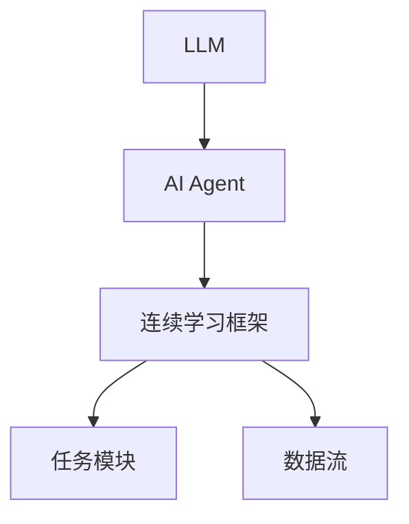
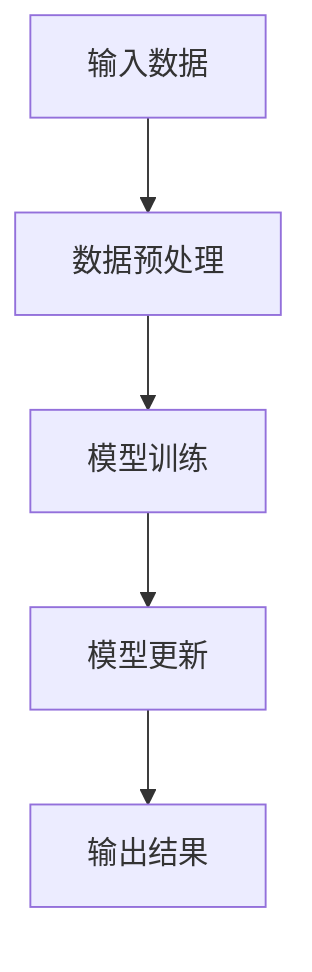
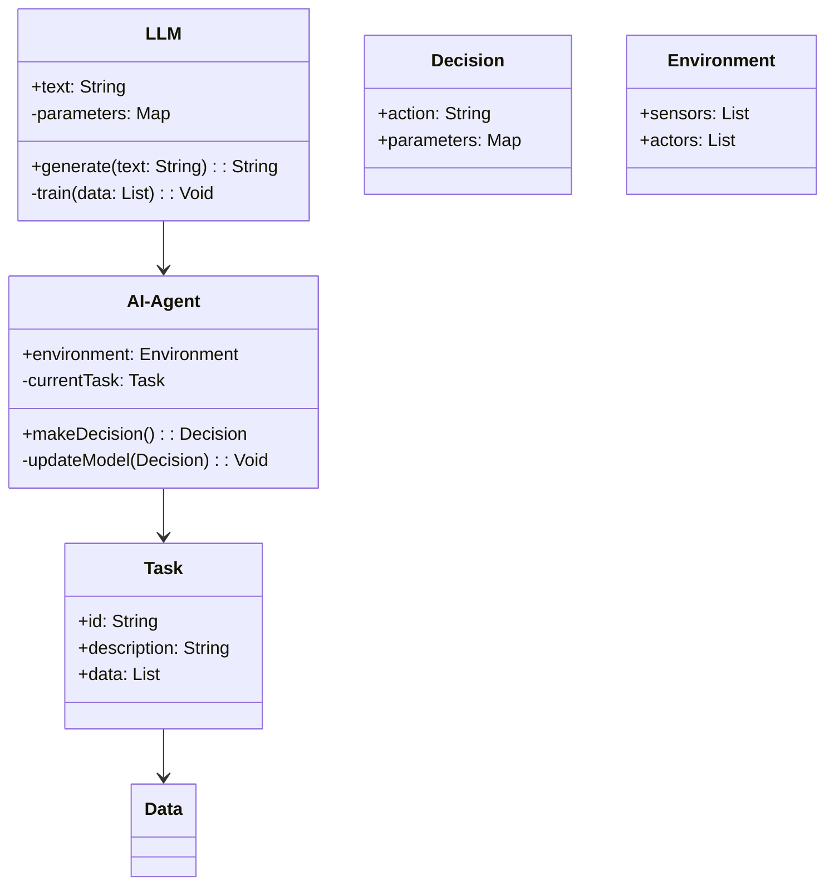
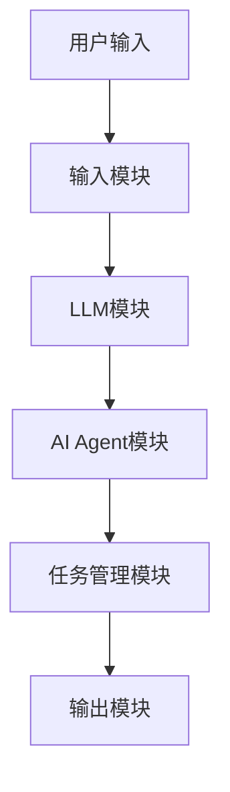
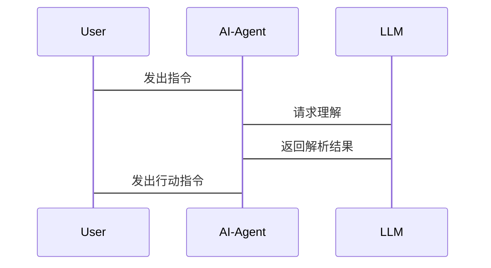

                 


# LLM驱动的AI Agent连续学习框架

> 关键词：LLM, AI Agent, 连续学习框架, 机器学习, 自然语言处理

> 摘要：本文深入探讨了LLM（大语言模型）驱动的AI Agent连续学习框架的设计与实现，分析了其在复杂动态环境中的应用价值。通过理论与实践结合的方式，详细阐述了框架的核心概念、算法原理、系统架构以及项目实现，为读者提供了一个全面的理解和应用指南。

---

# 第一部分: LLM驱动的AI Agent连续学习框架概述

# 第1章: LLM驱动的AI Agent连续学习框架背景介绍

## 1.1 问题背景与描述

### 1.1.1 AI Agent的定义与特点

AI Agent（人工智能代理）是指在计算机系统中能够感知环境并采取行动以实现目标的实体。其特点包括：

- **自主性**：能够在没有外部干预的情况下自主决策。
- **反应性**：能够实时感知环境并做出反应。
- **目标导向**：所有行为都围绕特定目标展开。
- **学习能力**：通过与环境交互不断优化自身行为。

### 1.1.2 LLM在AI Agent中的作用

大语言模型（LLM，Large Language Model）通过其强大的文本理解和生成能力，为AI Agent提供了以下关键能力：

- **自然语言理解**：能够准确理解用户意图或环境信息。
- **知识表示**：能够将复杂的信息转化为结构化的知识表示。
- **决策支持**：通过生成多种可能的决策方案，辅助AI Agent做出最优选择。

### 1.1.3 连续学习框架的必要性

在动态变化的环境中，AI Agent需要不断适应新的信息和任务。传统的离线学习方法无法满足实时更新的需求，因此需要一种能够持续学习的框架，使AI Agent在实际应用中保持性能的稳定性。

---

## 1.2 问题解决与边界

### 1.2.1 AI Agent连续学习的核心问题

- **模型更新**：如何在不破坏现有功能的前提下，逐步优化模型参数。
- **数据流处理**：如何高效处理实时数据流并更新模型。
- **任务迁移**：如何在新任务中快速适应并保持高性能。

### 1.2.2 连续学习的边界与外延

- **边界**：仅关注模型参数的持续优化，不涉及模型架构的改变。
- **外延**：与在线学习、增量学习等概念有交集，但更注重长期任务的持续优化。

### 1.2.3 框架的核心要素与组成

- **LLM模块**：负责自然语言理解和生成。
- **学习引擎**：负责模型参数的持续优化。
- **任务管理模块**：负责任务的分配与调度。

---

## 1.3 核心概念结构

### 1.3.1 LLM与AI Agent的关系

LLM作为AI Agent的核心模块，为其提供语言理解和生成能力，而AI Agent则为LLM提供决策支持和任务导向。

### 1.3.2 连续学习的机制

通过实时数据流的输入，AI Agent能够不断调整其行为策略，优化模型参数，以适应环境的变化。

### 1.3.3 框架的模块划分

- **输入模块**：接收实时数据流。
- **处理模块**：对数据进行预处理和特征提取。
- **学习模块**：更新模型参数。
- **输出模块**：生成决策指令。

---

## 1.4 本章小结

本章从背景、问题和核心概念三个方面介绍了LLM驱动的AI Agent连续学习框架的基本情况，为后续内容奠定了基础。

---

# 第二部分: 核心概念与联系

# 第2章: 核心概念原理

## 2.1 LLM驱动的AI Agent原理

### 2.1.1 LLM的输入输出机制

LLM通过接收文本输入，生成与输入相关的文本输出。其输入可以是用户指令或环境信息，输出则是对指令的响应或对环境的分析结果。

### 2.1.2 AI Agent的决策流程

1. **感知环境**：通过传感器或API获取环境信息。
2. **理解需求**：利用LLM对信息进行理解和解析。
3. **生成决策**：基于理解结果，生成多个决策方案。
4. **选择最优方案**：通过评估模型选择最优决策。
5. **执行行动**：将决策转化为具体行动。

### 2.1.3 连续学习的数学模型

连续学习的目标是通过实时更新模型参数 $\theta$，使得模型在新的任务中保持高性能。数学模型如下：

$$ \theta_{t+1} = \theta_t + \alpha \cdot (\theta^* - \theta_t) $$

其中，$\alpha$ 是学习率，$\theta^*$ 是目标参数。

---

## 2.2 核心概念对比

### 2.2.1 LLM与传统NLP模型的对比

| 对比维度 | LLM | 传统NLP模型 |
|----------|-----|-------------|
| 参数量   | 大  | 小           |
| 训练数据 | 大规模 | 小规模       |
| 模型复杂度 | 高 | 低           |

### 2.2.2 AI Agent与传统AI系统的对比

| 对比维度 | AI Agent | 传统AI系统 |
|----------|----------|------------|
| 自主性   | 高       | 低         |
| 反应性   | 高       | 低         |
| 适应性   | 高       | 低         |

### 2.2.3 连续学习与在线学习的对比

| 对比维度 | 连续学习 | 在线学习 |
|----------|----------|----------|
| 数据来源 | 实时数据流 | 实时数据流 |
| 模型更新 | 微调参数 | 微调参数 |
| 任务目标 | 长期优化 | 即时优化 |

---

## 2.3 ER实体关系图



---

## 2.4 本章小结

本章通过对比和图解的方式，详细阐述了核心概念之间的关系和区别，为后续的算法设计奠定了基础。

---

# 第三部分: 算法原理讲解

# 第3章: 算法原理与数学模型

## 3.1 连续学习框架的算法流程

### 3.1.1 数据预处理

1. **数据清洗**：去除噪声数据。
2. **特征提取**：提取关键特征。
3. **数据增强**：增加数据多样性。

### 3.1.2 模型训练

1. **预训练**：在大规模数据集上进行初始训练。
2. **微调**：在特定任务数据上进行微调。

### 3.1.3 模型更新

1. **参数更新**：通过优化器更新模型参数。
2. **模型评估**：评估模型性能并调整参数。

---

## 3.2 算法的数学模型

### 3.2.1 损失函数

$$ L = \frac{1}{n}\sum_{i=1}^{n}(y_i - \hat{y_i})^2 $$

其中，$y_i$ 是真实标签，$\hat{y_i}$ 是模型预测值。

### 3.2.2 优化器

$$ \theta_{new} = \theta_{old} - \eta \cdot \nabla L $$

其中，$\eta$ 是学习率，$\nabla L$ 是损失函数的梯度。

### 3.2.3 连续学习的更新公式

$$ \theta_{t+1} = \theta_t + \alpha \cdot (\theta^* - \theta_t) $$

其中，$\alpha$ 是学习率，$\theta^*$ 是目标参数。

---

## 3.3 算法流程图



---

## 3.4 本章小结

本章通过数学模型和流程图的形式，详细讲解了连续学习框架的算法原理，为后续的系统设计提供了理论基础。

---

# 第四部分: 系统分析与架构设计

# 第4章: 系统架构设计方案

## 4.1 问题场景介绍

### 4.1.1 连续学习框架的应用场景

- **智能客服**：实时处理用户的咨询请求。
- **自动驾驶**：实时调整驾驶策略。
- **智能推荐系统**：实时更新推荐内容。

### 4.1.2 系统的输入输出描述

- **输入**：实时数据流、用户指令。
- **输出**：决策指令、系统反馈。

### 4.1.3 系统的性能需求

- **响应时间**：小于1秒。
- **处理能力**：支持高并发请求。

---

## 4.2 系统功能设计

### 4.2.1 领域模型设计



### 4.2.2 系统架构设计



---

## 4.3 系统接口设计

### 4.3.1 输入接口

- **API接口**：接收实时数据流。
- **命令行接口**：接收用户指令。

### 4.3.2 输出接口

- **API接口**：输出决策指令。
- **命令行接口**：输出系统反馈。

---

## 4.4 系统交互设计



---

## 4.5 本章小结

本章通过系统架构图和交互图的形式，详细描述了LLM驱动的AI Agent连续学习框架的系统设计，为后续的项目实现提供了指导。

---

# 第五部分: 项目实战

# 第5章: 项目实现与案例分析

## 5.1 环境安装

### 5.1.1 系统需求

- **操作系统**：Linux/MacOS/Windows
- **Python版本**：3.8+
- **依赖库**：numpy, torch, transformers

### 5.1.2 安装步骤

```bash
pip install numpy torch transformers
```

---

## 5.2 系统核心实现源代码

### 5.2.1 LLM模块实现

```python
import torch
from transformers import AutoTokenizer, AutoModelForCausalLM

class LLMModule:
    def __init__(self, model_name="gpt2"):
        self.tokenizer = AutoTokenizer.from_pretrained(model_name)
        self.model = AutoModelForCausalLM.from_pretrained(model_name)
    
    def generate(self, input_text):
        inputs = self.tokenizer.encode(input_text, return_tensors="pt")
        outputs = self.model.generate(inputs, max_length=50)
        return self.tokenizer.decode(outputs[0], skip_special_tokens=True)
```

### 5.2.2 AI Agent模块实现

```python
class AI-Agent:
    def __init__(self, llm_module):
        self.llm = llm_module
        self.current_task = None
    
    def make_decision(self, input_text):
        understanding = self.llm.generate(input_text)
        # 处理理解结果，生成决策
        return "执行" + understanding
```

---

## 5.3 代码应用解读与分析

### 5.3.1 代码结构

- **LLMModule**：负责自然语言理解和生成。
- **AI-Agent**：负责接收输入，调用LLM进行理解，并生成决策。

### 5.3.2 代码实现细节

- **模型加载**：使用预训练好的LLM模型。
- **输入处理**：将输入文本转换为模型可理解的形式。
- **决策生成**：基于模型输出生成决策指令。

---

## 5.4 实际案例分析和详细讲解剖析

### 5.4.1 案例场景

假设我们有一个智能客服系统，客户发送了一条咨询消息：“我的订单状态如何？”

### 5.4.2 系统处理流程

1. **输入模块**：接收客户消息。
2. **LLM模块**：理解客户意图。
3. **AI Agent**：生成查询订单状态的决策。
4. **输出模块**：发送查询请求，返回结果。

---

## 5.5 项目小结

本章通过实际案例，详细讲解了框架的实现过程，展示了如何将理论应用于实际场景。

---

# 第六部分: 总结与展望

# 第6章: 总结与展望

## 6.1 核心观点总结

- LLM驱动的AI Agent连续学习框架能够实时优化模型参数，提高系统性能。
- 通过模块化设计，使得系统具有良好的扩展性和可维护性。

## 6.2 未来展望

- **模型优化**：探索更高效的模型更新方法。
- **多模态支持**：将视觉、听觉等多模态信息融入框架。
- **分布式部署**：实现高可用性的分布式架构。

## 6.3 最佳实践 tips

- **数据质量管理**：确保输入数据的质量。
- **模型监控**：实时监控模型性能，及时调整参数。
- **系统安全**：确保系统安全性和数据隐私。

## 6.4 小结

本文详细探讨了LLM驱动的AI Agent连续学习框架的设计与实现，为未来的研究和应用提供了重要的参考。

---

# 作者

作者：AI天才研究院/AI Genius Institute & 禅与计算机程序设计艺术 /Zen And The Art of Computer Programming

---

感谢您的阅读！希望本文能为您提供有价值的技术见解和实践指导。

