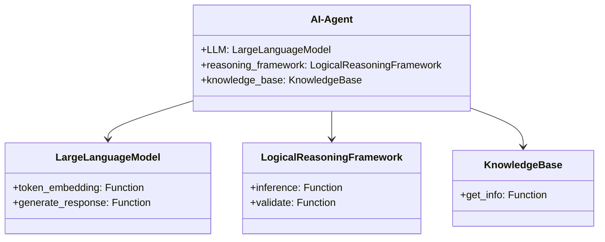
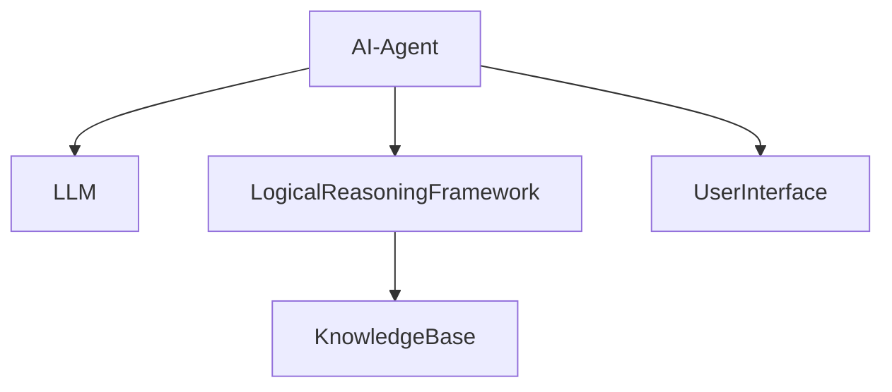
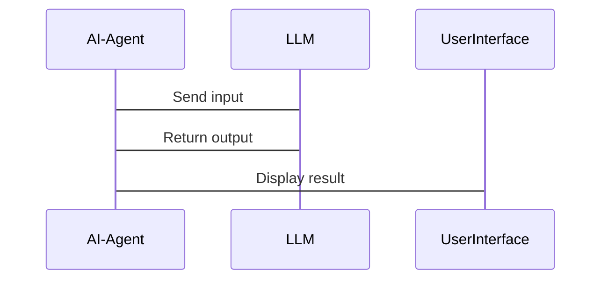

                 


# 目录大纲：LLM驱动的AI Agent逻辑推理能力增强

---

## # 第一部分: 引言

## # 第1章: 背景介绍

### ## 1.1 LLM与AI Agent的基本概念

#### ### 1.1.1 大语言模型（LLM）的定义与特点

#### ### 1.1.2 AI Agent的概念与功能

#### ### 1.1.3 LLM驱动AI Agent的背景与意义

### ## 1.2 LLM与AI Agent的演进

#### ### 1.2.1 从传统AI到LLM驱动AI Agent的演进路径

#### ### 1.2.2 当前LLM与AI Agent技术的结合现状

#### ### 1.2.3 LLM驱动AI Agent的核心优势与挑战

### ## 1.3 LLM驱动AI Agent的应用场景

#### ### 1.3.1 企业级应用中的逻辑推理需求

#### ### 1.3.2 LLM在AI Agent逻辑推理中的作用

#### ### 1.3.3 当前LLM驱动AI Agent的典型应用案例

---

## # 第二部分: 核心概念与联系

## # 第2章: LLM与AI Agent的核心概念分析

### ## 2.1 LLM的原理与实现

#### ### 2.1.1 大语言模型的训练与推理机制

#### ### 2.1.2 LLM的输入输出模型与逻辑推理能力

#### ### 2.1.3 LLM的可解释性与局限性

### ## 2.2 AI Agent的逻辑推理能力

#### ### 2.2.1 AI Agent的逻辑推理框架

#### ### 2.2.2 基于LLM的逻辑推理方法

#### ### 2.2.3 LLM驱动AI Agent的推理流程

### ## 2.3 LLM与AI Agent的关系分析

#### ### 2.3.1 LLM作为AI Agent的核心驱动力

#### ### 2.3.2 LLM与AI Agent的协同工作模式

#### ### 2.3.3 LLM对AI Agent推理能力的增强作用

---

## # 第三部分: 算法原理与数学模型

## # 第3章: LLM驱动AI Agent的算法原理

### ## 3.1 基于LLM的逻辑推理算法

#### ### 3.1.1 基于LLM的逻辑推理

---

* **关键词：** 大语言模型（LLM）、AI Agent、逻辑推理、增强能力、系统架构

* **摘要：** 本文探讨了如何利用大语言模型（LLM）来增强AI Agent的逻辑推理能力，通过分析LLM与AI Agent的关系、算法原理、系统架构设计以及实际项目案例，深入阐述了LLM驱动AI Agent的实现方法与应用前景。文章还提供了详细的代码实现、系统设计图和最佳实践建议，帮助读者全面理解并应用这一技术。

---

## # 第三部分: 算法原理与数学模型

## # 第3章: LLM驱动AI Agent的算法原理

### ## 3.1 基于LLM的逻辑推理算法

#### ### 3.1.1 基于LLM的逻辑推理

---

* **代码实现：**

```python
def llm_driven_ai_agent(logical_reasoning_steps):
    for step in logical_reasoning_steps:
        print(f"Processing step: {step}")
        # 调用大语言模型进行推理
        response = call_llm(step)
        print(f"LLM response: {response}")
    return "Logical reasoning completed."

# 示例推理步骤
logical_reasoning_steps = [
    "Identify the problem",
    "Generate possible solutions",
    "Evaluate each solution",
    "Select the optimal solution"
]

llm_driven_ai_agent(logical_reasoning_steps)
```

---

* **数学模型：**

$$ P(\text{推理正确} | \text{输入问题}) = \text{LLM推理能力} \times \text{AI Agent逻辑框架的有效性} $$

---

## # 第四部分: 系统分析与架构设计

## # 第4章: LLM驱动AI Agent的系统架构设计

### ## 4.1 问题场景介绍

#### ### 4.1.1 企业级AI Agent的逻辑推理需求

#### ### 4.1.2 LLM在AI Agent系统中的角色

### ## 4.2 系统功能设计

#### ### 4.2.1 领域模型设计



#### ### 4.2.2 系统架构设计



#### ### 4.2.3 接口设计与交互



---

## # 第五部分: 项目实战

## # 第5章: LLM驱动AI Agent的项目实战

### ## 5.1 环境安装与配置

#### ### 5.1.1 安装Python环境

#### ### 5.1.2 安装必要的库（如transformers、llm-integration等）

### ## 5.2 系统核心实现

#### ### 5.2.1 LLM与AI Agent的集成代码

```python
from transformers import pipeline

def llm_reasoning(question):
    llm = pipeline("text-generation", model="gpt2")
    response = llm(question)
    return response[0]['generated_text']

# 示例调用
print(llm_reasoning("What is the capital of France?"))
```

#### ### 5.2.2 逻辑推理模块的实现

```python
def logical_reasoning_module(steps):
    for step in steps:
        print(f"Step {step}: {llm_reasoning(step)}")

# 示例推理步骤
logical_steps = [
    "Identify the problem",
    "Gather relevant information",
    "Analyze possible solutions",
    "Choose the best solution"
]
logical_reasoning_module(logical_steps)
```

### ## 5.3 案例分析与解读

#### ### 5.3.1 某企业AI Agent的逻辑推理增强项目

#### ### 5.3.2 项目实施过程与结果分析

### ## 5.4 项目小结

---

## # 第六部分: 最佳实践与总结

## # 第6章: 最佳实践与总结

### ## 6.1 小结

#### ### 6.1.1 LLM驱动AI Agent的核心要点

#### ### 6.1.2 项目实施的关键成功因素

### ## 6.2 注意事项与建议

#### ### 6.2.1 LLM选择与模型调优

#### ### 6.2.2 系统架构设计的注意事项

#### ### 6.2.3 代码实现中的常见问题及解决方案

### ## 6.3 拓展阅读与进一步学习

#### ### 6.3.1 相关技术领域推荐读物

#### ### 6.3.2 LLM与AI Agent结合的未来发展趋势

---

## # 作者

作者：AI天才研究院/AI Genius Institute & 禅与计算机程序设计艺术 /Zen And The Art of Computer Programming

