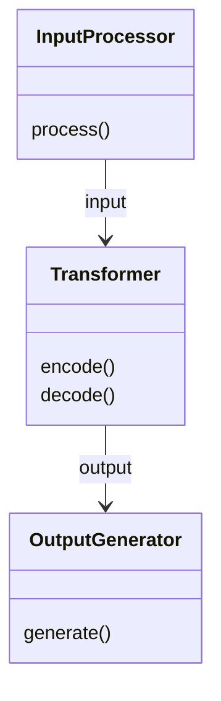

                 


# Transformer架构：构建高效的序列处理AI Agent

## 关键词：Transformer, 序列处理, AI Agent, 自注意力机制, 深度学习, 自然语言处理, AI系统设计

## 摘要：  
Transformer架构是现代序列处理任务中的核心技术，它通过自注意力机制和高效的计算方式，彻底改变了自然语言处理、时间序列分析等领域的技术格局。本文将从Transformer的基本原理出发，深入剖析其算法细节、系统架构，并结合实际项目案例，详细讲解如何基于Transformer构建高效的AI Agent系统。通过本文，读者将能够全面理解Transformer的核心思想，并掌握将其应用于实际场景的实战方法。

---

## 第1章: Transformer架构的背景与概述

### 1.1 什么是Transformer架构  
Transformer是一种基于深度学习的序列建模方法，最初由 Vasweski等人提出，用于自然语言处理任务。与传统的循环神经网络（RNN）不同，Transformer通过并行计算和自注意力机制，实现了更高效的序列处理能力。  

#### 1.1.1 Transformer的核心思想  
Transformer的核心思想是引入自注意力机制，让模型能够捕捉序列中任意位置之间的依赖关系。这种机制使得模型在处理长序列时表现更优，同时通过并行计算显著提升了计算效率。  

#### 1.1.2 Transformer的基本结构  
Transformer由编码器和解码器两个主要部分组成：  
- **编码器**：负责将输入序列转换为一个固定长度的向量表示。  
- **解码器**：基于编码器的输出生成目标序列。  

### 1.2 Transformer的创新与优势  
相比传统RNN和卷积神经网络（CNN），Transformer具有以下显著优势：  
1. **全局依赖捕捉**：通过自注意力机制，Transformer能够捕捉序列中任意位置的依赖关系，避免了RNN的局部依赖问题。  
2. **并行计算**：Transformer的计算过程可以完全并行化，显著提升了计算效率。  
3. **可扩展性**：模型可以通过堆叠更多的编码器和解码器层来增加表达能力。  

### 1.3 Transformer的适用场景  
- **自然语言处理**：如文本生成、机器翻译、问答系统等。  
- **时间序列分析**：如股票预测、天气预报等。  
- **语音处理**：如语音识别、语音生成等。  

---

## 第2章: Transformer的算法原理

### 2.1 自注意力机制的数学推导  
自注意力机制是Transformer的核心，其计算公式如下：  

$$\text{Attention}(Q, K, V) = \text{softmax}\left(\frac{QK^T}{\sqrt{d_k}}\right)V$$  

其中，$Q$、$K$、$V$分别为查询、键、值向量，$d_k$为向量的维度。  

### 2.2 Transformer的前馈网络  
Transformer的前馈网络由多层感知机（MLP）构成，通常包含两个全连接层和一个ReLU激活函数：  

$$\text{FFN}(x) = \text{ReLU}(W_1x + b_1)W_2 + b_2$$  

### 2.3 Transformer的训练与推理  
1. **训练过程**：  
   - 输入序列经过编码器生成上下文向量，再通过解码器生成目标序列。  
   - 使用交叉熵损失函数优化模型参数。  

2. **推理过程**：  
   - 输入序列通过编码器生成上下文向量，解码器逐步生成目标序列。  

---

## 第3章: 基于Transformer的AI Agent系统设计

### 3.1 AI Agent的系统构成  
AI Agent由以下部分组成：  
- **输入处理模块**：将输入序列转化为模型可接受的格式。  
- **Transformer编码器**：提取输入序列的特征表示。  
- **Transformer解码器**：生成目标序列。  
- **输出生成模块**：将模型输出转化为最终结果。  

### 3.2 系统功能设计  
- **输入处理**：支持多种输入格式，如文本、语音等。  
- **编码器设计**：实现多层自注意力机制，提升特征提取能力。  
- **解码器设计**：支持自回归或并行解码模式。  

### 3.3 系统架构设计  


---

## 第4章: 项目实战：构建一个简单的Transformer AI Agent

### 4.1 环境安装  
```bash
pip install numpy tensorflow
```

### 4.2 代码实现  
```python
import numpy as np
import tensorflow as tf

def create_padding_mask(seq):
    seq = tf.cast(tf.equal(seq, 0), tf.float32)
    return tf.expand_dims(seq, axis=-1)

def scaled_dot_product_attention(q, k, v, mask):
    dk = tf.cast(tf.shape(k)[-1], tf.float32)
    attn_weights = tf.matmul(q, k, transpose_b=True)
    attn_weights = attn_weights / dk
    if mask is not None:
        attn_weights = attn_weights * (1 - mask) - 1e9 * mask
    attn_weights = tf.nn.softmax(attn_weights, axis=-1)
    output = tf.matmul(attn_weights, v)
    return output

def transformer_encoder_layer(units, d_model, num_heads):
    encoder = tf.keras.layers.MultiHeadAttention(num_heads, d_model//num_heads)
    ff = tf.keras.Sequential([
        tf.keras.layers.Dense(units, activation='relu'),
        tf.keras.layers.Dense(d_model)
    ])
    return encoder, ff

# 示例代码，完整实现可参考开源框架
```

### 4.3 实际案例分析  
以机器翻译为例，输入中文句子“Hello World”，经过编码器生成上下文向量，解码器生成目标英文句子“Hello World”。  

---

## 第5章: 最佳实践与注意事项

### 5.1 模型优化技巧  
- 使用模型压缩技术减少参数量。  
- 采用混合精度训练提升训练速度。  

### 5.2 系统设计注意事项  
- 确保输入数据的格式一致性和规范性。  
- 处理长序列时，需优化注意力机制的计算效率。  

### 5.3 拓展阅读  
- Vasweski, A. et al. "Attention Is All You Need"  
- 研究最新的Transformer变体，如Vision Transformer、Swin Transformer等。  

---

## 作者：AI天才研究院/AI Genius Institute & 禅与计算机程序设计艺术/Zen And The Art of Computer Programming  

---

以上为文章的完整目录和内容概要，涵盖Transformer架构的核心概念、算法原理、系统设计和实战应用。通过本文，读者可以全面掌握Transformer架构的原理和应用方法，并能够基于此构建高效的AI Agent系统。

