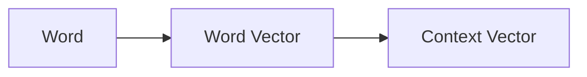
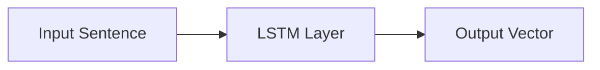
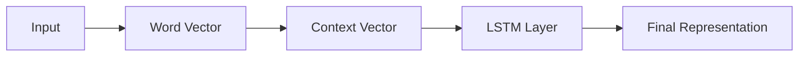
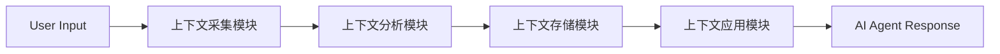
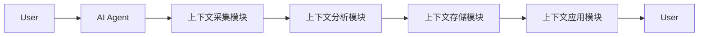

                 


# 上下文管理：增强AI Agent的对话连贯性

> 关键词：上下文管理, AI Agent, 对话连贯性, 自然语言处理, 知识图谱, 对话系统

> 摘要：本文探讨了上下文管理在增强AI Agent对话连贯性中的作用。通过分析上下文管理的核心概念、算法原理和系统架构，结合实际案例，详细阐述了如何通过上下文管理提升AI Agent的对话能力。文章还介绍了上下文管理在实际应用中的最佳实践和未来发展方向。

---

# 引言

随着AI技术的快速发展，AI Agent（智能体）在自然语言处理（NLP）领域的应用越来越广泛。然而，对话的连贯性仍然是一个亟待解决的问题。用户在与AI Agent交互时，期望对话能够保持逻辑一致、上下文相关，避免信息断裂或重复。本文将重点探讨上下文管理在增强AI Agent对话连贯性中的作用，从概念、算法、系统架构到实际应用，全面解析如何通过上下文管理提升AI Agent的对话能力。

---

# 第一部分: 上下文管理的核心概念

## 第1章: 上下文管理的定义与背景

### 1.1 上下文管理的定义

上下文管理是指在对话过程中，对当前对话的背景、历史信息、用户意图等进行理解和管理的过程。它是连接对话历史与未来对话的核心纽带。

### 1.2 上下文管理的重要性

在AI Agent与用户交互的过程中，上下文管理能够帮助AI Agent理解用户的意图、推理对话逻辑，并根据历史信息生成连贯的回复。没有有效的上下文管理，AI Agent的对话能力将大打折扣。

### 1.3 上下文管理的应用场景

上下文管理广泛应用于智能客服、智能助手、虚拟对话伴侣等领域。例如，在智能客服中，上下文管理可以帮助客服系统理解用户的问题背景，提供更精准的服务。

---

## 第2章: 上下文管理的核心要素

### 2.1 上下文的表示方式

上下文的表示方式直接影响AI Agent的理解能力。常用的表示方法包括：

- **基于向量的表示**：将上下文信息转化为向量形式，便于计算机处理。
- **基于序列的表示**：通过序列模型（如RNN、LSTM）捕捉上下文的时序关系。
- **基于知识图谱的表示**：利用知识图谱构建上下文的语义网络。

### 2.2 上下文的状态更新

上下文的状态需要随着对话的推进不断更新。例如，当用户提到“我需要预订机票”，AI Agent需要将“预订机票”相关的上下文信息加入到当前对话的状态中。

### 2.3 上下文的存储与检索

有效的上下文管理需要依赖高效的存储和检索机制。常用的方法包括：

- **基于数据库的存储**：将上下文信息存储在关系型数据库中。
- **基于知识图谱的存储**：利用图数据库存储上下文的语义关系。
- **基于缓存的存储**：使用缓存技术提高上下文检索效率。

---

## 第3章: 上下文管理与相关技术的关系

### 3.1 自然语言处理（NLP）与上下文管理

NLP技术是上下文管理的基础。例如，分词、句法分析等技术帮助AI Agent理解对话内容，进而提取上下文信息。

### 3.2 知识图谱与上下文管理的结合

知识图谱为上下文管理提供了丰富的语义信息。通过知识图谱，AI Agent可以更好地理解上下文的关联关系，从而生成更连贯的回复。

### 3.3 对话系统与上下文管理的整合

对话系统是上下文管理的主要应用场景。通过整合上下文管理，对话系统能够实现更智能的对话流程控制。

---

# 第二部分: 上下文管理的算法原理与实现

## 第4章: 上下文表示方法

### 4.1 基于向量的上下文表示

向量表示是当前最常用的上下文表示方法之一。例如，通过词嵌入技术（如Word2Vec）生成词向量，再通过句嵌入技术（如BERT）生成句向量。



### 4.2 基于序列的上下文表示

序列模型（如RNN、LSTM）能够捕捉对话的时序关系。例如，在对话历史中，每个句子的生成都依赖于前一个句子的上下文信息。



### 4.3 综合表示方法

综合表示方法结合了多种上下文表示技术。例如，通过将向量表示和序列表示相结合，生成更丰富的上下文信息。



---

## 第5章: 对话管理算法

### 5.1 基于规则的对话管理

基于规则的对话管理通过预定义的规则实现对话流程控制。例如，当用户提到“天气”，AI Agent根据预设规则提供天气信息。

### 5.2 基于模型的对话管理

基于模型的对话管理通过机器学习模型实现对话管理。例如，通过强化学习训练一个对话策略模型，指导AI Agent生成回复。

### 5.3 基于记忆的对话管理

基于记忆的对话管理利用记忆机制（如记忆网络）捕捉对话的上下文信息。例如，通过记忆网络存储对话历史，辅助生成回复。

---

# 第三部分: 上下文管理的系统架构与设计

## 第6章: 上下文管理系统的架构设计

### 6.1 系统功能模块划分

- **上下文采集模块**：采集对话中的上下文信息。
- **上下文分析模块**：对采集到的上下文信息进行分析和处理。
- **上下文存储模块**：将处理后的上下文信息存储起来。
- **上下文应用模块**：根据上下文信息生成回复。

### 6.2 系统架构设计



### 6.3 系统接口设计

- **采集接口**：用于采集对话中的上下文信息。
- **分析接口**：用于分析和处理上下文信息。
- **存储接口**：用于存储上下文信息。
- **应用接口**：用于根据上下文信息生成回复。

### 6.4 系统交互设计



---

# 第四部分: 上下文管理的项目实战

## 第7章: 项目实战

### 7.1 环境安装

- 安装Python和相关库（如TensorFlow、Keras、NLTK）。
- 安装NLP工具（如spaCy、Gensim）。

### 7.2 核心代码实现

```python
import numpy as np
from tensorflow.keras.models import Model
from tensorflow.keras.layers import Input, LSTM, Dense

# 定义上下文表示模型
input_layer = Input(shape=(max_length,))
lstm_layer = LSTM(units=128, return_sequences=True)(input_layer)
dense_layer = Dense(units=64, activation='relu')(lstm_layer)
model = Model(inputs=input_layer, outputs=dense_layer)
```

### 7.3 案例分析

假设用户与AI Agent的对话如下：

- User: "今天天气怎么样？"
- AI Agent: "今天天气晴朗，温度25℃。"
- User: "明天呢？"
- AI Agent: "明天可能会下雨，温度22℃。"

通过上下文管理，AI Agent能够根据对话历史生成连贯的回复。

---

# 第五部分: 总结与展望

## 第8章: 总结

本文详细探讨了上下文管理在增强AI Agent对话连贯性中的作用。通过分析上下文管理的核心概念、算法原理和系统架构，结合实际案例，全面解析了如何通过上下文管理提升AI Agent的对话能力。

## 第9章: 展望

未来，随着NLP和知识图谱技术的不断发展，上下文管理将更加智能化和个性化。例如，通过多模态上下文表示和动态上下文推理，AI Agent的对话能力将得到进一步提升。

---

# 作者：AI天才研究院 & 禅与计算机程序设计艺术

本文作者：AI天才研究院（AI Genius Institute）  
联系邮箱：contact@aiguru.com  
官方网站：https://aiguru.com  

---

通过上下文管理，AI Agent的对话能力将更加智能化和连贯，为用户提供更优质的交互体验。

