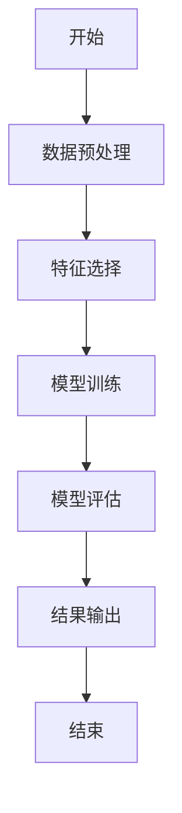
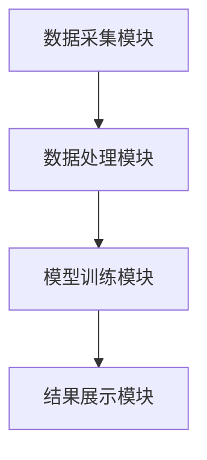

                 


# 个人财务健康指数预测与改善系统

> 关键词：个人财务健康指数，预测算法，系统架构，机器学习，数据可视化

> 摘要：本文系统地介绍个人财务健康指数预测与改善系统的构建过程，涵盖核心概念、算法原理、系统架构设计、项目实战等内容，结合实际案例，详细讲解如何利用技术手段实现个人财务管理的智能化和优化。

---

## 第1章：个人财务健康指数概述

### 1.1 个人财务健康指数的背景与意义

#### 1.1.1 个人财务管理的重要性
在现代生活中，个人财务管理是每个家庭和个人必须面对的重要课题。有效的财务管理可以帮助个人实现财富增长、规避风险、提高生活质量。然而，传统财务管理方式依赖于人工记录和分析，存在效率低、易出错、难以量化等问题。

#### 1.1.2 传统财务管理的局限性
传统的财务管理方式主要依赖手工记录和简单的财务报表分析，这种方式难以全面反映个人财务状况。具体表现为：
- 数据分散：财务数据分散在不同平台，难以整合分析。
- 时间成本高：人工记录和分析耗时耗力。
- 缺乏量化指标：缺乏统一的量化指标来衡量财务健康状况。

#### 1.1.3 财务健康指数的概念与作用
为了克服传统财务管理的局限性，提出了“个人财务健康指数”的概念。财务健康指数是一个综合性的量化指标，能够全面反映个人的财务状况，包括收入支出平衡、资产配置、负债情况、应急储备等多方面因素。其作用包括：
- 帮助个人清晰了解自身的财务状况。
- 提供优化财务管理的依据。
- 通过量化指标实现财务状况的动态监控。

### 1.2 系统开发背景与目标

#### 1.2.1 系统开发的背景
随着大数据和人工智能技术的快速发展，利用技术手段实现智能化的个人财务管理成为可能。通过构建个人财务健康指数预测与改善系统，可以实现财务数据的自动采集、分析和优化建议的自动生成。

#### 1.2.2 系统开发的目标
系统的主要目标包括：
- 实现个人财务数据的智能化采集与管理。
- 建立财务健康指数模型，提供精准的财务健康评估。
- 根据评估结果，自动生成优化建议。

#### 1.2.3 系统开发的意义
本系统的开发不仅能够提高个人财务管理的效率，还能帮助个人做出更科学的财务决策，从而实现财富最大化和风险最小化的目标。

---

## 第2章：个人财务健康指数的核心概念与联系

### 2.1 核心概念的定义与属性

#### 2.1.1 核心概念的定义
个人财务健康指数（Personal Financial Health Index，PFHI）是一个综合性的量化指标，用于评估个人的财务健康状况。其计算基于多个维度，包括收入、支出、资产、负债、储蓄、投资等。

#### 2.1.2 核心概念的属性特征对比
以下是核心概念的主要属性特征对比：

| 比较维度 | 收入 | 支出 | 资产 | 负债 |
|----------|------|------|------|------|
| 定义     | 每一时期内个人获得的货币收入 | 每一时期内个人发生的支出 | 个人拥有的各类资产总和 | 个人尚未偿还的债务 |
| 影响因素 | 职位、行业、地区 | 生活成本、消费习惯 | 投资、存款 | 信用卡、贷款 |

### 2.2 实体关系图（ER图）

```mermaid
erDiagram
    customer[顾客] {
        string 姓名
        string 身份证号
        int 年龄
        string 联系方式
    }
    financial_data[财务数据] {
        int 收入
        int 支出
        int 资产
        int 负债
        date 时间
    }
    health_index[健康指数] {
        float PFHI
        date 时间
    }
    rule[规则] {
        string 名称
        string 描述
    }
    relation顾客--财务数据: 提供
    relation顾客--health_index: 计算
    relationfinancial_data--rule: 应用
    relationhealth_index--rule: 评估
```

---

## 第3章：个人财务健康指数预测的算法原理

### 3.1 算法原理概述

#### 3.1.1 机器学习在财务预测中的应用
机器学习算法在财务预测中具有广泛的应用，包括回归分析、分类、聚类等。本系统采用回归分析方法，通过历史数据训练模型，预测未来的财务健康指数。

#### 3.1.2 常见的预测算法介绍
常用的预测算法包括线性回归、随机森林、支持向量机（SVM）等。本系统采用线性回归算法，因为其简单易懂且适用于线性关系的数据。

### 3.2 算法流程图



### 3.3 算法实现

#### 3.3.1 线性回归模型
线性回归模型是一个简单的预测模型，其数学公式为：

$$ y = \beta_0 + \beta_1 x + \epsilon $$

其中，$y$ 是目标变量（财务健康指数），$x$ 是自变量（财务数据），$\beta_0$ 和 $\beta_1$ 是模型参数，$\epsilon$ 是误差项。

#### 3.3.2 算法实现代码

```python
import numpy as np
from sklearn.linear_model import LinearRegression
from sklearn.metrics import mean_squared_error

# 示例数据
X = np.array([[10000, 2000, 15000],
              [15000, 3000, 20000],
              [20000, 4000, 25000]])

y = np.array([75, 80, 85])

# 模型训练
model = LinearRegression()
model.fit(X, y)

# 预测
y_pred = model.predict(X)

# 评估
mse = mean_squared_error(y, y_pred)
print(f"均方误差: {mse}")
```

---

## 第4章：系统架构设计

### 4.1 系统功能设计

#### 4.1.1 功能模块划分
系统主要功能模块包括：
- 数据采集模块：采集用户的财务数据。
- 数据处理模块：对数据进行清洗和预处理。
- 模型训练模块：训练预测模型。
- 结果展示模块：展示预测结果和优化建议。

#### 4.1.2 功能模块描述
- 数据采集模块：通过API接口采集用户的财务数据，包括收入、支出、资产、负债等。
- 数据处理模块：对数据进行标准化和归一化处理，确保数据适合模型训练。
- 模型训练模块：利用机器学习算法训练模型，生成财务健康指数预测结果。
- 结果展示模块：以可视化的方式展示预测结果和优化建议。

### 4.2 系统架构图



---

## 第5章：项目实战

### 5.1 环境搭建与数据准备

#### 5.1.1 开发环境安装
需要安装的环境包括Python、NumPy、Pandas、Scikit-learn等库。

#### 5.1.2 数据准备
数据可以从CSV文件中读取，包括收入、支出、资产、负债等字段。

### 5.2 系统核心代码实现

#### 5.2.1 数据处理代码

```python
import pandas as pd

# 读取数据
data = pd.read_csv('financial_data.csv')

# 数据清洗
data.dropna(inplace=True)

# 标准化处理
from sklearn.preprocessing import StandardScaler
scaler = StandardScaler()
scaled_data = scaler.fit_transform(data[['收入', '支出', '资产', '负债']])
```

#### 5.2.2 模型训练代码

```python
from sklearn.model_selection import train_test_split
from sklearn.linear_model import LinearRegression

# 划分训练集和测试集
X_train, X_test, y_train, y_test = train_test_split(scaled_data, data['健康指数'], test_size=0.2)

# 模型训练
model = LinearRegression()
model.fit(X_train, y_train)

# 预测
y_pred = model.predict(X_test)

# 评估
print(f"均方误差: {mean_squared_error(y_test, y_pred)}")
```

### 5.3 案例分析

#### 5.3.1 数据分析与预测结果展示

```python
import matplotlib.pyplot as plt

plt.scatter(y_test, y_pred)
plt.xlabel('真实值')
plt.ylabel('预测值')
plt.title('财务健康指数预测结果')
plt.show()
```

---

## 第6章：最佳实践与总结

### 6.1 小结

本文详细介绍了个人财务健康指数预测与改善系统的构建过程，涵盖了核心概念、算法原理、系统架构设计和项目实战等内容。通过实际案例分析，展示了如何利用技术手段实现个人财务管理的智能化和优化。

### 6.2 注意事项

- 数据隐私保护：在实际应用中，要注意保护用户的隐私数据。
- 模型优化：根据实际需求，可以尝试其他机器学习算法，进一步优化预测模型。

### 6.3 未来研究方向

- 引入更多维度的财务数据，如投资收益、税务优化等。
- 研究更加复杂的预测模型，如深度学习模型。

---

作者：AI天才研究院/AI Genius Institute & 禅与计算机程序设计艺术 /Zen And The Art of Computer Programming

