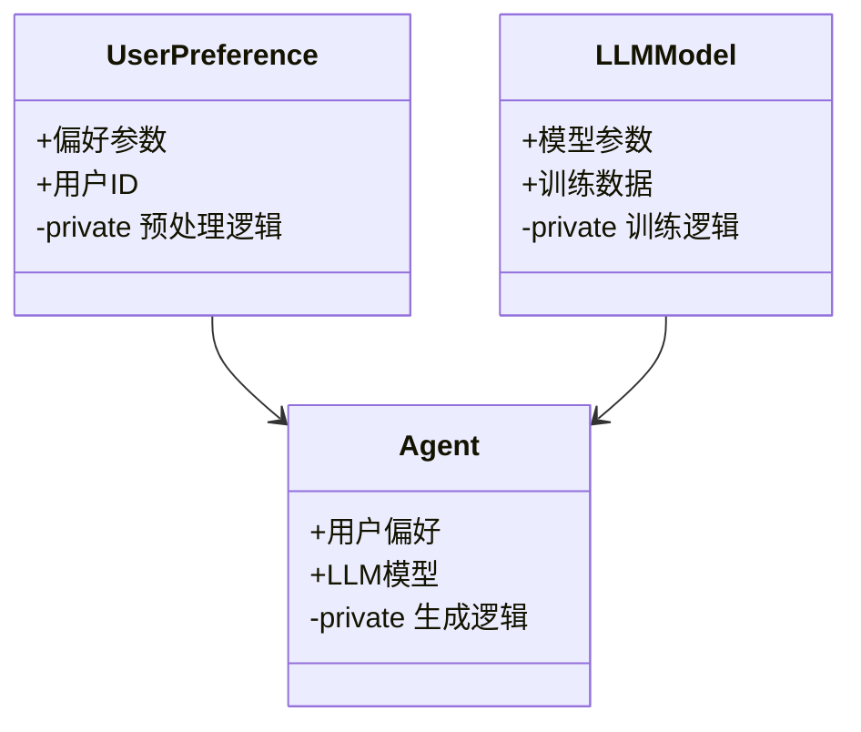
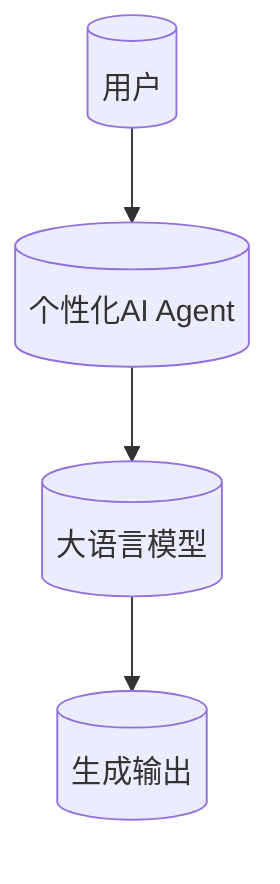

                 


# 个性化AI Agent：根据用户偏好定制LLM

## 关键词：个性化AI Agent, 大语言模型, LLM, 定制, 机器学习, 人工智能

## 摘要：个性化AI Agent通过根据用户的偏好定制大语言模型（LLM），实现更精准、更符合用户需求的智能化服务。本文将从背景、原理、算法、系统架构、实战到最佳实践，全面解析个性化LLM定制的核心内容。

---

## 第1章 个性化AI Agent概述

### 1.1 个性化AI Agent的基本概念

#### 1.1.1 什么是个性化AI Agent
个性化AI Agent是一种能够根据用户偏好、行为模式和需求，动态调整其输出和行为的智能代理。它通过深度学习和自然语言处理技术，提供高度个性化的交互体验。

#### 1.1.2 个性化AI Agent的核心特点
- **动态适应性**：根据用户反馈实时调整。
- **高度定制化**：基于用户偏好生成内容。
- **智能化**：具备自我学习和优化能力。

#### 1.1.3 个性化AI Agent与传统AI Agent的区别
| 特性 | 个性化AI Agent | 传统AI Agent |
|------|----------------|--------------|
| 适应性 | 动态调整输出 | 固定规则驱动 |
| 定制化 | 根据用户偏好 | 预设行为模式 |
| 智能性 | 具备学习能力 | 基于规则推理 |

### 1.2 大语言模型（LLM）的基本概念

#### 1.2.1 什么是大语言模型
大语言模型（LLM）是指基于大量数据训练的大型神经网络模型，具有强大的自然语言理解和生成能力。

#### 1.2.2 LLM的核心技术特点
- **深度学习**：采用多层神经网络结构。
- **注意力机制**：捕捉长距离依赖关系。
- **并行计算**：高效处理大规模数据。

#### 1.2.3 LLM的应用场景
- **对话生成**：智能客服、虚拟助手。
- **文本摘要**：信息抽取、内容压缩。
- **机器翻译**：跨语言通信。

### 1.3 个性化LLM定制的背景与意义

#### 1.3.1 个性化LLM定制的背景
随着用户需求的多样化，单一模型难以满足所有场景，因此需要根据用户偏好定制个性化LLM。

#### 1.3.2 个性化LLM定制的意义
- 提高用户体验。
- 优化模型性能。
- 支持个性化服务。

#### 1.3.3 个性化LLM定制的挑战与机遇
- **挑战**：计算资源消耗大、数据隐私问题。
- **机遇**：提供更精准的服务、提升用户满意度。

## 第2章 大语言模型（LLM）的核心原理

### 2.1 LLM的模型结构

#### 2.1.1 基于Transformer的模型结构
- **编码器-解码器结构**：编码器处理输入，解码器生成输出。
- **自注意力机制**：捕捉输入中的长距离依赖。

### 2.2 LLM的训练方法

#### 2.2.1 监督学习与无监督学习
- **监督学习**：基于标注数据进行训练。
- **无监督学习**：利用未标注数据进行自监督学习。

### 2.3 LLM的推理机制

#### 2.3.1 基于概率的生成机制
- **最大似然估计**：生成概率最高的文本。
- **贝叶斯推断**：基于先验概率生成后验结果。

## 第3章 个性化AI Agent的算法原理

### 3.1 LLM的训练过程

#### 3.1.1 前向传播
$$
\text{输入} \rightarrow \text{编码器} \rightarrow \text{解码器} \rightarrow \text{输出}
$$

#### 3.1.2 反向传播
$$
\text{损失函数} \rightarrow \text{梯度计算} \rightarrow \text{参数更新}
$$

### 3.2 算法的数学模型

#### 3.2.1 注意力机制的公式表示
$$
\text{注意力权重} = \text{ softmax}(\frac{QK^T}{\sqrt{d}})
$$

### 3.3 算法的优化方法

#### 3.3.1 学习率调整
- **衰减策略**：随着训练轮数增加，逐步降低学习率。
- **动态调整**：根据模型表现自动调节学习率。

## 第4章 系统分析与架构设计

### 4.1 问题场景介绍

#### 4.1.1 个性化LLM定制的场景
- 用户输入偏好参数。
- 模型根据参数生成个性化输出。

### 4.2 项目介绍

#### 4.2.1 项目目标
- 实现根据用户偏好定制LLM。

### 4.3 系统功能设计

#### 4.3.1 领域模型类图


### 4.4 系统架构设计

#### 4.4.1 系统架构图


### 4.5 系统接口设计

#### 4.5.1 输入接口
- 用户输入偏好参数。

#### 4.5.2 输出接口
- 生成个性化文本输出。

### 4.6 系统交互设计

#### 4.6.1 交互流程图
```mermaid
sequenceDiagram
    用户->输入偏好参数
    调用->LLMModel进行训练
    LLMModel->返回训练结果
    Agent->生成个性化输出
    输出->用户
```

## 第5章 项目实战

### 5.1 环境安装

#### 5.1.1 安装Python
- 使用Anaconda安装Python 3.8及以上版本。

#### 5.1.2 安装依赖包
```bash
pip install torch transformers
```

### 5.2 系统核心实现源代码

#### 5.2.1 模型训练代码
```python
import torch
from transformers import AutoTokenizer, AutoModelForCausalLM

class LLMTrainer:
    def __init__(self, model_name):
        self.tokenizer = AutoTokenizer.from_pretrained(model_name)
        self.model = AutoModelForCausalLM.from_pretrained(model_name)
        
    def train(self, preference):
        # 训练逻辑
        pass
```

#### 5.2.2 生成结果代码
```python
class Agent:
    def __init__(self, model):
        self.model = model
        
    def generate_output(self, input, preference):
        # 根据偏好生成输出
        pass
```

### 5.3 代码应用解读与分析

#### 5.3.1 模型训练解读
- 使用预训练模型进行微调，根据用户偏好调整模型参数。

#### 5.3.2 生成结果解读
- 根据用户偏好生成个性化文本输出。

### 5.4 实际案例分析

#### 5.4.1 案例分析
- 用户输入偏好参数，生成符合其口味的文本。

### 5.5 项目小结

#### 5.5.1 项目总结
- 成功实现个性化LLM定制。

## 第6章 最佳实践

### 6.1 设计原则

#### 6.1.1 简单性原则
- 模型设计尽可能简单。

### 6.2 优化方法

#### 6.2.1 参数调节
- 调整学习率和训练轮数。

### 6.3 常见问题及解决方案

#### 6.3.1 模型过拟合问题
- 使用正则化和交叉验证。

### 6.4 未来发展方向

#### 6.4.1 模型压缩
- 优化模型体积，降低计算成本。

## 作者

作者：AI天才研究院/AI Genius Institute & 禅与计算机程序设计艺术 /Zen And The Art of Computer Programming

