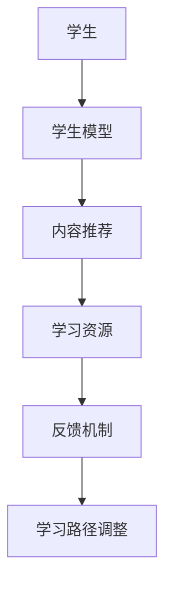

                 


# 个性化学习路径AI Agent：LLM辅助的自适应教育

## 关键词：AI教育，LLM，个性化学习，自适应教育，教育科技

## 摘要：  
随着人工智能技术的迅速发展，个性化学习正在成为教育领域的焦点。通过大语言模型（LLM）辅助的自适应教育系统，我们可以为每个学生量身定制学习路径，从而提高学习效率和效果。本文将深入探讨个性化学习路径AI Agent的设计与实现，从技术原理到实际应用，全面解析LLM在教育中的潜力与挑战。

---

## 第一部分：个性化学习路径与AI Agent概述

### 第1章：个性化学习路径与AI教育概述

#### 1.1 个性化学习的概念与背景

##### 1.1.1 个性化学习的定义与特点  
个性化学习是指根据学生的兴趣、能力、学习风格和目标，量身定制的学习方案。其特点是动态调整、精准定位和以学生为中心。  

##### 1.1.2 传统教育模式的局限性  
传统教育模式通常采用“一刀切”的教学方式，难以满足学生的个性化需求。学生的学习进度和能力差异可能导致部分学生跟不上节奏，而另一部分学生则感到 bored。  

##### 1.1.3 个性化学习的必要性与优势  
个性化学习能够提高学生的学习兴趣和效果，减少学习压力，同时优化教育资源的分配。通过AI技术的支持，个性化学习变得更加可行和高效。  

#### 1.2 AI技术在教育中的应用  

##### 1.2.1 AI技术在教育领域的现状  
AI技术已经在教育领域得到了广泛应用，例如智能辅导系统、自动评分系统和学习分析工具等。  

##### 1.2.2 AI在个性化学习中的作用  
AI技术能够分析学生的学习数据，识别学习难点，并推荐适合的学习资源。通过AI辅助，教师可以更高效地管理课堂，学生可以更精准地掌握知识。  

##### 1.2.3 LLM在个性化学习中的核心作用  
LLM（Large Language Model）能够理解上下文、生成自然语言文本，并根据学生的需求提供个性化的学习建议。  

#### 1.3 自适应教育系统的基本概念  

##### 1.3.1 自适应教育的定义  
自适应教育是一种根据学生的学习情况动态调整教学策略和内容的教育模式。  

##### 1.3.2 自适应教育的核心要素  
- 学生模型：分析学生的学习能力、兴趣和知识水平。  
- 内容推荐：根据学生的需求推荐合适的学习资源。  
- 反馈机制：实时反馈学习效果并调整学习路径。  

---

## 第二部分：LLM辅助个性化学习的原理与技术

### 第2章：LLM的原理与模型结构

#### 2.1 LLM的基本原理  

##### 2.1.1 大语言模型的定义与特点  
LLM是一种基于深度学习的自然语言处理模型，具有强大的文本理解和生成能力。  

##### 2.1.2 LLM的核心算法与训练方法  
- **Transformer架构**：通过自注意力机制和前馈网络实现高效的序列建模。  
- **预训练与微调**：通过大规模数据预训练，然后在特定任务上进行微调。  

##### 2.1.3 LLM的输入输出机制  
- 输入：文本片段或问题。  
- 输出：生成的文本或答案。  

#### 2.2 主流LLM模型介绍  

##### 2.2.1 GPT系列模型  
GPT（Generative Pre-trained Transformer）系列模型在文本生成任务中表现出色。  

##### 2.2.2 BERT及其变体  
BERT（Bidirectional Encoder Representations from Transformers）擅长理解上下文关系。  

##### 2.2.3 其他LLM模型的简要介绍  
- **PaLM**：Google推出的大语言模型，支持多任务学习。  
- **Megatron-LM**：开源的大型语言模型，适合研究和商业应用。  

#### 2.3 LLM在教育中的应用原理  

##### 2.3.1 LLM的文本生成机制  
通过生成式模型，LLM能够根据输入的问题生成详细的解答。  

##### 2.3.2 LLM的上下文理解能力  
模型能够理解上下文关系，从而提供更准确的回答。  

##### 2.3.3 LLM的个性化输出实现  
通过调整模型参数和输入策略，LLM可以生成适合不同学生的学习建议。  

---

### 第3章：个性化学习路径的构建原理

#### 3.1 个性化学习路径的核心要素  

##### 3.1.1 学生的学习目标  
- 短期目标：掌握某个知识点。  
- 长期目标：提升整体能力。  

##### 3.1.2 学生的知识水平  
通过测试和数据分析，确定学生的基础知识水平。  

##### 3.1.3 学习资源的选择与推荐  
根据学生的学习目标和知识水平，推荐合适的教材、视频和练习题。  

---

## 第三部分：系统分析与架构设计方案

### 第4章：自适应教育系统的功能与设计

#### 4.1 问题场景介绍  
自适应教育系统需要解决学生学习效率低、学习资源匹配度差等问题。  

#### 4.2 系统功能设计  

##### 4.2.1 学生模型设计  
- 数据输入：学生的基本信息、学习记录和测试结果。  
- 数据处理：通过机器学习算法分析学生的学习能力。  

##### 4.2.2 内容推荐系统  
- 基于学生的学习情况推荐合适的学习资源。  
- 推荐算法：基于协同过滤和内容过滤。  

##### 4.2.3 反馈与调整机制  
- 实时反馈学生的学习效果。  
- 根据反馈结果调整学习路径。  

#### 4.3 系统架构设计  

##### 4.3.1 系统架构图  


#### 4.4 系统接口设计  

##### 4.4.1 学生模型接口  
- 输入：学生信息。  
- 输出：学习能力评估。  

##### 4.4.2 内容推荐接口  
- 输入：学习目标和能力评估。  
- 输出：推荐的学习资源。  

#### 4.5 系统交互设计  

##### 4.5.1 学生与系统的交互流程  
1. 学生登录系统。  
2. 系统分析学生的学习情况。  
3. 系统推荐学习资源。  
4. 学生完成学习任务。  
5. 系统反馈学习效果并调整学习路径。  

---

## 第四部分：项目实战与应用案例

### 第5章：自适应教育系统的实现

#### 5.1 环境安装  

##### 5.1.1 安装Python  
```bash
python --version
pip install --upgrade pip
```

##### 5.1.2 安装LLM库  
```bash
pip install transformers
pip install torch
```

#### 5.2 核心代码实现  

##### 5.2.1 学生模型实现  
```python
import torch
from transformers import AutoTokenizer, AutoModelForMaskedLM

tokenizer = AutoTokenizer.from_pretrained("bert-base-uncased")
model = AutoModelForMaskedLM.from_pretrained("bert-base-uncased")
```

##### 5.2.2 内容推荐实现  
```python
def recommend_resources(student_info):
    # 根据学生信息生成推荐结果
    return recommended_resources
```

#### 5.3 代码应用解读与分析  
通过上述代码，我们可以实现学生模型和内容推荐功能，从而构建自适应教育系统的核心模块。  

#### 5.4 实际案例分析  
以数学学习为例，系统可以根据学生的薄弱环节推荐相应的练习题和教学视频。  

---

## 第五部分：总结与展望

### 第6章：未来展望与挑战

#### 6.1 技术挑战  
- 模型的实时性与响应速度。  
- 数据隐私与安全问题。  

#### 6.2 应用前景  
随着技术的进步，LLM辅助的个性化学习将更加普及，教育科技的未来充满潜力。  

---

## 作者：AI天才研究院/AI Genius Institute & 禅与计算机程序设计艺术 /Zen And The Art of Computer Programming

