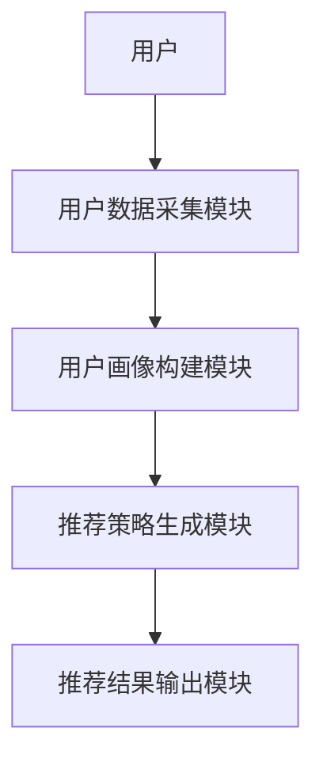
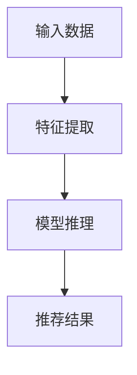
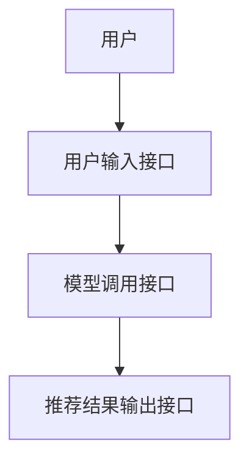

                 


# 个性化推荐 AI Agent：基于 LLM 的精准营销系统

> 关键词：个性化推荐，AI Agent，大语言模型，精准营销，LLM，推荐系统

> 摘要：本文详细探讨了基于大语言模型（LLM）的个性化推荐 AI Agent 在精准营销中的应用。通过分析其核心概念、算法原理、系统架构及实际案例，本文为技术从业者提供了从理论到实践的全面指导，帮助读者理解如何利用 AI Agent 实现更精准、更个性化的营销策略。

---

# 第一部分: 背景与核心概念

## 第1章: 个性化推荐与AI Agent概述

### 1.1 个性化推荐的背景与问题背景

个性化推荐是现代信息技术的核心应用之一，旨在通过分析用户行为、偏好和需求，为其提供高度个性化的信息或服务。传统推荐系统基于协同过滤、内容推荐等技术，但存在以下问题：

- 数据稀疏性：用户行为数据不足导致推荐精度下降。
- 单一性：推荐结果缺乏多样性，无法覆盖用户的真实需求。
- 实时性：无法满足实时推荐的需求。

个性化推荐的目标是通过技术手段解决上述问题，提升用户体验和商业价值。其核心价值体现在以下几个方面：

- 提高用户满意度：通过精准推荐，满足用户个性化需求。
- 提升商业转化率：通过精准推荐，提高用户购买意愿。
- 降低运营成本：通过自动化推荐，减少人工干预。

个性化推荐的边界在于如何在不侵犯用户隐私的前提下，最大化推荐的精准度。其外延则包括从简单的商品推荐到复杂的个性化服务推荐。

### 1.2 AI Agent的核心概念与特点

AI Agent（人工智能代理）是一种能够感知环境并采取行动以实现目标的智能体。其特点包括：

- **自主性**：能够独立决策，无需人工干预。
- **反应性**：能够实时感知环境并做出反应。
- **学习能力**：能够通过数据和反馈不断优化自身行为。

AI Agent在个性化推荐中的作用体现在以下几个方面：

- **用户画像构建**：通过收集和分析用户行为数据，构建详细的用户画像。
- **实时交互**：通过自然语言处理技术，与用户进行实时对话，动态调整推荐策略。
- **多模态推荐**：结合文本、图像等多种信息源，提供更精准的推荐结果。

AI Agent与传统推荐系统的区别主要体现在智能化程度和实时性上。传统推荐系统通常基于静态数据进行离线计算，而AI Agent能够实时感知用户需求，动态调整推荐策略。

### 1.3 个性化推荐AI Agent的系统架构

个性化推荐AI Agent的系统架构由以下几个核心要素组成：

1. **用户数据采集模块**：负责采集用户的行为数据，包括点击、浏览、购买等。
2. **用户画像构建模块**：基于采集的数据，构建用户的兴趣模型。
3. **推荐策略生成模块**：根据用户画像，生成个性化推荐策略。
4. **推荐结果输出模块**：将推荐结果以多种形式输出给用户。

系统的核心要素与组成可以通过以下对比表清晰展示：

| 核心要素 | 描述 |
|----------|------|
| 用户数据采集模块 | 采集用户行为数据，如点击、浏览、购买等 |
| 用户画像构建模块 | 基于数据构建用户兴趣模型 |
| 推荐策略生成模块 | 根据用户画像生成推荐策略 |
| 推荐结果输出模块 | 将推荐结果输出给用户 |

实体关系图（ER图）进一步展示了系统中各模块之间的关系：



---

## 第2章: 个性化推荐与AI Agent的核心联系

个性化推荐的核心在于通过分析用户需求，提供精准的推荐结果。AI Agent则通过智能化的交互方式，进一步提升推荐的精准度和实时性。以下是两者的核心联系：

### 2.1 个性化推荐的实现原理

个性化推荐的实现依赖于以下几个关键步骤：

1. **输入处理**：接收用户的输入数据，如搜索关键词、点击行为等。
2. **特征提取**：从输入数据中提取特征，如用户兴趣、行为模式等。
3. **模型推理**：基于提取的特征，生成推荐结果。

基于大语言模型的推荐系统工作流程如下：



### 2.2 AI Agent在精准营销中的应用场景

AI Agent在精准营销中的应用场景主要包括：

1. **用户画像构建**：通过分析用户行为数据，构建详细的用户画像。
2. **对话式推荐**：通过自然语言交互，实时调整推荐策略。
3. **实时推荐**：基于实时数据，动态更新推荐结果。

### 2.3 核心概念的系统架构图

系统架构图展示了个性化推荐AI Agent的整体结构：


---

# 第二部分: 算法原理与数学模型

## 第3章: 大语言模型的推荐算法原理

### 3.1 大语言模型的推荐流程

大语言模型的推荐流程包括以下几个步骤：

1. **输入处理**：接收用户的输入数据，如搜索关键词、点击行为等。
2. **特征提取**：从输入数据中提取特征，如用户兴趣、行为模式等。
3. **模型推理**：基于提取的特征，生成推荐结果。

推荐算法的实现可以通过以下Python代码进行：

```python
def generate_recommendations(user_input):
    # 特征提取
    features = extract_features(user_input)
    # 模型推理
    recommendations = model.predict(features)
    return recommendations
```

### 3.2 基于LLM的推荐算法实现

基于LLM的推荐算法实现包括以下几个步骤：

1. **输入处理**：接收用户的输入数据。
2. **特征提取**：从输入数据中提取特征。
3. **模型推理**：基于提取的特征，生成推荐结果。

数学模型部分可以通过以下公式表示：

$$
P(\text{推荐} | \text{用户}) = \text{模型}(\text{用户特征})
$$

---

## 第4章: 数学模型与公式详解

### 4.1 概率分布模型

概率分布模型用于描述用户对推荐结果的偏好程度。以下是一个简单的概率分布公式：

$$
P(i) = \frac{e^{w_i}}{\sum_j e^{w_j}}
$$

其中，$w_i$ 是第i个物品的权重。

### 4.2 损失函数与优化算法

损失函数用于衡量推荐结果与实际需求的差异。常见的损失函数包括均方误差（MSE）和交叉熵损失：

$$
\text{MSE} = \frac{1}{n}\sum_{i=1}^{n}(y_i - \hat{y}_i)^2
$$

$$
\text{交叉熵损失} = -\frac{1}{n}\sum_{i=1}^{n} y_i \log(\hat{y}_i) + (1 - y_i) \log(1 - \hat{y}_i)
$$

---

# 第三部分: 系统分析与架构设计

## 第5章: 个性化推荐AI Agent的系统架构

### 5.1 项目介绍与目标

本项目旨在开发一个基于大语言模型的个性化推荐AI Agent，用于实现精准营销。项目目标包括：

1. 提供高效的用户画像构建功能。
2. 实现基于自然语言交互的推荐系统。
3. 提供实时的推荐结果输出。

### 5.2 系统功能设计

系统功能设计包括以下几个模块：

1. **用户画像构建模块**：负责采集和分析用户行为数据，构建用户兴趣模型。
2. **对话式推荐模块**：通过自然语言交互，实时调整推荐策略。
3. **实时推荐模块**：基于实时数据，动态更新推荐结果。

### 5.3 系统架构设计

系统架构设计包括以下几个部分：

1. **用户数据采集模块**：负责采集用户行为数据。
2. **用户画像构建模块**：基于采集的数据，构建用户兴趣模型。
3. **推荐策略生成模块**：根据用户画像，生成推荐策略。
4. **推荐结果输出模块**：将推荐结果输出给用户。

系统架构图展示了各个模块之间的关系：


---

## 第6章: 系统接口设计与交互流程

### 6.1 系统接口设计

系统接口设计包括以下几个部分：

1. **用户输入接口**：接收用户的输入数据。
2. **推荐结果输出接口**：输出推荐结果。
3. **模型调用接口**：调用大语言模型进行推理。

### 6.2 交互流程图

交互流程图展示了系统中各模块之间的交互关系：



---

# 第四部分: 项目实战

## 第7章: 个性化推荐AI Agent的实现

### 7.1 环境安装

项目实现需要以下环境：

1. Python 3.8+
2. 大语言模型API（如GPT-3.5）
3. 推荐系统库（如numpy、pandas）

### 7.2 核心代码实现

以下是核心代码实现：

```python
import numpy as np
import pandas as pd

def extract_features(user_input):
    # 特征提取逻辑
    pass

def generate_recommendations(user_input):
    features = extract_features(user_input)
    return model.predict(features)
```

### 7.3 案例分析

案例分析展示了如何在实际场景中应用个性化推荐AI Agent。例如，在电商场景中，可以通过分析用户的购买历史和浏览行为，生成个性化的商品推荐。

---

# 第五部分: 总结与展望

## 第8章: 总结与展望

### 8.1 最佳实践

- 定期更新用户画像，确保推荐结果的准确性。
- 优化推荐算法，提升推荐的实时性和精准度。
- 加强数据隐私保护，确保用户数据的安全性。

### 8.2 小结

个性化推荐AI Agent基于大语言模型的精准营销系统，通过智能化的交互方式，进一步提升推荐的精准度和实时性。本文从理论到实践，详细探讨了个性化推荐AI Agent的核心概念、算法原理、系统架构及实际案例。

### 8.3 注意事项

- 数据隐私保护是个性化推荐系统的重要考量。
- 算法优化需要结合实际场景进行。

### 8.4 拓展阅读

建议读者进一步阅读以下内容：

1. 大语言模型在推荐系统中的应用。
2. AI Agent在其他领域的应用。

---

作者：AI天才研究院/AI Genius Institute & 禅与计算机程序设计艺术 /Zen And The Art of Computer Programming

