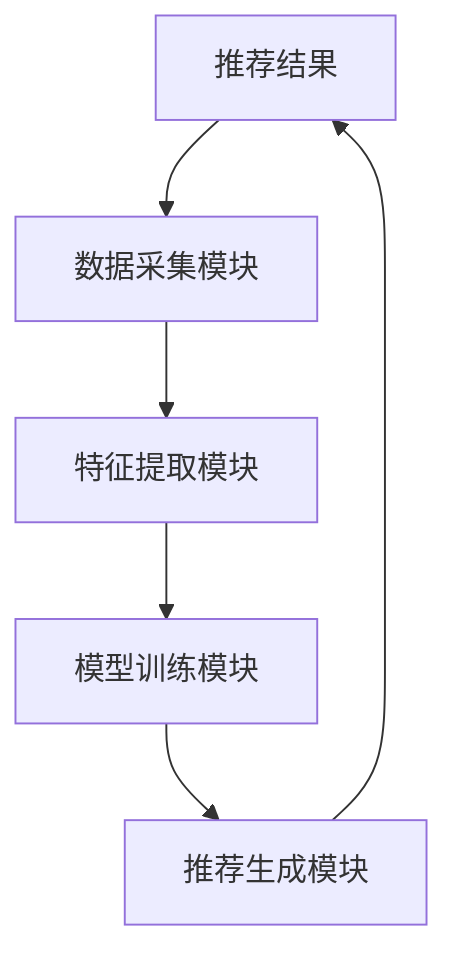

                 


# 个性化推荐AI Agent：基于LLM的用户兴趣建模

---

## 关键词  
个性化推荐，LLM，用户兴趣建模，大语言模型，推荐系统，AI Agent

---

## 摘要  
个性化推荐系统在现代互联网应用中扮演着至关重要的角色，而基于大语言模型（LLM）的推荐技术更是将推荐系统的智能化推向了新的高度。本文将从用户兴趣建模的角度出发，深入探讨如何利用LLM技术构建高效的个性化推荐系统。通过分析用户行为数据和兴趣特征，结合LLM的强大理解能力，提出了一种基于LLM的用户兴趣建模方法，并详细阐述了该方法在实际推荐系统中的应用和优化策略。本文还通过实际案例分析和代码实现，展示了如何将理论转化为实践，为读者提供了一套完整的个性化推荐解决方案。

---

## 第一部分：个性化推荐与LLM基础

### 第1章：个性化推荐系统概述

#### 1.1 个性化推荐的基本概念
个性化推荐是一种基于用户行为数据和特征信息，通过算法预测用户对特定内容或产品的兴趣程度，从而为用户推荐相关内容或产品的技术。它广泛应用于电商、社交媒体、视频平台等领域，能够显著提升用户体验和商业转化率。

#### 1.2 推荐系统的分类与应用场景
推荐系统主要分为基于协同过滤、基于内容理解和基于模型的推荐三种类型：
- **协同过滤推荐**：基于用户行为数据的相似性进行推荐。
- **内容理解推荐**：基于内容本身的特征进行推荐。
- **模型推荐**：基于深度学习模型的推荐。

#### 1.3 用户需求与推荐系统的目标
用户在使用推荐系统时，通常有以下需求：
- 获取感兴趣的内容或产品。
- 提高信息获取效率。
- 获得个性化体验。

推荐系统的目标则是：
- 准确预测用户的兴趣。
- 提供高质量的推荐结果。
- 提升用户满意度和留存率。

---

## 第二部分：基于LLM的用户兴趣建模

### 第2章：用户兴趣建模的核心概念与联系

#### 2.1 用户兴趣建模的定义与目标
用户兴趣建模是通过分析用户的行为数据和特征信息，构建用户兴趣的数学模型，以便更好地理解和预测用户的兴趣。其目标是通过模型捕捉用户兴趣的多维度特征，为推荐系统提供精准的用户画像。

#### 2.2 LLM在兴趣建模中的作用
大语言模型（LLM）具有强大的自然语言理解和生成能力，能够从用户的文本行为数据中提取深层次的兴趣特征。与传统推荐算法相比，LLM能够更好地理解用户的上下文信息，从而提供更精准的兴趣建模。

#### 2.3 兴趣建模的数学模型与特征分析
兴趣建模的数学模型通常包括以下几部分：
- **用户特征向量**：表示用户的基本特征，如年龄、性别、兴趣爱好等。
- **行为特征向量**：表示用户的历史行为数据，如点击、收藏、购买等。
- **兴趣向量**：通过模型学习得到的用户兴趣表示。

---

## 第三部分：算法实现与优化

### 第3章：基于LLM的兴趣建模算法

#### 3.1 算法原理概述
基于LLM的兴趣建模算法通常包括以下步骤：
1. 数据预处理：对用户行为数据进行清洗和特征提取。
2. 模型训练：利用LLM对用户特征进行建模，生成兴趣向量。
3. 推荐生成：基于兴趣向量生成推荐结果。

#### 3.2 算法实现流程
1. 数据预处理：
   - 数据清洗：去除无效数据和异常值。
   - 特征提取：提取用户的基本特征和行为特征。

2. 模型训练：
   - 利用LLM对用户特征进行建模，生成兴趣向量。
   - 使用对比学习或相似度计算方法优化模型性能。

3. 推荐生成：
   - 基于兴趣向量生成推荐结果。
   - 对推荐结果进行排序和优化。

#### 3.3 算法优化策略
1. **模型调优**：通过调整模型超参数和优化训练策略提升推荐精度。
2. **特征优化**：引入更多维度的特征信息，如用户的社交网络特征、时间特征等。
3. **实时更新**：通过实时更新用户行为数据，保持模型的准确性。

---

## 第四部分：系统架构与实现

### 第4章：系统架构设计

#### 4.1 系统模块划分
推荐系统的架构通常包括以下几个模块：
- **数据采集模块**：负责采集用户行为数据。
- **特征提取模块**：对用户行为数据进行特征提取。
- **模型训练模块**：利用LLM对用户特征进行建模。
- **推荐生成模块**：基于模型生成推荐结果。

#### 4.2 系统交互流程
1. 用户发起请求。
2. 系统采集用户行为数据。
3. 系统提取用户特征。
4. 系统生成推荐结果。
5. 系统返回推荐结果。

#### 4.3 系统架构图


---

## 第五部分：项目实战

### 第5章：基于LLM的兴趣建模实战

#### 5.1 环境搭建
1. 安装Python和相关库（如TensorFlow、PyTorch）。
2. 下载LLM模型（如GPT-3、BERT）。
3. 准备用户行为数据集。

#### 5.2 数据处理与特征提取
```python
import pandas as pd
import numpy as np

# 数据加载
data = pd.read_csv('user_behavior.csv')

# 特征提取
user_features = data[['user_id', 'age', 'gender', 'interests']]
behavior_features = data[['user_id', 'item_id', 'click_time', 'purchase_history']]
```

#### 5.3 模型训练与优化
```python
import torch
from transformers import AutoModelForMaskedLM, AutoTokenizer

# 加载LLM模型
model = AutoModelForMaskedLM.from_pretrained('bert-base-uncased')
tokenizer = AutoTokenizer.from_pretrained('bert-base-uncased')

# 定义训练函数
def train_model(model, tokenizer, user_features, behavior_features):
    optimizer = torch.optim.Adam(model.parameters(), lr=1e-5)
    model.train()
    for epoch in range(num_epochs):
        for batch in data_loader:
            inputs, labels = batch
            outputs = model(**inputs)
            loss = outputs.loss
            loss.backward()
            optimizer.step()
```

#### 5.4 模型部署与测试
```python
# 模型部署
import requests

url = 'http://localhost:8000/recommend'
payload = {'user_id': '123'}
response = requests.post(url, json=payload)
print(response.json())
```

---

## 第六部分：总结与展望

### 第6章：总结与最佳实践

#### 6.1 总结
本文详细探讨了基于LLM的用户兴趣建模方法，并通过实际案例展示了如何将理论转化为实践。通过对比传统推荐算法和基于LLM的兴趣建模，我们发现LLM在理解和捕捉用户兴趣方面具有显著优势。

#### 6.2 最佳实践
1. 在实际应用中，建议结合用户行为数据和LLM模型，构建多维度的用户兴趣特征。
2. 为了提高推荐系统的实时性，可以采用增量学习的方法，实时更新用户行为数据。
3. 在模型优化方面，建议结合A/B测试，验证不同算法的效果。

#### 6.3 未来展望
随着LLM技术的不断发展，基于LLM的推荐系统将变得更加智能和精准。未来的研究方向包括：
- 更高效的模型训练方法。
- 更加个性化的推荐策略。
- 更多跨领域应用场景的探索。

---

## 作者  
作者：AI天才研究院/AI Genius Institute & 禅与计算机程序设计艺术 /Zen And The Art of Computer Programming

---

通过本文的详细讲解，读者可以深入了解基于LLM的用户兴趣建模方法，并将其应用于实际的推荐系统中。希望本文能够为读者提供有价值的参考，帮助他们在个性化推荐领域取得更大的突破。

