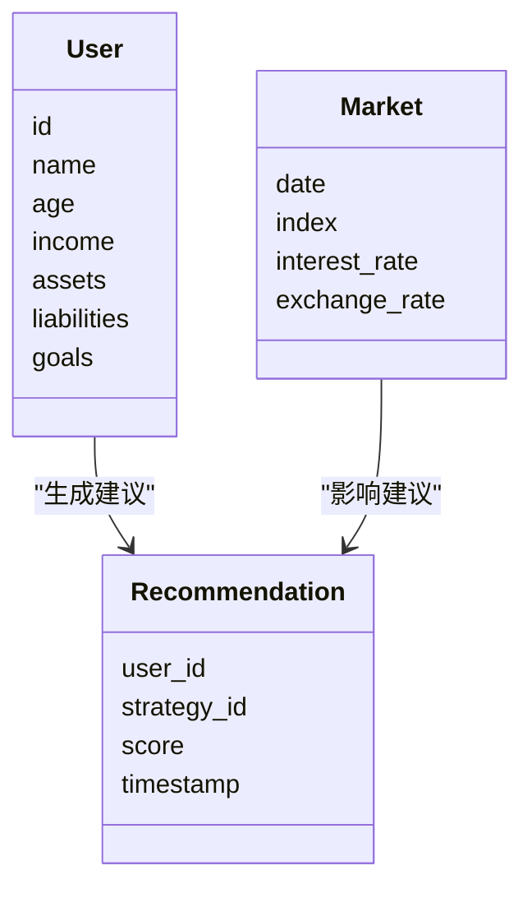
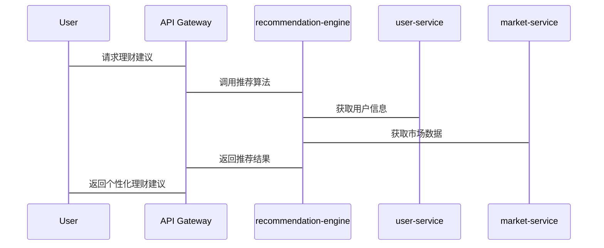

                 


# 个性化理财建议生成算法：原理与实现

## 关键词：
个性化理财、算法、机器学习、推荐系统、特征工程、系统设计

## 摘要：
本文详细介绍了个性化理财建议生成算法的原理与实现。从背景需求分析开始，探讨了如何利用数据驱动的方法，结合机器学习和推荐系统，生成个性化的理财建议。文章系统性地分析了算法的核心概念，详细讲解了协同过滤、基于内容的推荐、集成学习和深度学习模型，同时介绍了特征工程、系统架构设计和项目实战。通过实际案例分析和代码实现，深入浅出地展示了如何构建高效的个性化理财建议生成系统，为读者提供了理论与实践相结合的全面指导。

---

# 第一部分: 个性化理财建议生成算法背景与原理

## 第1章: 个性化理财建议的背景与需求

### 1.1 个性化理财的背景
- 1.1.1 传统理财方式的局限性
- 1.1.2 个性化理财的需求驱动
- 1.1.3 数字化转型对个性化理财的影响

### 1.2 个性化理财的核心问题
- 1.2.1 理财目标的多样性
- 1.2.2 财务状况的复杂性
- 1.2.3 市场环境的动态变化

### 1.3 个性化理财建议生成的必要性
- 1.3.1 提高理财效率
- 1.3.2 降低理财门槛
- 1.3.3 增强用户体验

### 1.4 本章小结

---

## 第2章: 核心概念与联系

### 2.1 核心概念原理
- 2.1.1 数据驱动的个性化分析
- 2.1.2 基于规则的理财策略
- 2.1.3 基于模型的预测机制

### 2.2 核心概念属性特征对比
- 2.2.1 数据特征对比表
- 2.2.2 算法特征对比表
- 2.2.3 系统性能对比表

### 2.3 ER实体关系图架构
```mermaid
erDiagram
    user {
        id : int
        name : string
        age : int
        income : float
        assets : float
        liabilities : float
        goals : string
    }
    market {
        date : date
        index : float
        interest_rate : float
        exchange_rate : float
    }
    recommendation {
        user_id : int
        strategy_id : int
        score : float
        timestamp : datetime
    }
    user --> recommendation : "生成建议"
    market --> recommendation : "影响建议"
```

---

# 第二部分: 个性化理财建议生成算法的核心原理

## 第3章: 协同过滤算法

### 3.1 协同过滤的原理
- 3.1.1 基于用户的协同过滤
- 3.1.2 基于物品的协同过滤
- 3.1.3 混合协同过滤

### 3.2 协同过滤的数学模型
- 3.2.1 相似度计算公式
  $$sim(i, j) = \frac{\sum_{k} (r_{ik} - \bar{r_i})(r_{jk} - \bar{r_j})}{\sqrt{\sum_{k}(r_{ik} - \bar{r_i})^2} \sqrt{\sum_{k}(r_{jk} - \bar{r_j})^2}}$$
- 3.2.2 预测评分公式
  $$\hat{r}_{ij} = \bar{r_i} + \sum_{k} w_{ijk}(r_jk - \bar{r_k})$$

### 3.3 协同过滤的实现步骤
- 数据预处理
- 计算相似度矩阵
- 生成推荐列表

### 3.4 协同过滤的优缺点
- 优点：计算简单，易于理解
- 缺点：冷启动问题，计算复杂度高

---

## 第4章: 基于内容的推荐算法

### 4.1 基于内容的推荐原理
- 4.1.1 特征提取
- 4.1.2 相似度计算
- 4.1.3 推荐生成

### 4.2 基于内容的数学模型
- 4.2.1 特征向量表示
  $$v_i = [v_{i1}, v_{i2}, ..., v_{in}]$$
- 4.2.2 相似度计算公式
  $$sim(i, j) = \frac{v_i \cdot v_j}{\|v_i\| \|v_j\|}$$

### 4.3 基于内容的实现步骤
- 特征提取
- 计算相似度
- 生成推荐

### 4.4 基于内容的优缺点
- 优点：能够处理冷启动问题
- 缺点：依赖于特征提取的质量

---

## 第5章: 集成学习与深度学习模型

### 5.1 集成学习模型
- 5.1.1 随机森林
- 5.1.2 梯度提升树

### 5.2 深度学习模型
- 5.2.1 神经网络
- 5.2.2 长短期记忆网络（LSTM）

### 5.3 深度学习模型的数学表示
- 5.3.1 神经网络的前向传播
  $$y = Wx + b$$
- 5.3.2 LSTM的门控机制
  $$f_t = \sigma(W_f x_t + U_f h_{t-1})$$

### 5.4 深度学习模型的优缺点
- 优点：能够捕捉非线性关系
- 缺点：计算复杂，需要大量数据

---

## 第6章: 特征工程

### 6.1 特征工程的重要性
- 6.1.1 数据预处理
- 6.1.2 特征选择
- 6.1.3 特征变换

### 6.2 常见特征工程方法
- 6.2.1 缩放
- 6.2.2 编码
- 6.2.3 维度降维

### 6.3 特征工程的实现步骤
- 数据清洗
- 特征提取
- 特征组合

---

# 第三部分: 系统分析与架构设计

## 第7章: 系统功能设计

### 7.1 问题场景介绍
- 用户需求分析
- 系统功能模块划分

### 7.2 领域模型设计


### 7.3 系统架构设计


### 7.4 系统接口设计
- 接口定义
- 接口调用流程

### 7.5 系统交互设计


---

## 第8章: 项目实战

### 8.1 环境配置
- Python版本要求
- 依赖库安装
  ```bash
  pip install numpy pandas scikit-learn xgboost
  ```

### 8.2 数据准备
- 数据获取
- 数据清洗
- 数据预处理

### 8.3 特征工程实现
- 特征提取代码示例
  ```python
  import pandas as pd
  from sklearn.preprocessing import StandardScaler

  df = pd.read_csv('data.csv')
  features = df[['income', 'assets', 'liabilities']]
  scaler = StandardScaler()
  features_scaled = scaler.fit_transform(features)
  ```

### 8.4 模型实现与优化
- 模型选择与训练
  ```python
  from sklearn.ensemble import RandomForestRegressor
  model = RandomForestRegressor(n_estimators=100, random_state=42)
  model.fit(features_scaled, labels)
  ```

### 8.5 实际案例分析
- 案例背景
- 数据分析
- 模型验证

---

## 第9章: 优化与扩展

### 9.1 模型调优
- 参数调优方法
- 超参数搜索

### 9.2 系统性能优化
- 算法优化
- 并行计算

### 9.3 个性化优化
- 动态调整模型
- 个性化策略

### 9.4 扩展与应用
- 支持多模态数据
- 集成更多模型

---

## 第10章: 最佳实践与注意事项

### 10.1 最佳实践
- 数据质量的重要性
- 模型解释性的提升
- 系统可扩展性的设计

### 10.2 注意事项
- 数据隐私保护
- 模型鲁棒性
- 系统维护与更新

### 10.3 小结

---

## 作者：AI天才研究院/AI Genius Institute & 禅与计算机程序设计艺术 /Zen And The Art of Computer Programming

---

# 结束语
感谢您的阅读！希望本文对您理解个性化理财建议生成算法有所帮助。如需进一步探讨或实践，欢迎随时联系！

