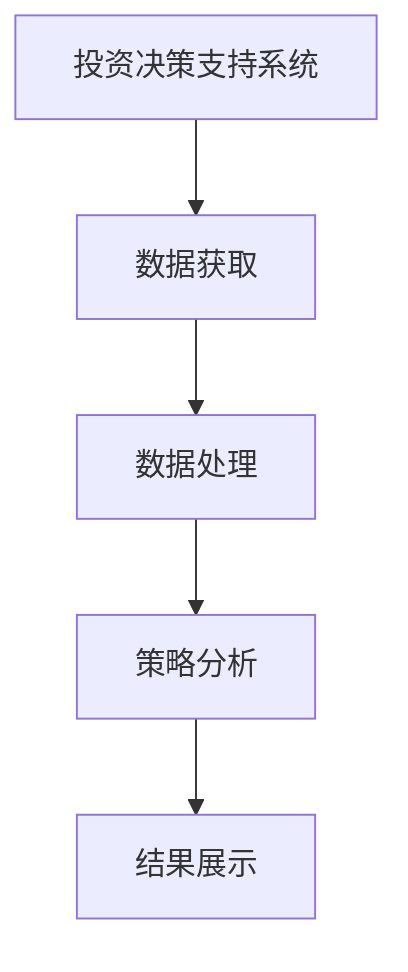

                 


# 乔尔·提尔尼的主动投资者的误区

---

## 关键词

- 主动投资
- 投资者行为心理学
- 投资组合优化
- 现代投资组合理论（MPT）
- 误区分析
- 机器学习投资策略

---

## 摘要

本文深入探讨了主动投资中的常见误区，结合投资者行为心理学、数学模型和系统设计，分析了这些误区对投资决策的影响，并提出了优化策略。文章通过实例分析和代码实现，展示了如何通过技术手段规避误区，实现更高效的主动投资。

---

## 第1章：背景介绍

### 1.1 什么是主动投资

主动投资是一种积极管理投资组合的策略，旨在通过精选个股或主动管理以超越市场表现。其核心在于通过研究和分析，选择具有超额收益潜力的资产。

#### 1.1.1 主动投资的定义

主动投资强调主动管理和决策，与被动投资（如指数基金）不同，它追求超越市场的收益。主动投资者通常会频繁调整投资组合，以抓住市场机会或规避风险。

#### 1.1.2 主动投资的特点

- **高关注度**：投资者需要持续关注市场动态，及时调整策略。
- **高交易成本**：频繁交易可能导致佣金和滑点成本增加。
- **高风险**：主动管理增加了投资组合的波动性和潜在风险。

#### 1.1.3 主动投资与被动投资的对比

| 特性            | 主动投资                          | 被动投资                          |
|-----------------|-----------------------------------|-----------------------------------|
| 管理方式        | 积极主动管理                      | 被动跟踪指数                      |
| 成本            | 较高（交易佣金、管理费）          | 较低（跟踪误差小）                |
| 风险            | 高（市场波动大）                  | 低（风险与市场一致）              |
| 收益潜力        | 高（可能超越市场）               | 适中（与市场同步）                |

### 1.2 主动投资的误区背景

投资者在主动投资中常陷入误区，这些误区源于认知偏差和行为偏见。

#### 1.2.1 认知偏差与决策

- **确认偏误**：投资者倾向于寻找支持自己观点的信息，忽视反面证据。
- **过度自信**：认为自己能够准确预测市场走势，导致过度交易。

#### 1.2.2 情绪对决策的影响

- **贪婪与恐惧**：市场上涨时贪婪，下跌时恐惧，导致非理性决策。
- **从众心理**：盲目跟随市场潮流，忽视独立分析。

#### 1.2.3 误区对投资决策的影响

误区导致的投资决策失误，如过度交易、追涨杀跌，往往侵蚀投资收益。

---

## 第2章：主动投资的核心概念

### 2.1 主动投资的定义与特点

#### 2.1.1 投资组合的构建

投资组合构建涉及资产配置和个股选择，主动投资者通过精选个股和动态调整以优化收益。

#### 2.1.2 投资者的角色

- **决策者**：制定投资策略和调整组合。
- **执行者**：下单交易，确保策略实施。

#### 2.1.3 投资策略的动态调整

主动投资需要根据市场变化和投资目标调整策略，这增加了复杂性和管理难度。

---

## 第3章：主动投资中的误区分析

### 3.1 误区一：过度交易

过度交易可能导致以下后果：

- **交易成本增加**：频繁交易产生佣金和滑点损失。
- **错误决策风险**：基于短期波动做出的交易决策可能错误。

### 3.2 误区二：追求短期收益

过度关注短期收益可能导致以下问题：

- **忽略长期价值**：短期波动可能掩盖长期趋势。
- **增加市场风险**：频繁调整策略可能导致投资组合不稳定。

---

## 第4章：投资者行为心理学

### 4.1 认知偏差与投资决策

认知偏差影响投资决策，常见的有：

- **确认偏误**：只关注支持自己观点的信息。
- **过度自信**：高估自己的预测能力。

### 4.2 情绪对投资的影响

情绪波动导致非理性决策，如贪婪和恐惧引发追涨杀跌。

### 4.3 行为偏见的克服方法

- **制定投资计划**：明确目标和策略，避免情绪驱动。
- **定期复盘**：反思决策，识别和纠正偏差。

---

## 第5章：数学模型与算法原理

### 5.1 现代投资组合理论（MPT）

#### 5.1.1 均值-方差优化

MPT通过优化投资组合的收益和风险，找到最优配置。

公式：$$ \text{Minimize } \sigma^2 \text{ subject to } \mu \geq \text{目标收益} $$

#### 5.1.2 解释与应用

通过数学模型优化投资组合，减少不必要的交易。

### 5.2 投资组合优化的Python实现

```python
import numpy as np
import pandas as pd
from scipy.optimize import minimize

def portfolio_optimization(returns, weights):
    n = len(weights)
    # 定义目标函数：最小化方差
    def objective(weights):
        return (weights.T.dot(np.dot(returns, weights))).item()
    # 约束条件：权重之和为1
    cons = ({'type': 'eq', 'fun': lambda w: sum(w) - 1})
    # 使用SLSQP求解
    result = minimize(objective, weights, method='SLSQP', constraints=cons)
    return result.x

# 示例数据
returns = np.array([[0.1, 0.2], [0.2, 0.1]])
weights = np.array([0.5, 0.5])
optimal_weights = portfolio_optimization(returns, weights)
print(optimal_weights)
```

---

## 第6章：系统设计与架构

### 6.1 投资决策支持系统设计

#### 6.1.1 系统架构

Mermaid架构图：



#### 6.1.2 功能模块

- 数据获取：收集市场数据。
- 数据处理：清洗和转换数据。
- 策略分析：应用算法优化投资组合。
- 结果展示：可视化分析结果。

---

## 第7章：项目实战

### 7.1 环境安装

#### 7.1.1 Python环境配置

安装Python 3.8以上版本，并配置Jupyter Notebook。

#### 7.1.2 库的安装

安装numpy、pandas、scipy等库：

```bash
pip install numpy pandas scipy
```

### 7.2 核心实现

#### 7.2.1 数据获取与预处理

使用Yahoo Finance获取数据：

```python
import yfinance as yf
data = yf.download(['AAPL', 'GOOGL'], start='2020-01-01', end='2023-12-31')
```

#### 7.2.2 算法实现

优化投资组合：

```python
def portfolio_optimization(returns):
    n = len(returns.columns)
    returns = returns.pct_change().dropna()
    mu = returns.mean().values
    sigma = returns.cov().values
    def objective(weights):
        return (weights.T @ mu) * (weights.T @ sigma @ weights)
    cons = ({'type': 'eq', 'fun': lambda w: sum(w) - 1})
    bounds = [{'type': 'bounds', 'args': (0, 1)} for _ in range(n)]
    result = minimize(objective, np.ones(n)/n, method='SLSQP', constraints=cons, bounds=bounds)
    return result.x

optimized_weights = portfolio_optimization(data)
print(optimized_weights)
```

---

## 第8章：总结与展望

### 8.1 最佳实践

- 制定明确的投资计划，避免情绪驱动决策。
- 定期复盘，识别并纠正认知偏差。
- 使用数学模型优化投资组合，减少人为干扰。

### 8.2 小结

主动投资需要理性决策和科学方法，避免误区，通过技术手段优化投资策略。

### 8.3 注意事项

- 保持长期视角，避免过度关注短期波动。
- 定期评估投资组合，及时调整策略。

### 8.4 拓展阅读

推荐书籍和资源，帮助深入理解投资策略和技术。

---

## 作者

作者：AI天才研究院/AI Genius Institute & 禅与计算机程序设计艺术 /Zen And The Art of Computer Programming

