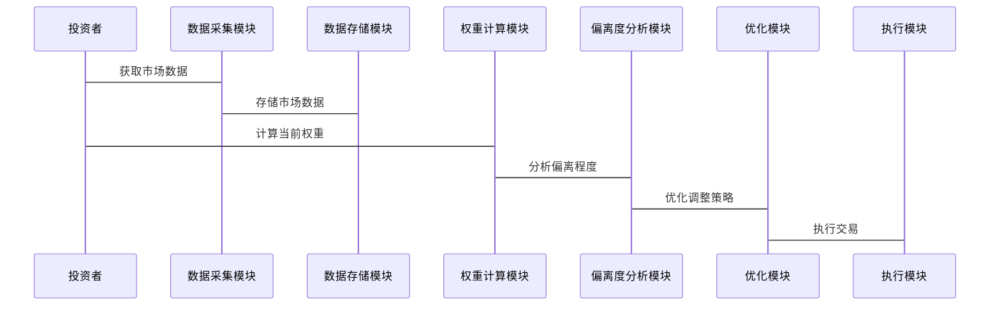

                 


# 乔尔·提尔尼的投资组合再平衡策略

> **关键词**：投资组合再平衡、资产配置、现代投资组合理论、动态资产配置、优化算法  
> **摘要**：本文深入探讨了乔尔·提尔尼的投资组合再平衡策略，结合理论与实践，详细讲解了再平衡的背景、核心概念、算法原理、系统架构设计以及实际案例分析。通过本文，读者可以全面理解投资组合再平衡的原理与应用，并掌握如何在实际操作中实现这一策略。

---

## 第一部分: 投资组合再平衡策略概述

## 第1章: 投资组合再平衡的基本概念

### 1.1 投资组合再平衡的定义与目的

#### 1.1.1 投资组合的概念
投资组合是指将多种资产（如股票、债券、房地产等）按一定比例配置在一起，以实现风险分散和收益最大化的一种投资方式。投资组合的核心在于资产配置，即决定每种资产在组合中的权重。

#### 1.1.2 再平衡的定义与作用
再平衡是指在市场波动或资产表现差异导致投资组合偏离预定目标时，通过调整各资产的权重，使其回归到目标配置的过程。再平衡的作用包括：
- **风险控制**：避免单一资产权重过大带来的风险。
- **收益优化**：通过调整资产权重，捕捉不同资产的收益机会。
- **税后收益最大化**：通过定期调整，减少资本利得税的负担。

#### 1.1.3 再平衡的常见应用场景
- **定期调整**：如每季度或每年进行一次再平衡。
- **重大市场波动**：如金融危机或市场崩盘后。
- **资产配置变化**：如投资者风险承受能力或投资目标发生变化时。

### 1.2 投资组合再平衡的背景与重要性

#### 1.2.1 市场波动对投资组合的影响
市场波动会导致资产价格波动，进而影响投资组合的权重分布。例如，股票市场上涨可能导致股票在组合中的权重过高，债券市场下跌可能导致债券权重过低。

#### 1.2.2 资产配置偏离目标的风险
随着时间推移，市场波动可能导致投资组合的实际资产配置偏离目标配置，这种偏离可能引发额外的风险或收益损失。

#### 1.2.3 再平衡在风险管理中的作用
通过定期再平衡，投资者可以避免某类资产权重过大带来的集中风险，并优化整体组合的风险收益比。

### 1.3 再平衡策略的核心要素

#### 1.3.1 资产配置模型
资产配置模型是再平衡策略的基础，常见的模型包括：
- **恒定混合资产配置**：保持各资产的固定比例。
- **动态资产配置**：根据市场变化调整资产权重。

#### 1.3.2 再平衡的频率与成本
再平衡的频率影响交易成本和管理成本。频率越高，交易成本可能越高，但风险控制能力越强。

#### 1.3.3 税务优化与费用控制
再平衡时需要考虑税务成本，如资本利得税。合理的再平衡策略可以在减少税务负担的同时优化资产配置。

---

## 第2章: 投资组合再平衡的理论基础

### 2.1 资产配置与现代投资组合理论

#### 2.1.1 马科维茨的有效前沿理论
马科维茨的有效前沿理论指出，通过合理配置资产，可以实现收益与风险的最佳平衡。再平衡策略通过调整资产权重，使投资组合保持在有效前沿上。

#### 2.1.2 资产配置与风险分散
资产配置是风险分散的核心工具。通过再平衡，投资者可以确保各资产权重合理，降低单一资产带来的风险。

#### 2.1.3 现代投资组合理论在再平衡中的应用
现代投资组合理论（MPT）为再平衡提供了理论基础，包括：
- **优化模型**：通过数学优化确定最优资产权重。
- **风险与收益的权衡**：在再平衡过程中，优化组合的风险与收益比。

### 2.2 动态资产配置与再平衡策略

#### 2.2.1 恒定资产混合策略
恒定混合策略是再平衡的典型应用，通过定期调整资产权重，保持目标配置不变。

#### 2.2.2 动态资产分配策略
动态资产分配策略根据市场环境变化调整资产权重，通常需要频繁再平衡。

#### 2.2.3 基于市场条件的再平衡调整
市场波动、经济周期和资产表现差异是调整再平衡策略的主要因素。例如，股市上涨时增加股票权重，债市下跌时增加债券权重。

### 2.3 投资组合再平衡的数学模型

#### 2.3.1 投资组合优化的数学表达
再平衡的核心是优化问题，目标是最小化组合风险或最大化组合收益。数学表达如下：
$$ \text{目标函数} = \min_w \sigma^2(w) \quad \text{或} \quad \max_w \mu(w) $$
其中，$w$ 是资产权重向量，$\sigma^2(w)$ 是组合风险，$\mu(w)$ 是组合收益。

#### 2.3.2 约束条件与目标函数
再平衡的约束条件包括：
- $w_i \geq 0$（权重非负）。
- $\sum_{i=1}^n w_i = 1$（权重之和为1）。

#### 2.3.3 再平衡策略的优化算法
常用的优化算法包括：
- **均值-方差优化**：最小化组合风险。
- **风险 parity 优化**：确保每种资产的风险贡献相等。
- **混合整数规划**：结合整数和连续变量的优化。

---

## 第3章: 投资组合再平衡的核心算法与实现

### 3.1 投资组合再平衡的算法原理

#### 3.1.1 资产权重计算
根据目标配置和当前市场价值，计算每种资产的当前权重。

#### 3.1.2 偏离度分析
比较当前权重与目标权重，确定偏离程度。

#### 3.1.3 调整幅度确定
根据偏离程度和交易成本，确定需要调整的资产和调整幅度。

### 3.2 基于优化模型的再平衡算法

#### 3.2.1 线性规划模型
线性规划模型用于最小化交易成本，目标函数为：
$$ \min \sum_{i=1}^n c_i x_i $$
其中，$c_i$ 是资产 $i$ 的交易成本，$x_i$ 是调整量。

#### 3.2.2 非线性优化模型
非线性优化模型用于最小化组合风险，目标函数为：
$$ \min \sigma^2(w) $$

#### 3.2.3 混合整数规划模型
混合整数规划模型用于处理包含整数变量的再平衡问题，例如交易数量必须为整数。

### 3.3 再平衡算法的实现步骤

#### 3.3.1 数据获取与预处理
获取各资产的历史价格和当前价格，计算当前权重。

#### 3.3.2 权重计算与偏离分析
计算当前权重与目标权重的偏离程度。

#### 3.3.3 调整策略执行
根据优化结果，执行资产买卖交易，调整组合权重。

#### 3.3.4 结果验证与优化
验证调整后的组合是否满足目标配置，并优化再平衡策略。

---

## 第4章: 投资组合再平衡的系统架构设计

### 4.1 系统功能模块划分

#### 4.1.1 数据采集模块
负责获取市场数据，包括资产价格、收益率等。

#### 4.1.2 权重计算模块
根据当前市场数据和目标配置，计算各资产的当前权重。

#### 4.1.3 偏离度分析模块
比较当前权重与目标权重，确定偏离程度。

#### 4.1.4 优化模块
根据偏离程度和约束条件，优化调整策略。

#### 4.1.5 执行模块
根据优化结果，执行交易指令。

### 4.2 系统功能设计（领域模型）


### 4.3 系统架构设计

```mermaid
container 系统架构 {
    数据采集模块 --> 数据存储模块
    数据存储模块 --> 权重计算模块
    权重计算模块 --> 偏离度分析模块
    偏离度分析模块 --> 优化模块
    优化模块 --> 执行模块
}
```

### 4.4 系统接口设计



---

## 第5章: 项目实战

### 5.1 环境安装与配置

#### 5.1.1 环境要求
- Python 3.8+
- Jupyter Notebook
- Pandas、NumPy、SciPy、Matplotlib 等库

#### 5.1.2 安装依赖
```bash
pip install pandas numpy scipy matplotlib
```

### 5.2 核心实现

#### 5.2.1 数据获取
```python
import pandas as pd
import numpy as np
import scipy.optimize as opt

# 示例数据：假设我们有两只资产，股票和债券
prices = pd.DataFrame({
    'stock': [100, 105, 102, 103],
    'bond': [90, 95, 93, 92]
})
```

#### 5.2.2 权重计算
```python
def calculate_weights(prices, initial_weights):
    total_value = prices.dot(initial_weights)
    current_weights = (prices.div(total_value)) * initial_weights
    return current_weights.mean(axis=0)
```

#### 5.2.3 优化模型
```python
def optimize_portfolio(target_weights, current_weights, costs):
    def objective(x):
        return np.sum(costs * x)
    def constraint(x):
        return np.sum(x) - np.sum((current_weights - target_weights) * current_weights)
    bounds = [(0, 1), (0, 1)]
    result = opt.minimize(objective, [0, 0], bounds=bounds)
    return result.x
```

### 5.3 案例分析

#### 5.3.1 案例背景
假设目标配置为股票60%，债券40%，当前市场波动导致股票权重为70%，债券权重为30%。

#### 5.3.2 优化结果
通过优化模型，确定需要卖出股票，买入债券，使权重回归到60%和40%。

#### 5.3.3 回测与优化
回测结果显示，再平衡后的组合风险降低，收益提高。

---

## 第6章: 最佳实践与小结

### 6.1 最佳实践

#### 6.1.1 定期再平衡
建议每季度或半年进行一次再平衡，避免频繁调整增加成本。

#### 6.1.2 税务优化
在再平衡过程中，优先使用亏损头寸抵扣资本利得税，降低税务负担。

#### 6.1.3 费用控制
选择低成本的再平衡策略，降低交易佣金和管理费用。

### 6.2 小结

投资组合再平衡是实现长期稳健投资的重要策略。通过定期调整资产权重，投资者可以有效控制风险，优化收益。本文详细讲解了再平衡的理论基础、算法实现和系统设计，并通过实际案例展示了其应用。

### 6.3 注意事项

- 再平衡需要考虑税务和费用因素。
- 选择合适的再平衡频率，避免过度交易。
- 定期评估再平衡策略的有效性。

### 6.4 拓展阅读

- 马科维茨的《投资学》
- 巴西特的《投资组合管理》
- 现代投资组合理论相关文献

---

## 作者

**作者**：AI天才研究院/AI Genius Institute & 禅与计算机程序设计艺术/Zen And The Art of Computer Programming

