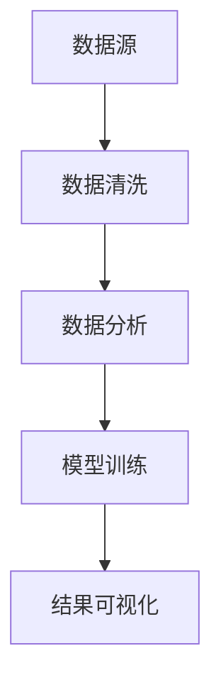
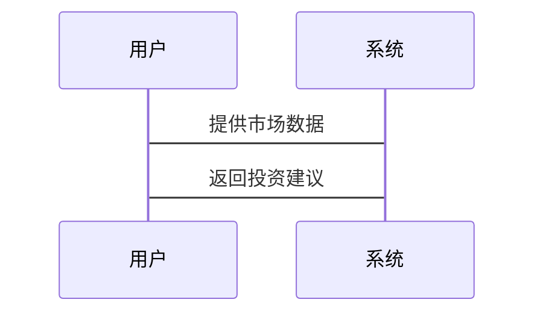

                 


# 乔尔·提林加斯特的价值投资心理学

> 关键词：价值投资，心理学，投资者心理，投资决策，心理偏差，行为金融学

> 摘要：本文从心理学的角度深入探讨了价值投资的核心理念和策略，分析了投资者心理偏差对投资决策的影响，并结合数学模型和系统架构设计，提供了克服心理偏差、实现理性投资的解决方案。

---

# 第一部分: 价值投资与心理学基础

## 第1章: 价值投资概述

### 1.1 价值投资的定义与核心理念
#### 1.1.1 价值投资的起源与发展
价值投资是一种长期投资策略，起源于20世纪初，由本杰明·格雷厄姆和戴维·多德提出。它强调以低于内在价值的价格购买股票，长期持有，等待市场重新认识到其价值。

#### 1.1.2 价值投资的核心理念与原则
- **安全边际**：购买价格低于内在价值，以降低风险。
- **长期视角**：关注企业的基本面，而非短期市场波动。
- **逆向思维**：在市场恐慌时寻找机会，在市场狂热时保持冷静。

#### 1.1.3 价值投资与其它投资策略的对比
- **成长投资**：注重企业未来的增长潜力，可能忽视当前的估值。
- **指数投资**：被动跟踪市场指数，风险分散但缺乏主动管理。

---

### 1.2 投资者心理学基础
#### 1.2.1 心理学与投资行为的关系
心理学揭示了人类行为的规律，尤其是在情绪波动和决策偏差方面。投资行为深受心理因素影响，如贪婪、恐惧、乐观和悲观。

#### 1.2.2 投资者常见的心理偏差
| 偏差类型 | 描述 | 影响 |
|----------|------|------|
| 过度自信 | 认为自己的判断比市场更准确 | 可能导致盲目买入或卖出 |
| 损失厌恶 | 对损失的恐惧超过对收益的追求 | 可能导致错失上涨机会 |
| 羊群效应 | 跟随大众决策 | 可能导致非理性波动 |

#### 1.2.3 心理因素对投资决策的影响
- **情绪化决策**：投资者常因情绪波动做出错误决策，如高位追涨、低位恐慌抛售。
- **认知偏差**：过度关注正面信息，忽视负面信息，或反之。

---

## 第2章: 价值投资的核心概念

### 2.1 安全边际
#### 2.1.1 安全边际的定义
安全边际是股票的市场价格低于其内在价值的部分，是投资的安全垫。

#### 2.1.2 安全边际的计算方法
假设某股票的内在价值为$V$，市场价格为$P$，则安全边际为$V - P$。

#### 2.1.3 安全边际在投资中的作用
- 降低投资风险。
- 提供纠错空间，避免因估值错误导致的损失。

---

### 2.2 市场先生
#### 2.2.1 市场先生的概念
市场先生是格雷厄姆提出的假设性人物，代表市场情绪的变化。市场先生每天为投资者提供买卖价格，但价格可能偏离内在价值。

#### 2.2.2 市场先生的行为特征
- 价格波动无规律，受情绪驱动。
- 投资者应与市场先生共舞，但不要被其情绪左右。

#### 2.2.3 如何与市场先生共舞
- 理解市场波动的暂时性。
- 利用市场恐慌时买入，市场狂热时卖出。

---

### 2.3 股价波动与内在价值
#### 2.3.1 股价波动的规律
股价围绕内在价值上下波动，波动幅度取决于市场情绪和投资者心理。

#### 2.3.2 内在价值的计算方法
内在价值的计算涉及对企业财务状况、行业地位、盈利能力等的分析。

#### 2.3.3 内在价值与股价波动的关系
股价波动是暂时的，内在价值是长期的。投资者应关注内在价值，而非短期波动。

---

## 第3章: 投资者心理偏差与行为分析

### 3.1 心理偏差对投资决策的影响
- **过度自信**：导致投资者忽视风险，过度交易。
- **损失厌恶**：导致投资者在亏损时急于止损，错失反弹机会。
- **羊群效应**：导致非理性跟风，加剧市场波动。

---

### 3.2 行为金融学的核心理论
#### 3.2.1 行为金融学的定义
行为金融学研究投资者心理和行为对金融市场的影响，强调非理性决策。

#### 3.2.2 行为金融学与传统金融学的对比
| 方面 | 行为金融学 | 传统金融学 |
|------|------------|-------------|
| 假设 | 投资者非理性 | 投资者理性 |
| 方法 | 实证研究 | 数学模型 |

#### 3.2.3 行为金融学在投资中的应用
- 理解市场情绪，避免非理性决策。
- 利用心理偏差，制定投资策略。

---

### 3.3 如何克服心理偏差
#### 3.3.1 建立正确的投资心态
- 长期思维，避免短期波动干扰。
- 理解市场波动的正常性。

#### 3.3.2 培养理性决策的能力
- 通过学习和实践，增强决策的理性。
- 建立投资计划，严格执行。

#### 3.3.3 制定科学的投资策略
- 分散投资，降低风险。
- 定期复盘，调整策略。

---

## 第4章: 价值投资中的数学模型与概率分析

### 4.1 投资中的概率论
#### 4.1.1 概率论的基本概念
概率论是研究随机事件规律的数学工具，用于评估投资风险和收益。

#### 4.1.2 投资中的概率计算
- 投资回报率服从概率分布。
- 计算期望收益和方差。

#### 4.1.3 概率在投资决策中的应用
- 评估投资项目的可行性。
- 判断投资风险的大小。

---

### 4.2 投资组合优化的数学模型
#### 4.2.1 投资组合优化的定义
通过优化资产配置，最大化收益，最小化风险。

#### 4.2.2 数学模型的构建与分析
$$
\text{目标函数：} \max \mu - \lambda \sigma^2
$$
其中，$\mu$是期望收益，$\sigma^2$是方差，$\lambda$是风险厌恶系数。

#### 4.2.3 模型在实际投资中的应用
- 基于模型进行资产配置。
- 定期调整投资组合。

---

### 4.3 风险与收益的数学公式
#### 4.3.1 风险与收益的关系
$$
E[R] = \lambda \sigma^2
$$
其中，$E[R]$是期望收益，$\sigma^2$是风险。

#### 4.3.2 风险调整后的收益计算
$$
R_{\text{风险调整}} = R - \lambda \sigma^2
$$

#### 4.3.3 数学公式在投资中的实际应用
- 计算不同资产的期望收益和风险。
- 比较不同投资策略的性价比。

---

## 第5章: 价值投资的系统分析与架构设计

### 5.1 投资决策系统的构建
#### 5.1.1 系统构建的目标与原则
- 目标：提供科学的投资决策支持。
- 原则：简单、可扩展、可维护。

#### 5.1.2 系统模块的划分与设计
- 数据采集模块：收集市场数据。
- 数据分析模块：计算内在价值、安全边际。
- 投资决策模块：基于数据分析结果，生成投资建议。

#### 5.1.3 系统功能的实现与优化
- 数据清洗与预处理。
- 模型训练与优化。
- 结果可视化。

---

### 5.2 系统架构的Mermaid图


---

### 5.3 系统接口与交互设计
#### 5.3.1 系统接口的设计
- 输入接口：接收市场数据。
- 输出接口：提供投资建议。

#### 5.3.2 系统交互的流程图


---

## 第6章: 项目实战

### 6.1 环境安装
- 安装Python和必要的库（如numpy、pandas、matplotlib）。

### 6.2 系统核心实现源代码
```python
import numpy as np
import pandas as pd

def calculate_intrinsic_value(stock_data):
    # 简单的内在价值计算方法
    return stock_data['Revenue'] / 10

def calculate_margin_of_safety(price, intrinsic_value):
    return (intrinsic_value - price) / intrinsic_value * 100

# 示例数据
stock_data = pd.DataFrame({
    'Revenue': [1000, 2000, 3000],
    'Price': [50, 100, 150]
})

# 计算内在价值和安全边际
intrinsic_values = calculate_intrinsic_value(stock_data)
margins = calculate_margin_of_safety(stock_data['Price'], intrinsic_values)

print("内在价值:", intrinsic_values)
print("安全边际:", margins)
```

---

### 6.3 代码应用解读与分析
- 计算内在价值：基于企业收入的简单估算。
- 计算安全边际：衡量价格与内在价值的差距。

---

### 6.4 实际案例分析和详细讲解剖析
以某公司为例，分析其内在价值和安全边际，判断是否值得投资。

---

## 第7章: 总结与展望

### 7.1 全文总结
本文从心理学视角深入分析了价值投资的核心理念和策略，揭示了心理偏差对投资决策的影响，并结合数学模型和系统设计，提供了克服心理偏差、实现理性投资的解决方案。

---

### 7.2 未来展望
- 更深入的心理学研究，帮助投资者更好地克服心理偏差。
- 更复杂的数学模型，提高投资决策的科学性。
- 更智能化的投资系统，提供实时数据分析和决策支持。

---

## 第8章: 最佳实践 tips、小结、注意事项、拓展阅读

### 8.1 小结
价值投资不仅是技术分析，更是心理战。成功投资需要理性思维和长期视角。

### 8.2 注意事项
- 避免情绪化决策。
- 定期复盘和调整策略。
- 持续学习和提升能力。

### 8.3 拓展阅读
- 《价值》——张磊
- 《投资最重要的事》——彼得·林奇

---

# 作者：AI天才研究院 & 禅与计算机程序设计艺术

---

这篇文章从价值投资的心理学角度出发，结合数学模型和系统设计，为投资者提供了科学的投资决策方法。希望对读者有所帮助！

