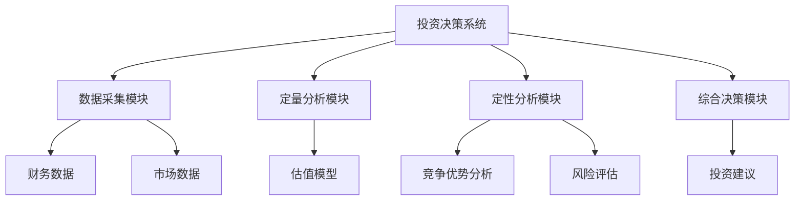
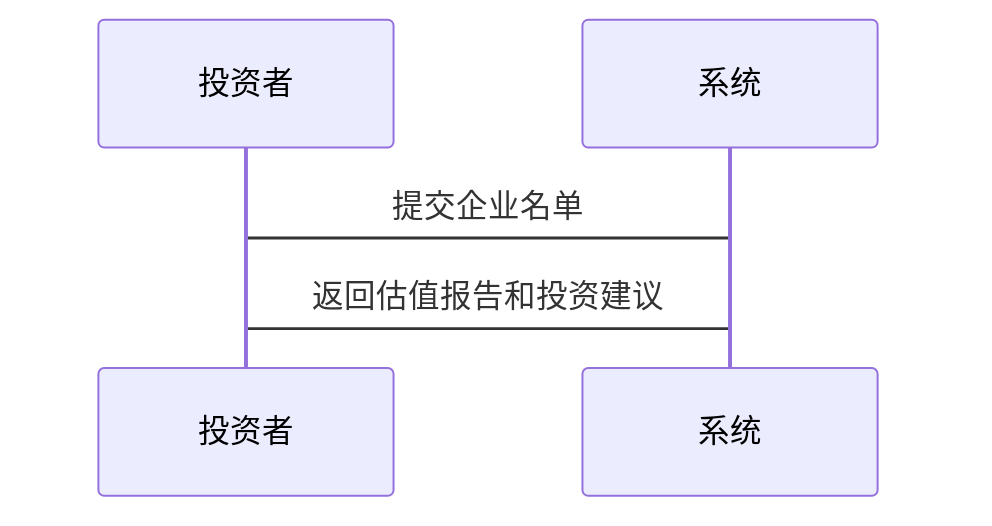

                 


# 乔尔·提林加斯特的价值投资方法：定量与定性的平衡

---

## 关键词：
- 价值投资
- 定量分析
- 定性分析
- 投资策略
- 乔尔·提林加斯特
- 股票估值
- 投资组合管理

---

## 摘要：
乔尔·提林加斯特是一位备受尊敬的价值投资者，他以其独特的投资方法闻名，尤其擅长将定量分析与定性分析相结合。本文将深入探讨乔尔的价值投资方法，分析其核心理念、定量与定性分析的具体实践，以及如何在实际投资中实现两者的平衡。通过详细讲解其算法原理、系统架构和项目实战，本文旨在为投资者提供一套科学且实用的投资策略。

---

# 第一部分: 价值投资方法的背景与基础

## 第1章: 价值投资的基本概念与背景

### 1.1 价值投资的定义与核心理念
价值投资是一种以基本面分析为基础的投资策略，旨在通过识别市场低估的优质企业进行长期投资。其核心理念包括：
1. **安全边际**：以低于内在价值的价格买入优质资产。
2. **长期视角**：关注企业的长期增长潜力而非短期波动。
3. **企业基本面**：通过财务报表分析企业的盈利能力、成长性和抗风险能力。

### 1.2 乔尔·提林加斯特的个人投资理念
乔尔·提林加斯特是价值投资的代表人物之一，他的投资理念强调：
1. **深度研究**：通过对企业的深入了解，识别其竞争优势和潜在风险。
2. **逆向思维**：在市场恐慌时寻找被低估的机会，在市场狂热时保持冷静。
3. **长期持有**：避免频繁交易，减少交易成本，专注于优质企业的长期增长。

### 1.3 价值投资的核心要素
1. **企业基本面分析**：包括收入、利润、资产负债表和现金流等关键指标。
2. **市场情绪与估值**：通过分析市场情绪和估值指标（如PE、PB、EV等）判断投资机会。
3. **投资组合管理**：通过分散投资和动态调整优化投资组合的风险与收益。

### 1.4 价值投资的适用场景与边界
价值投资适用于市场波动较大、企业基本面稳定的环境。其局限性包括：
1. **短期波动风险**：在市场恐慌时，优质企业可能被过度抛售。
2. **信息不对称**：需要深度研究企业，对普通投资者来说门槛较高。
3. **周期性限制**：在市场泡沫或剧烈波动时，价值投资可能表现不佳。

---

# 第二部分: 定量与定性分析的结合

## 第2章: 定量分析方法

### 2.1 定量分析的核心原理
定量分析通过数学模型和统计方法，量化企业的内在价值和市场估值。常用方法包括：
1. **DCF模型**：通过现金流折现计算企业内在价值。
2. **相对估值法**：通过比较同类企业的估值指标（如PE、PB等）判断企业估值是否合理。
3. **多因子模型**：结合多个财务指标（如ROE、ROA、杠杆率等）筛选优质企业。

### 2.2 价值投资中的定量分析工具
#### 2.2.1 财务指标分析
- **盈利能力**：净利润率、ROE（净资产收益率）。
- **成长性**：收入增长率、净利润增长率。
- **财务健康性**：资产负债率、现金流状况。

#### 2.2.2 估值模型
- **DCF模型**：
  $$ V = \frac{CF_1}{(1+r)^1} + \frac{CF_2}{(1+r)^2} + \cdots + \frac{CF_n}{(1+r)^n} $$
  其中，\( CF \) 为现金流，\( r \) 为折现率。
- **PE估值法**：\( PE = \frac{股价}{每股收益} \)，用于比较企业估值的合理性。
- **PB估值法**：\( PB = \frac{股价}{每股净资产} \)，适用于评估资产密集型企业。

#### 2.2.3 风险评估与收益预测
- **波动率**：衡量企业股票价格的波动性，用于评估投资风险。
- **Beta系数**：衡量企业股票相对于市场的波动性。

### 2.3 定量分析在投资决策中的应用
1. **企业筛选**：通过定量指标筛选出具备成长性和估值优势的企业。
2. **投资组合优化**：利用定量模型优化资产配置，降低风险。

---

## 第3章: 定性分析方法

### 3.1 定性分析的核心原理
定性分析关注企业的软性因素，如管理层素质、企业战略、行业地位等。常用方法包括：
1. **行业分析**：评估行业的发展前景和竞争格局。
2. **企业竞争优势**：分析企业的核心竞争力，如技术优势、品牌影响力等。
3. **管理层分析**：评估管理层的诚信、能力和战略规划。

### 3.2 价值投资中的定性分析工具
#### 3.2.1 行业分析与企业竞争优势
- **行业生命周期**：判断行业所处的阶段（导入期、成长期、成熟期、衰退期）。
- **竞争格局**：分析行业内主要竞争者的市场份额和竞争优势。

#### 3.2.2 管理层分析
- **管理层背景**：包括创始人、高管的行业经验、管理风格等。
- **管理层决策**：评估管理层在战略制定、资本运作等方面的能力。

#### 3.2.3 企业治理结构评估
- **治理结构**：包括董事会结构、股权分散度、内部控制机制等。
- **企业文化**：评估企业文化是否健康，是否鼓励创新和风险管理。

### 3.3 定性分析在投资决策中的应用
1. **行业选择**：通过定性分析选择具备长期增长潜力的行业。
2. **企业筛选**：结合定性因素进一步筛选出具备竞争优势和良好治理结构的企业。

---

## 第4章: 定量与定性分析的结合

### 4.1 综合分析的必要性
乔尔·提林加斯特强调，仅依靠定量分析容易忽视企业的软性因素，而仅依靠定性分析则可能缺乏科学依据。因此，将两者结合是实现全面投资分析的关键。

### 4.2 结合方法与实际案例
#### 4.2.1 综合筛选模型
通过将定量指标（如ROE、PE）与定性因素（如行业地位、管理层能力）结合，构建综合筛选模型。

#### 4.2.2 投资决策流程
1. **定量初筛**：通过财务指标和估值模型筛选出具备估值优势的企业。
2. **定性分析**：对初筛企业进行深度定性分析，评估其竞争优势和风险。
3. **最终决策**：结合定量和定性分析结果，综合判断是否投资。

---

## 第三部分: 系统分析与架构设计

### 第5章: 投资系统的设计与实现

#### 5.1 系统功能设计
- **数据采集**：获取企业的财务数据和市场数据。
- **定量分析**：计算企业估值指标。
- **定性分析**：评估企业的竞争优势和风险。
- **综合决策**：结合定量和定性分析结果，生成投资建议。

#### 5.2 系统架构设计


#### 5.3 系统接口设计
- **输入接口**：接收企业财务数据和市场数据。
- **输出接口**：生成投资建议和估值报告。

#### 5.4 系统交互流程


---

## 第四部分: 项目实战

### 第6章: 构建一个价值投资系统

#### 6.1 环境安装
- **Python**：安装Python 3.x及以上版本。
- **库的安装**：安装pandas、numpy、scipy等库。

#### 6.2 核心实现
```python
import pandas as pd
import numpy as np

# 示例：计算企业估值（DCF模型）
def calculate_dcf(cash_flows, discount_rate):
    return sum(cash_flows / (1 + discount_rate) ** i for i in range(len(cash_flows)))

# 示例：计算PE和PB
def calculate_pe_ttm(df):
    return df['股价'] / df['净利润率']

def calculate_pb(df):
    return df['股价'] / df['每股净资产']

# 示例：综合评分模型
def composite_score(enterprise):
    score = 0
    score += enterprise.ROE * 0.3
    score += enterprise.PE_ttm * 0.3
    score += enterprise.竞争优势 * 0.2
    score += enterprise.风险评估 * 0.2
    return score
```

#### 6.3 案例分析
假设我们有一个包含多家企业的数据集，通过上述代码计算它们的DCF价值、PE和PB，并结合定性因素（如竞争优势和风险评估）进行综合评分，最终筛选出具备投资价值的企业。

---

## 第五部分: 最佳实践与小结

### 第7章: 最佳实践与注意事项

#### 7.1 投资中的注意事项
1. **分散投资**：避免过度集中，降低风险。
2. **持续学习**：市场环境不断变化，需持续更新知识和模型。
3. **耐心与纪律**：坚持长期投资，避免情绪化决策。

#### 7.2 小结
乔尔·提林加斯特的价值投资方法通过定量与定性的结合，实现了科学与艺术的统一。投资者在实践中应灵活运用这些方法，结合市场环境和自身需求，制定合适的投资策略。

---

## 作者：AI天才研究院/AI Genius Institute & 禅与计算机程序设计艺术 /Zen And The Art of Computer Programming

---

**注**：由于篇幅限制，上述内容为文章的框架和部分核心内容的概述，实际文章将更加详细，包含完整的数学公式、代码实现和图表分析。

