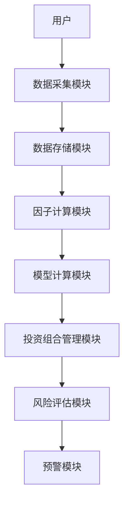
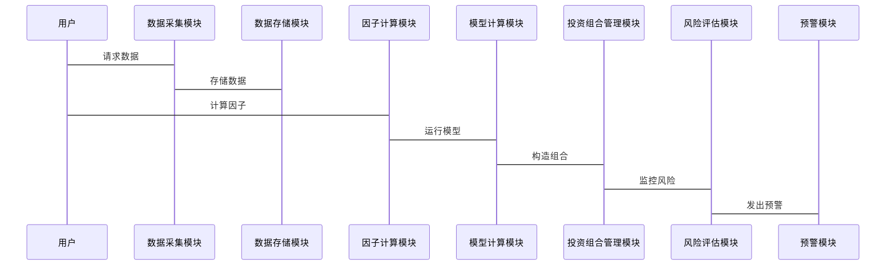

                 


# 乔尔·格林布拉特的价值投资学术研究

---

## 关键词
- 价值投资
- 乔尔·格林布拉特
- 多因子模型
- 投资策略
- 股票估值

---

## 摘要
本文系统地探讨了乔尔·格林布拉特的价值投资理论及其学术研究。从价值投资的核心理念到多因子模型的构建，再到系统的架构设计，文章详细分析了格林布拉特的投资方法及其在实际中的应用。通过数学模型和算法的详细讲解，结合项目实战，本文为读者提供了一个全面的价值投资研究框架。

---

## 第一部分: 价值投资的学术研究基础

### 第1章: 价值投资的概述

#### 1.1 价值投资的核心概念

##### 1.1.1 价值投资的定义与背景
价值投资是一种以低于内在价值的价格购买优质股票的投资策略。乔尔·格林布拉特是该领域的权威，他通过深入研究企业的基本面，寻找被市场低估的投资机会。

##### 1.1.2 乔尔·格林布拉特的学术贡献
格林布拉特提出了多因子模型，结合了多个财务指标来评估股票的价值，为投资决策提供了科学依据。

##### 1.1.3 价值投资的核心理念与目标
价值投资强调安全边际和长期持有的理念，目标是以合理的价格买入优质的资产，实现长期的资本增值。

---

#### 1.2 价值投资的基本原理

##### 1.2.1 市场有效性的假设与分析
价值投资基于市场存在非有效性的假设，认为短期内市场波动可能导致价格偏离内在价值。

##### 1.2.2 价值与价格的差异与机会
通过分析市盈率、市净率等指标，识别价格低于内在价值的股票，这些股票具有较大的增值潜力。

##### 1.2.3 投资者心理与市场行为
投资者的非理性行为导致市场波动，为价值投资者提供了寻找低估资产的机会。

---

#### 1.3 价值投资的策略与方法

##### 1.3.1 格林布拉特投资策略的核心要素
- **基本面分析**：重点关注企业的盈利能力、财务状况和竞争优势。
- **安全边际**：买入价格低于内在价值的股票，确保投资的安全性。
- **分散投资**：通过多样化降低风险，同时集中投资优质资产。

##### 1.3.2 股票估值的基本方法
- **内在价值计算**：使用DCF模型等方法估算企业的未来现金流。
- **相对估值法**：通过比较市盈率、市净率等指标评估股票的合理价格。

##### 1.3.3 风险控制与投资组合管理
- **分散投资**：避免过度集中，降低特定风险。
- **定期调整**：根据市场变化和企业情况，及时调整投资组合。

---

#### 1.4 价值投资与其他投资方法的区别

##### 1.4.1 与成长投资的对比
- 成长投资关注高成长性企业，风险较高。
- 价值投资注重安全性和稳定性，风险相对较低。

##### 1.4.2 与技术分析的对比
- 技术分析基于价格和成交量预测未来走势。
- 价值投资关注企业的内在价值，强调基本面分析。

##### 1.4.3 与指数投资的对比
- 指数投资通过分散化降低风险，但不主动选择个股。
- 价值投资通过精选个股，追求超额收益。

---

### 第2章: 乔尔·格林布拉特的多因子模型

#### 2.1 多因子模型的基本原理

##### 2.1.1 多因子模型的定义与特点
多因子模型通过多个因子（如盈利能力、成长性、估值等）来解释股票收益，帮助投资者找到具有超额收益的股票。

##### 2.1.2 多因子模型的构建步骤
1. 选择相关因子。
2. 收集历史数据。
3. 进行因子回归分析。
4. 确定因子权重。
5. 验证模型的有效性。

##### 2.1.3 多因子模型的优势与局限性
- **优势**：能够捕捉多个影响股票收益的因素，提高模型的解释力。
- **局限性**：因子过多可能导致过拟合，增加模型的复杂性。

---

#### 2.2 格林布拉特多因子模型的核心要素

##### 2.2.1 盈利能力因子
- **ROE（净资产收益率）**：衡量企业盈利能力的重要指标。
- **净利率**：反映企业的盈利效率。

##### 2.2.2 市盈率因子
- **P/E（市盈率）**：用于评估股票的估值是否合理。

##### 2.2.3 市净率因子
- **P/B（市净率）**：衡量股价与账面价值的比率，用于识别低估股票。

##### 2.2.4 其他相关因子
- **股息率**：反映企业的分红能力。
- **杠杆率**：评估企业的财务风险。

---

#### 2.3 多因子模型的实证分析

##### 2.3.1 数据收集与处理方法
- 数据来源：选取历史股价、财务数据等。
- 数据清洗：处理缺失值和异常值。

##### 2.3.2 因子权重的确定与优化
- 使用回归分析确定各因子的权重。
- 通过历史回测验证权重的有效性。

##### 2.3.3 模型的回测与验证
- 回测区间：选择足够的历史数据进行测试。
- 模型表现：评估模型的超额收益和风险调整后收益。

---

### 第3章: 价值投资的数学模型与算法

#### 3.1 价值投资的数学模型

##### 3.1.1 股票估值的数学公式
$$ V = \text{DCF模型} $$
$$ \text{DCF模型} = \sum_{t=1}^{n} \frac{CF_t}{(1 + r)^t} + \frac{TV}{(1 + r)^n} $$
其中，\( CF_t \) 是第 \( t \) 年的现金流，\( r \) 是折现率，\( TV \) 是终值。

##### 3.1.2 投资组合优化的数学模型
$$ \text{最大化} \quad \sum_{i=1}^{n} w_i R_i $$
$$ \text{约束} \quad \sum_{i=1}^{n} w_i = 1 $$
$$ \quad \quad w_i \geq 0 $$

##### 3.1.3 风险调整后的收益计算
$$ \text{夏普比率} = \frac{E(R_p) - R_f}{\sigma_p} $$
其中，\( E(R_p) \) 是投资组合的预期收益，\( R_f \) 是无风险利率，\( \sigma_p \) 是投资组合的波动率。

---

#### 3.2 多因子模型的数学推导

##### 3.2.1 因子回归分析
$$ R_i = \alpha + \beta_1 F_1 + \beta_2 F_2 + \dots + \beta_k F_k + \epsilon $$
其中，\( R_i \) 是股票 \( i \) 的收益，\( F_j \) 是因子 \( j \)，\( \epsilon \) 是误差项。

##### 3.2.2 因子载荷矩阵的构建
$$ F = X \beta $$
其中，\( X \) 是因子矩阵，\( \beta \) 是因子载荷矩阵。

##### 3.2.3 模型的参数估计与假设检验
- 参数估计：使用最小二乘法估计回归系数。
- 假设检验：检验因子的显著性和模型的整体有效性。

---

#### 3.3 算法实现与代码解读

##### 3.3.1 Python代码实现多因子模型
```python
import pandas as pd
import numpy as np
from sklearn.linear_model import LinearRegression

# 假设data是一个包含因子数据的DataFrame，columns是因子名称
# target是目标变量（股票收益）

model = LinearRegression()
model.fit(data, target)

# 因子载荷矩阵
beta = model.coef_

# 因子得分
factor_scores = model.predict(data)
```

##### 3.3.2 代码功能与逻辑分析
- 数据预处理：清洗数据，处理缺失值。
- 模型训练：使用线性回归进行因子回归分析。
- 模型评估：计算回归系数和因子得分。

##### 3.3.3 实例分析与结果解读
通过实际数据计算因子得分，验证模型的有效性，分析各因子对股票收益的贡献。

---

### 第4章: 价值投资系统的架构设计

#### 4.1 系统功能需求分析

##### 4.1.1 数据采集与处理模块
- 数据来源：股票数据库、财务报表等。
- 数据清洗：处理缺失值和异常值。

##### 4.1.2 模型计算与分析模块
- 因子计算：计算各因子的得分。
- 模型回测：验证模型的超额收益。

##### 4.1.3 投资组合管理模块
- 组合构造：根据因子得分选择股票。
- 风险管理：监控组合风险，及时调整。

##### 4.1.4 风险评估与预警模块
- 风险指标：计算波动率、最大回撤等。
- 预警机制：当风险超过阈值时，触发预警。

---

#### 4.2 系统架构设计

##### 4.2.1 系统架构图（使用Mermaid）


##### 4.2.2 系统接口设计
- 数据接口：与数据库交互，获取数据。
- 模型接口：调用因子计算和模型回测模块。
- 报告接口：生成投资报告和风险预警。

##### 4.2.3 系统交互流程（使用Mermaid）


---

## 第二部分: 项目实战与最佳实践

### 第5章: 项目实战

#### 5.1 环境搭建

##### 5.1.1 工具安装
- 安装Python和必要的库（如pandas、numpy、scikit-learn）。

##### 5.1.2 数据获取
- 从金融数据库获取历史数据，如Yahoo Finance。

#### 5.2 系统核心实现

##### 5.2.1 数据预处理
```python
data = pd.read_csv('stock_data.csv')
data.dropna(inplace=True)
```

##### 5.2.2 因子计算与模型运行
```python
from sklearn.linear_model import LinearRegression

model = LinearRegression()
model.fit(data[['市盈率', '市净率']], data['收益'])
```

##### 5.2.3 投资组合管理
```python
selected_stocks = model.predict(data[['市盈率', '市净率']])
top_stocks = selected_stocks.nlargest(10)
```

##### 5.2.4 风险评估与预警
```python
import numpy as np

volatility = np.std(top_stocks)
if volatility > 0.1:
    print("高风险预警")
```

#### 5.3 实例分析与结果解读

##### 5.3.1 数据来源与处理
选择某段时间的股票数据，清洗后用于模型计算。

##### 5.3.2 模型回测结果
通过回测验证模型的有效性，计算超额收益和风险调整后收益。

##### 5.3.3 投资组合调整
根据模型结果，动态调整投资组合，优化风险收益比。

#### 5.4 项目小结

---

### 第6章: 最佳实践与小结

#### 6.1 最佳实践

##### 6.1.1 投资策略选择
- 结合市场环境，灵活调整投资策略。
- 定期评估模型的有效性，及时优化。

##### 6.1.2 风险管理技巧
- 设置止损点，避免过度亏损。
- 分散投资，降低特定风险。

##### 6.1.3 技术应用建议
- 利用大数据和人工智能技术，提高分析效率。
- 使用量化工具，辅助投资决策。

#### 6.2 未来趋势

##### 6.2.1 人工智能在价值投资中的应用
- 使用机器学习算法，发现新的因子。
- 利用自然语言处理，分析非结构化数据。

##### 6.2.2 大数据时代的投资机会
- 利用海量数据，提高分析精度。
- 开发个性化投资策略。

#### 6.3 本章小结
总结价值投资的研究和实践，展望未来的发展方向，为读者提供理论和实践的指导。

---

## 第三部分: 附录与参考文献

### 附录A: 代码与数据

#### 附录A.1 代码示例
```python
import pandas as pd
import numpy as np
from sklearn.linear_model import LinearRegression

# 数据读取与预处理
data = pd.read_csv('stock_data.csv')
data.dropna(inplace=True)

# 模型训练
model = LinearRegression()
model.fit(data[['市盈率', '市净率']], data['收益'])

# 因子得分计算
factor_scores = model.predict(data[['市盈率', '市净率']])
```

#### 附录A.2 数据来源
- 数据来源：Yahoo Finance、 Bloomberg等金融数据库。

---

### 附录B: 参考文献

1. 格林布拉特, 乔尔. 《价值投资: 现金为王》.
2. Fama, E. F. (1970). *Efficient Capital Markets: A Review of Theory and Empirical Work*.
3. Sharpe, W. F. (1994). *The Sharpe Ratio*.

---

## 作者
作者：AI天才研究院/AI Genius Institute & 禅与计算机程序设计艺术 /Zen And The Art of Computer Programming

---

本文系统地探讨了乔尔·格林布拉特的价值投资理论及其学术研究，通过理论分析和实践案例，为读者提供了深入的理解和实际应用的指导。

