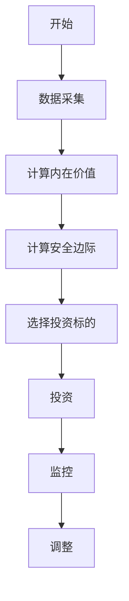
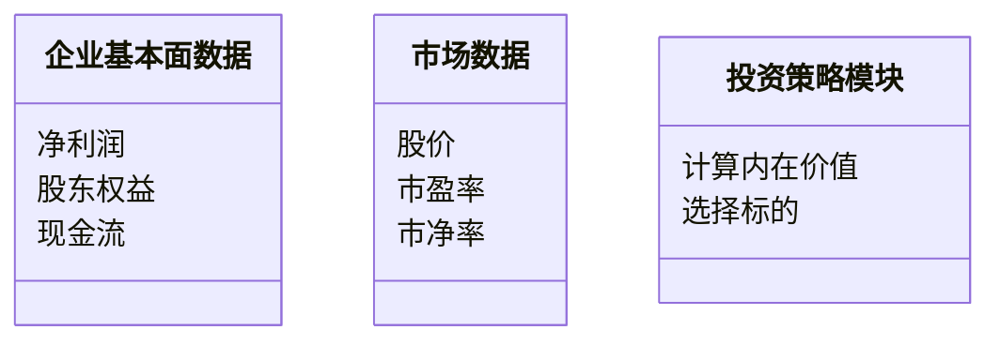
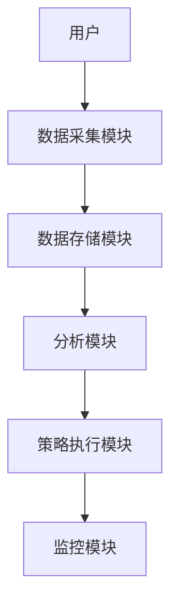
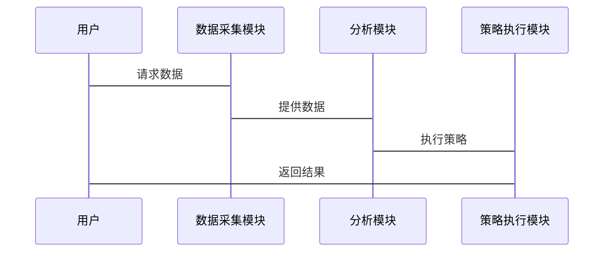

                 


# 《乔尔·格林布拉特的价值投资实践指南》

> 关键词：价值投资，格林布拉特，投资策略，安全边际，竞争优势

> 摘要：本文详细探讨了乔尔·格林布拉特的价值投资方法，从其核心理念到具体实践策略，结合数学模型和系统架构，提供了一套完整的投资指南，帮助读者理解和应用这一投资策略。

---

## 第1章：价值投资的背景与基础

### 1.1 价值投资的起源与发展

#### 1.1.1 价值投资的起源
价值投资是一种长期投资策略，起源于20世纪初。本杰明·格雷厄姆和戴维·多德是该领域的先驱，他们强调以低于内在价值的价格购买股票。

#### 1.1.2 核心理念
价值投资的核心在于寻找市场低估的股票，通过分析公司的基本面，如盈利能力、财务状况和行业地位，来评估其内在价值。

#### 1.1.3 格林布拉特的贡献
乔尔·格林布拉特是该领域的杰出代表，他将价值投资的理念进一步系统化，提出了著名的“Gurufocus模型”，强调安全边际和竞争优势。

---

### 1.2 价值投资的背景与问题背景

#### 1.2.1 传统投资方法的局限性
传统投资方法往往依赖市场波动和短期趋势，忽略了企业的长期价值。

#### 1.2.2 价值投资的必要性
在市场波动中，价值投资通过分析企业内在价值，帮助投资者避免短期损失，实现长期收益。

#### 1.2.3 格林布拉特方法的解决方案
格林布拉特提出，通过量化分析和安全边际，选择具有持续竞争优势的企业进行投资。

---

### 1.3 价值投资的边界与外延

#### 1.3.1 价值投资的适用范围
适用于长期投资者，尤其是机构投资者和个人投资者，寻找低估股票。

#### 1.3.2 方法的局限性
依赖于准确的企业估值，市场波动可能影响短期表现。

#### 1.3.3 与其他投资策略的对比
与成长投资不同，价值投资注重低估而非高增长，与趋势投资注重短期不同，价值投资注重长期。

---

## 第2章：价值投资的核心概念

### 2.1 价值投资的核心要素

#### 2.1.1 投资标的选择标准
- 盈利能力：ROE、ROA
- 财务状况：低负债率、高现金流
- 行业地位：市场领导者

#### 2.1.2 安全边际的定义与作用
安全边际是股票价格与内在价值的差距，提供缓冲以应对市场波动。

#### 2.1.3 企业的竞争优势分析
竞争优势包括成本优势、品牌效应和市场进入壁垒。

---

### 2.2 核心概念的属性对比

| 投资策略 | 核心概念       | 突出特点                     |
|----------|----------------|------------------------------|
| 价值投资 | 内在价值       | 强调低估，注重长期价值       |
| 成长投资 | 盈利增长       | 侧重未来增长潜力             |

---

## 第3章：格林布拉特投资模型的算法原理

### 3.1 投资模型的流程图



### 3.2 算法实现的Python代码

```python
def calculate_intrinsic_value(financials):
    # 示例代码，计算内在价值
    return financials['净利润'] / (financials['市盈率'] / financials['行业平均市盈率'])
```

### 3.3 数学模型与公式

$$\text{内在价值} = \frac{\text{净利润} \times (1 + g)}{r}$$

其中，$g$是增长率，$r$是期望回报率。

---

## 第4章：系统分析与架构设计

### 4.1 问题场景介绍

构建一个投资管理系统，实现数据采集、分析、策略执行和监控。

### 4.2 系统功能设计

#### 4.2.1 领域模型



### 4.3 系统架构设计



### 4.4 系统交互设计



---

## 第5章：项目实战

### 5.1 环境安装

安装Python和相关库（pandas、numpy）。

### 5.2 核心实现代码

```python
import pandas as pd

def calculate_margin_of_safety(price, intrinsic_value):
    return (intrinsic_value - price) / intrinsic_value * 100

# 示例数据
data = {
    '股价': [100],
    '内在价值': [120]
}
df = pd.DataFrame(data)
margin = calculate_margin_of_safety(100, 120)
print(f"安全边际为: {margin}%")
```

### 5.3 案例分析

分析某公司的基本面，计算其内在价值和安全边际，决定是否投资。

---

## 第6章：总结与拓展

### 6.1 最佳实践 tips

- 定期复盘，调整投资组合。
- 保持对市场的敏感性，及时调整策略。

### 6.2 小结

价值投资需要深入分析和耐心等待，通过系统化的策略，实现稳健收益。

### 6.3 注意事项

- 避免过度依赖模型，结合市场实际情况。
- 管控投资风险，分散投资标的。

### 6.4 拓展阅读

推荐阅读《聪明的投资者》和《投资最重要的简单真理》。

---

作者：AI天才研究院/AI Genius Institute & 禅与计算机程序设计艺术/Zen And The Art of Computer Programming

