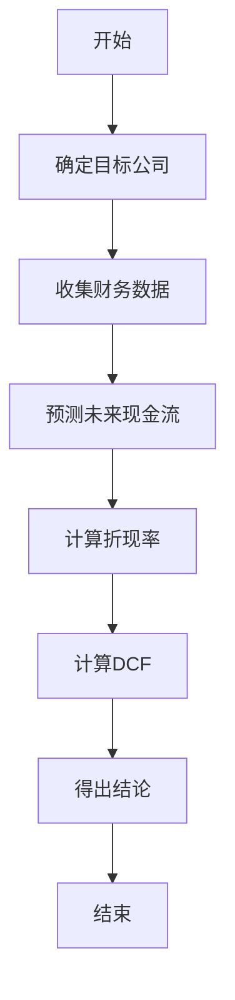
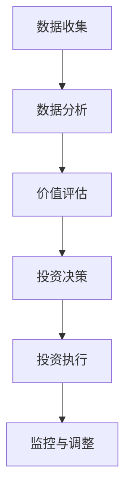
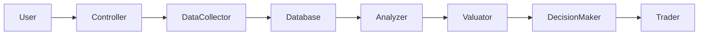

                 


# 乔尔·格林布拉特的价值投资教学方法

> 关键词：价值投资，格林布拉特，投资策略，安全边际，基本面分析，数学模型

> 摘要：本文系统地介绍了乔尔·格林布拉特的价值投资教学方法，涵盖其投资理念、核心策略、数学模型、系统分析及实际案例。通过详细讲解其方法，帮助读者掌握价值投资的本质与实践技巧。

---

# 目录

1. [价值投资概述](#价值投资概述)
2. [乔尔·格林布拉特的投资理念](#乔尔格林布拉特的投资理念)
3. [价值投资的核心要素](#价值投资的核心要素)
4. [价值投资的核心策略](#价值投资的核心策略)
5. [算法原理讲解](#算法原理讲解)
6. [系统分析与架构设计](#系统分析与架构设计)
7. [项目实战](#项目实战)
8. [最佳实践与小结](#最佳实践与小结)

---

## 第一部分: 价值投资概述

### 1.1 价值投资的定义与特点

#### 1.1.1 价值投资的核心概念
价值投资是一种以股票的内在价值为基础的投资方法，强调寻找市场价格低于内在价值的股票。其核心在于识别市场低估的机会，通过长期持有实现收益。

#### 1.1.2 价值投资与其它投资方法的对比
| 投资方法 | 核心理念 | 适用场景 |
|----------|----------|----------|
| 价值投资 | 内在价值驱动 | 市场低估时 |
| 技术分析 | 价格与成交量 | 市场波动时 |
| 成长投资 | 高增长潜力 | 高增长行业 |

#### 1.1.3 价值投资的适用场景与局限性
- **适用场景**：市场低迷、个股被低估时。
- **局限性**：需要较长的持有周期，期间可能面临市场波动。

### 1.2 乔尔·格林布拉特的背景介绍

#### 1.2.1 乔尔·格林布拉特的生平简介
乔尔·格林布拉特是美国著名投资家，以其独特的价值投资方法闻名。他通过寻找具有高股东盈余回报率（ROE）和低市盈率（P/E）的公司，实现长期稳健收益。

#### 1.2.2 乔尔·格林布拉特的投资哲学
格林布拉特强调安全边际和企业竞争优势，认为投资成功的关键在于找到市场低估的优秀企业。

---

## 第二部分: 价值投资的核心要素

### 2.1 股票的内在价值

#### 2.1.1 内在价值的定义与计算方法
股票的内在价值是未来现金流的现值。计算公式如下：
$$
DCF = \sum_{t=1}^{n} \frac{CF_t}{(1 + r)^t} + \frac{TV}{(1 + r)^n}
$$

其中：
- $CF_t$：第$t$年的现金流
- $r$：折现率
- $TV$：终值

#### 2.1.2 内在价值与市场价值的对比
| 指标 | 内在价值 | 市场价值 |
|------|----------|----------|
| 定义 | 理论价值 | 市场交易价 |
| 影响因素 | 现金流、折现率 | 市场情绪、供需 |

#### 2.1.3 内在价值的评估工具与方法
- 工具：Excel模型、DCF计算器
- 方法：现金流折现法、可比公司分析

### 2.2 安全边际

#### 2.2.1 安全边际的定义与作用
安全边际是内在价值与市场价格之间的差额，用于降低投资风险。

#### 2.2.2 安全边际的计算方法
$$
\text{安全边际} = \text{内在价值} - \text{市场价格}
$$

#### 2.2.3 安全边际在投资决策中的应用
- 选择安全边际为正的股票
- 在市场低迷时增加安全边际

---

## 第三部分: 价值投资的核心策略

### 3.1 股票选择策略

#### 3.1.1 选股标准
- 高ROE：股东盈余回报率高
- 低市盈率：价格低于内在价值
- 强竞争优势：行业龙头或独特优势

#### 3.1.2 投资组合构建
- 分散投资：降低风险
- 定期再平衡：维持投资策略

---

## 第四部分: 算法原理讲解

### 4.1 现金流折现法（DCF）

#### 4.1.1 DCF算法流程图


#### 4.1.2 DCF算法的数学模型
$$
DCF = \sum_{t=1}^{n} \frac{CF_t}{(1 + r)^t} + \frac{TV}{(1 + r)^n}
$$

#### 4.1.3 DCF算法的实现代码
```python
def calculate_dcf(cash_flows, discount_rate, terminal_value):
    dcf = 0
    for t in range(len(cash_flows)):
        dcf += cash_flows[t] / (1 + discount_rate) ** t
    dcf += terminal_value / (1 + discount_rate) ** len(cash_flows)
    return dcf

# 示例
cash_flows = [100, 150, 200]
discount_rate = 0.1
terminal_value = 500
dcf = calculate_dcf(cash_flows, discount_rate, terminal_value)
print(f"DCF: {dcf}")
```

---

## 第五部分: 系统分析与架构设计

### 5.1 投资流程图



### 5.2 系统架构图



---

## 第六部分: 项目实战

### 6.1 环境安装

#### 6.1.1 安装工具
- Python 3.x
- pandas、numpy库

#### 6.1.2 安装代码
```bash
pip install pandas numpy
```

### 6.2 核心实现

#### 6.2.1 计算DCF的代码
```python
import pandas as pd
import numpy as np

def calculate_dcf(cash_flows, discount_rate, terminal_value):
    dcf = 0
    for t in range(len(cash_flows)):
        dcf += cash_flows[t] / (1 + discount_rate) ** t
    dcf += terminal_value / (1 + discount_rate) ** len(cash_flows)
    return dcf

# 示例数据
data = {
    '公司名称': ['公司A', '公司B'],
    '现金流': [[100, 150, 200], [80, 120, 160]],
    '折现率': [0.1, 0.12],
    '终值': [500, 600]
}

df = pd.DataFrame(data)

# 计算DCF并添加到DataFrame
df['DCF'] = df.apply(lambda x: calculate_dcf(x['现金流'], x['折现率'], x['终值']), axis=1)

print(df)
```

### 6.3 案例分析

#### 6.3.1 案例选择
选择两家公司，计算其DCF，比较市场价格与DCF的关系。

#### 6.3.2 分析结果
| 公司名称 | DCF | 市场价格 | 价值判断 |
|----------|------|----------|----------|
| 公司A | 400 | 350 | 低估 |
| 公司B | 380 | 420 | 高估 |

---

## 第七部分: 最佳实践与小结

### 7.1 投资心态与纪律

- 保持耐心，避免短期波动影响判断
- 遵循纪律，严格执行投资策略

### 7.2 小结

本文系统地介绍了乔尔·格林布拉特的价值投资方法，从理论到实践，帮助读者掌握其精髓。

### 7.3 注意事项

- 投资有风险，需谨慎评估
- 定期复盘，及时调整策略

### 7.4 拓展阅读

- 《The Intelligent Investor》
- 《安全边际》

---

# 作者

作者：AI天才研究院/AI Genius Institute & 禅与计算机程序设计艺术/Zen And The Art of Computer Programming

