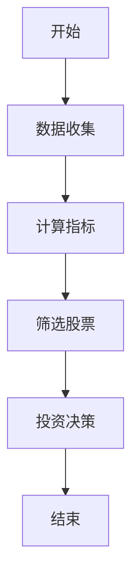
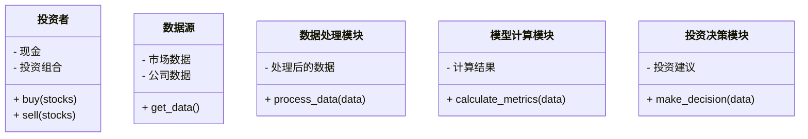
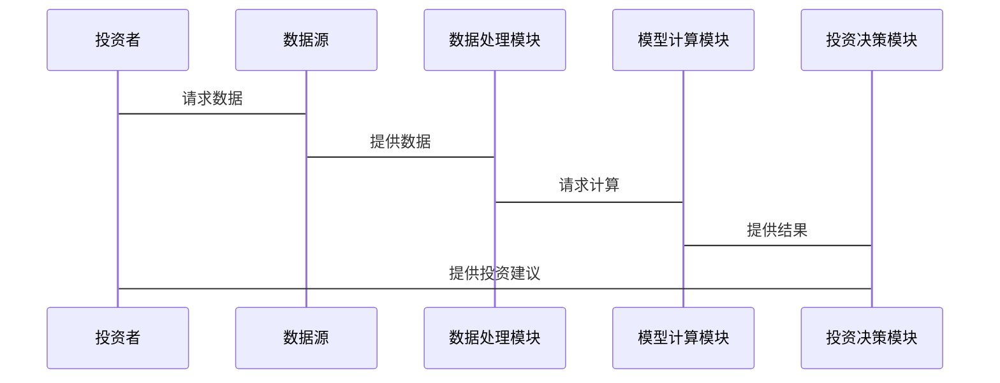

                 


# 乔尔·格林布拉特的价值投资量化方法

> 关键词：价值投资、量化方法、基本面分析、数学模型、投资策略

> 摘要：本文详细介绍了乔尔·格林布拉特的价值投资量化方法，从基本概念到系统架构，结合实际案例，深入分析其原理和应用，帮助读者理解如何将价值投资与量化方法结合，提升投资决策的科学性和效率。

---

## 第一部分：价值投资与量化方法的结合

### 第1章：价值投资的起源与核心理念

#### 1.1 价值投资的起源

##### 1.1.1 价值投资的定义与核心理念
价值投资是一种长期投资策略，强调购买被市场低估的资产，等待其价值回归。核心理念包括安全边际、内在价值和市场先生理论。

##### 1.1.2 价值投资的哲学基础
价值投资基于格雷厄姆的价值投资理论，强调安全边际和深入的基本面分析，寻找市场价格低于内在价值的股票。

##### 1.1.3 价值投资的历史发展
从格雷厄姆到巴菲特，价值投资经历了从理论到实践的发展，逐步融入更多量化分析方法。

#### 1.2 乔尔·格林布拉特的贡献

##### 1.2.1 乔尔·格林布拉特的生平简介
乔尔·格林布拉特是纽约大学教授，因量化价值投资方法而闻名，著有《Quantitative Value》。

##### 1.2.2 乔尔·格林布拉特的投资理念
强调利用量化模型筛选价值低估的股票，结合基本面分析和数学模型优化投资决策。

##### 1.2.3 乔尔·格林布拉特的量化方法
通过量化模型评估股票的内在价值，寻找市场价格低于模型预测的股票，构建投资组合。

---

### 第2章：量化方法的基本原理

#### 2.1 量化投资的定义与特点

##### 2.1.1 量化投资的定义
量化投资是利用数学模型和算法进行投资决策，强调数据驱动和系统性。

##### 2.1.2 量化投资的核心特点
数据驱动、系统性、纪律性、可量化和可重复性。

##### 2.1.3 量化投资与传统投资的区别
量化投资依赖数据和模型，传统投资更多依赖经验判断。

#### 2.2 量化方法的基本框架

##### 2.2.1 数据收集与处理
从财务报表、市场数据等来源获取数据，清洗和预处理。

##### 2.2.2 模型构建与验证
构建数学模型，验证其有效性和稳定性。

##### 2.2.3 策略优化与执行
优化策略参数，制定执行计划，控制风险。

---

### 第3章：乔尔·格林布拉特量化模型的核心要素

#### 3.1 核心概念与联系

##### 3.1.1 核心概念原理
结合基本面分析和量化模型，寻找价值低估的股票。

##### 3.1.2 核心概念属性特征对比表格
| 属性 | 定义 | 重要性 |
|------|------|--------|
| 市盈率 | 价格/每股收益 | 评估估值指标 |
| 市净率 | 价格/每股净资产 | 评估资产价值 |
| 股息率 | 每股股息/股价 | 评估收益能力 |

##### 3.1.3 ER实体关系图架构的Mermaid流程图
```mermaid
erd
actor 投资者
database 公司基本面数据
database 市场数据
```

#### 3.2 核心模型与公式

##### 3.2.1 核心模型的数学模型
$$ \text{内在价值} = \sum_{t=1}^{\infty} \frac{\text{现金流}_t}{(1 + r)^t} $$
其中，r为折现率，现金流为公司未来现金流。

##### 3.2.2 核心公式
$$ \text{安全边际} = \frac{\text{内在价值} - \text{市场价格}}{\text{市场价格}} $$

##### 3.2.3 举例说明
假设某公司内在价值为$50，市场价格为$40，安全边际为25%，具有投资价值。

---

### 第4章：量化模型的算法原理

#### 4.1 算法原理讲解

##### 4.1.1 算法原理的Mermaid流程图


##### 4.1.2 算法原理的Python源代码实现
```python
def calculate_intrinsic_value(financial_data):
    # 计算现金流和折现率
    cash_flow = financial_data['现金流']
    discount_rate = 0.1
    present_value = sum(cash_flow / (1 + discount_rate)**t for t in range(len(cash_flow)))
    return present_value

def select_stocks(dataframe):
    # 计算内在价值和市场价格
    dataframe['内在价值'] = dataframe.apply(lambda x: calculate_intrinsic_value(x), axis=1)
    dataframe['安全边际'] = (dataframe['内在价值'] - dataframe['市场价格']) / dataframe['市场价格']
    # 筛选安全边际为正的股票
    return dataframe[dataframe['安全边际'] > 0]
```

##### 4.1.3 算法原理的数学模型和公式
$$ \text{安全边际} = \frac{\text{内在价值} - \text{市场价格}}{\text{市场价格}} $$

#### 4.2 算法实现与优化

##### 4.2.1 算法实现的步骤
1. 数据收集：获取公司基本面数据和市场数据。
2. 计算指标：使用数学模型计算内在价值和安全边际。
3. 筛选股票：根据安全边际筛选出具有投资价值的股票。
4. 投资决策：构建投资组合，制定交易策略。

##### 4.2.2 算法优化的方法
1. 参数优化：调整折现率等参数，提高模型准确性。
2. 数据优化：引入更多数据源，增强模型的鲁棒性。

##### 4.2.3 算法优化的案例分析
通过历史数据测试，优化后的模型在某段时间内表现优于原始模型。

---

### 第5章：系统架构与设计

#### 5.1 系统分析与架构设计方案

##### 5.1.1 问题场景介绍
构建一个量化投资系统，实现数据收集、分析、筛选和报告生成。

##### 5.1.2 系统功能设计（领域模型Mermaid类图）


##### 5.1.3 系统架构设计（Mermaid架构图）


##### 5.1.4 系统接口设计
- 数据接口：获取市场数据和公司基本面数据。
- 计算接口：计算股票的内在价值和安全边际。
- 决策接口：根据计算结果生成投资建议。

##### 5.1.5 系统交互Mermaid序列图


---

### 第6章：项目实战与案例分析

#### 6.1 环境安装与配置

##### 6.1.1 环境搭建步骤
安装Python、Pandas、NumPy等库，配置数据源接口。

##### 6.1.2 工具安装与配置
安装Jupyter Notebook，配置API接口访问市场数据。

#### 6.2 核心代码实现

##### 6.2.1 核心算法的Python源代码
```python
import pandas as pd
import numpy as np

def calculate_intrinsic_value(financial_data):
    cash_flow = financial_data['现金流']
    discount_rate = 0.1
    present_value = sum(cash_flow / (1 + discount_rate)**t for t in range(len(cash_flow)))
    return present_value

def select_stocks(dataframe):
    dataframe['内在价值'] = dataframe.apply(lambda x: calculate_intrinsic_value(x), axis=1)
    dataframe['安全边际'] = (dataframe['内在价值'] - dataframe['市场价格']) / dataframe['市场价格']
    return dataframe[dataframe['安全边际'] > 0]

# 示例数据
data = {
    '公司': ['A', 'B', 'C'],
    '现金流': [[100, 110, 120], [80, 90, 100], [60, 70, 80]],
    '市场价格': [50, 40, 30]
}
df = pd.DataFrame(data)
selected = select_stocks(df)
print(selected)
```

##### 6.2.2 代码实现的详细解读
通过代码计算每家公司的内在价值和安全边际，筛选出符合条件的股票。

##### 6.2.3 代码实现的优化建议
优化现金流计算和并行处理，提高计算效率。

#### 6.3 案例分析与详细讲解

##### 6.3.1 实际案例分析
分析某段时间内市场的数据，应用模型筛选股票。

##### 6.3.2 案例分析的详细讲解
展示计算过程和结果，解释模型的应用效果。

##### 6.3.3 案例分析的总结与启示
总结模型的有效性，提出改进方向。

---

### 第7章：最佳实践与总结

#### 7.1 最佳实践Tips

##### 7.1.1 投资策略的优化建议
定期回顾投资组合，根据市场变化调整策略。

##### 7.1.2 量化模型的优化建议
引入更多的数据源，优化模型参数，提高预测精度。

##### 7.1.3 投资风险管理的注意事项
设定止损点，分散投资，控制风险敞口。

#### 7.2 总结与展望

##### 7.2.1 本书的核心内容总结
结合基本面分析和量化模型，系统化价值投资过程，提升投资效率。

##### 7.2.2 量化投资的未来发展趋势
随着大数据和人工智能的发展，量化投资将更加精确和智能化。

##### 7.2.3 进一步学习与实践的建议
深入学习数学模型和编程技术，结合实际数据进行实践。

---

## 作者：AI天才研究院 & 禅与计算机程序设计艺术

---

通过以上内容，读者可以系统地了解乔尔·格林布拉特的价值投资量化方法，从理论到实践，从模型构建到系统设计，全面掌握其精髓。

