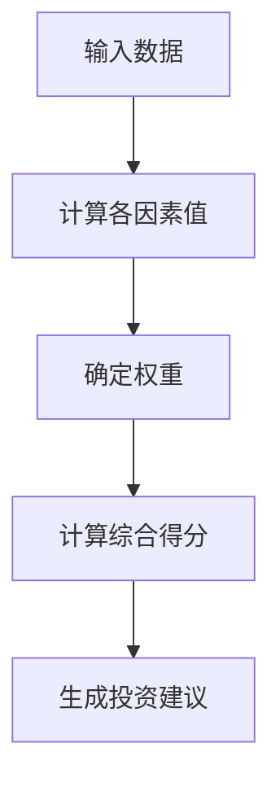
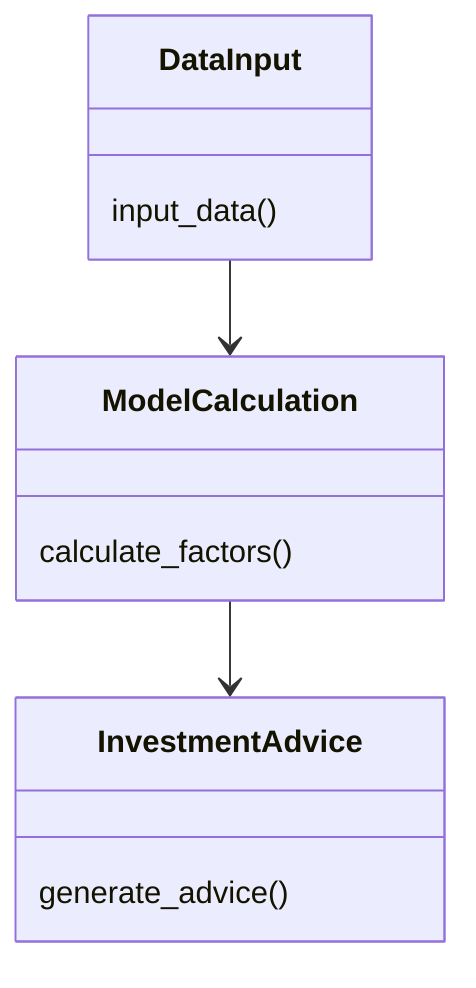
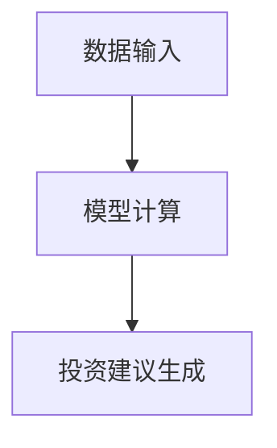

                 


# 乔尔·格林布拉特的价值投资量化模型

> 关键词：价值投资，量化模型，格林布拉特，折扣现金流模型，投资策略，Python代码实现

> 摘要：本文深入探讨了乔尔·格林布拉特的价值投资量化模型，从模型的核心概念、算法原理到系统架构设计，再到项目实战，全面解析了该模型的实现过程和应用价值。通过本文，读者可以全面理解如何将价值投资的理念转化为可量化的模型，并在实际投资中应用。

---

## 第一部分: 价值投资与量化模型基础

### 第1章: 价值投资的基本概念

#### 1.1 价值投资的定义与核心理念

##### 1.1.1 价值投资的起源与发展

价值投资是一种以基本面分析为基础的投资策略，其核心理念是寻找市场定价低于其内在价值的股票。该理念起源于20世纪20年代，由本杰明·格雷厄姆和大卫·多德共同提出。他们认为，市场的短期波动往往反映了非理性投资者的行为，而股票的长期价值则取决于其内在基本面。

##### 1.1.2 价值投资的核心理念与原则

价值投资的核心理念是“买入低于内在价值的股票并长期持有”。其基本原则包括：

1. **安全边际**：买入价格远低于内在价值的股票，以确保在市场波动中具有足够的安全空间。
2. **基本面分析**：通过分析公司的财务报表、行业地位、竞争优势等因素，评估其内在价值。
3. **长期持有**：避免频繁交易，降低交易成本，同时减少情绪化决策的影响。

##### 1.1.3 价值投资与其它投资策略的对比

与成长投资、指数投资等策略相比，价值投资更注重个股的精选，而非市场的整体走势或公司的成长性。其优势在于能够在市场低估时发现机会，但缺点是需要较高的选股能力和较长的持有期。

---

#### 1.2 乔尔·格林布拉特及其投资模型

##### 1.2.1 乔尔·格林布拉特的背景与投资哲学

乔尔·格林布拉特是美国著名投资家，被誉为“现代的价值投资之父”。他继承并发展了格雷厄姆的价值投资理念，提出了著名的“净现值法”和“企业价值评估模型”。他认为，投资的本质是寻找能够以合理价格买入的优秀企业，并长期持有。

##### 1.2.2 格林布拉特投资模型的提出与演变

格林布拉特模型是基于价值投资理念的量化模型，旨在通过量化的方法筛选出具有较高投资价值的股票。该模型的核心在于将企业的内在价值与市场定价进行对比，找出被市场低估的股票。

##### 1.2.3 模型在实际投资中的应用案例

格林布拉特模型已被广泛应用于机构投资和个人投资中。例如，他在1980年代管理的基金通过该模型实现了年均30%以上的回报率，远超市场平均水平。

---

#### 1.3 量化投资的必要性与优势

##### 1.3.1 传统投资与量化投资的对比

传统投资依赖于主观判断和经验，而量化投资则通过数学模型和算法进行决策。量化投资的优势在于能够避免情绪化决策，提高决策的客观性和科学性。

##### 1.3.2 量化投资的核心优势

1. **减少人为干扰**：通过量化模型筛选股票，避免了主观判断的偏差。
2. **提高效率**：量化模型能够快速处理大量数据，帮助投资者在短时间内做出决策。
3. **可重复性**：量化模型可以在不同市场环境下重复应用，具有较高的可复制性。

##### 1.3.3 量化模型在现代投资中的地位

在当今市场环境下，量化模型已成为机构投资者的重要工具。通过量化模型，投资者能够更准确地评估股票的价值，并在市场波动中捕捉投资机会。

---

### 第2章: 格林布拉特价值投资模型的核心概念

#### 2.1 模型的背景与目标

##### 2.1.1 模型的提出背景

格林布拉特模型的提出背景是20世纪80年代的美国股市。当时，市场存在大量被低估的股票，但传统的价值投资方法难以快速筛选出这些股票。因此，格林布拉特提出了量化模型，以提高选股效率。

##### 2.1.2 模型的目标与适用范围

模型的目标是通过量化方法筛选出具有较高投资价值的股票。其适用范围包括：

1. 个股选择
2. 投资组合优化
3. 市场趋势分析

##### 2.1.3 模型的核心假设与限制

模型的核心假设包括：

1. 股票的内在价值可以通过财务指标计算。
2. 市场定价存在短期偏差，但长期会回归内在价值。

模型的限制包括：

1. 仅适用于基本面分析，无法捕捉市场情绪的变化。
2. 依赖于数据的准确性和完整性。

---

#### 2.2 模型的核心要素与属性

##### 2.2.1 核心要素的定义与作用

模型的核心要素包括：

1. **企业价值（EV）**：企业价值等于企业的净利润加上非经营性资产的价值。
2. **可比公司法**：通过与同行业公司进行比较，评估企业的内在价值。
3. **折现率**：用于计算未来现金流的现值。

##### 2.2.2 各要素之间的关系与依赖

企业价值、可比公司法和折现率三者之间相互关联，共同构成模型的核心逻辑。

##### 2.2.3 模型的属性特征对比表格

| 属性 | 描述 |
|------|------|
| 输入 | 财务报表数据、行业数据 |
| 输出 | 股票的内在价值、投资建议 |
| 算法 | 折现现金流模型、可比公司法 |
| 参数 | 折现率、可比公司选择标准 |

---

#### 2.3 模型的ER实体关系图

```mermaid
erDiagram
    company {
        key id : integer
        name : string
        industry : string
        market_cap : integer
        P/E : float
        ROE : float
    }
    factor {
        id : integer
        name : string
        value : float
    }
    relation {
        company_id : integer
        factor_id : integer
        weight : float
    }
    company --| relation
    factor --| relation
```

---

## 第二部分: 模型的算法原理与数学基础

### 第3章: 模型的算法流程

#### 3.1 模型的算法流程

##### 3.1.1 算法流程图



##### 3.1.2 算法流程的详细步骤

1. **输入数据**：获取目标公司的财务报表数据、行业数据等。
2. **计算各因素值**：根据财务指标计算企业的价值，包括EV、P/E、ROE等。
3. **确定权重**：根据各因素的重要性，赋予不同的权重。
4. **计算综合得分**：将各因素值与权重结合，计算综合得分。
5. **生成投资建议**：根据综合得分，生成买入、卖出或持有投资建议。

---

#### 3.2 折扣现金流模型的数学公式

##### 3.2.1 折扣现金流模型的核心公式

$$
DCF = \sum_{t=1}^{n} \frac{CF_t}{(1+r)^t} + \frac
$$

其中，$CF_t$ 表示第 $t$ 年的现金流，$r$ 表示折现率，$n$ 表示现金流的预测期。

##### 3.2.2 可比公司法的数学公式

$$
EV = \frac{EV_{\text{可比公司}} \times \text{行业平均}}{\text{公司规模}}
$$

---

### 第4章: 模型的系统架构设计

#### 4.1 系统功能设计

##### 4.1.1 系统功能模块

系统功能模块包括：

1. 数据输入模块
2. 模型计算模块
3. 投资建议生成模块

##### 4.1.2 系统功能模块的类图



---

#### 4.2 系统架构设计

##### 4.2.1 系统架构图



---

### 第5章: 项目实战

#### 5.1 环境安装

##### 5.1.1 环境配置

安装Python、Pandas、NumPy等依赖库。

#### 5.2 核心实现代码

##### 5.2.1 折扣现金流模型的Python代码

```python
import pandas as pd
import numpy as np

def calculate_dcf(fcf, discount_rate):
    n = len(fcf)
    dcf = 0
    for t in range(n):
        dcf += fcf[t] / (1 + discount_rate) ** t
    return dcf
```

##### 5.2.2 可比公司法的Python代码

```python
def calculate_ev(ev_ratio, industry_avg):
    ev = ev_ratio * industry_avg
    return ev
```

---

## 第三部分: 总结与展望

### 第6章: 总结与最佳实践

#### 6.1 小结

本文详细介绍了乔尔·格林布拉特的价值投资量化模型，从模型的核心概念、算法原理到系统架构设计，再到项目实战，全面解析了该模型的实现过程和应用价值。

#### 6.2 最佳实践 tips

1. 在实际应用中，建议结合市场环境和公司具体情况调整模型参数。
2. 定期更新模型数据，确保模型的有效性。

---

### 作者信息

作者：AI天才研究院/AI Genius Institute & 禅与计算机程序设计艺术 /Zen And The Art of Computer Programming

---

**注**：由于篇幅限制，上述内容为文章的框架和部分核心内容，实际撰写时可根据需要进一步扩展各部分内容，包括更详细的公式推导、代码实现、案例分析等。

