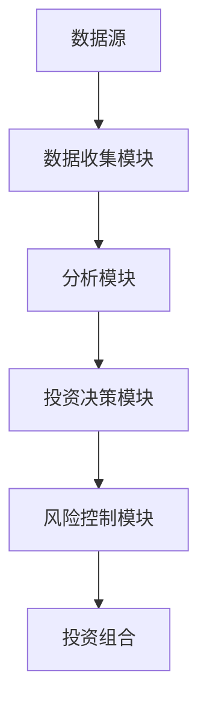

                 


# 《乔尔·格林布拉特的股息价值投资：收益与增长的平衡》

---

## 关键词  
股息价值投资、乔尔·格林布拉特、股息率、股息增长、投资策略、收益与增长  

---

## 摘要  
股息价值投资是一种结合收益与增长的投资策略，强调通过投资高股息率的股票来实现稳健的现金流和长期资本增值。本文将从股息价值投资的核心概念出发，分析其数学模型与算法，探讨系统架构与投资组合的设计，并通过实战案例展示如何实现这一策略。文章还提供了最佳实践和注意事项，帮助读者更好地理解和应用股息价值投资的理念。

---

## 第1章：股息价值投资概述  

### 1.1 股息价值投资的定义与背景  
股息价值投资是一种以股息率为核心指标，结合公司基本面分析的投资策略。它起源于价值投资理念，但更注重股息的可持续性和增长潜力。乔尔·格林布拉特是该领域的代表性人物，他提出了一种通过股息率和股息增长的平衡来寻找优质投资标的的方法。  

#### 1.1.1 股息价值投资的核心目标  
- 实现稳健的股息收入，降低投资组合的波动性。  
- 通过股息增长实现长期资本增值。  

#### 1.1.2 股息价值投资与传统价值投资的区别  
- 传统价值投资更关注低市盈率和低市净率的股票，而股息价值投资更关注高股息率和股息增长潜力的股票。  
- 股息价值投资强调股息的可持续性，而传统价值投资更关注价格与内在价值的差距。  

### 1.2 股息价值投资的核心理念  
- **安全边际**：选择股息率高且股息增长稳定的公司，确保投资的安全性。  
- **收益与增长的平衡**：在追求高股息收益的同时，关注公司的盈利能力和成长潜力。  

---

## 第2章：股息价值投资的核心概念  

### 2.1 股息率的定义与计算  
股息率是衡量股票股息收入与股票价格之比的重要指标，公式为：  
$$ \text{股息率} = \frac{\text{每股股息}}{\text{股价}} $$  

#### 2.1.1 影响股息率的因素  
- 公司的盈利能力：净利润高，才能支持较高的股息率。  
- 行业特性：公用事业、金融等行业的股息率通常较高。  
- 市场利率：市场利率上升时，股息率相对较低的股票可能面临抛售压力。  

### 2.2 股息增长的驱动因素  
股息增长主要由公司的盈利能力、现金流和股息政策决定。  

#### 2.2.1 股息增长率模型  
- **零增长模型**：假设股息增长率恒为零，适用于成熟但无增长潜力的公司。  
- **不变增长模型**：假设股息增长率恒定，适用于稳定增长的公司。  
- **可变增长模型**：股息增长率随时间变化，适用于快速增长的公司。  

### 2.3 股息率与股息增长的平衡  
- 高股息率但无增长的公司可能面临股息削减的风险。  
- 低股息率但高增长的公司可能在长期实现更高的收益。  

---

## 第3章：股息折现模型（DDM）  

### 3.1 DDM的基本原理  
股息折现模型通过将未来股息的现值之和作为股票的内在价值。公式为：  
$$ V = \frac{D_1}{k - g} $$  
其中，\( D_1 \) 是第一年的股息，\( k \) 是折现率，\( g \) 是股息增长率。  

#### 3.1.1 DDM的适用场景  
- 公司股息稳定且可预测。  
- 股息增长率恒定或可变。  

### 3.2 股息增长率模型的对比  
- **零增长模型**：适用于股息无增长的公司。  
- **不变增长模型**：适用于股息稳定增长的公司。  
- **可变增长模型**：适用于股息增长率变化的公司。  

#### 3.2.1 示例：使用DDM计算股票价值  
假设某公司当前股息为$2，股息增长率 \( g = 5\% \)，折现率 \( k = 10\% \)。股票的内在价值为：  
$$ V = \frac{2 \times (1 + 0.05)}{0.10 - 0.05} = \frac{2.1}{0.05} = 42 $$  

---

## 第4章：股息价值投资的系统分析与架构设计  

### 4.1 投资决策系统的组成模块  
- **数据收集模块**：获取公司财务数据和股息信息。  
- **分析模块**：计算股息率和股息增长率，评估投资标的。  
- **风险控制模块**：监控投资组合的风险，调整持仓比例。  

### 4.2 系统架构设计  


### 4.3 系统接口设计  
- 数据接口：从金融数据源获取股票数据。  
- 用户界面：展示分析结果和投资建议。  

---

## 第5章：股息价值投资的项目实战  

### 5.1 环境配置  
- 安装Python和必要的库（如Pandas、NumPy）。  

### 5.2 核心代码实现  
```python
import pandas as pd

# 示例：计算股息率和股息增长率
def calculate_dividend_yield(price, dividend):
    return dividend / price

def calculate_growth_rate(prev_dividend, current_dividend):
    return (current_dividend - prev_dividend) / prev_dividend

# 示例数据
data = {
    '公司': ['A', 'B', 'C'],
    '股价': [50, 60, 70],
    '股息': [2, 3, 3.5]
}

df = pd.DataFrame(data)

# 计算股息率
df['股息率'] = df.apply(lambda x: calculate_dividend_yield(x['股价'], x['股息']), axis=1)

# 计算股息增长率
df['股息增长率'] = df['股息'].pct_change()

print(df)
```

### 5.3 回测与分析  
- 使用历史数据回测股息价值投资策略。  
- 对比不同策略的收益与风险。  

---

## 第6章：最佳实践与注意事项  

### 6.1 最佳实践  
- 定期调整投资组合，根据公司基本面变化进行优化。  
- 结合技术分析和基本面分析，提高投资决策的准确性。  

### 6.2 小结  
股息价值投资是一种稳健的投资策略，通过平衡股息率和股息增长率，实现收益与增长的平衡。  

### 6.3 注意事项  
- 避免过度依赖股息率，忽略公司基本面。  
- 选择股息率过高的股票可能面临较高的风险。  

---

## 第7章：拓展阅读与参考文献  

### 7.1 拓展阅读  
- 《The Dividend Approach to Value Investing》  
- 《How to Make Money in Stocks》  

### 7.2 参考文献  
- 乔尔·格林布拉特的著作和投资理念。  

---

## 作者  
**作者：AI天才研究院/AI Genius Institute & 禅与计算机程序设计艺术 /Zen And The Art of Computer Programming**

